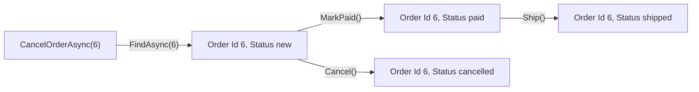

## Before you start

- [[design.l2.where-a-rule-belongs]] — you know `Order` decides its own status changes, and `OrderService` finds the order and asks it to decide.
- [[backend.l1.efcore-relationships-and-keys]] — you know `orders` has an `id` primary key, while `order_items` has no `Id` and uses `(order_id, product_id)` as a composite key.

## The situation

A teammate is writing a report of the orders that changed during the day. The report keeps the order `6` it loaded in the morning, loads order `6` again in the evening in a separate request, and compares the two `Order` objects with `==`: the answer is `false`. Comparing every field instead also says `false`, because a customer cancelled order `6` in between, so its `Status` went from `new` to `cancelled`. Yet anyone in support would call both objects "order 6 of customer 3". And two different orders by the same customer, with identical items, placed a minute apart, have almost the same data. What makes two `Order` objects the same order?

## Core concepts

- **entity (DDD)** — DDD is short for domain-driven design, the way of modelling this module follows. An entity is an object the business follows over time, on its own, as one particular thing. Two entities are the same when their identities match, whatever the rest of their data says.
- identity — the value that names one particular entity for its whole life; in Đơn Hàng, the `Id` stored in the entity's row; for a new order at stage-2 (this lesson reads the code at the stage-2 tag), the database generates it on insert.
- reference comparison — what `==` checks by default on two instances of a C# class that is not a record: whether both variables point to the same object in memory.
- entity type — EF Core's name for a class EF Core knows how to map to a table (EF Core calls this set of classes its model), whatever that class means to the business.

## How it works



Start at the leftmost box: it shows how code reaches order `6`. `CancelOrderAsync` receives only the number `6`. It asks the repository for that id, then lets `Cancel()` decide. It never searches for "the order with these items at this time", because the data is not what names an order.

After the first arrow, the diagram shows status changes order `6` can go through. `CancelOrderAsync` performs only the `Cancel()` one; `Ship()` comes from `ShipOrderAsync`, and at stage-2 no endpoint calls `MarkPaid()` yet: only the tests use it to get a paid order. Order `6` starts as `new`. `MarkPaid()` and then `Ship()` move it on, or `Cancel()` can end it. Every box holds a different `Status`, yet the business calls each of them "order 6". That is what makes `Order` an entity: the business follows this one order over time, and its identity is its `Id`.

The same holds when the data matches. Suppose two different people named `Trần Minh Anh` both live in `Hà Nội`. The name and city match, yet Đơn Hàng still holds two `customers` rows with two `Id` values and two order histories. Equal data does not make two entities the same; equal identity does.

Now the `==` from the situation. On two instances of a C# class, `==` is a reference comparison unless the class overloads the `==` operator, and stage-2 `Order` does not. Two requests load two separate `Order` objects for order `6`, so `==` answers `false` while the business means "same order". Code that asks whether two orders are the same compares their `Id` values instead. An order not yet inserted has no `Id` from the database, so this works only for saved orders. The `Id` check stays true after the cancel, and false for two look-alike orders.

## In the Đơn Hàng system

The identity of an order, in `DonHang.Domain/Entities.cs`:

```csharp file=DonHang.Domain/Entities.cs tag=stage-2 lines=30-36
public sealed class Order
{
    public int Id { get; set; }
    public int CustomerId { get; private set; }
    public DateTimeOffset PlacedAt { get; private set; }
    public string Status { get; private set; }
    public List<OrderItem> Items { get; private set; } = [];
```

`Id` keeps a public setter. At stage-2 the database generates it when the order is inserted, and the fake repository that tests use assigns one itself, from a running number, when an order is added to it. None of `Order`'s own methods, further down the file and outside this excerpt, assigns `Id`; they change `Status`.

Finding the order to cancel, in `DonHang.Domain/OrderService.cs`:

```csharp file=DonHang.Domain/OrderService.cs tag=stage-2 lines=36-49
    // lesson: design.l2.domain-model
    // Find, let the order decide, notify, save. An order that is already
    // cancelled or shipped makes order.Cancel() throw OrderStatusException.
    // The notification is saved with the order, by the same SaveChangesAsync.
    public async Task<Order> CancelOrderAsync(int orderId)
    {
        var order = await repository.FindAsync(orderId)
            ?? throw new KeyNotFoundException($"order {orderId} not found");

        order.Cancel();
        notifier.Send(order, "order cancelled");
        await repository.SaveChangesAsync();
        return order;
    }
```

The first comment line names the lesson this version of the code was written for; `OrderStatusException` is what `Cancel()` throws when the status does not allow it. The method takes an `int`, not an `Order`. The id alone is enough to name the order; everything else comes from what `FindAsync` loads for that id: the order's row and its items. When no order has that id, the method throws `KeyNotFoundException` instead of guessing a close match.

EF Core uses the same word for something else. Its documentation calls each class in its model an entity type: `Customer` and `Order`, but also `OrderItem`, which has no `Id` and is keyed by `OrderId` and `ProductId` together. EF Core needs a key so it can tell which row to update. It does not ask whether anyone in the business follows that row over time. Whether `OrderItem` is an entity in the business sense is a question about the business, and the mapping cannot answer it; later lessons in this module return to it.

## Seniors often assume…

- **"Every class EF Core maps, `OrderItem` included, is an entity in the business sense."** → Actually "entity type" in EF Core means a class in its model; an entity type EF Core inserts and updates needs a key, so it can tell which row to change. The business meaning asks a different question: does anyone follow this thing over time, on its own? You notice this when you look for an `OrderItem`'s own id and find only `OrderId` and `ProductId`, the order and the product it belongs to.
- **"Two orders with the same customer, items and time are the same order."** → Actually a customer may place the same order twice on purpose, and each one gets its own `Id`, its own status and its own notifications. The data cannot tell a second order from a retried first one. You notice this when you read `PlaceOrderAsync`, the `OrderService` method that places a new order, which receives the request's `Idempotency-Key` header value: it recognises a retry by that key, not by comparing items.
- **"A class becomes an entity simply by having an `Id` property."** → Actually the `Id` is how code keeps track of an entity, not what makes it one. Adding an `Id` to a class changes the table, not whether the business follows each instance over time. You notice this when a table gets an `id` column only so that a reporting tool that only handles single-column keys can use it, and no one ever looks a row up by it.

## Try it (3 minutes)

In the root folder of the example repository, in a shell:

1. Run `git show stage-2:DonHang.Domain/Entities.cs` and look at `Customer`, `Product`, `Order` and `OrderItem`.
2. Note which of the four has a property named `Id`.
3. For each one, ask: a month from now, would someone in the business ask about "that one" by itself, while its other data may have changed?

Expected result: `Customer`, `Product` and `Order` each start with `public int Id { get; set; }`. `OrderItem` has no property named `Id`; besides `Quantity` and `UnitPriceVnd`, it has only `OrderId` and `ProductId`, its key together.

<details><summary>Suggested answer</summary>

The file shows which classes have an `Id`, but it cannot answer step 3; only the business can. Support asks about "order 6" while its status changes, and about "customer 3" whatever their city. Staff change a product's price, and it is still the same product. For `OrderItem`, the missing `Id` does not settle the question either way: it describes how the table is keyed, not how the business talks.

</details>

## Connections

- [[design.l2.where-a-rule-belongs]] — prerequisite: there `Order` already decides its own rules; this lesson says what makes it one particular order.
- [[backend.l1.efcore-relationships-and-keys]] — the database side of the same idea: the `id` primary key is where an order's identity is stored.
- [[backend.l1.efcore-mapping]] — the EF Core meaning of "entity", which this lesson separates from the business meaning.
- [[design.l3.value-objects]] — the opposite case: objects with no identity, known only by their values.
- [[design.l3.aggregates-and-invariants]] — builds on this lesson: it asks which objects change together with an order.

## Five-line summary

1. An entity is something the business follows over time; two entities are the same when their identities match, whatever else differs.
2. Order `6` keeps `Id` 6 while its `Status` changes, and `CancelOrderAsync` finds it by that id alone.
3. Two customers with the same name and city are still two customers, told apart by their `Id` values.
4. `==` on two `Order` objects compares references, so code asking "same order?" compares their `Id` values instead.
5. EF Core calls every class in its model an entity type; whether the business follows it over time is a question the mapping cannot answer.
