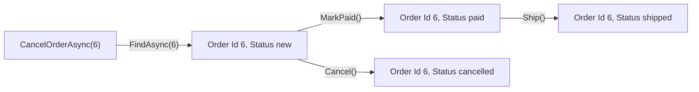

## Bạn cần biết trước

- [[design.l2.where-a-rule-belongs]] — bạn biết `Order` tự quyết định các lần đổi trạng thái của mình, còn `OrderService` tìm đơn rồi nhờ đơn quyết định.
- [[backend.l1.efcore-relationships-and-keys]] — bạn biết `orders` có khóa chính `id`, còn `order_items` không có `Id` mà dùng `(order_id, product_id)` làm khóa kết hợp.

## Tình huống

Một đồng nghiệp đang viết báo cáo các đơn thay đổi trong ngày. Báo cáo giữ lại đơn `6` đã tải từ sáng, tối tải lại đơn `6` trong một request khác, rồi so hai object `Order` bằng `==`: kết quả là `false`. So từng trường thì cũng ra `false`, vì giữa hai lần tải, khách đã hủy đơn `6`, nên `Status` của nó đổi từ `new` sang `cancelled`. Vậy mà ai ở bộ phận hỗ trợ cũng gọi cả hai object là "đơn 6 của khách 3". Còn hai đơn khác nhau của cùng một khách, cùng các item, đặt cách nhau một phút, thì dữ liệu gần như giống hệt. Điều gì khiến hai object `Order` là cùng một đơn?

## Khái niệm cốt lõi

- **entity (DDD)** (đối tượng nghiệp vụ được theo dõi qua thời gian bằng định danh riêng, dù dữ liệu của nó thay đổi) — DDD là viết tắt của domain-driven design, cách mô hình hóa mà module này theo. Entity là một object mà nghiệp vụ theo dõi qua thời gian, riêng lẻ, như một thứ cụ thể. Hai entity là một khi định danh của chúng trùng nhau, dù phần dữ liệu còn lại nói gì.
- định danh — giá trị gọi tên một entity cụ thể trong suốt vòng đời của nó. Trong Đơn Hàng, đó là `Id` lưu trong dòng của entity. Với một đơn mới ở stage-2 (bài này đọc code ở tag stage-2), database sinh ra nó lúc insert.
- so sánh tham chiếu — điều `==` mặc định kiểm tra trên hai instance của một class C# không phải record: hai biến có cùng trỏ tới một object trong bộ nhớ hay không.
- entity type — tên EF Core đặt cho một class mà EF Core biết cách ánh xạ vào bảng (EF Core gọi tập các class này là model của nó), bất kể class đó có nghĩa gì với nghiệp vụ.

## Cơ chế hoạt động



Bắt đầu từ ô ngoài cùng bên trái: nó cho thấy code tới được đơn `6` bằng cách nào. `CancelOrderAsync` chỉ nhận con số `6`. Method hỏi repository đơn có id đó, rồi để `Cancel()` quyết định. Nó không bao giờ tìm "đơn có những item này vào lúc này", vì dữ liệu không phải thứ gọi tên một đơn.

Sau mũi tên đầu tiên, sơ đồ cho thấy những lần đổi trạng thái mà đơn `6` có thể trải qua. `CancelOrderAsync` chỉ làm một lần, là `Cancel()`. `Ship()` đến từ `ShipOrderAsync`, còn ở stage-2 chưa endpoint nào gọi `MarkPaid()`: chỉ test dùng nó để có một đơn đã thanh toán. Đơn `6` bắt đầu ở `new`. `MarkPaid()` rồi `Ship()` đưa nó đi tiếp, hoặc `Cancel()` có thể kết thúc nó. Mỗi ô mang một `Status` khác nhau, vậy mà nghiệp vụ gọi ô nào cũng là "đơn 6". Đó là điều khiến `Order` là một entity: nghiệp vụ theo dõi đúng đơn này qua thời gian, và định danh của nó là `Id`.

Khi dữ liệu trùng nhau cũng vậy. Giả sử có hai người khác nhau cùng tên `Trần Minh Anh` và cùng sống ở `Hà Nội`. Tên và thành phố trùng, nhưng Đơn Hàng vẫn giữ hai dòng `customers` với hai giá trị `Id` và hai lịch sử đặt hàng. Dữ liệu bằng nhau không làm hai entity thành một, định danh bằng nhau mới làm được.

Giờ quay lại phép `==` trong tình huống. Trên hai instance của một class C#, `==` là so sánh tham chiếu, trừ khi class overload toán tử `==`, và `Order` ở stage-2 không làm vậy. Hai request tải hai object `Order` riêng cho đơn `6`, nên `==` trả `false` trong khi nghiệp vụ muốn nói "cùng một đơn". Code muốn hỏi hai đơn có phải là một không thì so `Id` của chúng. Một đơn chưa insert thì chưa có `Id` từ database, nên cách này chỉ dùng được cho đơn đã lưu. Phép so `Id` vẫn ra true sau khi hủy, và ra false với hai đơn trông giống nhau.

## Trong hệ thống Đơn Hàng

Định danh của một đơn, trong `DonHang.Domain/Entities.cs`:

```csharp file=DonHang.Domain/Entities.cs tag=stage-2 lines=30-36
public sealed class Order
{
    public int Id { get; set; }
    public int CustomerId { get; private set; }
    public DateTimeOffset PlacedAt { get; private set; }
    public string Status { get; private set; }
    public List<OrderItem> Items { get; private set; } = [];
```

`Id` vẫn giữ setter public. Ở stage-2, database sinh ra nó khi đơn được insert, còn repository giả mà test dùng thì tự gán, lấy từ một số đếm tăng dần, khi một đơn được thêm vào. Không method nào của chính `Order`, nằm phía dưới trong file và ngoài đoạn trích này, gán `Id`. Chúng đổi `Status`.

Tìm đơn cần hủy, trong `DonHang.Domain/OrderService.cs`:

```csharp file=DonHang.Domain/OrderService.cs tag=stage-2 lines=36-49
    // lesson: design.l2.domain-model
    // Find, let the order decide, notify, save. An order that is already
    // cancelled or shipped makes order.Cancel() throw OrderStatusException.
    // The notification is saved with the order, by the same SaveChangesAsync.
    public async Task<Order> CancelOrderAsync(int orderId)
    {
        var order = await repository.FindAsync(orderId)
            ?? throw new KeyNotFoundException($"order {orderId} not found");

        order.Cancel();
        notifier.Send(order, "order cancelled");
        await repository.SaveChangesAsync();
        return order;
    }
```

Dòng comment đầu tiên ghi tên bài mà phiên bản code này được viết cho. `OrderStatusException` là thứ `Cancel()` ném ra khi trạng thái không cho phép. Method nhận một `int`, không phải một `Order`. Chỉ id là đủ gọi tên đơn, mọi thứ khác đến từ những gì `FindAsync` tải cho id đó: dòng của đơn và các item của nó. Khi không có đơn nào mang id đó, method ném `KeyNotFoundException` thay vì đoán một đơn gần giống.

EF Core dùng cùng chữ này cho một thứ khác. Tài liệu của EF Core gọi mỗi class trong model là một entity type: `Customer` và `Order`, nhưng cả `OrderItem`, class không có `Id` và được định khóa bằng `OrderId` cùng `ProductId`. EF Core cần một khóa để biết phải update dòng nào. Nó không hỏi có ai trong nghiệp vụ theo dõi dòng đó qua thời gian không. `OrderItem` có phải entity theo nghĩa nghiệp vụ hay không là câu hỏi về nghiệp vụ, và phần ánh xạ không trả lời được. Các bài sau trong module này sẽ quay lại câu hỏi đó.

## Senior hay nhầm rằng…

- **"Mọi class EF Core ánh xạ, kể cả `OrderItem`, đều là entity theo nghĩa nghiệp vụ."** → Thực ra "entity type" trong EF Core nghĩa là một class trong model của nó, và một entity type mà EF Core insert và update thì cần khóa, để biết phải đổi dòng nào. Nghĩa nghiệp vụ hỏi một câu khác: có ai theo dõi thứ này qua thời gian, riêng lẻ, không? Bạn sẽ nhận ra khi đi tìm id riêng của một `OrderItem` và chỉ thấy `OrderId` và `ProductId`, tức đơn và sản phẩm mà nó thuộc về.
- **"Hai đơn cùng khách, cùng item, cùng thời điểm là cùng một đơn."** → Thực ra khách có thể cố ý đặt cùng một đơn hai lần, và mỗi đơn có `Id` riêng, trạng thái riêng, thông báo riêng. Dữ liệu không phân biệt được đơn thứ hai với một lần gửi lại của đơn thứ nhất. Bạn sẽ nhận ra khi đọc `PlaceOrderAsync`, method của `OrderService` đặt một đơn mới, nhận giá trị header `Idempotency-Key` của request: nó nhận ra một lần gửi lại nhờ key đó, chứ không nhờ so các item.
- **"Một class trở thành entity chỉ vì có property `Id`."** → Thực ra `Id` là cách code theo dấu một entity, không phải thứ biến nó thành entity. Thêm `Id` vào một class làm đổi bảng, chứ không quyết định nghiệp vụ có theo dõi từng instance qua thời gian hay không. Bạn sẽ nhận ra khi một bảng được thêm cột `id` chỉ để một công cụ báo cáo, vốn chỉ xử lý được khóa một cột, dùng được nó, và không ai từng tra một dòng theo cột đó.

## Thử ngay (3 phút)

Trong thư mục gốc của repository ví dụ, mở một shell:

1. Chạy `git show stage-2:DonHang.Domain/Entities.cs` và xem `Customer`, `Product`, `Order` và `OrderItem`.
2. Ghi lại class nào trong bốn class có property tên `Id`.
3. Với từng class, tự hỏi: một tháng nữa, liệu có ai trong nghiệp vụ hỏi về riêng "cái đó", trong khi dữ liệu khác của nó có thể đã đổi?

Kết quả mong đợi: `Customer`, `Product` và `Order` đều mở đầu bằng `public int Id { get; set; }`. `OrderItem` không có property nào tên `Id`. Ngoài `Quantity` và `UnitPriceVnd`, nó chỉ có `OrderId` và `ProductId`, hai cột cùng làm khóa của nó.

<details><summary>Gợi ý đáp án</summary>

File cho thấy class nào có `Id`, nhưng không trả lời được bước 3, chỉ nghiệp vụ trả lời được. Bộ phận hỗ trợ hỏi về "đơn 6" trong khi trạng thái của nó đổi, và về "khách 3" dù họ sống ở thành phố nào. Nhân viên đổi giá một sản phẩm, và nó vẫn là sản phẩm đó. Với `OrderItem`, thiếu `Id` cũng không quyết định câu trả lời theo hướng nào: nó mô tả cách bảng được định khóa, không phải cách nghiệp vụ nói về nó.

</details>

## Liên hệ

- [[design.l2.where-a-rule-belongs]] — bài tiên quyết: ở đó `Order` đã tự quyết định quy tắc của mình, bài này nói điều gì khiến nó là một đơn cụ thể.
- [[backend.l1.efcore-relationships-and-keys]] — phía database của cùng ý tưởng: khóa chính `id` là nơi lưu định danh của một đơn.
- [[backend.l1.efcore-mapping]] — nghĩa "entity" của EF Core, thứ mà bài này tách khỏi nghĩa nghiệp vụ.
- [[design.l3.value-objects]] — trường hợp ngược lại: object không có định danh, chỉ được nhận biết qua giá trị.
- [[design.l3.aggregates-and-invariants]] — xây tiếp trên bài này: nó hỏi những object nào thay đổi cùng với một đơn.

## Tóm tắt 5 dòng

1. Entity là thứ nghiệp vụ theo dõi qua thời gian. Hai entity là một khi định danh trùng nhau, dù mọi thứ khác khác nhau.
2. Đơn `6` giữ `Id` 6 trong khi `Status` của nó đổi, và `CancelOrderAsync` tìm nó chỉ bằng id đó.
3. Hai khách cùng tên, cùng thành phố vẫn là hai khách, phân biệt bằng giá trị `Id` của họ.
4. `==` trên hai object `Order` so tham chiếu, nên code muốn hỏi "cùng một đơn?" thì so `Id` của chúng.
5. EF Core gọi mọi class trong model là entity type. Nghiệp vụ có theo dõi nó qua thời gian hay không là câu hỏi mà phần ánh xạ không trả lời được.
