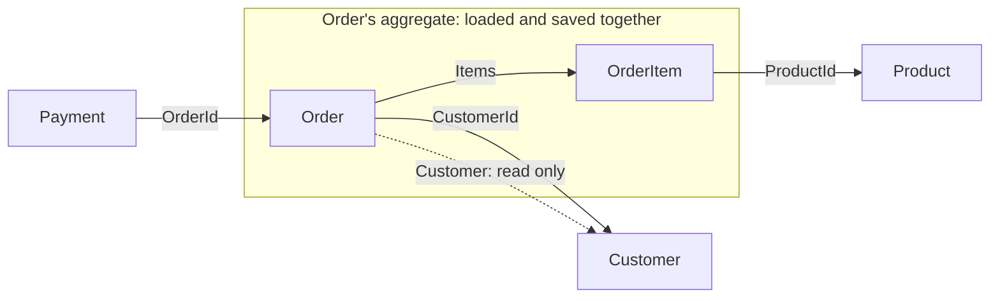

## Before you start

- [[design.l3.aggregate-root]] — you know that from stage-3 every change inside the order's aggregate goes through `Order`, and that `IOrderRepository` loads an order together with its items.
- [[backend.l2.projection-queries]] — you know that reading `o.Customer!.FullName` inside `Select` fetches one value without loading a `Customer` object.

## The situation

You are reviewing a pull request in Đơn Hàng at stage-2. Its author noticed that `Order` has a `Customer` property and changed `FindAsync`, which cancelling uses, to load the customer too, "so the order is complete". The same pull request adds a use case that fixes a customer's email by loading one of their orders and assigning `order.Customer!.Email`. Both changes compile, yet cancelling an order now reads a `customers` row that no cancel rule looks at. A customer's details can now change through whichever of their orders someone happened to load. Where does an order end, and how should it point to what lies beyond it?

## Core concepts

- the aggregate's boundary — the line around the objects one use case loads, checks and saves together; for an order, the order and its items, nothing more.
- a reference by id — a property that holds another aggregate's id, such as `Order.CustomerId` or `Payment.OrderId`, instead of the object itself.
- a read-only navigation — a navigation is a property that holds another object, such as `Order.Customer` or `Order.Items`, which EF Core can fill when it loads the order; a read-only one is followed only to read the other side, never to change it; at stage-2, `Order.Customer`.
- one aggregate per save — the guideline that one save changes one aggregate, broken on purpose when splitting the save would cost more.

## How it works



In the situation above, the cancel use case needs one thing to decide: the order's status. `Order.Cancel()` reads only the order's own fields: `Status` to decide, and `Id` for its error message. The rules from the earlier lessons span the order and its items. So the boundary of the order's aggregate is the order with its items. The customer sits outside it, and so do the product an item names and any payment for the order.

Follow the solid arrows. `Order` to `OrderItem` is `Order.Items`, inside the boundary; every other one crosses it as an id: `Order` holds `CustomerId`, each `OrderItem` holds `ProductId`, and `Payment` holds `OrderId`. An id is enough to find the other aggregate when a use case needs it, and costs nothing when it does not. Loading an order therefore never requires loading a customer, and saving an order never writes one.

The dotted arrow is the exception at stage-2. `Order` also has a `Customer` navigation. Code follows it only to read: the list of a customer's orders selects the customer's name through it, and `NotificationSender`, the background job that sends the emails queued in `notifications`, reads the customer's address through the notification's order. No use case changes a customer through an order. Kept that way, the navigation is a convenience for reading, not a second way into another aggregate.

Small aggregates keep each change small. If loading an order also loaded its customer, and loading a customer loaded its orders, every use case would load and track far more than its rules need, and a change to a customer could start from any of its orders.

## In the Đơn Hàng system

This lesson reads stage-2, where `Items` is still a plain `List`; that changes how the items are guarded, not where the order's boundary lies. Both kinds of pointer sit side by side in `Order`; skip the `IdempotencyKey` and `Version` lines, which belong to other lessons:

```csharp file=DonHang.Domain/Entities.cs tag=stage-2 lines=30-49
public sealed class Order
{
    public int Id { get; set; }
    public int CustomerId { get; private set; }
    public DateTimeOffset PlacedAt { get; private set; }
    public string Status { get; private set; }
    public List<OrderItem> Items { get; private set; } = [];

    // lesson: backend.l2.idempotent-endpoints
    // The client's Idempotency-Key, stored in the same row as the order it
    // created; null when the client sent none. A unique index guards it.
    public string? IdempotencyKey { get; init; }

    // lesson: backend.l2.optimistic-concurrency
    // Not a column Đơn Hàng adds: DonHangDbContext maps this to PostgreSQL's
    // xmin system column, which changes every time the row is updated.
    public uint Version { get; private set; }

    // lesson: backend.l1.efcore-n-plus-one
    public Customer? Customer { get; set; }
```

Read `CustomerId` and `Customer` together. `CustomerId` is the reference by id, set once by the constructor. `Customer` is the navigation, added for loading in an earlier lesson. Further down the file, `OrderItem` holds `ProductId` and `Payment` holds `OrderId`, plain `int` properties with no navigation to the object.

How the repository loads an order, and how it reads a customer:

```csharp file=DonHang.Infrastructure/EfOrderRepository.cs tag=stage-2 lines=9-29
    // Tracked: cancelling and shipping load the order with this, change it,
    // and SaveChangesAsync writes what changed.
    public Task<Order?> FindAsync(int id) =>
        db.Orders.Include(o => o.Items).FirstOrDefaultAsync(o => o.Id == id);

    // lesson: backend.l2.no-tracking-queries
    public Task<Order?> FindForReadingAsync(int id) =>
        db.Orders.AsNoTracking().Include(o => o.Items).FirstOrDefaultAsync(o => o.Id == id);

    // lesson: backend.l2.cursor-pagination
    // lesson: backend.l2.projection-queries
    // One customer's orders after the cursor, in id order, one page at a time.
    // The Select puts only three columns in the SQL; reading o.Customer inside
    // it makes EF Core write the JOIN, so no Include is needed.
    public Task<List<OrderSummary>> ListByCustomerAsync(int customerId, int afterId, int limit) =>
        db.Orders
            .Where(o => o.CustomerId == customerId && o.Id > afterId)
            .OrderBy(o => o.Id)
            .Take(limit)
            .Select(o => new OrderSummary(o.Id, o.Status, o.Customer!.FullName))
            .ToListAsync();
```

`FindAsync` is what `CancelOrderAsync` and `ShipOrderAsync` call. Its only `Include` is the items: the boundary, written as a query. `ListByCustomerAsync` follows `o.Customer` inside `Select`, gets one name, and returns `OrderSummary` records, not a tracked `Customer` anyone could change.

`OrderService.PlaceOrderAsync` breaks one aggregate per save on purpose. It adds the new order, then `notifier.Send` adds a pending row to `notifications`, and one `SaveChangesAsync` writes both in one transaction; cancelling and shipping also add a pending row through `notifier.Send` before their one `SaveChangesAsync`. That row is not part of the order: `NotificationSender` later claims, sends and updates it on its own, reading the customer through the `Order` navigation that `QueuedNotifier` sets on `Notification`. Saved separately, the order could be written and its `notifications` row lost, and that customer would never get the email. One transaction fits when losing the email job would cost more than tying the two saves together. When the second change could safely happen later, or fail without undoing the first, saving it separately keeps each aggregate independent.

## Seniors often assume…

- **"An `Order` should hold the whole `Customer`, so code can change the customer's details through the order."** → Actually no rule of an order reads customer data, so the customer lies outside the order's boundary. Changing it through an order gives the customer as many ways in as it has orders. You notice this when `FindAsync` gains an `Include(o => o.Customer)` that cancelling never reads.
- **"Navigation properties do not belong in a domain model and must all be deleted."** → Actually the guideline is about what a use case loads and changes, not about which properties exist. `Order.Items` is a navigation inside the boundary, and `Order.Customer` is harmless while it is only read. You notice this when `ListByCustomerAsync` reads `o.Customer!.FullName` in its projection: deleting the navigation breaks a query that changes nothing.
- **"Referring by id means the database must drop the foreign key between `orders` and `customers`."** → Actually referring by id is about the objects in memory, not the tables. PostgreSQL still refuses an order whose `customer_id` names no customer. You notice this when you open `db/schema.sql` at stage-2: `customer_id` is declared with `REFERENCES customers (id)`, and `Order` holds `CustomerId` beside it.

## Try it (3 minutes)

In the root folder of the example repository, in Git Bash:

1. Run `git grep -n "Customer!" stage-2 -- "*.cs"`.
2. For each line printed, decide: does the code read the customer, or change it?

Expected result: two lines, one from `DonHang.Api/Jobs/NotificationSender.cs` and one from `DonHang.Infrastructure/EfOrderRepository.cs`, each starting with `stage-2:`.

<details><summary>Suggested answer</summary>

Both only read. `EfOrderRepository.cs` reads `FullName` inside the projection of `ListByCustomerAsync`. `NotificationSender.cs` takes the customer of the notification's order and reads its email address and name to write the email. Neither assigns anything to a customer. Nothing in the compiler enforces this: `Customer` and its properties have public setters, so keeping the navigation read-only is a decision the code follows, not a guarantee.

</details>

## Connections

- [[design.l3.aggregate-root]] — the same idea seen from outside: that lesson guards what is inside an aggregate, this one draws where it ends.
- [[backend.l2.projection-queries]] — where the read-only navigation earns its place: a projection reads the customer's name without loading a customer.
- [[backend.l1.efcore-n-plus-one]] — the loading side of the same choice: what `Include` brings along with an order.
- [[backend.l2.database-job-queue]] — the `notifications` row saved with a new order, the deliberate exception to one aggregate per save.
- [[design.l3.domain-events]] — what comes next: how an order records what happened without holding the objects that react to it.

## Five-line summary

1. One aggregate refers to another by its id, so loading or changing one never requires loading the other.
2. At stage-2 `Order` holds `CustomerId`, each `OrderItem` holds `ProductId`, and `Payment` holds `OrderId`.
3. Cancelling loads an order with its items through `FindAsync` and no customer, because no order rule reads customer data.
4. `Order.Customer` stays as a read-only navigation for queries such as `ListByCustomerAsync`; no use case changes a customer through it.
5. One aggregate per save is a guideline: `PlaceOrderAsync` saves the order with its pending `notifications` row on purpose.
