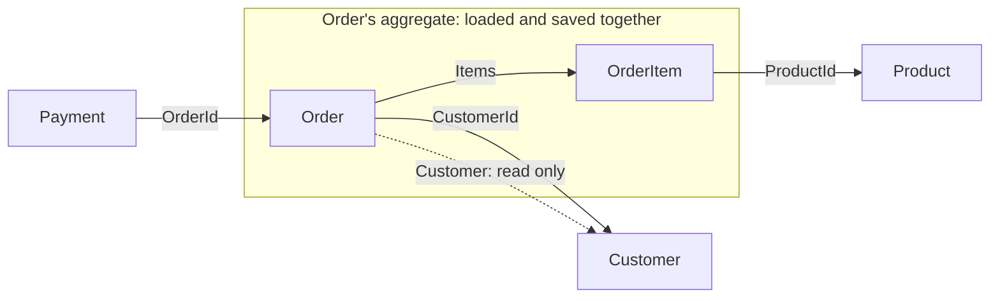

## Bạn cần biết trước

- [[design.l3.aggregate-root]] — bạn biết từ stage-3, mọi thay đổi bên trong aggregate của đơn đều đi qua `Order`, và `IOrderRepository` tải một đơn cùng các item của nó.
- [[backend.l2.projection-queries]] — bạn biết đọc `o.Customer!.FullName` bên trong `Select` chỉ lấy về một giá trị, không tải cả object `Customer`.

## Tình huống

Bạn đang review một pull request trong Đơn Hàng ở stage-2. Người viết thấy `Order` có property `Customer`, bèn sửa `FindAsync`, method mà thao tác hủy đơn dùng, để tải luôn khách hàng, "cho đơn được đầy đủ". Cũng pull request đó thêm một use case sửa email của khách: tải một đơn bất kỳ của khách rồi gán `order.Customer!.Email`. Cả hai thay đổi đều compile. Thế nhưng giờ hủy một đơn lại đọc một dòng `customers` mà không quy tắc hủy nào cần tới. Thông tin của một khách giờ đổi được qua bất kỳ đơn nào của họ mà ai đó tình cờ tải lên. Một đơn kết thúc ở đâu, và nó nên trỏ tới những gì nằm ngoài nó bằng cách nào?

## Khái niệm cốt lõi

- ranh giới của aggregate — đường bao quanh các object mà một use case tải, kiểm tra và lưu cùng nhau. Với một đơn, đó là đơn và các item của nó, không hơn.
- tham chiếu bằng id — một property giữ id của aggregate khác, như `Order.CustomerId` hay `Payment.OrderId`, thay vì giữ chính object đó.
- navigation chỉ đọc — navigation là property giữ một object khác, như `Order.Customer` hay `Order.Items`, mà EF Core có thể điền khi tải đơn. Navigation chỉ đọc là navigation chỉ được lần theo để đọc phía bên kia, không bao giờ để đổi nó. Ở stage-2, đó là `Order.Customer`.
- mỗi lần lưu một aggregate — nguyên tắc rằng một lần lưu chỉ đổi một aggregate, được cố ý phá khi tách lần lưu ra sẽ tốn kém hơn.

## Cơ chế hoạt động



Trong tình huống trên, use case hủy đơn chỉ cần một thứ để quyết định: trạng thái của đơn. `Order.Cancel()` chỉ đọc các field của chính đơn: `Status` để quyết định, và `Id` cho thông báo lỗi. Các quy tắc ở những bài trước trải trên đơn và các item của nó. Vì vậy ranh giới của aggregate đơn là đơn cùng các item. Khách hàng nằm ngoài ranh giới, sản phẩm mà một item nhắc tới và mọi thanh toán của đơn cũng vậy.

Lần theo các mũi tên liền. `Order` tới `OrderItem` là `Order.Items`, nằm trong ranh giới. Mọi mũi tên khác đều vượt ranh giới dưới dạng id: `Order` giữ `CustomerId`, mỗi `OrderItem` giữ `ProductId`, còn `Payment` giữ `OrderId`. Có id là đủ để tìm aggregate kia khi một use case cần, và không tốn gì khi không cần. Nhờ đó, tải một đơn không bao giờ bắt phải tải khách hàng, và lưu một đơn không bao giờ ghi khách hàng.

Mũi tên chấm là ngoại lệ ở stage-2. `Order` còn có navigation `Customer`. Code chỉ lần theo nó để đọc: danh sách đơn của một khách lấy tên khách qua nó, còn `NotificationSender`, background job gửi các email đang chờ trong `notifications`, đọc địa chỉ của khách qua đơn của notification. Không use case nào đổi một khách hàng qua một đơn. Giữ được như vậy, navigation chỉ là tiện ích để đọc, không phải lối thứ hai vào một aggregate khác.

Aggregate nhỏ thì mỗi thay đổi cũng nhỏ. Nếu tải một đơn kéo theo khách hàng, rồi tải một khách hàng kéo theo các đơn của họ, mọi use case sẽ tải và theo dõi nhiều hơn hẳn những gì quy tắc của nó cần, và một thay đổi lên khách hàng có thể bắt đầu từ bất kỳ đơn nào của họ.

## Trong hệ thống Đơn Hàng

Bài này đọc stage-2, khi `Items` vẫn là một `List` thường. Điều đó đổi cách các item được bảo vệ, chứ không đổi chỗ ranh giới của đơn. Hai kiểu trỏ nằm cạnh nhau trong `Order`. Bỏ qua hai dòng `IdempotencyKey` và `Version`, chúng thuộc về bài khác:

```csharp file=DonHang.Domain/Entities.cs tag=stage-2 lines=30-49
public sealed class Order
{
    public int Id { get; set; }
    public int CustomerId { get; private set; }
    public DateTimeOffset PlacedAt { get; private set; }
    public string Status { get; private set; }
    public List<OrderItem> Items { get; private set; } = [];

    // lesson: backend.l2.idempotent-endpoints
    // The client's Idempotency-Key, stored in the same row as the order it
    // created; null when the client sent none. A unique index guards it.
    public string? IdempotencyKey { get; init; }

    // lesson: backend.l2.optimistic-concurrency
    // Not a column Đơn Hàng adds: DonHangDbContext maps this to PostgreSQL's
    // xmin system column, which changes every time the row is updated.
    public uint Version { get; private set; }

    // lesson: backend.l1.efcore-n-plus-one
    public Customer? Customer { get; set; }
```

Đọc `CustomerId` và `Customer` cùng lúc. `CustomerId` là tham chiếu bằng id, do constructor đặt một lần. `Customer` là navigation, được thêm vào để tải dữ liệu ở một bài trước. Xuống dưới trong file, `OrderItem` giữ `ProductId` và `Payment` giữ `OrderId`, đều là property `int` thường, không có navigation tới object.

Repository tải một đơn thế nào, và đọc một khách hàng thế nào:

```csharp file=DonHang.Infrastructure/EfOrderRepository.cs tag=stage-2 lines=9-29
    // Tracked: cancelling and shipping load the order with this, change it,
    // and SaveChangesAsync writes what changed.
    public Task<Order?> FindAsync(int id) =>
        db.Orders.Include(o => o.Items).FirstOrDefaultAsync(o => o.Id == id);

    // lesson: backend.l2.no-tracking-queries
    public Task<Order?> FindForReadingAsync(int id) =>
        db.Orders.AsNoTracking().Include(o => o.Items).FirstOrDefaultAsync(o => o.Id == id);

    // lesson: backend.l2.cursor-pagination
    // lesson: backend.l2.projection-queries
    // One customer's orders after the cursor, in id order, one page at a time.
    // The Select puts only three columns in the SQL; reading o.Customer inside
    // it makes EF Core write the JOIN, so no Include is needed.
    public Task<List<OrderSummary>> ListByCustomerAsync(int customerId, int afterId, int limit) =>
        db.Orders
            .Where(o => o.CustomerId == customerId && o.Id > afterId)
            .OrderBy(o => o.Id)
            .Take(limit)
            .Select(o => new OrderSummary(o.Id, o.Status, o.Customer!.FullName))
            .ToListAsync();
```

`FindAsync` là method mà `CancelOrderAsync` và `ShipOrderAsync` gọi. `Include` duy nhất của nó là các item: chính ranh giới, viết dưới dạng câu truy vấn. `ListByCustomerAsync` lần theo `o.Customer` bên trong `Select`, lấy về một cái tên, rồi trả về các record `OrderSummary`, chứ không phải một `Customer` đang được theo dõi mà ai cũng đổi được.

`OrderService.PlaceOrderAsync` cố ý phá nguyên tắc mỗi lần lưu một aggregate. Nó thêm đơn mới, rồi `notifier.Send` thêm một dòng đang chờ vào `notifications`, và một lần `SaveChangesAsync` ghi cả hai trong cùng một giao dịch. Hủy và giao đơn cũng thêm một dòng đang chờ qua `notifier.Send` trước lần `SaveChangesAsync` duy nhất của chúng. Dòng đó không thuộc về đơn: về sau `NotificationSender` tự nhận, gửi và cập nhật nó, đọc khách hàng qua navigation `Order` mà `QueuedNotifier` đặt trên `Notification`. Nếu lưu riêng, đơn có thể được ghi còn dòng `notifications` thì mất, và khách đó sẽ không bao giờ nhận được email. Một giao dịch là hợp lý khi mất job gửi email tốn kém hơn buộc hai lần lưu vào nhau. Khi thay đổi thứ hai có thể để sau mà vẫn an toàn, hoặc có thể thất bại mà không cần hoàn tác thay đổi thứ nhất, lưu riêng giúp mỗi aggregate độc lập.

## Senior hay nhầm rằng…

- **"Một `Order` nên giữ nguyên cả `Customer`, để code đổi được thông tin khách qua đơn."** → Thực ra không quy tắc nào của đơn đọc dữ liệu khách hàng, nên khách hàng nằm ngoài ranh giới của đơn. Đổi khách qua đơn sẽ mở cho khách đó số lối vào bằng số đơn của họ. Bạn sẽ nhận ra khi `FindAsync` có thêm một `Include(o => o.Customer)` mà thao tác hủy chẳng bao giờ đọc tới.
- **"Navigation property không thuộc về domain model và phải xóa hết."** → Thực ra nguyên tắc nói về những gì một use case tải và đổi, chứ không nói property nào được phép tồn tại. `Order.Items` là một navigation nằm trong ranh giới, còn `Order.Customer` vô hại chừng nào nó chỉ được đọc. Bạn sẽ nhận ra khi `ListByCustomerAsync` đọc `o.Customer!.FullName` trong projection của nó: xóa navigation sẽ làm hỏng một câu truy vấn không hề đổi gì.
- **"Tham chiếu bằng id nghĩa là database phải bỏ khóa ngoại giữa `orders` và `customers`."** → Thực ra tham chiếu bằng id nói về các object trong bộ nhớ, không nói về các bảng. PostgreSQL vẫn từ chối một đơn có `customer_id` trỏ tới khách không tồn tại. Bạn sẽ nhận ra khi mở `db/schema.sql` ở stage-2: `customer_id` được khai báo với `REFERENCES customers (id)`, và `Order` giữ `CustomerId` ngay bên cạnh.

## Thử ngay (3 phút)

Trong thư mục gốc của repo ví dụ, dùng Git Bash:

1. Chạy `git grep -n "Customer!" stage-2 -- "*.cs"`.
2. Với mỗi dòng in ra, quyết định: code đó đọc khách hàng hay đổi khách hàng?

Kết quả mong đợi: hai dòng, một từ `DonHang.Api/Jobs/NotificationSender.cs` và một từ `DonHang.Infrastructure/EfOrderRepository.cs`, mỗi dòng bắt đầu bằng `stage-2:`.

<details><summary>Gợi ý đáp án</summary>

Cả hai chỉ đọc. `EfOrderRepository.cs` đọc `FullName` trong projection của `ListByCustomerAsync`. `NotificationSender.cs` lấy khách hàng của đơn gắn với notification rồi đọc địa chỉ email và tên để soạn email. Không dòng nào gán gì cho khách hàng. Compiler không ép điều này: `Customer` và các property của nó có setter public, nên giữ navigation ở dạng chỉ đọc là quyết định mà code tuân theo, không phải một bảo đảm.

</details>

## Liên hệ

- [[design.l3.aggregate-root]] — cùng ý tưởng nhìn từ bên ngoài: bài đó bảo vệ những gì bên trong một aggregate, bài này vạch chỗ aggregate kết thúc.
- [[backend.l2.projection-queries]] — nơi navigation chỉ đọc chứng tỏ giá trị: một projection đọc tên khách mà không tải khách hàng.
- [[backend.l1.efcore-n-plus-one]] — phía tải dữ liệu của cùng lựa chọn: `Include` kéo theo những gì cùng với một đơn.
- [[backend.l2.database-job-queue]] — dòng `notifications` được lưu cùng đơn mới, ngoại lệ có chủ đích của nguyên tắc mỗi lần lưu một aggregate.
- [[design.l3.domain-events]] — bài tiếp theo: một đơn ghi lại điều đã xảy ra thế nào mà không giữ các object phản ứng với điều đó.

## Tóm tắt 5 dòng

1. Một aggregate tham chiếu aggregate khác bằng id, nên tải hay đổi cái này không bao giờ bắt phải tải cái kia.
2. Ở stage-2, `Order` giữ `CustomerId`, mỗi `OrderItem` giữ `ProductId`, còn `Payment` giữ `OrderId`.
3. Hủy đơn tải đơn cùng các item qua `FindAsync` mà không tải khách hàng, vì không quy tắc nào của đơn đọc dữ liệu khách.
4. `Order.Customer` được giữ lại làm navigation chỉ đọc cho các câu truy vấn như `ListByCustomerAsync`. Không use case nào đổi khách hàng qua nó.
5. Mỗi lần lưu một aggregate là một nguyên tắc: `PlaceOrderAsync` cố ý lưu đơn cùng dòng `notifications` đang chờ của nó.
