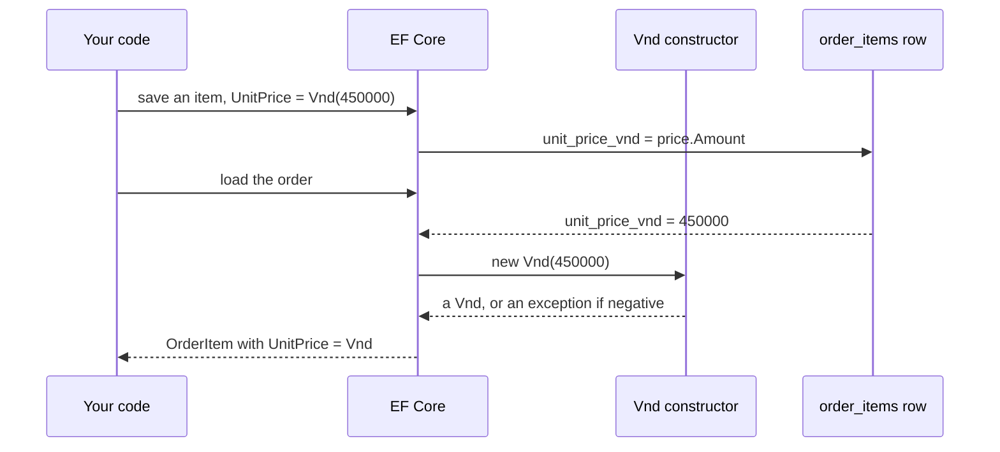

## Before you start

- [[design.l3.value-objects]] — you know `Vnd` is a record with no id, whose constructor refuses a negative amount, and that `OrderItem.UnitPrice` is a `Vnd` at stage-3.
- [[design.l2.ef-core-and-private-setters]] — you know EF Core fills properties that have private setters, and that loading an `Order` runs none of its public constructor's checks.

## The situation

You check out `stage-3` and read `OrderItem`. Its unit price is no longer an `int` named `UnitPriceVnd` but a `Vnd` named `UnitPrice`, a record with an `Amount` and no `Id`. You expect the database to pay for the change: a table for prices, or at least a migration that changes `order_items`. None of the seven migrations added for stage-3 changes that table, and an order's JSON still shows `unitPriceVnd` as a plain number. So where does a `Vnd` go when an order is saved, and how does it come back as a `Vnd` when the order is loaded?

## Core concepts

- value object — an object defined only by its values, with no id; in Đơn Hàng, `Vnd`.
- owner — the object that holds a value object as one of its properties; here `OrderItem`, whose row in `order_items` holds the price.
- value converter — a pair of functions EF Core runs on one property: the first turns the property's value into what the column stores, the second turns the column's value back into the property's type.
- DTO — the shape the API answers in; `OrderItemDto` is a separate type from `OrderItem` and declares its own property types.

## How it works



In the situation above, a `Vnd` has no id, and nothing in it can serve as its own key. A key picks out one particular row, but a `Vnd` of 450000 in one item is not a particular thing: it is equal to every other `Vnd` of 450000 and can replace it. So Đơn Hàng gives `Vnd` no rows of its own. A value converter maps it into its owner's row, where its one value, the amount, sits in the `unit_price_vnd` column that `order_items` already had at stage-2.

Saving goes through the converter's first function. It takes the `Vnd` and returns its `Amount`, an `int`, and EF Core writes that `int` into the column. The column receives an `int`, as it did when the property itself was an `int`, so its type stays `integer`. Introducing `Vnd` changed the mapping in `DonHangDbContext`, not the database schema.

Loading goes through the second function. It takes the `int` from the column and calls `new Vnd(amount)`, so the item EF Core hands back holds a real `Vnd`. The constructor refuses a negative amount. If a negative number ever reaches `unit_price_vnd` by a path outside the code, loading that row throws instead of handing your code an item with a negative price. That is the opposite of `Order`, which EF Core creates through a private constructor that checks nothing.

The API stays outside all of this. `OrderItemDto` still declares an `int`, so `Vnd` never reaches the JSON and `unitPriceVnd` stays a plain number. `Vnd` stays in `DonHang.Domain`, the project that holds the business classes.

## In the Đơn Hàng system

The whole storage decision is three lines at the end of the `OrderItem` mapping:

```csharp file=DonHang.Infrastructure/DonHangDbContext.cs tag=stage-3 lines=80-96
        modelBuilder.Entity<OrderItem>(e =>
        {
            e.ToTable("order_items");
            e.HasKey(i => new { i.OrderId, i.ProductId });
            e.Property(i => i.OrderId).HasColumnName("order_id");
            e.Property(i => i.ProductId).HasColumnName("product_id");
            e.Property(i => i.Quantity).HasColumnName("quantity");

            // lesson: design.l3.storing-value-objects
            // A Vnd has no id, so it gets no table: it is stored in the item's own
            // row. EF Core writes its Amount into the same integer column as at
            // stage-2 and builds a new Vnd from the column when it loads a row, so a
            // negative amount in the table makes the load fail.
            e.Property(i => i.UnitPrice)
                .HasColumnName("unit_price_vnd")
                .HasConversion(price => price.Amount, amount => new Vnd(amount));
        });
```

`HasConversion` takes the two functions in order: `price => price.Amount` for writing, `amount => new Vnd(amount)` for reading. `HasColumnName("unit_price_vnd")` keeps the column name that the `int` property `UnitPriceVnd` was mapped to at stage-2. The block gives `OrderItem` a table with `ToTable` and a primary key with `HasKey`, but nothing in `DonHangDbContext` does either for `Vnd`. `UnitPrice` is one more column of `order_items`, next to `quantity`.

```csharp file=DonHang.Api/Dtos.cs tag=stage-3 lines=12-17
// lesson: design.l3.storing-value-objects
// The JSON keeps unitPriceVnd as a plain number from stage-3 too: Vnd stays
// inside DonHang.Domain, and the controller passes on its Amount.
public sealed record OrderItemDto(int ProductId, int Quantity, int UnitPriceVnd);

public sealed record OrderDto(int Id, int CustomerId, string Status, DateTimeOffset PlacedAt, List<OrderItemDto> Items);
```

`OrderItemDto` is the shape of one item in an order's JSON, and its `UnitPriceVnd` is still an `int`. The comment above it says the controller passes on the `Vnd`'s `Amount`; that code is in `OrdersController.cs`, outside this excerpt. ASP.NET Core writes the property as `unitPriceVnd`, so a client such as `DonHang.App` keeps reading the same number it read at stage-2.

## Seniors often assume…

- **"A value object needs its own table, like every class EF Core maps."** → Actually, with a value converter EF Core treats `UnitPrice` as one property of `OrderItem` stored in one column, and `DonHangDbContext` maps no class of its own for `Vnd` (there is no `Entity<Vnd>`). A key would have nothing to name, because equal amounts can replace each other. You notice this when you search `DonHangDbContext` for `Entity<Vnd>`, or the database for a prices table, and find neither.
- **"Turning the unit price into a `Vnd` needs a migration that changes the column."** → Actually the converter's database side is an `int`, so the column stays `integer`, and none of the migration files added for stage-3 mentions `unit_price_vnd`. Only the generated `.Designer.cs` file beside each one does, because EF Core writes into it a copy of the whole model, every table and column, changed or not. A migration follows a change to the table; here only the C# side changed. You notice this in "Try it" below: the same column name is mapped at both tags, and the new migrations never name it.
- **"Once the domain uses `Vnd`, the API's JSON must turn the price into an object with an amount inside."** → Actually the DTO is a separate type and still declares an `int`, so the JSON did not change. Changing it would break a client that reads `unitPriceVnd` as a number, such as `DonHang.App`. While Đơn Hàng has a single currency, an object with a currency field beside the amount would also add no check the domain does not already make. You notice this when an order's JSON at stage-3 still shows `"unitPriceVnd":450000`.

## Try it (3 minutes)

In the root folder of the example repository, in Git Bash:

1. Run `git grep -n unit_price_vnd stage-2 stage-3 -- DonHang.Infrastructure/DonHangDbContext.cs`. Naming `stage-2` and `stage-3` searches the file as it is at each tag, whatever you have checked out.
2. Run `git diff --diff-filter=A stage-2 stage-3 -- DonHang.Infrastructure/Migrations ':!*.Designer.cs' | grep -c unit_price`. `--diff-filter=A` keeps only the files added between the two tags, here the seven new migrations; `':!*.Designer.cs'` leaves out the generated file that sits next to each one; `grep -c` counts the lines that mention `unit_price`.

Expected result: step 1 prints two lines. `stage-2:DonHang.Infrastructure/DonHangDbContext.cs:75:` shows `e.Property(i => i.UnitPriceVnd).HasColumnName("unit_price_vnd");`, and `stage-3:DonHang.Infrastructure/DonHangDbContext.cs:94:` shows `.HasColumnName("unit_price_vnd")`. Step 2 prints `0`. The same column is mapped at both tags, first from an `int` property and then from a `Vnd` property, and no migration file added for stage-3 mentions it.

## Connections

- [[design.l3.value-objects]] — the type this lesson stores: there you saw what `Vnd` is, here where its value lives.
- [[design.l2.ef-core-and-private-setters]] — the opposite case on loading: EF Core skips `Order`'s checking constructor, but goes through `Vnd`'s.
- [[backend.l1.efcore-mapping]] — the same `Property(...).HasColumnName(...)` mapping, extended here with a conversion.
- [[backend.l1.dtos-and-serialization]] — why the API's shape can stay the same while the domain type changes.
- [[design.l3.aggregate-root]] — prerequisite for: it relies on `OrderItem.UnitPrice` being a `Vnd` stored in the item's own row.

## Five-line summary

1. A value object has no id or key of its own: in Đơn Hàng a `Vnd` gets no table and lives in its owner's row.
2. At stage-3 a value converter in `DonHangDbContext` writes a `Vnd`'s `Amount` into `order_items.unit_price_vnd` and builds a new `Vnd` from it on load.
3. The column stays `integer` as at stage-2: introducing `Vnd` changed the mapping, not the database schema, so no migration touches it.
4. The converter builds each `Vnd` through its constructor, so a negative amount in the table makes loading fail instead of reaching the code.
5. `OrderItemDto` still carries an `int`: `Vnd` stays in `DonHang.Domain`, and the JSON keeps `unitPriceVnd` as a plain number.
