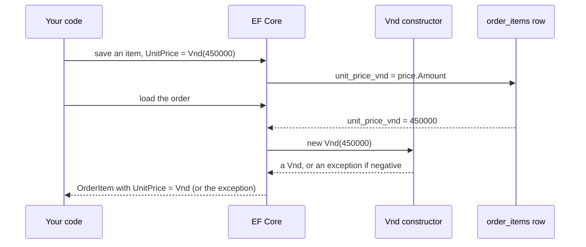

## Before you start

- [[design.l3.value-objects]] — you know `Vnd` is a record with no id, whose constructor refuses a negative amount, and that `OrderItem.UnitPrice` is a `Vnd` at stage-3.
- [[design.l2.ef-core-and-private-setters]] — you know EF Core fills properties that have private setters, and that loading an `Order` runs none of its public constructor's checks.

## The situation

You check out `stage-3` and see that `OrderItem.UnitPrice` is no longer an `int` but a `Vnd`, a record with an `Amount` and no `Id`. You expect the change to have cost something in the database: a new table for prices, or at least a migration that changes `order_items`. You look through the migrations added for stage-3, and none of them changes `order_items`. The API's order JSON still shows `unitPriceVnd` as a plain number. So where does a `Vnd` go when an order is saved, and how does it come back as a `Vnd` when the order is loaded?

## Core concepts

- value object — an object defined only by its values, with no id; in Đơn Hàng, `Vnd`.
- owner — the object that holds a value object as one of its properties; here `OrderItem`, whose row in `order_items` is where the price lives.
- value converter — a pair of functions EF Core runs on one property: the first turns the property's value into what the column stores, the second turns the column's value back into the property's type.
- column type — what PostgreSQL stores in a column, here `integer` for `unit_price_vnd`. EF Core expects the column type that matches what the converter hands over. The real column in the database changes only when a migration changes it.
- DTO — the shape the API answers in; `OrderItemDto` is separate from `OrderItem` and keeps its own types.

## How it works



In the situation above, nothing new is stored. A value object has no id of its own. With nothing to use as a key it cannot have rows of its own, so Đơn Hàng maps `Vnd` with a value converter into its owner's row: its one value, the amount, sits in the `unit_price_vnd` column that `order_items` already had at stage-2.

What changed is the mapping. When EF Core saves an item, the value converter's first function takes the `Vnd` and returns its `Amount`, an `int`, and that `int` goes into the column. When EF Core reads a row, the second function takes the `int` from the column and calls `new Vnd(amount)`, so the item it hands back holds a real `Vnd`.

Because the converter turns a `Vnd` into an `int`, the column type stays `integer`, as at stage-2. The database never learns that `Vnd` exists, which is why no stage-3 migration touches prices.

The second function matters for safety. It does not set `Amount` behind the constructor's back; it calls the constructor, and the constructor refuses a negative amount. If a negative number ever reaches `unit_price_vnd` by some other path, loading that row throws instead of giving your code an item with a negative price. That is the opposite of what you saw with `Order`, whose private constructor checks nothing when EF Core loads a row.

The API is the last layer. Its DTO still carries an `int`, so `Vnd` never reaches the API's JSON: it is declared in `DonHang.Domain`, the project that holds the business classes such as `Order` and `Vnd`, and the JSON does not change.

## In the Đơn Hàng system

The whole storage decision is three lines at the end of the `OrderItem` mapping.

```csharp file=DonHang.Infrastructure/DonHangDbContext.cs tag=stage-3 lines=80-96
        modelBuilder.Entity<OrderItem>(e =>
        {
            e.ToTable("order_items");
            e.HasKey(i => new { i.OrderId, i.ProductId });
            e.Property(i => i.OrderId).HasColumnName("order_id");
            e.Property(i => i.ProductId).HasColumnName("product_id");
            e.Property(i => i.Quantity).HasColumnName("quantity");

            // lesson: design.l3.storing-value-objects
            // A Vnd has no id, so it gets no table: it is stored in the item's own
            // row. EF Core writes its Amount into the same integer column as at
            // stage-2 and builds a new Vnd from the column when it loads a row, so a
            // negative amount in the table makes the load fail.
            e.Property(i => i.UnitPrice)
                .HasColumnName("unit_price_vnd")
                .HasConversion(price => price.Amount, amount => new Vnd(amount));
        });
```

`HasColumnName("unit_price_vnd")` keeps the column name the `int` property `UnitPriceVnd` used at stage-2. `HasConversion` takes the two functions in order: `price => price.Amount` when writing, `amount => new Vnd(amount)` when reading. For `OrderItem`, `Entity<OrderItem>` declares a mapped class, `ToTable` names its table and `HasKey` sets its primary key. Notice what is absent: no `Entity<Vnd>`, no `HasKey` and no `ToTable` for `Vnd`. `UnitPrice` is one more column of `order_items`, next to `quantity`.

```csharp file=DonHang.Api/Dtos.cs tag=stage-3 lines=12-17
// lesson: design.l3.storing-value-objects
// The JSON keeps unitPriceVnd as a plain number from stage-3 too: Vnd stays
// inside DonHang.Domain, and the controller passes on its Amount.
public sealed record OrderItemDto(int ProductId, int Quantity, int UnitPriceVnd);

public sealed record OrderDto(int Id, int CustomerId, string Status, DateTimeOffset PlacedAt, List<OrderItemDto> Items);
```

`OrderItemDto` is the shape of one item in an order's JSON, and its `UnitPriceVnd` is still an `int`. `OrdersController` fills it with `i.UnitPrice.Amount`, so the conversion back to a number happens once more, at the edge of the API. A client such as `DonHang.App` keeps reading `unitPriceVnd` as an `int`, exactly as before stage-3.

## Seniors often assume…

- **"A value object needs its own table, like every class EF Core maps."** → Actually, with a value converter EF Core does not map `Vnd` as a class of its own at all; `UnitPrice` is a property of `OrderItem` stored in one column. Nothing in a `Vnd` could serve as a key, and the converter stores it as one more column of `order_items`. You notice this when you look for an `Entity<Vnd>` call in `DonHangDbContext`, or a prices table in the database, and find neither.
- **"Turning the unit price into a `Vnd` needs a migration that changes the column."** → Actually the converter's database side is an `int`, so the column type stays `integer` and no stage-3 migration touches `unit_price_vnd`. The change lives in the mapping, not in the schema. EF Core keeps its own record of its mapping in `DonHangDbContextModelSnapshot.cs`, next to the migrations. You notice this when that file at stage-3 still records `UnitPrice` as an `int` in an `integer` column.
- **"Once the domain uses `Vnd`, the API's JSON must turn the price into an object with an amount inside."** → Actually the DTO is a separate shape with its own types, and it still declares an `int`; the controller passes on `Amount`. Changing the JSON would break a client that reads `unitPriceVnd` as a number, such as `DonHang.App`, and would add no protection, since the domain already refuses negative amounts. A second field holding the same number as an object would only be a copy no client reads. You notice this when an order's JSON at stage-3 still has `unitPriceVnd` as a bare number.

## Try it (3 minutes)

1. In the Đơn Hàng repository, run `git grep -n -e unit_price_vnd -e UnitPrice stage-3 -- DonHang.Infrastructure/Migrations ':!*.Designer.cs'`. `:!*.Designer.cs` leaves out the generated `.Designer.cs` file that sits next to each migration, so only the migrations' own changes and the snapshot are searched.
2. For each match, note which file it comes from and, if the line names one, which C# type.

Expected result: three lines. One comes from `20260923154631_InitialCreate.cs`, where the column was first created as `table.Column<int>(type: "integer", nullable: false)`. Two come from `DonHangDbContextModelSnapshot.cs`: `b.Property<int>("UnitPrice")` and `.HasColumnName("unit_price_vnd")`. No migration added for stage-3 appears. EF Core's own record of its mapping knows `UnitPrice` only as an `int` in the column that has existed since the first migration; `Vnd` never reached the database.

## Connections

- [[design.l3.value-objects]] — the type this lesson stores: there you saw what `Vnd` is, here where its value lives.
- [[design.l2.ef-core-and-private-setters]] — the opposite case on loading: EF Core skips `Order`'s checking constructor, but goes through `Vnd`'s.
- [[backend.l1.efcore-mapping]] — the same `Property(...).HasColumnName(...)` mapping, extended here with a conversion.
- [[backend.l1.dtos-and-serialization]] — why the API's shape can stay the same while the domain type changes.
- [[design.l3.aggregate-root]] — prerequisite for: it relies on `OrderItem.UnitPrice` being a `Vnd` stored in the item's own row.

## Five-line summary

1. A value object has no id of its own; in Đơn Hàng a `Vnd` gets no table and lives in its owner's row.
2. At stage-3 a value converter in `DonHangDbContext` writes a `Vnd`'s `Amount` into `order_items.unit_price_vnd` and builds a new `Vnd` from it on load.
3. The column stays `integer` as at stage-2: introducing `Vnd` changed the mapping, not the database, so no migration touches it.
4. The converter builds each `Vnd` through its constructor, so a negative amount in the table makes loading fail instead of reaching the code.
5. `OrderItemDto` still carries an `int`: `Vnd` does not appear in the JSON, which keeps `unitPriceVnd` as a plain number.
