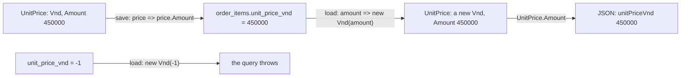

## Before you start

- [[design.l3.value-objects]] — you know `Vnd` has no id, its constructor refuses a negative amount, and `OrderItem.UnitPrice` is a `Vnd` at stage-3.
- [[design.l2.ef-core-and-private-setters]] — you know that loading an `Order` goes through a private constructor, so the public constructor's checks do not run.

## The situation

At stage-3 `OrderItem.UnitPrice` has become a `Vnd`, and you expect the database to change with it. You look for a table of prices and find none: `order_items` still has its `unit_price_vnd` column of whole numbers, and no migration between stage-2 and stage-3 touches it. A client calling `GET /api/v1/orders/{id}` still receives `unitPriceVnd` as a plain number. A table of `Vnd` rows would have nothing to use as a key, since a `Vnd` has no id. So where does a `Vnd` go when an order is saved, and how does it come back as a `Vnd`?

## Core concepts

- owner — the entity that holds a value object as one of its properties; in Đơn Hàng, the `OrderItem` that holds a unit price.
- value converter — a pair of functions EF Core applies to one property: the first turns the property's value into what the column stores, the second turns the column's value back.
- provider value — what the converter hands to the database for that column, here the `int` inside a `Vnd`.

## How it works



Start from the missing table. EF Core needs a key to tell one saved row from another, and a value object has nothing to offer as one: two prices of 450,000 đồng can replace each other anywhere. So a `Vnd` never gets a table or a key of its own. Its value lives in the row of its owner, next to the owner's other columns. In the situation above, the owner is `OrderItem`, and its row in `order_items` holds the price.

On save, the value converter's first function takes the `Vnd` and returns its `Amount`. That `int` is the provider value, and EF Core writes it into `unit_price_vnd`. On load, the second function takes the number from the column and calls `new Vnd(amount)`. The code after the query receives a `Vnd`, never a bare `int`.

That call matters. Loading an `Order` goes through its private constructor and skips the public one's checks. Loading a `Vnd` skips nothing: the converter calls `new Vnd(amount)`, the public constructor that holds the check, so the check runs on every row loaded. The diagram's third row shows a `-1` in the column: building the `Vnd` throws, and the query fails instead of handing the code a negative price. A table created by `db/schema.sql` already refuses such a row with a check of its own; the converter guards the code even where no such check exists.

The last arrow leaves the domain. The API copies `UnitPrice.Amount` into a DTO, so the JSON still carries a plain number.

## In the Đơn Hàng system

The mapping of `OrderItem`, in `DonHang.Infrastructure/DonHangDbContext.cs`:

```csharp file=DonHang.Infrastructure/DonHangDbContext.cs tag=stage-3 lines=80-96
        modelBuilder.Entity<OrderItem>(e =>
        {
            e.ToTable("order_items");
            e.HasKey(i => new { i.OrderId, i.ProductId });
            e.Property(i => i.OrderId).HasColumnName("order_id");
            e.Property(i => i.ProductId).HasColumnName("product_id");
            e.Property(i => i.Quantity).HasColumnName("quantity");

            // lesson: design.l3.storing-value-objects
            // A Vnd has no id, so it gets no table: it is stored in the item's own
            // row. EF Core writes its Amount into the same integer column as at
            // stage-2 and builds a new Vnd from the column when it loads a row, so a
            // negative amount in the table makes the load fail.
            e.Property(i => i.UnitPrice)
                .HasColumnName("unit_price_vnd")
                .HasConversion(price => price.Amount, amount => new Vnd(amount));
        });
```

Look at what is absent first. `DonHangDbContext` has no `Entity<Vnd>` and no `DbSet<Vnd>`: EF Core treats the unit price as one property of `OrderItem`, like `Quantity`. The key of `order_items` is the order id with the product id; the price takes no part in it. `HasConversion` takes the two functions in that order: the first runs when EF Core writes a row, the second when it reads one. The column name is the one stage-2 already used, so the database has nothing to change.

The answer shape, in `DonHang.Api/Dtos.cs`:

```csharp file=DonHang.Api/Dtos.cs tag=stage-3 lines=12-15
// lesson: design.l3.storing-value-objects
// The JSON keeps unitPriceVnd as a plain number from stage-3 too: Vnd stays
// inside DonHang.Domain, and the controller passes on its Amount.
public sealed record OrderItemDto(int ProductId, int Quantity, int UnitPriceVnd);
```

`OrderItemDto` still declares `int UnitPriceVnd`, exactly as at stage-2. `OrdersController` fills it with `UnitPrice.Amount`, so a client sees `"unitPriceVnd": 450000` at both tags. Keeping `Vnd` out of the DTO is worth it when clients already depend on the JSON shape: the "never negative" rule protects the domain, and a nested object would give those clients a breaking change and nothing else. A new API version, with no existing clients to break, is where a richer money shape could be weighed instead.

## Seniors often assume…

- **"A value object needs its own table, like every class EF Core maps."** → Actually EF Core does not map `Vnd` as a class of its own at all; it maps `OrderItem`, and the unit price is one of its properties, stored through a converter. You notice this when you search `DonHangDbContext` for `Vnd`: apart from the comment above it, the only code that names it is the `HasConversion` call — there is no `Entity<Vnd>` and no `DbSet<Vnd>`.
- **"Turning the unit price into a `Vnd` needs a migration that changes the column."** → Actually the converter turns a `Vnd` into the same `int` the column held at stage-2, under the same column name, so the database sees no difference. Only the C# side changed. You notice this when you read the `Up` methods of the migrations added between stage-2 and stage-3 and none of them touches `unit_price_vnd`.
- **"Once the domain uses `Vnd`, the API's JSON must turn the price into an object with an amount inside."** → Actually the JSON is shaped by `OrderItemDto`, not by the entity, and the DTO still carries an `int`. Changing the domain type and changing what clients receive are two separate decisions. You notice this when `GET /api/v1/orders/{id}` at stage-3 answers with `unitPriceVnd` as a plain number, as at stage-2.

## Try it (3 minutes)

In the root folder of the example repository, in Git Bash:

1. Run `git diff stage-2 stage-3 -- DonHang.Infrastructure/Migrations/DonHangDbContextModelSnapshot.cs`.
2. Search the output for `unit_price_vnd` and read the lines around it.

Expected result: next to `unit_price_vnd`, one line changes, from `b.Property<int>("UnitPriceVnd")` to `b.Property<int>("UnitPrice")`. The lines `.HasColumnType("integer")` and `.HasColumnName("unit_price_vnd")` appear unchanged around it.

Then decide: why does the snapshot say `Property<int>` when `OrderItem.UnitPrice` is a `Vnd`?

<details><summary>Suggested answer</summary>

The snapshot records each property under its C# name but with the type its column stores, and for a converted property that is the provider value's type. The converter turns each `Vnd` into its `Amount` before EF Core writes it, so the column is recorded as an `int` held in an `integer` column. The `Vnd` exists only on the C# side of the converter, which is why the property's new name was the only change EF Core recorded.

</details>

## Connections

- [[design.l3.value-objects]] — the prerequisite: this lesson stores the `Vnd` that lesson built, without giving it an id.
- [[design.l2.ef-core-and-private-setters]] — the contrast: loading an `Order` skips its public constructor, while loading a `Vnd` runs its public one.
- [[backend.l1.efcore-mapping]] — the same mapping tools, `ToTable` and `HasColumnName`, one step further with a converter.
- [[design.l3.aggregate-root]] — what comes next: closing an order's items to outside code while EF Core still loads them.

## Five-line summary

1. A single-valued value object like `Vnd` has no id, so it gets no table or key: its value is a column in its owner's row.
2. At stage-3 a value converter writes a `Vnd`'s `Amount` into `order_items.unit_price_vnd` and builds a new `Vnd` from it on load.
3. The column keeps its stage-2 name and integer type, so introducing `Vnd` changed the mapping, not the database.
4. The converter calls `Vnd`'s constructor, so a negative amount in the table makes the query fail instead of reaching the code.
5. `OrderItemDto` still carries an `int`, so the JSON keeps `unitPriceVnd` as a plain number.
