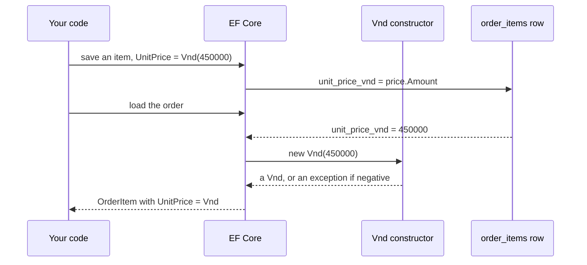

## Bạn cần biết trước

- [[design.l3.value-objects]] — bạn biết `Vnd` là một record không có id, constructor của nó từ chối số tiền âm, và ở stage-3 `OrderItem.UnitPrice` là một `Vnd`.
- [[design.l2.ef-core-and-private-setters]] — bạn biết EF Core gán được cả property có setter private, và khi tải một `Order`, không phép kiểm tra nào trong constructor public của nó được chạy.

## Tình huống

Bạn checkout `stage-3` và đọc `OrderItem`. Đơn giá không còn là một `int` tên `UnitPriceVnd` nữa mà là một `Vnd` tên `UnitPrice`, một record có `Amount` và không có `Id`. Bạn đoán database phải trả giá cho thay đổi này: một bảng giá riêng, hoặc ít nhất một migration sửa `order_items`. Thế nhưng trong bảy migration thêm vào ở stage-3, không cái nào đụng tới bảng đó, và JSON của một đơn vẫn hiện `unitPriceVnd` là một con số bình thường. Vậy khi lưu đơn, `Vnd` đi đâu, và khi tải đơn, làm sao nó quay về thành một `Vnd`?

## Khái niệm cốt lõi

- value object — object chỉ được xác định bởi giá trị, không có id. Trong Đơn Hàng, đó là `Vnd`.
- đối tượng chứa — object giữ value object như một property của mình. Ở đây là `OrderItem`, và dòng của nó trong `order_items` giữ đơn giá.
- value converter — một cặp hàm EF Core chạy trên một property: hàm thứ nhất đổi giá trị của property thành thứ cột lưu, hàm thứ hai đổi giá trị trong cột về lại kiểu của property.
- DTO — hình dạng mà API trả về. `OrderItemDto` là một kiểu tách riêng khỏi `OrderItem` và tự khai báo kiểu cho các property của nó.

## Cơ chế hoạt động



Trong tình huống trên, `Vnd` không có id, và không có gì bên trong nó dùng làm khóa của chính nó được. Khóa chỉ ra một dòng cụ thể, nhưng một `Vnd` 450.000 trong một item không phải là một thứ cụ thể: nó bằng mọi `Vnd` 450.000 khác và thay được cho chúng. Vì thế Đơn Hàng không cho `Vnd` dòng riêng nào. Một value converter ánh xạ nó vào dòng của đối tượng chứa, nơi giá trị duy nhất của nó, số tiền, nằm trong cột `unit_price_vnd` mà `order_items` đã có từ stage-2.

Khi lưu, dữ liệu đi qua hàm thứ nhất của converter. Hàm nhận `Vnd` và trả về `Amount` của nó, một `int`, rồi EF Core ghi `int` đó vào cột. Cột nhận một `int`, y như hồi property còn là `int`, nên kiểu của cột vẫn là `integer`. Đưa `Vnd` vào chỉ đổi phần ánh xạ trong `DonHangDbContext`, không đổi schema database.

Khi tải, dữ liệu đi qua hàm thứ hai. Hàm lấy `int` từ cột và gọi `new Vnd(amount)`, nên item EF Core trả về giữ một `Vnd` thật. Constructor từ chối số tiền âm. Nếu có lúc một số âm lọt vào `unit_price_vnd` bằng đường nào đó ngoài code, tải dòng đó sẽ ném exception thay vì đưa cho code một item có giá âm. Điều này ngược hẳn với `Order`, thứ EF Core tạo qua một constructor private không kiểm tra gì.

API đứng ngoài toàn bộ chuyện này. `OrderItemDto` vẫn khai báo một `int`, nên `Vnd` không bao giờ tới được JSON và `unitPriceVnd` vẫn là một con số bình thường. `Vnd` ở yên trong `DonHang.Domain`, project chứa các class nghiệp vụ.

## Trong hệ thống Đơn Hàng

Toàn bộ quyết định lưu trữ là ba dòng cuối phần ánh xạ `OrderItem`:

```csharp file=DonHang.Infrastructure/DonHangDbContext.cs tag=stage-3 lines=80-96
        modelBuilder.Entity<OrderItem>(e =>
        {
            e.ToTable("order_items");
            e.HasKey(i => new { i.OrderId, i.ProductId });
            e.Property(i => i.OrderId).HasColumnName("order_id");
            e.Property(i => i.ProductId).HasColumnName("product_id");
            e.Property(i => i.Quantity).HasColumnName("quantity");

            // lesson: design.l3.storing-value-objects
            // A Vnd has no id, so it gets no table: it is stored in the item's own
            // row. EF Core writes its Amount into the same integer column as at
            // stage-2 and builds a new Vnd from the column when it loads a row, so a
            // negative amount in the table makes the load fail.
            e.Property(i => i.UnitPrice)
                .HasColumnName("unit_price_vnd")
                .HasConversion(price => price.Amount, amount => new Vnd(amount));
        });
```

`HasConversion` nhận hai hàm theo thứ tự: `price => price.Amount` để ghi, `amount => new Vnd(amount)` để đọc. `HasColumnName("unit_price_vnd")` giữ nguyên tên cột mà property `int` `UnitPriceVnd` được ánh xạ vào ở stage-2. Khối này cho `OrderItem` một bảng bằng `ToTable` và một khóa chính bằng `HasKey`, nhưng trong `DonHangDbContext` không chỗ nào làm điều tương tự cho `Vnd`. `UnitPrice` chỉ là thêm một cột của `order_items`, cạnh `quantity`.

```csharp file=DonHang.Api/Dtos.cs tag=stage-3 lines=12-17
// lesson: design.l3.storing-value-objects
// The JSON keeps unitPriceVnd as a plain number from stage-3 too: Vnd stays
// inside DonHang.Domain, and the controller passes on its Amount.
public sealed record OrderItemDto(int ProductId, int Quantity, int UnitPriceVnd);

public sealed record OrderDto(int Id, int CustomerId, string Status, DateTimeOffset PlacedAt, List<OrderItemDto> Items);
```

`OrderItemDto` là hình dạng của một item trong JSON của đơn, và `UnitPriceVnd` của nó vẫn là `int`. Comment phía trên nói controller chuyển tiếp `Amount` của `Vnd`. Phần code đó nằm trong `OrdersController.cs`, ngoài đoạn trích này. ASP.NET Core ghi property này thành `unitPriceVnd`, nên một client như `DonHang.App` vẫn đọc đúng con số nó đã đọc ở stage-2.

## Senior hay nhầm rằng…

- **"Value object cần bảng riêng, như mọi class EF Core ánh xạ."** → Thực ra với value converter, EF Core coi `UnitPrice` là một property của `OrderItem` lưu trong một cột, và `DonHangDbContext` không ánh xạ class riêng nào cho `Vnd` (không có `Entity<Vnd>`). Một khóa sẽ chẳng có gì để gọi tên, vì các số tiền bằng nhau thay được cho nhau. Bạn sẽ nhận ra khi tìm `Entity<Vnd>` trong `DonHangDbContext`, hay tìm bảng giá trong database, và không thấy cái nào.
- **"Đổi đơn giá thành `Vnd` thì cần một migration sửa cột."** → Thực ra phía database của converter là một `int`, nên cột vẫn là `integer`, và không file migration nào thêm ở stage-3 nhắc tới `unit_price_vnd`. Chỉ file `.Designer.cs` được sinh ra cạnh mỗi migration là có nhắc, vì EF Core ghi vào đó bản sao của cả model, mọi bảng và mọi cột, dù có đổi hay không. Migration đi theo thay đổi của bảng, còn ở đây chỉ phía C# đổi. Bạn sẽ nhận ra ở phần "Thử ngay" bên dưới: cùng một tên cột được ánh xạ ở cả hai tag, và các migration mới không hề nhắc tới nó.
- **"Domain đã dùng `Vnd` thì JSON của API phải biến giá thành một object có số tiền bên trong."** → Thực ra DTO là một kiểu tách riêng và vẫn khai báo `int`, nên JSON không đổi. Đổi nó sẽ làm hỏng client đang đọc `unitPriceVnd` như một con số, chẳng hạn `DonHang.App`. Chừng nào Đơn Hàng chỉ có một loại tiền, một object có thêm trường loại tiền cạnh số tiền cũng không thêm được phép kiểm tra nào mà domain chưa làm. Bạn sẽ nhận ra khi JSON của một đơn ở stage-3 vẫn hiện `"unitPriceVnd":450000`.

## Thử ngay (3 phút)

Trong thư mục gốc của repository ví dụ, mở Git Bash:

1. Chạy `git grep -n unit_price_vnd stage-2 stage-3 -- DonHang.Infrastructure/DonHangDbContext.cs`. Ghi `stage-2` và `stage-3` vào lệnh nghĩa là tìm trong file đúng như nó ở từng tag, bất kể bạn đang checkout gì.
2. Chạy `git diff --diff-filter=A stage-2 stage-3 -- DonHang.Infrastructure/Migrations ':!*.Designer.cs' | grep -c unit_price`. `--diff-filter=A` chỉ giữ các file được thêm giữa hai tag, ở đây là bảy migration mới. `':!*.Designer.cs'` bỏ qua file được sinh ra nằm cạnh mỗi migration. `grep -c` đếm số dòng có nhắc tới `unit_price`.

Kết quả mong đợi: bước 1 in ra hai dòng. `stage-2:DonHang.Infrastructure/DonHangDbContext.cs:75:` hiện `e.Property(i => i.UnitPriceVnd).HasColumnName("unit_price_vnd");`, còn `stage-3:DonHang.Infrastructure/DonHangDbContext.cs:94:` hiện `.HasColumnName("unit_price_vnd")`. Bước 2 in ra `0`. Cùng một cột được ánh xạ ở cả hai tag, lần đầu từ một property `int`, sau đó từ một property `Vnd`, và không file migration nào thêm ở stage-3 nhắc tới nó.

## Liên hệ

- [[design.l3.value-objects]] — kiểu mà bài này lưu: ở đó bạn đã thấy `Vnd` là gì, ở đây là giá trị của nó nằm ở đâu.
- [[design.l2.ef-core-and-private-setters]] — trường hợp ngược lại khi tải: EF Core bỏ qua constructor có kiểm tra của `Order`, nhưng đi qua constructor của `Vnd`.
- [[backend.l1.efcore-mapping]] — cùng kiểu ánh xạ `Property(...).HasColumnName(...)`, ở đây được nối thêm một phép chuyển đổi.
- [[backend.l1.dtos-and-serialization]] — vì sao hình dạng của API giữ nguyên được trong khi kiểu trong domain thay đổi.
- [[design.l3.aggregate-root]] — bài cần bài này trước: nó cần `OrderItem.UnitPrice` là một `Vnd` lưu ngay trong dòng của item.

## Tóm tắt 5 dòng

1. Value object không có id hay khóa riêng: trong Đơn Hàng, `Vnd` không có bảng và nằm trong dòng của đối tượng chứa nó.
2. Ở stage-3, một value converter trong `DonHangDbContext` ghi `Amount` của `Vnd` vào `order_items.unit_price_vnd` và dựng một `Vnd` mới từ cột đó khi tải.
3. Cột vẫn là `integer` như ở stage-2: đưa `Vnd` vào đổi phần ánh xạ, không đổi schema database, nên không migration nào đụng tới nó.
4. Converter dựng mỗi `Vnd` qua constructor của nó, nên một số tiền âm trong bảng làm lần tải thất bại thay vì lọt vào code.
5. `OrderItemDto` vẫn mang một `int`: `Vnd` ở yên trong `DonHang.Domain`, và JSON giữ `unitPriceVnd` là một con số bình thường.
