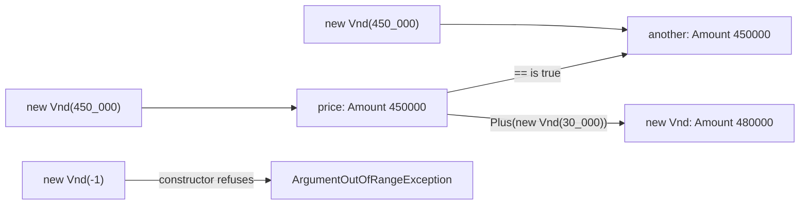

## Before you start

- [[design.l3.entities-and-identity]] — you know an entity is followed over time by its identity, and two orders are the same order when their `Id` values match.
- [[design.l2.valid-from-construction]] — you know `Order`'s constructor refuses an empty list of items, so no order can start in a state its rules forbid.

## The situation

At stage-2 you review a change that works out what an order costs. One line adds an item's `UnitPriceVnd` to its `Quantity` with `+`, where it should multiply. The compiler accepts it, because both are `int`. You look for a guard against a negative price and find none: `UnitPriceVnd` is a public `int` property, so it takes `-450000` as readily as `450000`. Two items that cost `450000` each do not differ in any way that matters, yet no single type says what a price is, so each place that touches a price has to remember the rules on its own. What should a price be, so that it carries its own rules?

## Core concepts

- **value object** — an object with no identity, defined entirely by its values, so two with the same values can replace each other anywhere.
- primitive — a type the language gives you, such as `int` or `string`, that knows nothing about what its number or text means in the business.
- record — a C# type for which the compiler generates equality that compares the values of its data members instead of the reference.
- immutable — unable to change after it is created; an operation that seems to change it returns a new object instead.

## How it works



Start from the meaning. An order is followed over time; a price is not. Nobody asks for "that particular 450,000 đồng". If two items cost 450,000 đồng each, you could swap their prices and nothing in the business would change. That is a value object: it has no id, and its values are all there is to it.

At stage-2, every amount of money in `Entities.cs` is a primitive: `Product.PriceVnd`, `OrderItem.UnitPriceVnd` and `Payment.AmountVnd` are plain `int` properties. The `Vnd` in each name is only a reminder to the reader. The type accepts a negative number, and lets code add a price to a quantity.

At stage-3, `Vnd` is a type of its own, and the diagram shows its whole life. The two top rows each run `new Vnd(450_000)` and create two separate objects, `price` and `another`, with the same amount. The arrow labelled `== is true` shows that `==` calls them equal, because `Vnd` is a record. The arrow labelled `Plus` does not change `price`; it creates a third `Vnd` holding the sum. The last row runs the same constructor with `-1`, and the constructor refuses it with an exception. A `Vnd` is immutable, so a check that passed when it was created stays true for as long as it exists.

In the situation above, the price stops being a bare number. The rule "never negative" lives in one constructor instead of at every place that uses a price.

## In the Đơn Hàng system

The whole type, in `DonHang.Domain/Vnd.cs`:

```csharp file=DonHang.Domain/Vnd.cs tag=stage-3 lines=8-26
public sealed record Vnd
{
    public int Amount { get; }

    public Vnd(int amount)
    {
        if (amount < 0) throw new ArgumentOutOfRangeException(nameof(amount), "an amount in VND cannot be negative");
        Amount = amount;
    }

    public static Vnd Zero { get; } = new(0);

    // checked: an amount too big for an int throws instead of turning negative.
    public Vnd Plus(Vnd other) => new(checked(Amount + other.Amount));

    public Vnd Times(int quantity) => new(checked(Amount * quantity));

    public override string ToString() => $"{Amount} VND";
}
```

Look at the constructor first: it is the only constructor `Vnd` declares, so every amount a `Vnd` holds has passed it, and it throws `ArgumentOutOfRangeException` for a negative amount.

`OrderItem` now declares `public Vnd UnitPrice { get; private set; } = unitPrice;`, where `unitPrice` is the `Vnd` passed to `OrderItem`'s constructor; stage-2 had `public int UnitPriceVnd { get; set; }`. That private setter lets an item swap in a different `Vnd` object; it can never change the amount inside a `Vnd`, which has no setter at all. A unit price cannot be negative, and adding a quantity to it with `+` no longer compiles. Code combines amounts with `Plus` and multiplies by a quantity with `Times`. `Order.Total` starts from `Vnd.Zero`, a single `Vnd` of 0 shared by every call, and adds `item.UnitPrice.Times(item.Quantity)` for every item with `Plus`.

How equality works, in `DonHang.Tests/Domain/VndTests.cs`:

```csharp file=DonHang.Tests/Domain/VndTests.cs tag=stage-3 lines=10-19
    [Fact]
    public void TwoVndWithTheSameAmount_AreEqual()
    {
        var a = new Vnd(450_000);
        var b = new Vnd(450_000);

        Assert.Equal(a, b);
        Assert.True(a == b);
        Assert.False(ReferenceEquals(a, b));
    }
```

`a` and `b` are two objects, and the last line proves it: `ReferenceEquals` is `false`. Yet both `Assert.Equal` and `==` say they are equal. A record compares the values of its data members, and `Amount` is the only one `Vnd` has. That is the opposite of `Order` in the previous lesson, where `==` compared references and only the `Id` could say "same order".

`Amount` has a getter and no setter, so only the constructor can give it a value. `Plus` and `Times` build a new `Vnd` through that same constructor, so every result is checked too. A further test, `Plus_ReturnsANewVnd_AndChangesNeither`, adds `30_000` to `450_000` and then confirms that both inputs still hold their old amounts. Code that holds a `Vnd`, such as an item's unit price, never sees it change under it.

Wrapping a primitive pays off when a rule or a unit belongs to the value, as "never negative" and "money, not a count" belong to a price. Wrapping every `int` and `string` without such a rule adds types and conversions without adding any check. Some teams take the opposite view and wrap values with no rule at all, such as ids, because mixing up two `int` values of different kinds has cost them before; that pays off when those mix-ups actually happen. Đơn Hàng takes the narrow path: when an order is placed, each product's current price is read and turned into a `Vnd`, which becomes the item's unit price and feeds the order total; the stored `Product.PriceVnd` and payment amounts stay `int`. `Quantity` stays an `int` too: `Order`'s constructor refuses any item with a quantity below 1, and `OrderItem.Quantity` has only a private setter.

## Seniors often assume…

- **"A value object is just another name for a C# `struct`."** → Actually a value object is a design idea: no identity, compared by its values, never changed. `Vnd` is a `record`, which declares a class, and it has all three without being a struct. Being a struct does not make a type unchangeable, because a struct can have public setters, and a plain `struct` gets no `==` unless it declares one. You notice this when you read `public sealed record Vnd` and find no `struct` keyword, yet `VndTests` shows two separate objects compared as equal.
- **"Two `Vnd` objects are equal only when they are the same instance in memory."** → Actually that is reference comparison, what a plain class like `Order` gets. A record compares data member values, so two `Vnd` built from the same amount are equal. You notice this when `TwoVndWithTheSameAmount_AreEqual` passes while its last line confirms `a` and `b` are different objects.
- **"A value object may change its own amount through a method, as long as its setter is private."** → Actually a private setter only limits who may change the value; the type's own methods still can, and every holder of that object would see the change. `Vnd` has no setter at all, and `Plus` returns a new object. You notice this when you picture `Vnd.Zero`, one object shared by every call to `Order.Total`: if `Plus` changed it in place, the second order's total would start from the first order's sum.

## Try it (3 minutes)

In the root folder of the example repository, in Git Bash:

1. Run `git grep -n "UnitPrice" stage-2 stage-3 -- DonHang.Domain/Entities.cs`.
2. Compare the type of the unit price at each tag, and note where stage-3 uses it.

Expected result: the stage-2 line declares `public int UnitPriceVnd { get; set; }`. The stage-3 lines declare `public Vnd UnitPrice { get; private set; } = unitPrice;` and one line calling `item.UnitPrice.Times(item.Quantity)`, which is inside `Order.Total`; one more line is a comment recording the old `int UnitPriceVnd`.

Then decide: should `Quantity` become a type of its own too?

<details><summary>Suggested answer</summary>

It depends on whether a rule belongs to it. A quantity does have one, "at least 1", but at stage-3 `Order`'s constructor already checks it, and `OrderItem.Quantity` has only a private setter. A `Quantity` type would pay off if quantities were created and combined in many places, each needing that check. Until then it adds a type without adding a rule that is not already enforced.

</details>

## Connections

- [[design.l3.entities-and-identity]] — the opposite case: an entity is known by its identity, a value object by its values.
- [[design.l2.valid-from-construction]] — the same idea at a smaller scale: a constructor that refuses bad input, here for a single amount instead of a whole order.
- [[foundation.l1.oop-encapsulation]] — the language tool behind `Vnd`: data kept behind a constructor and methods, with no setter left open.
- [[design.l3.storing-value-objects]] — what comes next: how EF Core stores a `Vnd` when it has no id of its own.

## Five-line summary

1. A value object has no identity: it is defined entirely by its values, and two with the same values can replace each other anywhere.
2. At stage-2 every amount in `Entities.cs` is a bare `int`, so a price could be negative or added to a quantity.
3. At stage-3 `Vnd` is a record whose constructor refuses a negative amount, and `OrderItem.UnitPrice` is a `Vnd`.
4. Two `Vnd` with the same amount are equal, because a record compares data member values, not references.
5. A `Vnd` never changes; `Plus` and `Times` return new ones, and wrapping pays off when a rule or a unit belongs to the value.
