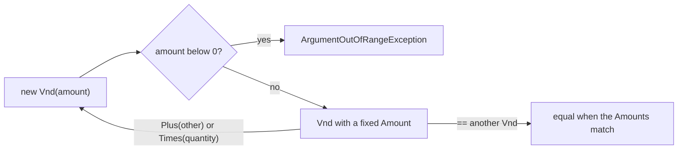

## Before you start

- [[design.l3.entities-and-identity]] — you know an entity is followed by its identity while its data changes; this lesson is about the objects that have no identity at all.
- [[design.l2.valid-from-construction]] — you saw `Order`'s constructor refuse a bad order so none can exist; `Vnd` uses the same move for a single amount.

## The situation

You are writing code that totals an order at stage-2. You type `item.UnitPriceVnd + item.Quantity` where you meant to multiply, and the compiler accepts it: both are `int`. In a test you also set `UnitPriceVnd` to `-450000`, and `OrderItem` accepts that too. The only thing saying this number is money is the `Vnd` at the end of its name, and the compiler does not read names. A price is an amount of đồng that is never negative; a quantity is a count of things. How can the type itself carry that difference, so the wrong line does not compile and the wrong amount cannot exist?

## Core concepts

- **value object** — an object defined entirely by its values: it has no id, and two of them with the same values can replace each other anywhere, like two 450,000 đồng prices.
- record — a C# type for which the compiler writes `Equals`, `==` and `!=` that compare the values of its fields instead of the reference.
- unchanging object — an object whose values are fixed when it is created; a different value means a new object, never an edit to the old one.
- entity — the contrast from the previous lesson: followed by its identity, so equal data does not make two entities the same.

## How it works



In the situation above, what was missing is a type that means "an amount of đồng". At stage-3 that type is `Vnd`, a value object, and the diagram shows the only three things that happen to one.

Every `Vnd` starts at the constructor. A negative amount ends in `ArgumentOutOfRangeException`, so no negative `Vnd` exists anywhere in the program.

Once created, the amount is fixed. `Amount` has a getter and no setter, so only the constructor assigns it. Arithmetic does not change it either: `Plus` and `Times` compute a new amount and pass it back through the constructor, which is the arrow looping back to the start. The result is checked like any other `Vnd`, and the two inputs keep their amounts. Because nothing can change a `Vnd`, code can share one freely, such as the one `Vnd.Zero` every total starts from.

Comparison looks only at the amount. `Vnd` is declared as a record, so `==` and `Equals` compare its field values, not the reference. Two `Vnd` objects made separately from `450_000` are two objects in memory and still equal. There is no `Id` to ask, so any `Vnd` of 450,000 can stand in for any other.

Last, `Vnd` offers `Plus(Vnd)` and `Times(int)` but no `+` operator. At stage-3 the property is `UnitPrice`, a `Vnd`, so the mistaken `item.UnitPrice + item.Quantity` no longer compiles; the type now does the job the name `UnitPriceVnd` could not.

## In the Đơn Hàng system

```csharp file=DonHang.Domain/Vnd.cs tag=stage-3 lines=3-26
// lesson: design.l3.value-objects
// An amount of money in whole đồng. A record, so two Vnd with the same Amount
// are equal; no setter and no `with`, so a Vnd never changes once created.
// Adding or multiplying gives a new Vnd. Used for OrderItem.UnitPrice and
// Order.Total only; elsewhere an amount is still an int named ...Vnd.
public sealed record Vnd
{
    public int Amount { get; }

    public Vnd(int amount)
    {
        if (amount < 0) throw new ArgumentOutOfRangeException(nameof(amount), "an amount in VND cannot be negative");
        Amount = amount;
    }

    public static Vnd Zero { get; } = new(0);

    // checked: an amount too big for an int throws instead of turning negative.
    public Vnd Plus(Vnd other) => new(checked(Amount + other.Amount));

    public Vnd Times(int quantity) => new(checked(Amount * quantity));

    public override string ToString() => $"{Amount} VND";
}
```

The declaration line makes `Vnd` a `sealed record`, which is what gives it value equality. `Amount` is get-only, and the constructor is the only place it is set. `Plus` and `Times` both end in `new(...)`, so every result goes through the same check, and `checked` keeps an overflow from wrapping around into a negative number. `ToString` prints the amount with its unit, which you will see again in "Try it". In `Entities.cs`, outside this excerpt, `OrderItem.UnitPrice` is now a `Vnd`, and `Order.Total` adds up the items starting from `Vnd.Zero`; the comment above `UnitPrice` notes it was `int UnitPriceVnd` until stage-2.

```csharp file=DonHang.Tests/Domain/VndTests.cs tag=stage-3 lines=10-19
    [Fact]
    public void TwoVndWithTheSameAmount_AreEqual()
    {
        var a = new Vnd(450_000);
        var b = new Vnd(450_000);

        Assert.Equal(a, b);
        Assert.True(a == b);
        Assert.False(ReferenceEquals(a, b));
    }
```

`a` and `b` are built separately. `ReferenceEquals` confirms they are two objects, yet `Assert.Equal` and `==` both report them equal. The test `Plus_ReturnsANewVnd_AndChangesNeither`, further down the same file, checks the other half: after `price.Plus(fee)`, `price` and `fee` still hold their old amounts.

Not every number became a type. `CustomerId` and `ProductId` stay `int`, and `Customer.City` stays a `string`. `Vnd` earned its type because a rule (never negative) and a unit (đồng) belong to every amount of money. Wrapping an `int` that carries no rule of its own adds a type and no check. Some teams still wrap ids when two kinds of id keep getting swapped in method calls; that choice is about catching a mix-up, not about the id carrying a rule.

## Seniors often assume…

- **"A value object is just another name for a C# `struct`."** → Actually a value object is a design choice — no identity, equal by values, never changing — and `Vnd` is one while being a `record`, which is a class. A `struct` with a public setter on its amount would copy like a value yet still let code change that amount, so it would not be a value object. You notice this when someone proposes turning `Vnd` into a `struct` "to make it a value object", though `VndTests` already pass as it is.
- **"Two `Vnd` objects are equal only when they are the same instance in memory."** → Actually that is what `==` does for a class with no equality of its own; a record compares field values, so `a == b` holds while `ReferenceEquals(a, b)` is false. You notice this when an assertion fails with the same amount printed on both sides, the sign that a class lost its value equality.
- **"A value object may change its own amount through a method, as long as its setter is private."** → Actually a private setter still lets any method of `Vnd` change `Amount`, and every holder of that object sees the change. `Vnd.Zero` is one object created once and returned to every caller, so a `Plus` that edited its own amount would leave `Zero` holding the last total. You notice this when `Order.Total` starts its sum from a number that is not zero.

## Try it (3 minutes)

1. In the Đơn Hàng repository at `stage-3`, run `dotnet test DonHang.Tests --filter VndTests`. Four tests pass.
2. In `DonHang.Domain/Vnd.cs`, change `public sealed record Vnd` to `public sealed class Vnd` and run the same command again. Afterwards, restore the file with `git checkout DonHang.Domain/Vnd.cs`.

Expected result: the second run still compiles, but reports `Failed: 3, Passed: 1`. Only `Constructor_NegativeAmount_Throws` passes. `TwoVndWithTheSameAmount_AreEqual` fails with `Expected: 450000 VND` and `Actual: 450000 VND`: the same amount on both sides, because a class with no equality of its own compares references. The `Plus` and `Times` tests fail for the same reason: they also compare `Vnd` objects with `Assert.Equal`.

## Connections

- [[design.l3.entities-and-identity]] — the opposite case: an object known by its identity while its values change, where this one has values and no identity.
- [[design.l2.valid-from-construction]] — the same constructor check one size up: a whole order there, a single amount here.
- [[design.l3.storing-value-objects]] — the next step: how EF Core saves a `Vnd`, which this lesson leaves out.
- [[foundation.l1.oop-encapsulation]] — the idea underneath: a type keeps its data behind rules it enforces itself.

## Five-line summary

1. A value object is defined only by its values: it has no id, and two with equal values can replace each other.
2. At stage-2 money was a bare `int` named `...Vnd`, so a negative price and `price + quantity` both compiled.
3. At stage-3 `Vnd` is a record whose constructor refuses a negative amount, and `OrderItem.UnitPrice` is a `Vnd`.
4. Two `Vnd` with the same amount are equal; `Plus` and `Times` return a new `Vnd` and change neither input.
5. Wrap an `int` or `string` when a rule or unit belongs to the value; with no rule, wrapping adds a type but no check.
