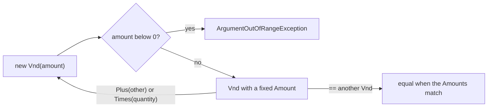

## Bạn cần biết trước

- [[design.l3.entities-and-identity]] — bạn biết entity được theo dõi qua định danh trong khi dữ liệu của nó thay đổi. Bài này nói về những object hoàn toàn không có định danh.
- [[design.l2.valid-from-construction]] — bạn đã thấy constructor của `Order` từ chối một đơn sai, nên không đơn sai nào tồn tại được. `Vnd` dùng đúng nước đi đó cho một số tiền.

## Tình huống

Bạn đang viết code tính tổng một đơn ở stage-2. Đáng lẽ phải nhân, bạn lại gõ `item.UnitPriceVnd + item.Quantity`, và compiler vẫn chấp nhận: cả hai đều là `int`. Trong một test, bạn còn gán `UnitPriceVnd` bằng `-450000`, và `OrderItem` cũng nhận luôn. Thứ duy nhất cho biết con số này là tiền là chữ `Vnd` ở cuối tên, mà compiler thì không đọc tên. Giá là một số đồng không bao giờ âm, còn số lượng là số món hàng. Làm sao để chính kiểu dữ liệu mang sự khác biệt đó, để dòng sai không compile được và số tiền sai không thể tồn tại?

## Khái niệm cốt lõi

- **value object** (đối tượng không có định danh, chỉ được xác định bởi giá trị; hai cái cùng giá trị thay nhau được) — object được định nghĩa hoàn toàn bởi giá trị của nó: không có id, và hai cái cùng giá trị có thể thay cho nhau ở bất cứ đâu, như hai mức giá 450.000 đồng.
- record — kiểu C# mà compiler tự viết `Equals`, `==` và `!=` để so giá trị các trường thay vì so tham chiếu.
- object không đổi — object có giá trị cố định từ lúc tạo. Muốn giá trị khác thì tạo object mới, không bao giờ sửa object cũ.
- entity — trường hợp đối lập ở bài trước: được theo dõi qua định danh, nên dữ liệu bằng nhau không làm hai entity thành một.

## Cơ chế hoạt động



Trong tình huống trên, thứ còn thiếu là một kiểu mang nghĩa "một số tiền tính bằng đồng". Ở stage-3, kiểu đó là `Vnd`, một value object, và sơ đồ cho thấy ba điều duy nhất có thể xảy ra với nó.

Mọi `Vnd` đều bắt đầu từ constructor. Số tiền âm kết thúc ở `ArgumentOutOfRangeException`, nên không có `Vnd` âm nào tồn tại trong chương trình.

Đã tạo xong thì số tiền cố định. `Amount` có getter mà không có setter, nên chỉ constructor gán được nó. Phép tính cũng không đổi nó: `Plus` và `Times` tính ra số tiền mới rồi đưa lại qua constructor, chính là mũi tên vòng về điểm đầu. Kết quả được kiểm tra như mọi `Vnd` khác, còn hai đầu vào giữ nguyên số tiền. Vì không gì đổi được một `Vnd`, code có thể dùng chung một object thoải mái, chẳng hạn chỉ một `Vnd.Zero` làm điểm xuất phát cho mọi tổng.

Phép so sánh chỉ nhìn vào số tiền. `Vnd` khai báo là record, nên `==` và `Equals` so giá trị các trường, không so tham chiếu. Hai `Vnd` tạo riêng từ `450_000` là hai object trong bộ nhớ nhưng vẫn bằng nhau. Không có `Id` nào để hỏi, nên `Vnd` 450.000 nào cũng thay được cho `Vnd` 450.000 khác.

Cuối cùng, `Vnd` có `Plus(Vnd)` và `Times(int)` nhưng không có toán tử `+`. Ở stage-3, property là `UnitPrice`, kiểu `Vnd`, nên dòng nhầm `item.UnitPrice + item.Quantity` không còn compile được. Kiểu dữ liệu giờ làm được việc mà cái tên `UnitPriceVnd` không làm được.

## Trong hệ thống Đơn Hàng

```csharp file=DonHang.Domain/Vnd.cs tag=stage-3 lines=3-26
// lesson: design.l3.value-objects
// An amount of money in whole đồng. A record, so two Vnd with the same Amount
// are equal; no setter and no `with`, so a Vnd never changes once created.
// Adding or multiplying gives a new Vnd. Used for OrderItem.UnitPrice and
// Order.Total only; elsewhere an amount is still an int named ...Vnd.
public sealed record Vnd
{
    public int Amount { get; }

    public Vnd(int amount)
    {
        if (amount < 0) throw new ArgumentOutOfRangeException(nameof(amount), "an amount in VND cannot be negative");
        Amount = amount;
    }

    public static Vnd Zero { get; } = new(0);

    // checked: an amount too big for an int throws instead of turning negative.
    public Vnd Plus(Vnd other) => new(checked(Amount + other.Amount));

    public Vnd Times(int quantity) => new(checked(Amount * quantity));

    public override string ToString() => $"{Amount} VND";
}
```

Dòng khai báo biến `Vnd` thành `sealed record`, và đó là thứ cho nó phép so sánh theo giá trị. `Amount` chỉ có get, và constructor là nơi duy nhất gán nó. `Plus` và `Times` đều kết thúc bằng `new(...)`, nên mọi kết quả đi qua cùng một phép kiểm tra, còn `checked` ngăn phép tràn số quay vòng thành số âm. `ToString` in số tiền kèm đơn vị, bạn sẽ gặp lại ở phần "Thử ngay". Trong `Entities.cs`, ngoài đoạn trích này, `OrderItem.UnitPrice` giờ là `Vnd`, và `Order.Total` cộng các item bắt đầu từ `Vnd.Zero`. Comment phía trên `UnitPrice` ghi rằng nó là `int UnitPriceVnd` cho tới stage-2.

```csharp file=DonHang.Tests/Domain/VndTests.cs tag=stage-3 lines=10-19
    [Fact]
    public void TwoVndWithTheSameAmount_AreEqual()
    {
        var a = new Vnd(450_000);
        var b = new Vnd(450_000);

        Assert.Equal(a, b);
        Assert.True(a == b);
        Assert.False(ReferenceEquals(a, b));
    }
```

`a` và `b` được tạo riêng. `ReferenceEquals` xác nhận đó là hai object, vậy mà `Assert.Equal` và `==` đều báo chúng bằng nhau. Test `Plus_ReturnsANewVnd_AndChangesNeither`, ở phía dưới cùng file, kiểm tra nửa còn lại: sau `price.Plus(fee)`, `price` và `fee` vẫn giữ số tiền cũ.

Không phải con số nào cũng thành một kiểu riêng. `CustomerId` và `ProductId` vẫn là `int`, `Customer.City` vẫn là `string`. `Vnd` xứng đáng có kiểu riêng vì có một quy tắc (không bao giờ âm) và một đơn vị (đồng) gắn với mọi số tiền. Bọc một `int` không mang quy tắc nào chỉ thêm một kiểu mà không thêm phép kiểm tra nào. Vẫn có team bọc cả id khi hai loại id cứ bị truyền nhầm chỗ cho nhau trong lời gọi method. Lựa chọn đó nhằm bắt lỗi nhầm lẫn, chứ không phải vì id mang quy tắc riêng.

## Senior hay nhầm rằng…

- **"Value object chỉ là tên khác của `struct` trong C#."** → Thực ra value object là một lựa chọn thiết kế: không định danh, bằng nhau theo giá trị, không bao giờ đổi. `Vnd` là value object dù nó là `record`, tức là một class. Một `struct` có setter public cho số tiền sẽ được sao chép như giá trị nhưng vẫn cho code sửa số tiền đó, nên nó không phải value object. Bạn sẽ nhận ra khi ai đó đề xuất đổi `Vnd` thành `struct` "để nó thành value object", trong khi `VndTests` vốn đã pass với code hiện tại.
- **"Hai object `Vnd` chỉ bằng nhau khi là cùng một instance trong bộ nhớ."** → Thực ra đó là cách `==` hoạt động với một class không tự định nghĩa phép so sánh bằng. Record so giá trị các trường, nên `a == b` đúng trong khi `ReferenceEquals(a, b)` sai. Bạn sẽ nhận ra khi một assertion fail với cùng một số tiền in ở cả hai bên, dấu hiệu một class đã mất phép so sánh theo giá trị.
- **"Value object có thể tự đổi số tiền của mình qua một method, miễn setter là private."** → Thực ra setter private vẫn cho mọi method của `Vnd` đổi `Amount`, và mọi chỗ đang giữ object đó đều thấy thay đổi. `Vnd.Zero` là một object tạo một lần rồi trả về cho mọi nơi gọi, nên một `Plus` tự sửa số tiền của chính nó sẽ khiến `Zero` giữ tổng gần nhất. Bạn sẽ nhận ra khi `Order.Total` bắt đầu cộng từ một số không phải 0.

## Thử ngay (3 phút)

1. Trong repository Đơn Hàng ở `stage-3`, chạy `dotnet test DonHang.Tests --filter VndTests`. Bốn test pass.
2. Trong `DonHang.Domain/Vnd.cs`, đổi `public sealed record Vnd` thành `public sealed class Vnd` rồi chạy lại đúng lệnh đó. Xong thì khôi phục file bằng `git checkout DonHang.Domain/Vnd.cs`.

Kết quả mong đợi: lần chạy thứ hai vẫn compile được, nhưng báo `Failed: 3, Passed: 1`. Chỉ `Constructor_NegativeAmount_Throws` pass. `TwoVndWithTheSameAmount_AreEqual` fail với `Expected: 450000 VND` và `Actual: 450000 VND`: hai bên cùng một số tiền, vì một class không tự định nghĩa phép so sánh bằng thì so tham chiếu. Các test `Plus` và `Times` fail cùng lý do: chúng cũng so các object `Vnd` bằng `Assert.Equal`.

## Liên hệ

- [[design.l3.entities-and-identity]] — trường hợp ngược lại: object được nhận ra qua định danh trong khi giá trị đổi, còn object ở bài này có giá trị mà không có định danh.
- [[design.l2.valid-from-construction]] — cùng phép kiểm tra ở constructor, ở cỡ lớn hơn: ở đó là cả một đơn, ở đây là một số tiền.
- [[design.l3.storing-value-objects]] — bước tiếp theo: EF Core lưu một `Vnd` thế nào, điều bài này bỏ qua.
- [[foundation.l1.oop-encapsulation]] — ý tưởng nằm bên dưới: một kiểu giữ dữ liệu của nó sau những quy tắc do chính nó áp đặt.

## Tóm tắt 5 dòng

1. Value object chỉ được định nghĩa bởi giá trị: không có id, và hai cái cùng giá trị thay nhau được.
2. Ở stage-2, tiền là một `int` trần tên `...Vnd`, nên cả giá âm lẫn `price + quantity` đều compile được.
3. Ở stage-3, `Vnd` là record có constructor từ chối số tiền âm, và `OrderItem.UnitPrice` là một `Vnd`.
4. Hai `Vnd` cùng số tiền thì bằng nhau. `Plus` và `Times` trả về `Vnd` mới và không đổi đầu vào nào.
5. Bọc một `int` hay `string` khi giá trị có quy tắc hoặc đơn vị đi kèm. Không có quy tắc thì bọc chỉ thêm kiểu, không thêm phép kiểm tra.
