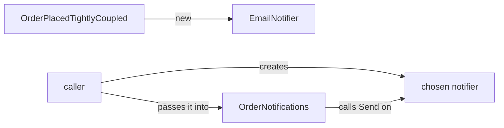

## Before you start

- [[design.l1.solid-dip]] — you know `OrderNotifications` depends on `INotifier` instead of creating an `EmailNotifier`, and that DIP is about which way the dependency points.
- [[design.l1.the-repository-layer]] — you know `OrderService` depends on `IOrderRepository`, and that `EfOrderRepository` implements it.

## The situation

In the DIP lesson, `OrderNotifications` asked for an `INotifier` instead of creating an `EmailNotifier` the way its neighbour `OrderPlacedTightlyCoupled` does. That lesson ended with a loose end: something outside the class decides which notifier it gets. A teammate reads `OrdersController` and says: "This class uses Dependency Inversion, look, it gets an `OrderService` from outside." But `OrderService` is a concrete class, not an abstraction. Is the teammate right? What exactly is "getting it from outside" called, and how is it different from the principle?

## Core concepts

- **dependency injection (DI)** — a technique: a class receives the objects it depends on from outside — in this course, and most often in C#, as constructor parameters — instead of creating them itself with `new`.
- dependency — an object whose behaviour a class uses to do its job, like the notifier that `OrderNotifications` calls `Send` on.
- constructor parameter — a value the caller must pass when creating an object; in C#, the parameters in parentheses right after a class name are constructor parameters for the whole class.

## How it works



A class can get a dependency in two ways. It can create it: `OrderPlacedTightlyCoupled` writes `new()` for its `EmailNotifier` field, so that decision is made inside the class, once, forever. Or it can receive it: `OrderNotifications` lists an `INotifier` as a constructor parameter, so whoever creates an `OrderNotifications` must create a notifier first and hand it over. The second way is dependency injection: the class that uses the dependency no longer chooses it, the caller does.

DIP and DI answer different questions. DIP asks what type the class should depend on, and answers: an abstraction, such as `INotifier`. DI asks how the object reaches the class, and answers: from outside, here through the constructor. DIP is the principle; injection is the usual mechanic that makes it work in code. A class that writes `new EmailNotifier()` names the concrete class in its own code, even when the field's type is `INotifier`. For the caller to choose the object, it has to come from outside, and injection is how it usually gets there.

Injection can also appear without inversion. A class can receive a concrete class through its constructor: that is injection, but not inversion, because it still names the concrete type. The caller still chooses the object, but only among instances of that one class.

## In the Đơn Hàng system

The injected half of the sample, as the DIP lesson left it:

```csharp file=samples/DonHang.Samples/Samples/Design/OrderNotifications.cs tag=stage-1 lines=20-23
public sealed class OrderNotifications(INotifier notifier)
{
    public void Handle(int orderId) => notifier.Send(orderId, "order placed");
}
```

`OrderNotifications` never writes `new` for its notifier. It follows DIP (it names only `INotifier`, so any implementation fits, even one written after this class) and it uses DI (the notifier arrives as a constructor parameter). Nothing in the samples project creates an `OrderNotifications` yet; the class simply cannot exist without a caller handing it some `INotifier`.

Now the class the teammate pointed at, in `DonHang.Api`:

```csharp file=DonHang.Api/Controllers/OrdersController.cs tag=stage-1 lines=10-12
[ApiController]
[Route("api/v1/orders")]
public sealed class OrdersController(OrderService orderService, IOrderRepository repository) : ControllerBase
```

Both of its dependencies are injected. `IOrderRepository` is an abstraction, so that one is DI carrying out DIP. `OrderService` is a concrete class: that one is DI without inversion. The controller never builds its own `OrderService`, but it can only ever receive an `OrderService`. So the teammate was half right: the controller uses dependency injection for both, and depends on an abstraction for one of them.

`OrderService` works the same way one level down: its constructor asks for an `IOrderRepository` and an `INotifier`, and neither class writes `new` for them. So when the API runs, something outside these classes has to build an `EfOrderRepository` and a notifier, then an `OrderService`, then the controller. The next lesson shows what does that.

## Beginners often think…

- **"Dependency Injection and Dependency Inversion are two names for the same thing."** → Actually, inversion is a rule about what a class depends on (an abstraction), and injection is a way of handing a dependency to a class (through its constructor). `OrdersController` receives `OrderService` by injection, yet depends on that concrete class, not an abstraction. You notice the difference when you want to swap an injected class for another implementation and find that the constructor only accepts that one type.
- **"A class 'uses DI' as soon as it takes any constructor parameter, even a plain string or number."** → Actually, DI is about dependencies: objects whose behaviour the class calls. If `OrderNotifications` also took the text `"order placed"` as a constructor parameter, that text would be a value the class is set up with, not a dependency; the `INotifier` is a dependency, because the class calls `Send` on it. You notice the difference when you ask "could I pass a different implementation here?" — for a string or a number the question has no meaning.

## Try it (3 minutes)

For each class, say whether it receives each dependency by injection or creates it itself, and whether that dependency's type is an abstraction.

1. `OrderPlacedTightlyCoupled` and its `EmailNotifier`.
2. `OrderNotifications` and its `INotifier`.
3. `EfOrderRepository(DonHangDbContext db)` and its `DonHangDbContext`.

Expected result: 1 — creates it, concrete type. 2 — injected, abstraction. 3 — injected, concrete type.

Which of the three could be given a different notifier or database access class without editing its source?

<details><summary>Suggested answer</summary>

Only `OrderNotifications`: it is injected and names an abstraction, so any `INotifier` fits. `EfOrderRepository` is injected but asks for `DonHangDbContext` by its concrete type, so it only accepts that class; `OrderPlacedTightlyCoupled` creates its own `EmailNotifier` and accepts nothing at all.

</details>

## Connections

- [[design.l1.solid-dip]] — the principle this mechanic carries out.
- [[design.l1.the-di-container]] — what builds the objects and passes them in when the API runs.

## Five-line summary

1. Dependency injection means a class receives its dependencies from outside, usually as constructor parameters, instead of creating them with `new`.
2. DIP says what to depend on (an abstraction); DI says how the object gets there (from outside, here through the constructor).
3. `OrderNotifications` uses both: it names only `INotifier`, and the notifier is passed in.
4. `OrdersController` is injected with both of its dependencies, but `OrderService` is a concrete class — DI without inversion.
5. Because these classes never create their dependencies, something outside must build and pass them in when the API runs.
