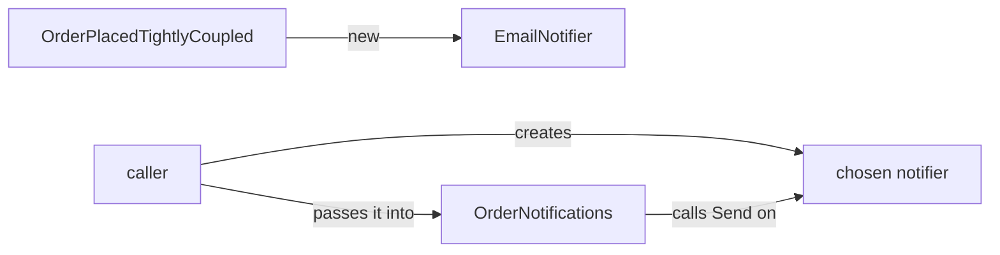

## Bạn cần biết trước

- [[design.l1.solid-dip]] — bạn biết `OrderNotifications` phụ thuộc vào `INotifier` thay vì tự tạo một `EmailNotifier`, và DIP nói về chiều của phụ thuộc.
- [[design.l1.the-repository-layer]] — bạn biết `OrderService` phụ thuộc vào `IOrderRepository`, và `EfOrderRepository` cài đặt interface đó.

## Tình huống

Ở bài DIP, `OrderNotifications` xin một `INotifier` thay vì tự tạo `EmailNotifier` như class hàng xóm `OrderPlacedTightlyCoupled`. Bài đó để lại một đầu mối bỏ ngỏ: một thứ bên ngoài class quyết định nó nhận notifier nào. Một đồng nghiệp đọc `OrdersController` và nói: "Class này dùng Dependency Inversion đấy, nhìn này, nó nhận `OrderService` từ bên ngoài." Nhưng `OrderService` là một class cụ thể, không phải abstraction. Đồng nghiệp nói đúng không? Việc "nhận từ bên ngoài" chính xác gọi là gì, và nó khác nguyên tắc ra sao?

## Khái niệm cốt lõi

- **dependency injection (DI)** — một kỹ thuật: class nhận các object nó phụ thuộc từ bên ngoài — trong khóa học này, và phổ biến nhất trong C#, là qua tham số constructor — thay vì tự tạo chúng bằng `new`.
- phụ thuộc — một object mà class dùng hành vi của nó để làm việc, như notifier mà `OrderNotifications` gọi `Send`.
- tham số constructor — một giá trị bên gọi bắt buộc phải truyền khi tạo object; trong C#, các tham số trong ngoặc ngay sau tên class là tham số constructor của cả class.

## Cơ chế hoạt động



Một class có hai cách để có một phụ thuộc. Nó có thể tự tạo: `OrderPlacedTightlyCoupled` viết `new()` cho field `EmailNotifier` của nó, nên quyết định đó nằm bên trong class, một lần, mãi mãi. Hoặc nó có thể nhận: `OrderNotifications` khai báo một `INotifier` làm tham số constructor, nên ai tạo `OrderNotifications` cũng phải tạo một notifier trước rồi trao vào. Cách thứ hai là dependency injection: class dùng phụ thuộc không còn tự chọn nó nữa, bên gọi chọn.

DIP và DI trả lời hai câu hỏi khác nhau. DIP hỏi class nên phụ thuộc vào kiểu nào, và trả lời: một abstraction, như `INotifier`. DI hỏi object tới được class bằng cách nào, và trả lời: từ bên ngoài, ở đây là qua constructor. DIP là nguyên tắc; injection là cơ chế thường dùng để nguyên tắc đó thành hiện thực trong code. Một class viết `new EmailNotifier()` gọi tên class cụ thể ngay trong code của mình, kể cả khi kiểu của field là `INotifier`. Để bên gọi chọn được object, object phải tới từ bên ngoài, và injection là cách nó thường tới.

Injection cũng có thể xuất hiện mà không có inversion. Một class có thể nhận một class cụ thể qua constructor: đó là injection, nhưng không phải inversion, vì nó vẫn gọi tên kiểu cụ thể. Bên gọi vẫn chọn object, nhưng chỉ trong số các instance của đúng class đó.

## Trong hệ thống Đơn Hàng

Nửa được inject của ví dụ, đúng như bài DIP để lại:

```csharp file=samples/DonHang.Samples/Samples/Design/OrderNotifications.cs tag=stage-1 lines=20-23
public sealed class OrderNotifications(INotifier notifier)
{
    public void Handle(int orderId) => notifier.Send(orderId, "order placed");
}
```

`OrderNotifications` không bao giờ viết `new` cho notifier của nó. Nó theo DIP (nó chỉ gọi tên `INotifier`, nên cài đặt nào cũng vừa, kể cả cài đặt viết sau class này) và nó dùng DI (notifier tới dưới dạng tham số constructor). Trong project samples chưa có chỗ nào tạo `OrderNotifications`; class này đơn giản là không thể tồn tại nếu không có bên gọi trao cho nó một `INotifier` nào đó.

Giờ tới class mà đồng nghiệp chỉ vào, trong `DonHang.Api`:

```csharp file=DonHang.Api/Controllers/OrdersController.cs tag=stage-1 lines=10-12
[ApiController]
[Route("api/v1/orders")]
public sealed class OrdersController(OrderService orderService, IOrderRepository repository) : ControllerBase
```

Cả hai phụ thuộc của nó đều được inject. `IOrderRepository` là abstraction, nên cái đó là DI thực hiện DIP. `OrderService` là class cụ thể: cái đó là DI không có inversion. Controller không bao giờ tự dựng `OrderService` của nó, nhưng nó chỉ có thể nhận đúng một `OrderService`. Vậy đồng nghiệp đúng một nửa: controller dùng dependency injection cho cả hai, và phụ thuộc vào abstraction cho một trong hai.

`OrderService` làm y như vậy ở tầng dưới: constructor của nó xin một `IOrderRepository` và một `INotifier`, và không class nào viết `new` cho chúng. Vì vậy khi API chạy, một thứ nằm ngoài các class này phải dựng một `EfOrderRepository` và một notifier, rồi một `OrderService`, rồi tới controller. Bài sau cho thấy thứ đó là gì.

## Người mới hay nghĩ rằng…

- **"Dependency Injection và Dependency Inversion là hai tên của cùng một thứ."** → Thực ra inversion là quy tắc về việc class phụ thuộc vào cái gì (một abstraction), còn injection là cách trao phụ thuộc cho class (qua constructor). `OrdersController` nhận `OrderService` bằng injection, nhưng vẫn phụ thuộc vào class cụ thể đó, không phải một abstraction. Bạn sẽ nhận ra sự khác biệt khi muốn đổi một class được inject sang cài đặt khác và thấy constructor chỉ nhận đúng một kiểu đó.
- **"Một class 'dùng DI' ngay khi nó nhận bất kỳ tham số constructor nào, kể cả một chuỗi hay một con số thuần."** → Thực ra DI nói về phụ thuộc: các object mà class gọi hành vi của chúng. Nếu `OrderNotifications` nhận thêm chuỗi `"order placed"` làm tham số constructor, chuỗi đó là giá trị để thiết lập class, không phải phụ thuộc; còn `INotifier` là phụ thuộc, vì class gọi `Send` trên nó. Bạn sẽ nhận ra sự khác biệt khi tự hỏi "mình có thể truyền một cài đặt khác vào đây không?" — với một chuỗi hay một con số, câu hỏi đó không có nghĩa.

## Thử ngay (3 phút)

Với mỗi class, cho biết nó nhận từng phụ thuộc bằng injection hay tự tạo, và kiểu của phụ thuộc đó có phải abstraction không.

1. `OrderPlacedTightlyCoupled` và `EmailNotifier` của nó.
2. `OrderNotifications` và `INotifier` của nó.
3. `EfOrderRepository(DonHangDbContext db)` và `DonHangDbContext` của nó.

Kết quả mong đợi: 1 — tự tạo, kiểu cụ thể. 2 — được inject, abstraction. 3 — được inject, kiểu cụ thể.

Trong ba class, class nào có thể được trao một notifier hay một class truy cập database khác mà không phải sửa source của nó?

<details><summary>Gợi ý đáp án</summary>

Chỉ `OrderNotifications`: nó được inject và gọi tên một abstraction, nên `INotifier` nào cũng vừa. `EfOrderRepository` được inject nhưng xin `DonHangDbContext` bằng kiểu cụ thể, nên chỉ nhận đúng class đó; `OrderPlacedTightlyCoupled` tự tạo `EmailNotifier` của nó và không nhận gì cả.

</details>

## Liên hệ

- [[design.l1.solid-dip]] — nguyên tắc mà cơ chế này thực hiện.
- [[design.l1.the-di-container]] — thứ dựng các object và truyền chúng vào khi API chạy.

## Tóm tắt 5 dòng

1. Dependency injection nghĩa là class nhận các phụ thuộc từ bên ngoài, thường là qua tham số constructor, thay vì tự tạo chúng bằng `new`.
2. DIP nói phụ thuộc vào cái gì (một abstraction); DI nói object tới đó bằng cách nào (từ bên ngoài, ở đây là qua constructor).
3. `OrderNotifications` dùng cả hai: nó chỉ gọi tên `INotifier`, và notifier được truyền vào.
4. `OrdersController` được inject cả hai phụ thuộc, nhưng `OrderService` là class cụ thể — DI không có inversion.
5. Vì các class này không bao giờ tự tạo phụ thuộc, một thứ bên ngoài phải dựng và truyền chúng vào khi API chạy.
