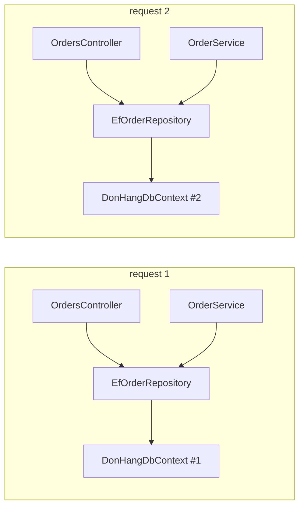

## Before you start

- [[design.l1.the-di-container]] — you know the container builds `OrderService`, `EfOrderRepository` and the rest from registrations, and that `IOrderRepository` appears twice in the graph behind one `OrdersController`.
- [[backend.l1.efcore-mapping]] — you know `DonHangDbContext` is the class EF Core uses to read and write Đơn Hàng's tables.

## The situation

The last lesson left a question open: when one request needs an `IOrderRepository` twice — once for `OrdersController`, once for `OrderService` — does it get one `EfOrderRepository` or two? And what about two customers placing orders at the same moment: do their requests share a `DonHangDbContext`, with its change tracker full of the other customer's order? The container has to decide, every time it is asked, whether to build a new object or hand back one it already built. Who tells it which?

## Core concepts

- **service lifetime** — the rule for how long an object the container builds is kept and handed out again: singleton, scoped, or transient.
- singleton — one object for the whole run of the app; every request that asks gets the same one.
- scoped — one object per scope; ASP.NET Core opens one scope per request, so each request gets its own object, shared by everything in that request.
- transient — a new object every time anything asks for it.
- scope — a boundary the container keeps scoped objects in; when the scope ends, its objects are disposed: told to release what they hold, the way a `using` block does.

## How it works



Every registration carries a **service lifetime**, and the container follows it on every resolve. For a singleton, it builds the object the first time it is asked and then hands out that same object for as long as the app runs. For a scoped registration, it keeps one object per scope. ASP.NET Core opens a new scope when a request arrives and disposes it, with its scoped objects, when the request ends, so inside one request every class asking for a scoped type gets the same object, and the next request gets a fresh one. For a transient registration, it builds a new object on every resolve, even twice within one request. The diagram shows the scoped case: each request has its own `EfOrderRepository` and `DonHangDbContext`, and inside one request the controller and `OrderService` point at the same repository.

The lifetime is a correctness decision, not only a speed one. A `DbContext` keeps a change tracker for the work of one request, and EF Core does not support using one instance from two requests at the same time. Registered as a singleton, the one `DonHangDbContext` would serve every concurrent request: two customers' orders would land in the same change tracker, and two queries could run on it at once — EF Core throws when it detects that, and when it does not, the results can be wrong. Scoped is the lifetime that matches: one context per request, used by one request at a time.

A class with nothing request-specific inside it has no such problem. If it only reads settings and computes a result, one instance can serve every request, and a singleton saves building it again and again.

## In the Đơn Hàng system

The registrations in `DonHang.Api`'s startup code, which the next lesson reads line by line:

```csharp file=DonHang.Api/Program.cs tag=stage-1 lines=18-20
builder.Services.AddDonHangInfrastructure(connectionString);
builder.Services.AddScoped<OrderService>();
builder.Services.AddSingleton<JwtTokenService>();
```

`AddDonHangInfrastructure` registers `DonHangDbContext` with `AddDbContext`, whose default lifetime is scoped, and `EfOrderRepository` and `LoggingNotifier` (the class that writes notifications to the log) with `AddScoped`. `OrderService` is scoped too. So during one `POST /api/v1/orders`, `OrdersController` and `OrderService` receive the same `EfOrderRepository`, which holds the same `DonHangDbContext`: the answer to the last lesson's question is "one". The next request gets a new set.

`JwtTokenService` is a singleton. It receives the app's configuration and, each time a customer logs in, reads the settings it needs from it; it keeps nothing that changes between calls, so one instance can serve every login.

Scoped objects need a scope, and at startup no request has opened one yet. Program.cs therefore opens a scope by hand before it applies migrations:

```csharp file=DonHang.Api/Program.cs tag=stage-1 lines=57-62
using (var scope = app.Services.CreateScope())
{
    var context = scope.ServiceProvider.GetRequiredService<DonHangDbContext>();
    MigrationBaseline.ApplyIfNeeded(context);
    context.Database.Migrate();
}
```

`CreateScope` does by hand what a request does automatically. The two middle lines bring the database schema up to date; what matters here is where `context` comes from. It is resolved from `scope.ServiceProvider` (the container, working inside this scope), and when the `using` block ends, the scope is disposed, and so is that `DonHangDbContext`.

## Beginners often think…

- **"Singleton is the safest default, since there's only ever one object to worry about."** → Actually one object means every concurrent request shares it, and whatever it keeps inside is shared too. A singleton `DonHangDbContext` would mix different customers' orders in one change tracker and break when two requests query at once. You notice this when errors appear only when many requests arrive at once, or when one request sees an order object another request just loaded.
- **"Service lifetime only affects performance, not correctness."** → Actually the lifetime decides who shares an object, and sharing changes behaviour. Scoped is what makes `OrdersController` and `OrderService` work on one `DonHangDbContext` within a request, and keeps other requests out of it. You notice this when a lifetime change makes a feature misbehave without any change to its code.

## Try it (3 minutes)

Using the registrations in this lesson, answer each question with a number.

1. During one `POST /api/v1/orders`, how many `EfOrderRepository` objects does the container build?
2. How many `DonHangDbContext` objects does the container build for two requests handled one after the other?
3. How many `JwtTokenService` objects serve ten logins?

Expected result: 1 — one, shared by the controller and `OrderService`, because it is scoped. 2 — two, one per request. 3 — one, because it is a singleton.

If `EfOrderRepository` were registered transient but `DonHangDbContext` stayed scoped, how would answer 1 change, and would the two repositories still share a context?

<details><summary>Suggested answer</summary>

Answer 1 would become two: the controller and `OrderService` would each get a new `EfOrderRepository`. Both would still receive the same `DonHangDbContext`, because the context's own lifetime is scoped and they are resolved in the same request.

</details>

## Connections

- [[design.l1.the-di-container]] — how the container builds the graph whose objects these lifetimes govern.
- [[design.l1.wiring-the-container]] — the full registration code these lifetimes come from.

## Five-line summary

1. A service lifetime says how long the container keeps an object: singleton for the app, scoped per request, transient never reused.
2. `DonHangDbContext`, `EfOrderRepository`, `LoggingNotifier` and `OrderService` are scoped, so one request shares one set of them.
3. A singleton `DonHangDbContext` would be shared by concurrent requests, which EF Core does not support — a correctness bug, not a slowdown.
4. `JwtTokenService` is a singleton because it keeps nothing that changes between calls.
5. Outside a request there is no scope, so Program.cs creates one by hand to get a `DonHangDbContext` for migrations.
