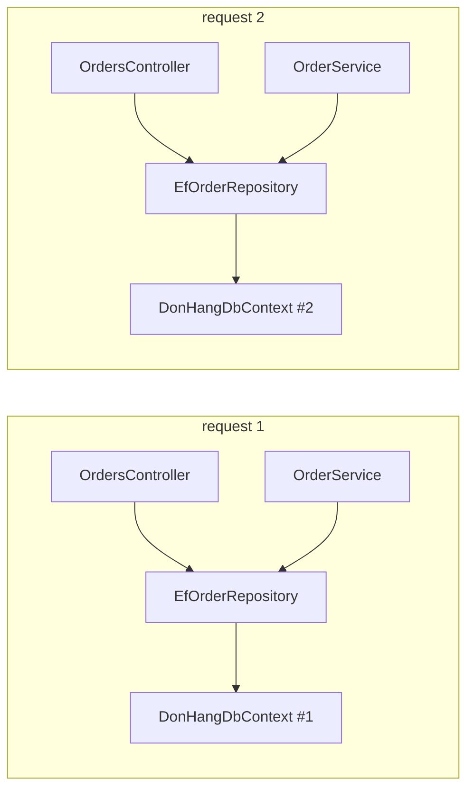

## Bạn cần biết trước

- [[design.l1.the-di-container]] — bạn biết container dựng `OrderService`, `EfOrderRepository` và các class còn lại từ registration, và `IOrderRepository` xuất hiện hai lần trong cây đằng sau một `OrdersController`.
- [[backend.l1.efcore-mapping]] — bạn biết `DonHangDbContext` là class EF Core dùng để đọc và ghi các bảng của Đơn Hàng.

## Tình huống

Bài trước để ngỏ một câu hỏi: khi một request cần `IOrderRepository` hai lần — một cho `OrdersController`, một cho `OrderService` — nó nhận một `EfOrderRepository` hay hai? Còn khi hai khách đặt hàng cùng một lúc thì sao: request của họ có dùng chung một `DonHangDbContext`, với change tracker chứa đầy order của khách kia không? Mỗi lần được hỏi, container phải quyết định dựng object mới hay trả lại object đã dựng. Ai bảo nó chọn cái nào?

## Khái niệm cốt lõi

- **service lifetime** — quy tắc cho biết một object do container dựng được giữ lại và trao ra lần nữa trong bao lâu: singleton, scoped, hay transient.
- singleton — một object cho cả quá trình chạy của app; request nào xin cũng nhận đúng object đó.
- scoped — một object cho mỗi scope; ASP.NET Core mở một scope cho mỗi request, nên mỗi request có object riêng, được mọi thứ trong request đó dùng chung.
- transient — một object mới mỗi lần có thứ xin.
- scope — một ranh giới mà container giữ các object scoped bên trong; khi scope kết thúc, các object của nó bị dispose: được bảo giải phóng những gì chúng giữ, giống như khối `using` làm.

## Cơ chế hoạt động



Mỗi registration mang một **service lifetime**, và container làm theo nó mỗi lần resolve. Với singleton, container dựng object ở lần đầu được hỏi rồi trao đúng object đó chừng nào app còn chạy. Với registration scoped, nó giữ một object cho mỗi scope. ASP.NET Core mở scope mới khi request tới và dispose scope, cùng các object scoped của nó, khi request kết thúc, nên trong một request mọi class xin một kiểu scoped đều nhận cùng một object, còn request sau nhận object mới. Với registration transient, nó dựng object mới mỗi lần resolve, kể cả hai lần trong cùng một request. Sơ đồ cho thấy trường hợp scoped: mỗi request có `EfOrderRepository` và `DonHangDbContext` riêng, và trong một request thì controller và `OrderService` trỏ tới cùng một repository.

Lifetime là quyết định về tính đúng đắn, không chỉ về tốc độ. Một `DbContext` giữ change tracker cho phần việc của một request, và EF Core không hỗ trợ dùng một instance từ hai request cùng lúc. Nếu đăng ký singleton, một `DonHangDbContext` duy nhất sẽ phục vụ mọi request đồng thời: order của hai khách sẽ rơi vào cùng một change tracker, và hai truy vấn có thể chạy trên nó cùng lúc — EF Core throw khi phát hiện ra điều đó, còn khi không phát hiện thì kết quả có thể sai. Scoped là lifetime phù hợp: một context cho mỗi request, được đúng một request dùng tại một thời điểm.

Một class không chứa gì riêng của request thì không gặp vấn đề đó. Nếu nó chỉ đọc thiết lập rồi tính ra kết quả, một instance có thể phục vụ mọi request, và singleton giúp khỏi phải dựng nó lặp đi lặp lại.

## Trong hệ thống Đơn Hàng

Các registration trong code khởi động của `DonHang.Api`, mà bài sau sẽ đọc từng dòng:

```csharp file=DonHang.Api/Program.cs tag=stage-1 lines=18-20
builder.Services.AddDonHangInfrastructure(connectionString);
builder.Services.AddScoped<OrderService>();
builder.Services.AddSingleton<JwtTokenService>();
```

`AddDonHangInfrastructure` đăng ký `DonHangDbContext` bằng `AddDbContext`, có lifetime mặc định là scoped, và đăng ký `EfOrderRepository` cùng `LoggingNotifier` (class ghi thông báo vào log) bằng `AddScoped`. `OrderService` cũng là scoped. Vì vậy trong một `POST /api/v1/orders`, `OrdersController` và `OrderService` nhận cùng một `EfOrderRepository`, giữ cùng một `DonHangDbContext`: câu trả lời cho câu hỏi của bài trước là "một". Request sau nhận một bộ mới.

`JwtTokenService` là singleton. Nó nhận cấu hình của app và, mỗi lần có khách đăng nhập, đọc những thiết lập nó cần từ đó; nó không giữ gì thay đổi giữa các lần gọi, nên một instance phục vụ được mọi lần đăng nhập.

Object scoped cần một scope, mà lúc khởi động chưa có request nào mở scope. Vì thế Program.cs tự mở một scope trước khi áp dụng migration:

```csharp file=DonHang.Api/Program.cs tag=stage-1 lines=57-62
using (var scope = app.Services.CreateScope())
{
    var context = scope.ServiceProvider.GetRequiredService<DonHangDbContext>();
    MigrationBaseline.ApplyIfNeeded(context);
    context.Database.Migrate();
}
```

`CreateScope` làm bằng tay việc mà request làm tự động. Hai dòng ở giữa đưa schema database lên phiên bản mới nhất; điều quan trọng ở đây là `context` đến từ đâu. Nó được resolve từ `scope.ServiceProvider` (container, làm việc bên trong scope này), và khi khối `using` kết thúc, scope bị dispose, kéo theo `DonHangDbContext` đó.

## Người mới hay nghĩ rằng…

- **"Singleton là mặc định an toàn nhất, vì lúc nào cũng chỉ có một object phải lo."** → Thực ra một object nghĩa là mọi request đồng thời dùng chung nó, và mọi thứ nó giữ bên trong cũng bị dùng chung. Một `DonHangDbContext` singleton sẽ trộn order của nhiều khách vào một change tracker và hỏng khi hai request truy vấn cùng lúc. Bạn sẽ nhận ra khi lỗi chỉ xuất hiện lúc nhiều request tới cùng một lúc, hoặc khi một request thấy một object order mà request khác vừa nạp.
- **"Service lifetime chỉ ảnh hưởng tới hiệu năng, không ảnh hưởng tới tính đúng đắn."** → Thực ra lifetime quyết định ai dùng chung một object, và việc dùng chung làm thay đổi hành vi. Scoped là thứ khiến `OrdersController` và `OrderService` làm việc trên cùng một `DonHangDbContext` trong một request, và giữ các request khác ở ngoài. Bạn sẽ nhận ra khi đổi lifetime khiến một tính năng chạy sai dù code của nó không đổi.

## Thử ngay (3 phút)

Dựa vào các registration trong bài, trả lời mỗi câu bằng một con số.

1. Trong một `POST /api/v1/orders`, container dựng bao nhiêu object `EfOrderRepository`?
2. Container dựng bao nhiêu object `DonHangDbContext` cho hai request được xử lý lần lượt?
3. Bao nhiêu object `JwtTokenService` phục vụ mười lần đăng nhập?

Kết quả mong đợi: 1 — một, controller và `OrderService` dùng chung, vì nó là scoped. 2 — hai, mỗi request một cái. 3 — một, vì nó là singleton.

Nếu `EfOrderRepository` được đăng ký transient còn `DonHangDbContext` vẫn là scoped, đáp án 1 sẽ đổi thế nào, và hai repository có còn dùng chung context không?

<details><summary>Gợi ý đáp án</summary>

Đáp án 1 thành hai: controller và `OrderService` mỗi bên nhận một `EfOrderRepository` mới. Cả hai vẫn nhận cùng một `DonHangDbContext`, vì lifetime của chính context là scoped và chúng được resolve trong cùng một request.

</details>

## Liên hệ

- [[design.l1.the-di-container]] — cách container dựng cây mà các lifetime này chi phối.
- [[design.l1.wiring-the-container]] — toàn bộ code đăng ký mà các lifetime này đến từ đó.

## Tóm tắt 5 dòng

1. Service lifetime cho biết container giữ một object bao lâu: singleton cho cả app, scoped theo request, transient không bao giờ dùng lại.
2. `DonHangDbContext`, `EfOrderRepository`, `LoggingNotifier` và `OrderService` là scoped, nên một request dùng chung một bộ.
3. Một `DonHangDbContext` singleton sẽ bị các request đồng thời dùng chung, điều EF Core không hỗ trợ — lỗi đúng đắn, không phải chậm.
4. `JwtTokenService` là singleton vì nó không giữ gì thay đổi giữa các lần gọi.
5. Ngoài request thì không có scope, nên Program.cs tự tạo một scope để lấy `DonHangDbContext` cho migration.
