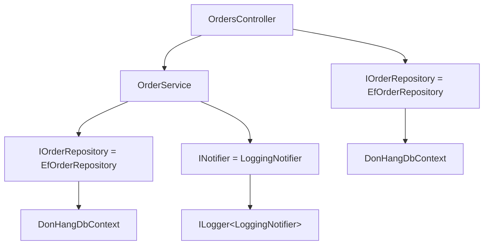

## Before you start

- [[design.l1.dependency-injection-intro]] — you know `OrdersController` and `OrderService` receive their dependencies as constructor parameters and never create them with `new`.

## The situation

A request for `POST /api/v1/orders` arrives, and it needs an `OrdersController`. That controller asks for an `OrderService` and an `IOrderRepository`. `OrderService` asks for an `IOrderRepository` and an `INotifier`. `EfOrderRepository` asks for a `DonHangDbContext`, and `LoggingNotifier` asks for a logger. None of these classes creates what it needs, and nowhere in the API is there a line that builds an `OrderService`. So who builds this whole chain of objects, for every request, and how does it know that an `IOrderRepository` should be an `EfOrderRepository`?

## Core concepts

- **DI container** — the component that holds interface-to-implementation registrations and builds a whole tree of dependencies on demand.
- registration — one entry told to the container at startup, such as "when something needs an `IOrderRepository`, give it an `EfOrderRepository`".
- resolve — ask the container for an object of some type; it finds the registration, builds the object, and first resolves everything that object's constructor asks for.
- dependency graph — the tree of objects needed to build one object: its dependencies, their dependencies, and so on down.

## How it works



Each arrow means "asks for in its constructor". A **DI container** works in two phases. At startup, the app fills it with registrations. Each one maps a type that code asks for to the class that should answer it: `IOrderRepository` to `EfOrderRepository`, `INotifier` to `LoggingNotifier`, and `OrderService` to itself, because code asks for that class directly. `DonHangDbContext` and the logger are registered too, some by Đơn Hàng's startup code and some by ASP.NET Core. After startup, the registrations cannot change.

Later, when some code resolves a type, the container looks it up and reads the constructor of the class it maps to. For every parameter there, it resolves that type the same way, recursively, until it reaches classes whose constructors it can satisfy completely. Then it builds from the bottom up and passes each object into the one above it. The container does not guess and does not read names: `EfOrderRepository` is used for `IOrderRepository` only because a registration says so.

Controllers are a special case. By default ASP.NET Core does not register controllers in the container; for each request it creates the controller itself and asks the container for every constructor parameter. So for `POST /api/v1/orders`, the container is asked for an `OrderService` and an `IOrderRepository`, and the whole graph above falls out of those two questions. Whether the two `IOrderRepository` arrows end at one object or two is a question for the next lesson.

## In the Đơn Hàng system

The container reads constructors like this one from `DonHang.Domain`:

```csharp file=DonHang.Domain/OrderService.cs tag=stage-1 lines=6-6
public sealed class OrderService(IOrderRepository repository, INotifier notifier)
```

`OrderService` names two abstractions. The container cannot create an interface, so for each one it needs a registration that points to a class. It finds `EfOrderRepository` and `LoggingNotifier`, and moves on to their constructors. `EfOrderRepository(DonHangDbContext db)` asks for a concrete class: `DonHangDbContext`, the EF Core class through which Đơn Hàng reads and writes its database. It in turn asks for its options — settings such as which database to connect to — and those are registered along with it, so the container passes them in like any other parameter. `LoggingNotifier`, in `DonHang.Infrastructure`, asks for a logger:

```csharp file=DonHang.Infrastructure/LoggingNotifier.cs tag=stage-1 lines=9-13
public sealed class LoggingNotifier(ILogger<LoggingNotifier> logger) : INotifier
{
    public void Send(int orderId, string subject) =>
        logger.LogInformation("notification for order {OrderId}: {Subject}", orderId, subject);
}
```

Nobody in Đơn Hàng wrote a registration for `ILogger<LoggingNotifier>`: `WebApplication.CreateBuilder`, which the API calls at startup, registers logging. So the container resolves it like everything else, and `LoggingNotifier` receives a ready logger.

Now imagine the API without a container. The code handling each request would first have to build a `DonHangDbContext` with its connection settings, then an `EfOrderRepository` around it, a logger, a `LoggingNotifier` around that, an `OrderService` from the two, and finally the controller. That is at least six objects in the right order, written out wherever a controller is needed. When `OrderService` later gains a third dependency, every one of those places has to change. With a container, only the constructor changes, plus one new registration for the new type; the existing registrations stay as they are.

## Beginners often think…

- **"The container guesses which implementation to use based on the interface's name."** → Actually the container only follows registrations. `IOrderRepository` becomes `EfOrderRepository` because Đơn Hàng registered exactly that pair; the similar names play no part. You notice this when you write a new class implementing an interface and nothing uses it until you change the registration.
- **"Every object the app creates goes through the container, including simple data objects like a DTO."** → Actually the container builds the parts that do work: controllers' dependencies, services, repositories. Data is still created with `new` where it is needed: `OrderService` writes `new Order { ... }` in `PlaceOrderAsync`, and the controller's `ToDto` method builds each `OrderDto`. You notice this when you look for a registration for `Order` or `OrderDto` and find none — none is needed, because they are values, not dependencies.

## Try it (3 minutes)

Using the constructors in this lesson, write down the dependency graph behind one `OrdersController`: everything the container is asked for when ASP.NET Core creates it. Start from the controller and keep going until every branch ends at something this lesson does not take further.

Expected result: `OrdersController` → `OrderService` and `IOrderRepository`; `OrderService` → `IOrderRepository` and `INotifier`; each `IOrderRepository` → `EfOrderRepository` → `DonHangDbContext` → its options; `INotifier` → `LoggingNotifier` → `ILogger<LoggingNotifier>`.

Which type appears twice in your graph, and what would you need to know to say whether both places get the same object?

<details><summary>Suggested answer</summary>

`IOrderRepository` appears twice: once for the controller, once for `OrderService`. Whether they share one `EfOrderRepository` — and one `DonHangDbContext` — depends on how long the container keeps an object it has built, which is the subject of the next lesson.

</details>

## Connections

- [[design.l1.dependency-injection-intro]] — the classes that ask for their dependencies instead of creating them.
- [[design.l1.service-lifetimes]] — how long each object the container builds lives.
- [[design.l1.wiring-the-container]] — the real registrations Đơn Hàng makes at startup.

## Five-line summary

1. A DI container is filled with registrations once, at startup: which class answers each type that code asks for.
2. To resolve a type, it reads the mapped class's constructor and resolves every parameter the same way, recursively.
3. For each request, ASP.NET Core creates the controller and asks the container for its constructor parameters.
4. The container follows registrations only; it never picks a class because of its name.
5. Without it, every place that needs a controller would write out the whole chain of `new`s and change whenever a constructor does.
