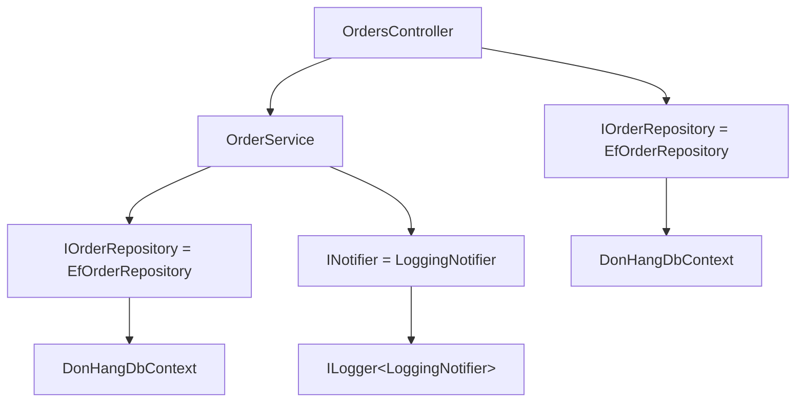

## Bạn cần biết trước

- [[design.l1.dependency-injection-intro]] — bạn biết `OrdersController` và `OrderService` nhận các phụ thuộc qua tham số constructor và không bao giờ tự tạo chúng bằng `new`.

## Tình huống

Một request `POST /api/v1/orders` tới, và nó cần một `OrdersController`. Controller đó xin một `OrderService` và một `IOrderRepository`. `OrderService` xin một `IOrderRepository` và một `INotifier`. `EfOrderRepository` xin một `DonHangDbContext`, còn `LoggingNotifier` xin một logger. Không class nào tự tạo thứ nó cần, và không chỗ nào trong API có dòng dựng `OrderService`. Vậy ai dựng cả chuỗi object này, cho mỗi request, và làm sao nó biết một `IOrderRepository` phải là một `EfOrderRepository`?

## Khái niệm cốt lõi

- **DI container** — thành phần giữ các registration interface–implementation và dựng cả cây phụ thuộc khi được hỏi.
- registration — một mục khai báo với container lúc khởi động, như "khi có thứ cần một `IOrderRepository`, hãy đưa nó một `EfOrderRepository`".
- resolve — hỏi container một object thuộc kiểu nào đó; container tìm registration, dựng object, và trước đó resolve mọi thứ mà constructor của object ấy xin.
- cây phụ thuộc (dependency graph) — cây các object cần có để dựng một object: phụ thuộc của nó, phụ thuộc của chúng, cứ thế đi xuống.

## Cơ chế hoạt động



Mỗi mũi tên nghĩa là "xin trong constructor của nó". Một **DI container** làm việc theo hai giai đoạn. Lúc khởi động, app nạp registration vào nó. Mỗi registration ghép một kiểu mà code xin với class sẽ trả lời kiểu đó: `IOrderRepository` với `EfOrderRepository`, `INotifier` với `LoggingNotifier`, và `OrderService` với chính nó, vì code xin thẳng class đó. `DonHangDbContext` và logger cũng được đăng ký, một số do code khởi động của Đơn Hàng, một số do ASP.NET Core. Sau khi khởi động xong, các registration không thể đổi nữa.

Về sau, khi có code resolve một kiểu, container tra kiểu đó rồi đọc constructor của class được ghép với nó. Với mỗi tham số ở đó, nó resolve kiểu của tham số theo cùng cách, đệ quy, cho tới khi gặp những class mà nó đáp ứng được trọn vẹn constructor. Rồi nó dựng từ dưới lên và truyền từng object vào object phía trên. Container không đoán và không đọc tên: `EfOrderRepository` được dùng cho `IOrderRepository` chỉ vì có registration nói vậy.

Controller là trường hợp đặc biệt. Mặc định ASP.NET Core không đăng ký controller vào container; với mỗi request, nó tự tạo controller và hỏi container từng tham số constructor. Vì vậy với `POST /api/v1/orders`, container được hỏi một `OrderService` và một `IOrderRepository`, và cả cây ở trên sinh ra từ hai câu hỏi đó. Hai mũi tên `IOrderRepository` dẫn tới một object hay hai object là câu hỏi của bài sau.

## Trong hệ thống Đơn Hàng

Container đọc những constructor như cái này, trong `DonHang.Domain`:

```csharp file=DonHang.Domain/OrderService.cs tag=stage-1 lines=6-6
public sealed class OrderService(IOrderRepository repository, INotifier notifier)
```

`OrderService` gọi tên hai abstraction. Container không tạo được interface, nên với mỗi cái nó cần một registration trỏ tới một class. Nó tìm được `EfOrderRepository` và `LoggingNotifier`, rồi chuyển sang constructor của chúng. `EfOrderRepository(DonHangDbContext db)` xin một class cụ thể: `DonHangDbContext`, class EF Core mà Đơn Hàng dùng để đọc và ghi database. Tới lượt nó, class này xin các tùy chọn của mình — những thiết lập như kết nối tới database nào — và chúng được đăng ký cùng với nó, nên container truyền chúng vào như mọi tham số khác. `LoggingNotifier`, trong `DonHang.Infrastructure`, xin một logger:

```csharp file=DonHang.Infrastructure/LoggingNotifier.cs tag=stage-1 lines=9-13
public sealed class LoggingNotifier(ILogger<LoggingNotifier> logger) : INotifier
{
    public void Send(int orderId, string subject) =>
        logger.LogInformation("notification for order {OrderId}: {Subject}", orderId, subject);
}
```

Không ai trong Đơn Hàng viết registration cho `ILogger<LoggingNotifier>`: `WebApplication.CreateBuilder`, hàm mà API gọi lúc khởi động, đã đăng ký logging. Nên container resolve nó như mọi thứ khác, và `LoggingNotifier` nhận được một logger sẵn dùng.

Giờ hãy hình dung API không có container. Code xử lý mỗi request sẽ phải dựng trước một `DonHangDbContext` với thiết lập kết nối của nó, rồi một `EfOrderRepository` bọc quanh nó, một logger, một `LoggingNotifier` bọc quanh logger, một `OrderService` từ hai thứ kia, và cuối cùng là controller. Tức là ít nhất sáu object theo đúng thứ tự, viết ra ở mọi chỗ cần một controller. Khi `OrderService` sau này có thêm phụ thuộc thứ ba, mọi chỗ đó đều phải sửa. Có container thì chỉ constructor thay đổi, cộng thêm một registration mới cho kiểu mới; các registration cũ giữ nguyên.

## Người mới hay nghĩ rằng…

- **"Container đoán implementation cần dùng dựa trên tên của interface."** → Thực ra container chỉ làm theo registration. `IOrderRepository` thành `EfOrderRepository` vì Đơn Hàng đã đăng ký đúng cặp đó; tên giống nhau không đóng vai trò gì. Bạn sẽ nhận ra khi viết một class mới cài đặt một interface và không có gì dùng nó cho tới khi bạn đổi registration.
- **"Mọi object app tạo ra đều đi qua container, kể cả object dữ liệu đơn giản như DTO."** → Thực ra container dựng những phần làm việc: phụ thuộc của controller, service, repository. Dữ liệu vẫn được tạo bằng `new` ở chỗ cần nó: `OrderService` viết `new Order { ... }` trong `PlaceOrderAsync`, và method `ToDto` của controller dựng từng `OrderDto`. Bạn sẽ nhận ra khi tìm registration cho `Order` hay `OrderDto` mà không thấy — không cần có, vì chúng là giá trị, không phải phụ thuộc.

## Thử ngay (3 phút)

Dựa vào các constructor trong bài, viết ra cây phụ thuộc đằng sau một `OrdersController`: mọi thứ container được hỏi khi ASP.NET Core tạo nó. Bắt đầu từ controller và đi tiếp cho tới khi mọi nhánh dừng ở thứ mà bài này không đi sâu hơn.

Kết quả mong đợi: `OrdersController` → `OrderService` và `IOrderRepository`; `OrderService` → `IOrderRepository` và `INotifier`; mỗi `IOrderRepository` → `EfOrderRepository` → `DonHangDbContext` → các tùy chọn của nó; `INotifier` → `LoggingNotifier` → `ILogger<LoggingNotifier>`.

Kiểu nào xuất hiện hai lần trong cây của bạn, và bạn cần biết gì để nói hai chỗ đó có nhận cùng một object hay không?

<details><summary>Gợi ý đáp án</summary>

`IOrderRepository` xuất hiện hai lần: một cho controller, một cho `OrderService`. Chúng có dùng chung một `EfOrderRepository` — và một `DonHangDbContext` — hay không phụ thuộc vào việc container giữ một object nó đã dựng trong bao lâu, và đó là chủ đề của bài sau.

</details>

## Liên hệ

- [[design.l1.dependency-injection-intro]] — những class xin phụ thuộc thay vì tự tạo chúng.
- [[design.l1.service-lifetimes]] — mỗi object container dựng sống bao lâu.
- [[design.l1.wiring-the-container]] — các registration thật mà Đơn Hàng tạo lúc khởi động.

## Tóm tắt 5 dòng

1. DI container được nạp registration một lần, lúc khởi động: class nào trả lời cho mỗi kiểu mà code xin.
2. Để resolve một kiểu, nó đọc constructor của class được ghép và resolve từng tham số theo cùng cách, đệ quy.
3. Với mỗi request, ASP.NET Core tạo controller và hỏi container các tham số constructor của nó.
4. Container chỉ làm theo registration; nó không bao giờ chọn class vì tên.
5. Không có nó, mọi chỗ cần controller sẽ phải viết ra cả chuỗi `new` và phải sửa mỗi khi một constructor đổi.
