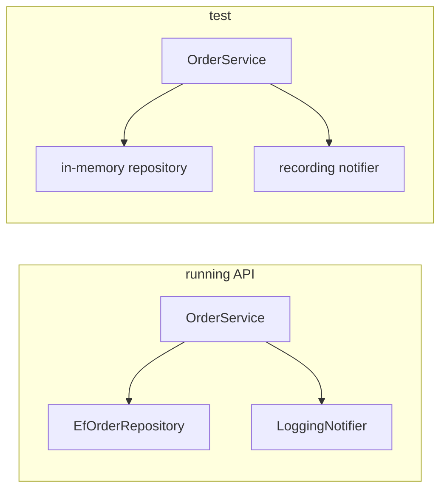

## Before you start

- [[design.l1.wiring-the-container]] — you know the container gives `OrderService` an `EfOrderRepository` and a `LoggingNotifier` because of two registrations, and that `OrderService` itself never names either class.

## The situation

You want to check one rule of `OrderService`: an order with no items is refused, and for an order with items, `PlaceOrderAsync` saves it with status `"new"`, sends one "order placed" notification and returns the order. Running the whole API for that means a database, a signed-in customer and an HTTP request, and a leftover order row every time you check. But `OrderService` does not know it talks to PostgreSQL, the database Đơn Hàng uses; it only knows `IOrderRepository` and `INotifier`. Could you run `PlaceOrderAsync` on its own, with something simpler in place of the database?

## Core concepts

- stand-in — an object you pass to a class in place of its real dependency, written to be simple and predictable, like a repository that keeps orders in a list.
- test (here) — a small piece of code that creates a class, calls it, and checks the result, without starting the whole app.
- isolation — checking one class on its own, so that a wrong result points at that class and not at a database or network it happened to use.

## How it works



`OrderService` asks for two interfaces in its constructor, `IOrderRepository` and `INotifier`, and reaches the database and the notifier only through their methods. In the running API, the container passes in `EfOrderRepository` and `LoggingNotifier`. But nothing forces that: any code can write `new OrderService(...)` and pass in its own `IOrderRepository` and `INotifier`. A test can hand it a repository that keeps orders in a list in memory, and a notifier that only records what it was asked to send. `OrderService`'s own code does not change at all; it cannot even tell the difference.

That is the payoff of DIP and of this module. DIP made `OrderService` depend on interfaces, and dependency injection made the concrete objects come from outside. Together they leave a gap exactly where a test needs one: the place where the real database and the real notifier would plug in. With stand-ins there, a check of `PlaceOrderAsync` runs in milliseconds, needs no PostgreSQL, and leaves no row behind.

A class that creates its own dependencies has no such gap. Whatever calls it also runs whatever those dependencies really do, every time. To check it, you have to run the real thing, or edit the class first.

## In the Đơn Hàng system

The samples show the difference on a small scale. First the class that creates its own notifier:

```csharp file=samples/DonHang.Samples/Samples/Design/OrderNotifications.cs tag=stage-1 lines=9-14
public sealed class OrderPlacedTightlyCoupled
{
    private readonly EmailNotifier notifier = new();

    public void Handle(int orderId) => notifier.Send(orderId, "order placed");
}
```

And what that `Send` really does, in the base class `EmailNotifier` inherits from:

```csharp file=samples/DonHang.Samples/Samples/Oop/NotifierBase.cs tag=stage-1 lines=5-16
public abstract class NotifierBase : INotifier
{
    private readonly List<string> sent = new();

    public IReadOnlyList<string> Sent => sent;

    public void Send(int orderId, string subject)
    {
        var message = Format(orderId, subject);
        sent.Add(message);
        Console.WriteLine(message);
    }
```

Any check of `OrderPlacedTightlyCoupled.Handle` writes to the console, because `Send` does. Worse, the notifier keeps a `Sent` list that would show exactly what was sent, but it sits in a private field of `OrderPlacedTightlyCoupled`, so ordinary calling code has no way to reach it. The only way to see what happened is to watch the console, or to change the class.

`OrderNotifications`, its injected neighbour, does the same job with an `INotifier` it receives through its constructor; its `Handle` calls `Send` on that notifier. A check can create an `EmailNotifier` itself, pass it in, call `Handle(42)`, and then read that notifier's `Sent` list: one message about order 42. The object is the same kind as before; the difference is only that the caller made it and still holds it.

`OrderService` gets the same benefit for bigger dependencies. `DonHang.Tests`, a project the next module opens, builds `OrderService` directly with two small in-memory classes of its own, and checks `PlaceOrderAsync` without any database.

## Beginners often think…

- **"Testing is a separate concern from how a class gets its dependencies; DI doesn't change what's testable."** → Actually how a class gets its dependencies decides what a test can control. `OrderPlacedTightlyCoupled` always sends through its own hidden `EmailNotifier`; `OrderNotifications` sends through whatever it is given. You notice this when you try to check a class and find the only way is to run the database or service it creates inside.
- **"A class needs a testing framework installed before dependency injection is worth doing."** → Actually injection pays off before any test exists, and before any testing tool is installed: the last lesson showed that one registration decides the notifier for the whole API. And the ability to test comes from the constructor, not from a tool — any code can pass a stand-in to `OrderService`. You notice this when you check `OrderNotifications` with nothing but an `EmailNotifier` you created and its `Sent` list.

## Try it (3 minutes)

Plan a check of `OrderService.PlaceOrderAsync` for an order with one item, without PostgreSQL. Answer in words:

1. What would you pass to `OrderService`'s constructor?
2. After calling `PlaceOrderAsync`, what would you look at to confirm it worked?

Expected result: 1 — an `IOrderRepository` that keeps added orders in a list, and an `INotifier` that records each call to `Send`. 2 — the returned order's status is `"new"`, the repository's list holds that order, and the notifier recorded one "order placed" message for it.

Why could you not plan the same check for `OrderPlacedTightlyCoupled` without editing it?

<details><summary>Suggested answer</summary>

It creates its own `EmailNotifier` in a private field, so there is nothing to pass in and no way to reach the notifier afterwards. Every call writes to the console, and the only record of what was sent is locked inside the class.

</details>

## Connections

- [[design.l1.dependency-injection-intro]] — how `OrderNotifications` receives its notifier.
- [[design.l1.solid-dip]] — why `OrderService` depends on interfaces in the first place.

## Five-line summary

1. `OrderService` depends on `IOrderRepository` and `INotifier`, and receives them from outside through its constructor.
2. So a check can pass in simple stand-ins, such as an in-memory repository and a recording notifier, without touching `OrderService`'s code.
3. `OrderPlacedTightlyCoupled` creates its own `EmailNotifier`, so every check also writes to the console and cannot read what was sent.
4. DIP plus injection leave a gap exactly where a real database or notifier would plug in; stand-ins fill it.
5. That gap is what makes checking one class in isolation possible, which the next module puts to direct use.
