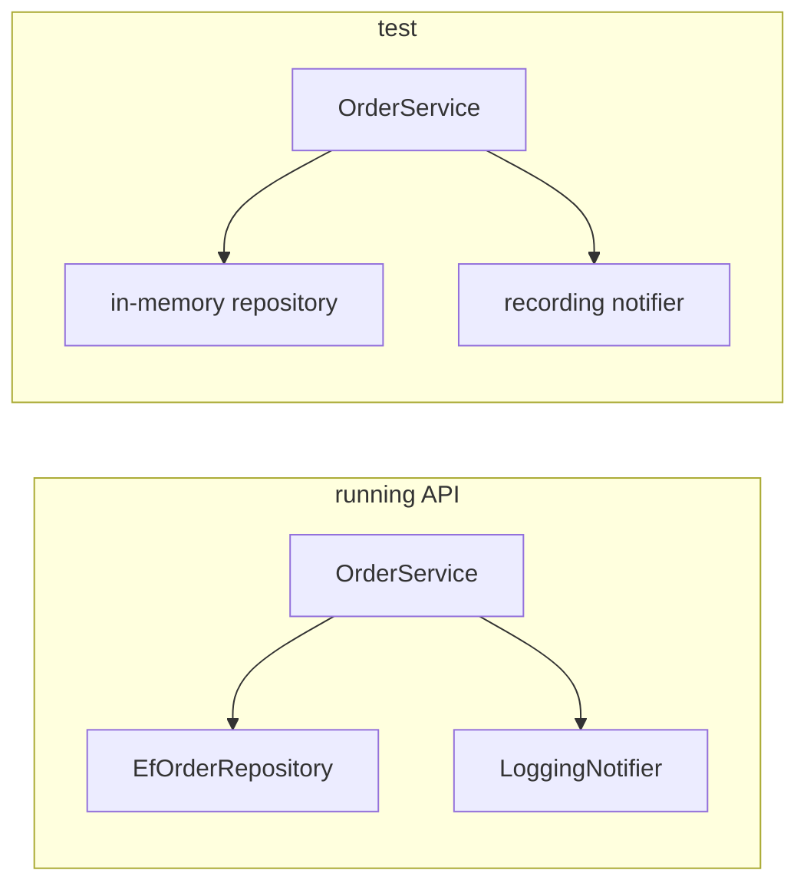

## Bạn cần biết trước

- [[design.l1.wiring-the-container]] — bạn biết container đưa cho `OrderService` một `EfOrderRepository` và một `LoggingNotifier` là nhờ hai registration, và bản thân `OrderService` không bao giờ gọi tên class nào trong hai class đó.

## Tình huống

Bạn muốn kiểm tra một quy tắc của `OrderService`: order không có món nào thì bị từ chối, còn với order có món, `PlaceOrderAsync` lưu nó với trạng thái `"new"`, gửi một thông báo "order placed" và trả order về. Chạy cả API cho việc đó nghĩa là cần database, một khách đã đăng nhập và một HTTP request, và mỗi lần kiểm tra lại để sót một dòng order. Nhưng `OrderService` không biết nó đang làm việc với PostgreSQL, database mà Đơn Hàng dùng; nó chỉ biết `IOrderRepository` và `INotifier`. Liệu bạn có thể chạy riêng `PlaceOrderAsync`, với thứ gì đó đơn giản hơn thay cho database?

## Khái niệm cốt lõi

- bản thay thế (stand-in) — một object bạn truyền cho class thay cho phụ thuộc thật của nó, được viết cho đơn giản và dễ đoán, như một repository giữ order trong một danh sách.
- test (ở đây) — một đoạn code nhỏ tạo một class, gọi nó, và kiểm tra kết quả, mà không khởi động cả app.
- cô lập (isolation) — kiểm tra riêng một class, để khi kết quả sai thì lỗi chỉ về class đó chứ không phải về database hay mạng mà nó tình cờ dùng.

## Cơ chế hoạt động



`OrderService` xin hai interface trong constructor, `IOrderRepository` và `INotifier`, và chỉ chạm tới database và notifier qua method của chúng. Trong API đang chạy, container truyền vào `EfOrderRepository` và `LoggingNotifier`. Nhưng không có gì bắt buộc điều đó: code nào cũng có thể viết `new OrderService(...)` và truyền vào `IOrderRepository` và `INotifier` của riêng mình. Một test có thể trao cho nó một repository giữ order trong một danh sách trong bộ nhớ, và một notifier chỉ ghi lại những gì nó được nhờ gửi. Code của chính `OrderService` không đổi chút nào; nó thậm chí không phân biệt được.

Đó là thành quả của DIP và của module này. DIP khiến `OrderService` phụ thuộc vào interface, còn dependency injection khiến các object cụ thể đến từ bên ngoài. Cùng nhau, chúng để lại một khoảng trống đúng chỗ test cần: chỗ mà database thật và notifier thật lẽ ra được cắm vào. Với các bản thay thế ở đó, một phép kiểm tra `PlaceOrderAsync` chạy trong vài mili giây, không cần PostgreSQL, và không để sót dòng dữ liệu nào.

Một class tự tạo phụ thuộc thì không có khoảng trống đó. Bất cứ thứ gì gọi nó cũng chạy luôn những gì các phụ thuộc đó thực sự làm, mọi lần. Muốn kiểm tra nó, bạn phải chạy thứ thật, hoặc sửa class trước.

## Trong hệ thống Đơn Hàng

Các ví dụ trong samples cho thấy sự khác biệt ở quy mô nhỏ. Trước hết là class tự tạo notifier của nó:

```csharp file=samples/DonHang.Samples/Samples/Design/OrderNotifications.cs tag=stage-1 lines=9-14
public sealed class OrderPlacedTightlyCoupled
{
    private readonly EmailNotifier notifier = new();

    public void Handle(int orderId) => notifier.Send(orderId, "order placed");
}
```

Và điều `Send` đó thực sự làm, trong base class mà `EmailNotifier` kế thừa:

```csharp file=samples/DonHang.Samples/Samples/Oop/NotifierBase.cs tag=stage-1 lines=5-16
public abstract class NotifierBase : INotifier
{
    private readonly List<string> sent = new();

    public IReadOnlyList<string> Sent => sent;

    public void Send(int orderId, string subject)
    {
        var message = Format(orderId, subject);
        sent.Add(message);
        Console.WriteLine(message);
    }
```

Mọi phép kiểm tra `OrderPlacedTightlyCoupled.Handle` đều ghi ra console, vì `Send` làm vậy. Tệ hơn, notifier giữ một danh sách `Sent` lẽ ra cho thấy chính xác những gì đã gửi, nhưng nó nằm trong một field private của `OrderPlacedTightlyCoupled`, nên code gọi thông thường không có cách nào với tới. Cách duy nhất để thấy chuyện gì đã xảy ra là nhìn console, hoặc sửa class.

`OrderNotifications`, class hàng xóm được inject, làm cùng việc đó với một `INotifier` nó nhận qua constructor; `Handle` của nó gọi `Send` trên notifier đó. Một phép kiểm tra có thể tự tạo một `EmailNotifier`, truyền vào, gọi `Handle(42)`, rồi đọc danh sách `Sent` của notifier đó: một thông báo về order 42. Object vẫn cùng loại như trước; khác biệt duy nhất là bên gọi đã tạo nó và vẫn đang giữ nó.

`OrderService` nhận cùng lợi ích đó với những phụ thuộc lớn hơn. `DonHang.Tests`, một project mà module sau sẽ mở ra, dựng thẳng `OrderService` với hai class nhỏ trong bộ nhớ của riêng nó, và kiểm tra `PlaceOrderAsync` mà không cần database nào.

## Người mới hay nghĩ rằng…

- **"Test là chuyện riêng, không liên quan tới cách class nhận phụ thuộc; DI không thay đổi việc cái gì test được."** → Thực ra cách class nhận phụ thuộc quyết định test kiểm soát được gì. `OrderPlacedTightlyCoupled` luôn gửi qua `EmailNotifier` ẩn của chính nó; `OrderNotifications` gửi qua bất cứ thứ gì nó được trao. Bạn sẽ nhận ra khi thử kiểm tra một class và thấy cách duy nhất là chạy database hay service mà nó tự tạo bên trong.
- **"Một class cần cài testing framework trước thì dependency injection mới đáng làm."** → Thực ra injection có ích trước khi có test nào, và trước khi cài công cụ test nào: bài trước cho thấy một registration quyết định notifier cho toàn bộ API. Và khả năng test đến từ constructor, không đến từ công cụ — code nào cũng truyền được bản thay thế cho `OrderService`. Bạn sẽ nhận ra khi kiểm tra `OrderNotifications` mà chỉ cần một `EmailNotifier` tự tạo cùng danh sách `Sent` của nó.

## Thử ngay (3 phút)

Lên kế hoạch kiểm tra `OrderService.PlaceOrderAsync` cho một order có một món, không dùng PostgreSQL. Trả lời bằng lời:

1. Bạn sẽ truyền gì vào constructor của `OrderService`?
2. Sau khi gọi `PlaceOrderAsync`, bạn sẽ xem gì để xác nhận nó chạy đúng?

Kết quả mong đợi: 1 — một `IOrderRepository` giữ các order được thêm trong một danh sách, và một `INotifier` ghi lại mỗi lần `Send` được gọi. 2 — order trả về có trạng thái `"new"`, danh sách của repository chứa order đó, và notifier đã ghi lại một thông báo "order placed" cho nó.

Vì sao bạn không thể lên kế hoạch kiểm tra tương tự cho `OrderPlacedTightlyCoupled` mà không sửa nó?

<details><summary>Gợi ý đáp án</summary>

Nó tự tạo `EmailNotifier` trong một field private, nên không có gì để truyền vào và cũng không cách nào với tới notifier sau đó. Mỗi lần gọi đều ghi ra console, và thứ duy nhất ghi lại những gì đã gửi thì bị khóa bên trong class.

</details>

## Liên hệ

- [[design.l1.dependency-injection-intro]] — cách `OrderNotifications` nhận notifier của nó.
- [[design.l1.solid-dip]] — vì sao ngay từ đầu `OrderService` đã phụ thuộc vào interface.

## Tóm tắt 5 dòng

1. `OrderService` phụ thuộc vào `IOrderRepository` và `INotifier`, và nhận chúng từ bên ngoài qua constructor.
2. Vì vậy phép kiểm tra có thể truyền vào các bản thay thế đơn giản, như repository trong bộ nhớ và notifier ghi lại lời gọi, mà không đụng tới code của `OrderService`.
3. `OrderPlacedTightlyCoupled` tự tạo `EmailNotifier`, nên mọi phép kiểm tra cũng ghi ra console và không đọc được những gì đã gửi.
4. DIP cộng injection để lại một khoảng trống đúng chỗ database hay notifier thật được cắm vào; bản thay thế lấp vào đó.
5. Khoảng trống đó giúp kiểm tra riêng một class, điều mà module sau sẽ dùng trực tiếp.
