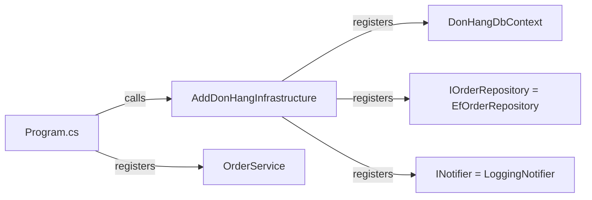

## Before you start

- [[design.l1.service-lifetimes]] — you know `DonHangDbContext`, `EfOrderRepository`, `LoggingNotifier` and `OrderService` are scoped, and that Program.cs calls `AddDonHangInfrastructure` and `AddScoped<OrderService>()`.
- [[design.l1.the-repository-layer]] — you know `IOrderRepository` lives in `DonHang.Domain` and `EfOrderRepository` in `DonHang.Infrastructure`.

## The situation

The last three lessons described registrations in words: "when something needs an `IOrderRepository`, give it an `EfOrderRepository`", scoped, one per request. Now you open the code to find them. `Program.cs` has no line that mentions `EfOrderRepository` or `LoggingNotifier` at all. Yet `POST /api/v1/orders` works, so the container must know about both. Where are those registrations written, why there, and what would happen if one of them were deleted?

## Core concepts

- registration method — a method such as `AddScoped<TService, TImplementation>()` that adds one registration: the first type is what code asks for, the second is the class the container builds.
- extension method — a static method whose first parameter is marked `this`, so it can be called as if it belonged to that parameter's type, like `builder.Services.AddDonHangInfrastructure(...)`.
- wiring — the startup code that makes every registration the app needs, so the classes of each layer can be connected when a request arrives.

## How it works



Registrations are method calls on `builder.Services`, the list of registrations the container will be built from. `AddScoped<IOrderRepository, EfOrderRepository>()` reads exactly like the sentence from the container lesson: when something asks for `IOrderRepository`, build an `EfOrderRepository`, one per request. `AddScoped<OrderService>()` has a single type, because code asks for the class itself. `AddDbContext<DonHangDbContext>(...)` registers the context along with its options, scoped by default.

One registration per type is enough, no matter how many classes ask for it. `OrdersController` and `OrderService` both ask for `IOrderRepository`, and one registration serves both. The class that asks never says which implementation it wants; that knowledge lives only in the wiring.

A registration can be missing, and the container never answers with `null`. When it cannot find a registration for a type a constructor asks for, it throws an exception naming that type. In Đơn Hàng's Development setup, the container checks the registered classes when the app is built, so a missing dependency of `OrderService` stops the app at startup. Controllers are not registered, so a type only a controller asks for fails later, on the first request that needs it.

## In the Đơn Hàng system

The infrastructure registrations live next to the classes they name, in `DonHang.Infrastructure`:

```csharp file=DonHang.Infrastructure/ServiceCollectionExtensions.cs tag=stage-1 lines=10-19
public static class ServiceCollectionExtensions
{
    public static IServiceCollection AddDonHangInfrastructure(this IServiceCollection services, string connectionString)
    {
        services.AddDbContext<DonHangDbContext>(options => options.UseNpgsql(connectionString));
        services.AddScoped<IOrderRepository, EfOrderRepository>();
        services.AddScoped<INotifier, LoggingNotifier>();
        return services;
    }
}
```

`AddDbContext` receives a small function that sets the context's options: `UseNpgsql` picks the PostgreSQL provider and gives it the connection string. The next two lines map each Domain interface to its Infrastructure class. Returning `services` lets the caller chain another call after it.

And the calls in `DonHang.Api`'s Program.cs:

```csharp file=DonHang.Api/Program.cs tag=stage-1 lines=16-19
var connectionString = builder.Configuration.GetConnectionString("Default")
    ?? throw new InvalidOperationException("ConnectionStrings:Default is not set");
builder.Services.AddDonHangInfrastructure(connectionString);
builder.Services.AddScoped<OrderService>();
```

Program.cs reads the connection string, hands it to the Infrastructure method, and registers `OrderService`, which lives in Domain. It never names `EfOrderRepository` or `LoggingNotifier`: which class answers `IOrderRepository` is decided inside `DonHang.Infrastructure`, the one project that knows about EF Core.

Together these lines connect the layers from the previous module. `OrdersController(OrderService orderService, IOrderRepository repository)` never calls `new OrderService(...)` and does not know that `OrderService` needs a notifier. On each request, ASP.NET Core asks the container for the controller's two parameters, and the registrations above supply the rest. Without them the classes would still compile, but ASP.NET Core could not create an `OrdersController`.

## Beginners often think…

- **"An interface and its implementation need to be registered separately, once for each place that uses them."** → Actually one registration per type serves every class that asks for it. `IOrderRepository` is registered once, and both `OrdersController` and `OrderService` receive an `EfOrderRepository` from that single line. You notice this when you add a third class asking for `IOrderRepository` and it works without touching the wiring.
- **"If a registration is missing, the app still runs and just returns null for that dependency."** → Actually the container throws instead of handing out `null`. Delete the `INotifier` line, and in Development the app refuses to start because `OrderService` cannot be built. Delete `AddScoped<OrderService>()`, and the app starts, but a signed-in customer's `POST /api/v1/orders` answers `500` because the controller cannot be created. You notice this when the error names the exact type the container could not resolve.

## Try it (3 minutes)

The team writes `SmsGatewayNotifier`, a new class in `DonHang.Infrastructure` that implements `INotifier` and sends real SMS messages. They want every order notification to use it instead of `LoggingNotifier`.

1. Which files change, and which line in each?
2. Which of `OrderService`, `OrdersController` and Program.cs change?

Expected result: 1 — only `ServiceCollectionExtensions.cs`, where `AddScoped<INotifier, LoggingNotifier>()` becomes `AddScoped<INotifier, SmsGatewayNotifier>()` (plus the new class file). 2 — none of them.

Why does Program.cs not change, even though it is where the app starts?

<details><summary>Suggested answer</summary>

Program.cs never names a notifier class: it only calls `AddDonHangInfrastructure`. The choice of `INotifier` implementation lives inside `DonHang.Infrastructure`, next to the classes, so swapping one Infrastructure class for another stays inside that project.

</details>

## Connections

- [[design.l1.the-di-container]] — the mappings these lines write for real.
- [[design.l1.service-lifetimes]] — why each line says scoped.
- [[design.l1.why-di-helps-testing]] — what the same constructors allow outside the running API.

## Five-line summary

1. `AddDonHangInfrastructure` registers `DonHangDbContext`, `IOrderRepository` → `EfOrderRepository` and `INotifier` → `LoggingNotifier`.
2. Program.cs calls it with the connection string, then registers `OrderService` itself.
3. One registration per type serves every class that asks for it; the asking class never names the implementation.
4. Program.cs never names `EfOrderRepository` or `LoggingNotifier`; that choice stays in `DonHang.Infrastructure`.
5. A missing registration makes the container throw, at startup or on the first request that needs it, never return `null`.
