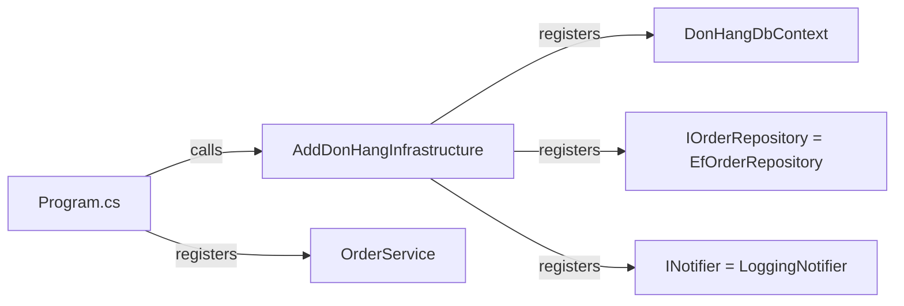

## Bạn cần biết trước

- [[design.l1.service-lifetimes]] — bạn biết `DonHangDbContext`, `EfOrderRepository`, `LoggingNotifier` và `OrderService` là scoped, và Program.cs gọi `AddDonHangInfrastructure` cùng `AddScoped<OrderService>()`.
- [[design.l1.the-repository-layer]] — bạn biết `IOrderRepository` nằm trong `DonHang.Domain` còn `EfOrderRepository` nằm trong `DonHang.Infrastructure`.

## Tình huống

Hai bài trước mô tả registration bằng lời: "khi có thứ cần một `IOrderRepository`, hãy đưa nó một `EfOrderRepository`", scoped, mỗi request một cái. Giờ bạn mở code để tìm chúng. `Program.cs` không có dòng nào nhắc tới `EfOrderRepository` hay `LoggingNotifier`. Vậy mà `POST /api/v1/orders` vẫn chạy, nên container hẳn phải biết cả hai. Các registration đó được viết ở đâu, vì sao ở đó, và chuyện gì xảy ra nếu một dòng trong số đó bị xóa?

## Khái niệm cốt lõi

- method đăng ký — một method như `AddScoped<TService, TImplementation>()` thêm một registration: kiểu thứ nhất là thứ code xin, kiểu thứ hai là class container dựng.
- extension method — ở dạng Đơn Hàng dùng, là một method static trong một class static có tham số đầu tiên được đánh dấu `this`, nhờ đó có thể gọi nó như thể nó thuộc về kiểu của tham số đó, như `builder.Services.AddDonHangInfrastructure(...)`.
- wiring — phần code khởi động tạo mọi registration mà app cần, để các class của từng tầng nối được với nhau khi request tới.

## Cơ chế hoạt động



Đọc sơ đồ từ trái sang: Program.cs gọi `AddDonHangInfrastructure`, method này đăng ký context và hai phép ghép interface, rồi Program.cs tự đăng ký `OrderService`. Mọi registration đều là một lời gọi method trên `builder.Services`, một `IServiceCollection`: danh sách registration mà container sẽ được dựng từ đó. `AddScoped<IOrderRepository, EfOrderRepository>()` đọc lên giống câu được trích trong phần Tình huống: khi có thứ xin `IOrderRepository`, hãy dựng một `EfOrderRepository`, mỗi request một cái. `AddScoped<OrderService>()` chỉ có một kiểu, vì code xin thẳng class đó. `AddDbContext<DonHangDbContext>(...)` đăng ký context cùng các thiết lập của nó, mặc định là scoped.

Mỗi kiểu chỉ cần một registration, bất kể bao nhiêu class xin nó. `OrdersController` và `OrderService` đều xin `IOrderRepository`, và một registration phục vụ cả hai. Class xin không bao giờ nói nó muốn implementation nào; điều đó chỉ nằm trong phần wiring.

Một registration có thể bị thiếu, và container không bao giờ điền `null` vào một tham số constructor bắt buộc. Khi không tìm thấy registration cho một kiểu mà constructor xin, nó throw exception nêu tên kiểu đó. Khi bạn chạy Đơn Hàng trên máy mình, API chạy ở môi trường Development, một chế độ dành cho làm việc cục bộ, và ở đó DI container kiểm tra lúc khởi động rằng mọi class đã đăng ký đều dựng được từ các registration khác. Vì vậy thiếu một phụ thuộc của `OrderService` sẽ khiến app dừng trước khi phục vụ bất cứ gì. Controller không được đăng ký, nên phép kiểm tra đó không nhìn tới chúng: một kiểu mà chỉ controller xin sẽ lỗi muộn hơn, ở request đầu tiên cần tới nó.

## Trong hệ thống Đơn Hàng

Các registration hạ tầng nằm cạnh những class chúng gọi tên, trong `DonHang.Infrastructure`:

```csharp file=DonHang.Infrastructure/ServiceCollectionExtensions.cs tag=stage-1 lines=10-19
public static class ServiceCollectionExtensions
{
    public static IServiceCollection AddDonHangInfrastructure(this IServiceCollection services, string connectionString)
    {
        services.AddDbContext<DonHangDbContext>(options => options.UseNpgsql(connectionString));
        services.AddScoped<IOrderRepository, EfOrderRepository>();
        services.AddScoped<INotifier, LoggingNotifier>();
        return services;
    }
}
```

`AddDbContext` nhận một hàm nhỏ để thiết lập context: `UseNpgsql` báo cho `DonHangDbContext` biết nó làm việc với một database PostgreSQL — database mà Đơn Hàng dùng — và đưa cho nó connection string, đoạn văn bản cho biết kết nối tới server và database nào. Hai dòng tiếp theo ghép từng interface của Domain với class tương ứng trong Infrastructure.

Và các lời gọi trong Program.cs của `DonHang.Api`:

```csharp file=DonHang.Api/Program.cs tag=stage-1 lines=16-19
var connectionString = builder.Configuration.GetConnectionString("Default")
    ?? throw new InvalidOperationException("ConnectionStrings:Default is not set");
builder.Services.AddDonHangInfrastructure(connectionString);
builder.Services.AddScoped<OrderService>();
```

Program.cs đọc connection string từ cấu hình của app, trao nó cho method bên Infrastructure, và đăng ký `OrderService`, class nằm trong Domain. Nó không bao giờ gọi tên `EfOrderRepository` hay `LoggingNotifier`: class nào trả lời `IOrderRepository` được quyết định bên trong `DonHang.Infrastructure`, ngay cạnh chính `EfOrderRepository` và `LoggingNotifier`.

Những dòng này cùng nhau nối các tầng của module trước. `OrdersController(OrderService orderService, IOrderRepository repository)` không bao giờ gọi `new OrderService(...)` và không biết `OrderService` cần một notifier. Ở mỗi request, ASP.NET Core hỏi container hai tham số của controller, và các registration ở trên lo phần còn lại. Không có chúng, các class vẫn biên dịch được, nhưng ASP.NET Core không thể tạo `OrdersController`.

## Người mới hay nghĩ rằng…

- **"Một interface và implementation của nó phải được đăng ký riêng, mỗi nơi dùng một lần."** → Thực ra một registration cho mỗi kiểu phục vụ mọi class xin nó. `IOrderRepository` được đăng ký một lần, và cả `OrdersController` lẫn `OrderService` đều nhận `EfOrderRepository` từ đúng dòng đó. Bạn sẽ nhận ra khi thêm class thứ ba xin `IOrderRepository` và nó chạy được mà không cần đụng tới dòng `IOrderRepository`.
- **"Nếu thiếu một registration, app vẫn chạy và chỉ trả null cho phụ thuộc đó."** → Thực ra container throw chứ không trao `null`. Xóa dòng `INotifier`, và ở Development app từ chối khởi động vì không dựng được `OrderService`. Xóa `AddScoped<OrderService>()`, và app vẫn khởi động, nhưng đặt hàng qua `POST /api/v1/orders` sẽ trả `500` vì không tạo được controller. Bạn sẽ nhận ra khi thông báo lỗi nêu đúng tên kiểu mà container không dựng được.

## Thử ngay (3 phút)

Nhóm viết `SmsGatewayNotifier`, một class mới trong `DonHang.Infrastructure` cài đặt `INotifier` và gửi SMS thật. Giống `LoggingNotifier`, constructor của nó chỉ xin một logger, thứ app đã cung cấp sẵn. Họ muốn mọi thông báo về order đều dùng nó thay cho `LoggingNotifier`.

1. Những file nào thay đổi, và dòng nào trong mỗi file?
2. Trong `OrderService`, `OrdersController` và Program.cs, cái nào thay đổi?

Kết quả mong đợi: 1 — chỉ `ServiceCollectionExtensions.cs`, nơi `AddScoped<INotifier, LoggingNotifier>()` thành `AddScoped<INotifier, SmsGatewayNotifier>()` (cộng thêm file của class mới). 2 — không cái nào.

Vì sao Program.cs không đổi, dù đó là nơi app khởi động?

<details><summary>Gợi ý đáp án</summary>

Program.cs không bao giờ gọi tên class notifier nào: nó chỉ gọi `AddDonHangInfrastructure`. Việc chọn implementation cho `INotifier` nằm bên trong `DonHang.Infrastructure`, cạnh các class, nên đổi class Infrastructure này sang class khác chỉ gói gọn trong project đó.

</details>

## Liên hệ

- [[design.l1.the-di-container]] — những phép ghép mà các dòng này viết thành code thật.
- [[design.l1.service-lifetimes]] — vì sao mỗi dòng đều là scoped.
- [[design.l1.why-di-helps-testing]] — những gì các constructor ấy cho phép bên ngoài API đang chạy.

## Tóm tắt 5 dòng

1. `AddDonHangInfrastructure` đăng ký `DonHangDbContext`, `IOrderRepository` → `EfOrderRepository` và `INotifier` → `LoggingNotifier`.
2. Program.cs gọi nó kèm connection string, rồi tự đăng ký `OrderService`.
3. Một registration cho mỗi kiểu phục vụ mọi class xin nó; class xin không bao giờ gọi tên implementation.
4. Program.cs không bao giờ gọi tên `EfOrderRepository` hay `LoggingNotifier`; lựa chọn đó nằm trong `DonHang.Infrastructure`.
5. Thiếu registration khiến container throw, lúc khởi động hoặc ở request đầu tiên cần tới nó; nó không bao giờ truyền `null`.
