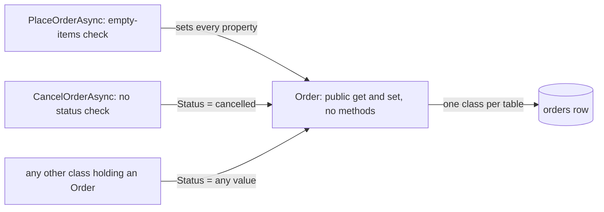

## Before you start

- [[design.l2.transaction-script]] — you know `PlaceOrderAsync` and `CancelOrderAsync` each run a whole operation, while `Order` only carries the values they read and write.
- [[foundation.l1.oop-encapsulation]] — you know a public setter that only stores the value is not encapsulation, because any code still decides the value.

## The situation

At stage-1, during a code review, a teammate reads the sample class `OrderExposed`, whose comment warns that its public fields let any code put an order into a state the business forbids. "Our real `Order` uses properties, not public fields, so it is safe," they say. You then open `CancelOrderAsync`: it sets `Status` to `cancelled` on any order it finds, even one already `shipped`, and nothing in `Order` objects. Why can `Order` not stop that, and what do you call a class like it?

## Core concepts

- **anemic domain model** — classes named after business things, such as `Order`, whose data any code can change, while every rule about that data lives in other classes.
- a home for a rule — a method or constructor in the class that owns the data, where a check runs every time the data changes.
- DTO, compared — a class meant only to carry data across a boundary, such as `OrderDto` sent to a client, with no rules by design.

## How it works



In the situation above, `Order` is an anemic domain model. At stage-1 every property has a public getter and setter, and the class has no methods. The comment atop `Entities.cs` intends this: one class per table, "No behaviour here beyond what a row is." Mapping to a table is not what makes it anemic; a mapped class could still hold rules. What makes it anemic is that its rules live in other classes.

`PlaceOrderAsync` sets every property and holds the only rule about orders in the C# code, "an order needs at least one item". `CancelOrderAsync` sets `Status` with no check, and so can any other class that holds an `Order`: the setter is public, so the compiler accepts any string, and the database accepts any of the four statuses (`new`, `paid`, `shipped`, `cancelled`), whatever the current one. A rule about which status may follow which exists only where a script remembered to check it, and no script does.

That is why `CancelOrderAsync` can cancel a `shipped` order: `Order` has no method and no constructor with checks, so the class has no place where the rule could live. A check added to `CancelOrderAsync` would guard that script alone.

A DTO looks similar, but its job differs: `OrderDto` exists to carry data to a client, so it is meant to hold no rules. `Order` stands for the business thing whose rules, such as "a shipped order cannot be cancelled", are real, yet it holds none of them.

An anemic domain model is a reasonable choice when the data has no rules that scripts must check, as with `Product` at stage-1, whose one business rule, a price above zero, the database checks. It becomes a cost once rules appear and get repeated across scripts.

## In the Đơn Hàng system

The sample that shows the danger with public fields:

```csharp file=samples/DonHang.Samples/Samples/Oop/OrderExposed.cs tag=stage-1 lines=3-12
// lesson: foundation.l1.oop-encapsulation
// Every field is public, so any code anywhere can put an order into a state
// the business does not allow: paid but empty, or with a negative total.
public sealed class OrderExposed
{
    public int Id;
    public string Status = "new";
    public int TotalVnd;
    public List<OrderLineExposed> Lines = new();
}
```

The real class, in `DonHang.Domain`:

```csharp file=DonHang.Domain/Entities.cs tag=stage-1 lines=24-35
// lesson: backend.l1.efcore-relationships-and-keys
public sealed class Order
{
    public int Id { get; set; }
    public int CustomerId { get; set; }
    public DateTimeOffset PlacedAt { get; set; }
    public required string Status { get; set; }
    public List<OrderItem> Items { get; set; } = [];

    // lesson: backend.l1.efcore-n-plus-one
    public Customer? Customer { get; set; }
}
```

Compare the two lines about status. `OrderExposed` has `public string Status`, a field. `Order` has `public required string Status { get; set; }`, a property whose setter is public and only stores the value. For the calling code the effect is the same: `order.Status = "cancelled"` compiles against both, whatever the order's current status. `required` only makes the code that creates an `Order` set `Status`; it says nothing about which value.

Now look at what `Order` does not have: no method such as `Cancel()`, and no constructor that checks anything. `PlaceOrderAsync` builds an order by setting properties one by one, and `CancelOrderAsync` assigns `Status` directly. Every rule has to live in one of those scripts, or nowhere.

## Beginners often think…

- **"`Order` uses properties, not public fields, so it is already encapsulated."** → Actually a property with a public setter that only stores the value lets any caller decide the value, exactly like a public field, because the class runs no check. You notice this when `order.Status = "cancelled"` compiles and runs on a `shipped` order.
- **"An anemic domain model is just another name for a DTO."** → Actually they look alike but do different jobs: a DTO carries data across a boundary and is meant to have no rules, while `Order` stands for a business thing that has rules and holds none of them. You notice the difference when a rule about orders has no class to go into, while nobody ever asks where `OrderDto`'s rules are.
- **"An anemic domain model is always a mistake, even for data that has no rules."** → Actually, for data whose rules no script has to repeat, such as a product's price above zero, which the database checks, a class of plain properties is a simple choice that works. The cost starts when rules appear. You notice it when the same check has to be written in a second script.

## Try it (3 minutes)

In the root folder of the example repository, checked out at `stage-1`:

1. Run `git grep -n "Status = \"" -- "DonHang.*/*.cs"` to list every line in the `DonHang.*` folders at the repository root that assigns a status string.
2. For each line, note which class assigns it.

Expected result: three lines in two classes. `OrderService.cs` sets `Status = "new"` in `PlaceOrderAsync` and `order.Status = "cancelled"` in `CancelOrderAsync`, and `OrderServiceTests.cs` sets `Status = "new"` while creating an order for a unit test. Each class decides the value itself; `Order` never sees the assignment coming.

## Connections

- [[design.l2.transaction-script]] — the other half of the same design: the scripts hold every rule because `Order` holds none.
- [[foundation.l1.oop-encapsulation]] — the principle `Order` does not follow: its public setters let any caller decide its state.
- [[management.l1.reviewing-for-tests]] — the reviewer's view of this gap: the missing test for cancelling a `shipped` order has no rule in `Order` to test either.
- [[backend.l1.efcore-mapping]] — where the "one class per table" comment comes from: `Order` was written to map a row of `orders`.
- [[design.l2.domain-model]] — the fix for the problem here: `Order` itself decides whether it can be cancelled.

## Five-line summary

1. An anemic domain model has business classes, such as `Order`, whose data any code can change, while every rule lives in other classes.
2. At stage-1 `Order` has only public getters and setters and no methods, as its "beyond what a row is" comment intends.
3. A public setter that only stores the value is no safer than a public field: any class can set `Status` to any string.
4. `CancelOrderAsync` cancels a `shipped` order and `Order` cannot refuse, because it has no place for that rule.
5. Unlike a DTO, `Order` stands for a thing with rules; plain properties are fine only while no script must repeat a rule about that data.
