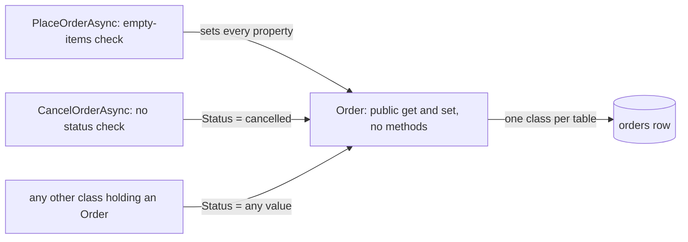

## Bạn cần biết trước

- [[design.l2.transaction-script]] — bạn biết `PlaceOrderAsync` và `CancelOrderAsync` mỗi method chạy trọn một thao tác, còn `Order` chỉ mang các giá trị mà chúng đọc và ghi.
- [[foundation.l1.oop-encapsulation]] — bạn biết một setter public chỉ lưu giá trị thì chưa phải đóng gói, vì code nào cũng vẫn quyết định được giá trị.

## Tình huống

Ở stage-1, trong một buổi code review, một đồng đội đọc class mẫu `OrderExposed`, có comment cảnh báo rằng field public của nó cho phép code nào cũng đưa đơn vào trạng thái nghiệp vụ cấm. "`Order` thật của mình dùng property chứ không phải field public, nên an toàn," đồng đội nói. Rồi bạn mở `CancelOrderAsync`: nó đặt `Status` thành `cancelled` cho bất kỳ đơn nào tìm thấy, kể cả đơn đã `shipped`, và không gì trong `Order` phản đối. Vì sao `Order` không chặn được việc đó, và một class như vậy gọi là gì?

## Khái niệm cốt lõi

- **anemic domain model** (Các class mang tên nghiệp vụ, dữ liệu ai cũng sửa được, còn mọi quy tắc về dữ liệu đó nằm ở class khác) — các class mang tên thứ nghiệp vụ, như `Order`, mà dữ liệu thì code nào cũng đổi được, còn mọi quy tắc về dữ liệu đó nằm ở các class khác.
- chỗ đặt một quy tắc — một method hay constructor trong chính class sở hữu dữ liệu, nơi bước kiểm tra chạy mỗi lần dữ liệu đổi.
- DTO, để so sánh — một class chỉ để mang dữ liệu qua một ranh giới, như `OrderDto` gửi cho client, và theo thiết kế thì không có quy tắc nào.

## Cơ chế hoạt động



Trong tình huống trên, `Order` là một anemic domain model. Ở stage-1 mọi property đều có getter và setter public, và class không có method nào. Comment đầu `Entities.cs` cố ý như vậy: mỗi bảng một class, "No behaviour here beyond what a row is." Được map vào bảng không làm class thành anemic, vì một class được map vẫn có thể giữ quy tắc. Điều làm nó anemic là các quy tắc của nó nằm ở class khác.

`PlaceOrderAsync` gán mọi property và giữ quy tắc duy nhất về đơn trong code C#, "đơn cần ít nhất một món hàng". `CancelOrderAsync` gán `Status` mà không kiểm tra gì, và class nào khác đang giữ một `Order` cũng làm được thế: setter là public, nên compiler nhận mọi chuỗi, còn database nhận bất kỳ trạng thái nào trong bốn trạng thái (`new`, `paid`, `shipped`, `cancelled`), bất kể trạng thái hiện tại. Quy tắc trạng thái nào được theo sau trạng thái nào chỉ tồn tại ở chỗ một script nhớ kiểm tra, và không script nào làm vậy.

Đó là lý do `CancelOrderAsync` hủy được một đơn `shipped`: `Order` không có method nào và không có constructor nào kiểm tra, nên class không có chỗ nào để quy tắc nằm. Một bước kiểm tra thêm vào `CancelOrderAsync` chỉ bảo vệ riêng script đó.

DTO trông giống vậy, nhưng vai trò khác: `OrderDto` sinh ra để mang dữ liệu tới client, nên vốn không cần quy tắc. `Order` thì đại diện cho thứ nghiệp vụ có quy tắc thật, như "đơn đã giao thì không hủy được", vậy mà không giữ quy tắc nào.

Anemic domain model là lựa chọn hợp lý khi dữ liệu không có quy tắc nào mà script phải kiểm tra, như `Product` ở stage-1, với quy tắc nghiệp vụ duy nhất là giá lớn hơn không, do database kiểm tra. Nó thành gánh nặng khi quy tắc xuất hiện và bị lặp lại qua nhiều script.

## Trong hệ thống Đơn Hàng

Class mẫu cho thấy mối nguy của field public:

```csharp file=samples/DonHang.Samples/Samples/Oop/OrderExposed.cs tag=stage-1 lines=3-12
// lesson: foundation.l1.oop-encapsulation
// Every field is public, so any code anywhere can put an order into a state
// the business does not allow: paid but empty, or with a negative total.
public sealed class OrderExposed
{
    public int Id;
    public string Status = "new";
    public int TotalVnd;
    public List<OrderLineExposed> Lines = new();
}
```

Class thật, trong `DonHang.Domain`:

```csharp file=DonHang.Domain/Entities.cs tag=stage-1 lines=24-35
// lesson: backend.l1.efcore-relationships-and-keys
public sealed class Order
{
    public int Id { get; set; }
    public int CustomerId { get; set; }
    public DateTimeOffset PlacedAt { get; set; }
    public required string Status { get; set; }
    public List<OrderItem> Items { get; set; } = [];

    // lesson: backend.l1.efcore-n-plus-one
    public Customer? Customer { get; set; }
}
```

Hãy so hai dòng về trạng thái. `OrderExposed` có `public string Status`, một field. `Order` có `public required string Status { get; set; }`, một property có setter public và chỉ lưu giá trị. Với code gọi tới, hiệu quả như nhau: `order.Status = "cancelled"` biên dịch được với cả hai, bất kể đơn đang ở trạng thái nào. `required` chỉ bắt code tạo `Order` phải gán `Status`, còn giá trị nào thì nó không nói gì.

Giờ hãy nhìn những gì `Order` không có: không method nào như `Cancel()`, và không constructor nào kiểm tra gì. `PlaceOrderAsync` tạo đơn bằng cách gán từng property, còn `CancelOrderAsync` gán thẳng `Status`. Mọi quy tắc phải nằm trong một trong các script đó, hoặc không nằm ở đâu cả.

## Người mới hay nghĩ rằng…

- **"`Order` dùng property chứ không phải field public, nên nó đã được đóng gói."** → Thực ra một property có setter public chỉ lưu giá trị thì cho bên gọi nào cũng quyết định được giá trị, y như field public, vì class không chạy bước kiểm tra nào. Bạn sẽ nhận ra khi `order.Status = "cancelled"` biên dịch và chạy được trên một đơn `shipped`.
- **"Anemic domain model chỉ là tên khác của DTO."** → Thực ra hai thứ trông giống nhau nhưng làm việc khác nhau: DTO mang dữ liệu qua một ranh giới và vốn không cần quy tắc, còn `Order` đại diện cho một thứ nghiệp vụ có quy tắc mà lại không giữ quy tắc nào. Bạn sẽ nhận ra khác biệt khi một quy tắc về đơn không có class nào để đặt vào, trong khi chẳng ai hỏi quy tắc của `OrderDto` nằm đâu.
- **"Anemic domain model lúc nào cũng là sai lầm, kể cả với dữ liệu không có quy tắc."** → Thực ra với dữ liệu mà không script nào phải lặp lại quy tắc của nó, như giá sản phẩm lớn hơn không do database kiểm tra, một class toàn property đơn giản là lựa chọn gọn và dùng được. Cái giá chỉ bắt đầu khi quy tắc xuất hiện. Bạn sẽ nhận ra khi cùng một bước kiểm tra phải viết lại trong script thứ hai.

## Thử ngay (3 phút)

Trong thư mục gốc của repo ví dụ, đã checkout ở `stage-1`:

1. Chạy `git grep -n "Status = \"" -- "DonHang.*/*.cs"` để liệt kê mọi dòng trong các thư mục `DonHang.*` ở gốc repo có gán một chuỗi trạng thái.
2. Với mỗi dòng, ghi lại class nào đang gán.

Kết quả mong đợi: ba dòng trong hai class. `OrderService.cs` gán `Status = "new"` trong `PlaceOrderAsync` và `order.Status = "cancelled"` trong `CancelOrderAsync`, còn `OrderServiceTests.cs` gán `Status = "new"` khi tạo một đơn cho unit test. Mỗi class tự quyết giá trị, còn `Order` không hề biết trước lần gán nào.

## Liên hệ

- [[design.l2.transaction-script]] — nửa kia của cùng thiết kế: các script giữ mọi quy tắc vì `Order` không giữ quy tắc nào.
- [[foundation.l1.oop-encapsulation]] — nguyên tắc mà `Order` không theo: setter public cho bên gọi nào cũng quyết định được trạng thái của nó.
- [[management.l1.reviewing-for-tests]] — lỗ hổng này nhìn từ phía người review: test thiếu cho việc hủy đơn `shipped` cũng không có quy tắc nào trong `Order` để kiểm.
- [[backend.l1.efcore-mapping]] — nơi comment "one class per table" bắt nguồn: `Order` được viết để map một dòng của `orders`.
- [[design.l2.domain-model]] — cách chữa vấn đề ở đây: chính `Order` quyết định nó có được hủy hay không.

## Tóm tắt 5 dòng

1. Anemic domain model có các class nghiệp vụ, như `Order`, mà dữ liệu thì code nào cũng đổi được, còn mọi quy tắc nằm ở class khác.
2. Ở stage-1 `Order` chỉ có getter và setter public, không có method nào, đúng như comment "beyond what a row is" muốn.
3. Setter public chỉ lưu giá trị không an toàn hơn field public: class nào cũng đặt được `Status` thành chuỗi bất kỳ.
4. `CancelOrderAsync` hủy một đơn `shipped` mà `Order` không từ chối được, vì nó không có chỗ cho quy tắc đó.
5. Khác DTO, `Order` đại diện cho một thứ có quy tắc. Property đơn giản chỉ ổn khi không script nào phải lặp lại quy tắc về dữ liệu đó.
