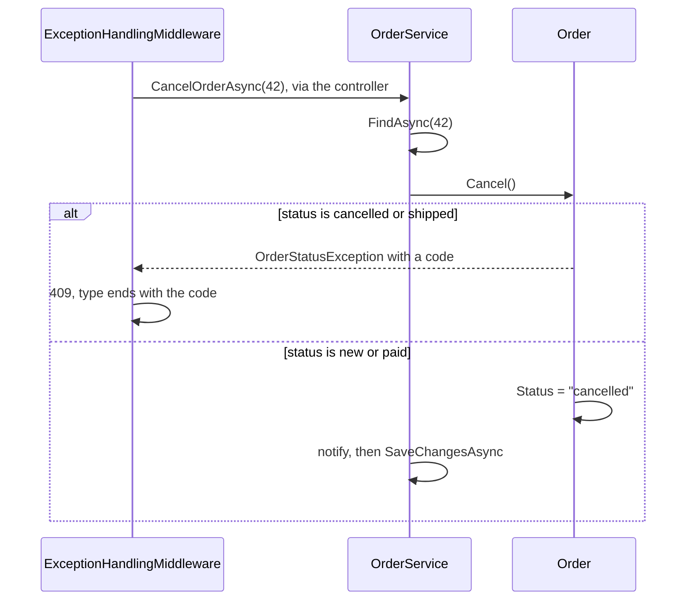

## Before you start

- [[design.l2.anemic-domain-model]] — you know that at stage-1 `Order` held data and no rules, so `CancelOrderAsync` could cancel a `shipped` order.
- [[backend.l2.problem-types]] — you know cancelling a cancelled or shipped order at stage-2 answers `409`, with a `type` ending in `already-cancelled` or `already-shipped`.
- [[design.l2.dependency-rule]] — you know nothing in `DonHang.Domain` may name the web or data-access code around it.

## The situation

At stage-2 a request `PATCH /api/v1/orders/42/cancel` arrives for an order that has already shipped. The API answers `409`, with a `type` ending in `already-shipped`: the stage-1 gap is closed. You open `CancelOrderAsync` in `OrderService` to see the check that was added. There is none: the method body has no `if` about the status and no comparison with `shipped`. It finds the order, calls `order.Cancel()`, notifies and saves. So where does the refusal come from now, and why was the rule put there instead of in the script?

## Core concepts

- **domain model** — a design that puts each business rule, as methods, in the class whose data the rule is about, so those methods become the way to change that data.
- `Order.Cancel()` — the method that decides whether this order may be cancelled, and changes its `Status` only when it may.
- `OrderStatusException` — the exception `Order` throws when a status change is not allowed; it carries a code naming the case and no HTTP status.

## How it works



In the situation above, `Order` has become a domain model. The rule "a cancelled or shipped order cannot be cancelled" is about the order's own status, so it now lives in `Order` as `Cancel()`. `Cancel()` throws `OrderStatusException` when the status is `cancelled` or `shipped`, and otherwise sets `Status` to `cancelled`.

`OrderService` did not disappear. `CancelOrderAsync` still runs the use case: it finds the order (or throws `KeyNotFoundException`, as before), calls `order.Cancel()`, sends the notification, then saves. The service decides the steps and talks to the repository and the notifier, the object it uses to send notifications; `Order` decides what is allowed. If `Cancel()` throws, the method stops before notifying or saving, so nothing about the refused cancel is written.

The refusal still has to reach the client as HTTP. `OrderStatusException` lives in `DonHang.Domain` and names no HTTP status: it carries the order id and a code such as `already-shipped`. `ExceptionHandlingMiddleware`, in `DonHang.Api`, catches it and writes `409` with a `type` built from that code, one `type` per case. So `DonHang.Domain` says which rule was broken, the web side says how to answer, and the dependency rule still holds.

Moving a rule into `Order` pays off when several use cases change the same data: any code that cancels an order calls `Cancel()` and gets the check without copying it, and any caller, not only the middleware, can catch `OrderStatusException` and read its code. For data whose only rule is a simple check on an incoming value, such as `Product` at stage-2, whose price must be above zero (the API rejects a request with a price of zero or less, and the database refuses such a row), methods on the class would only set a value, so it keeps its plain properties.

## In the Đơn Hàng system

The rule, inside `Order`:

```csharp file=DonHang.Domain/Entities.cs tag=stage-2 lines=82-88
    // lesson: design.l2.domain-model
    public void Cancel()
    {
        if (Status == "cancelled") throw new OrderStatusException(Id, "already-cancelled", $"order {Id} is already cancelled");
        if (Status == "shipped") throw new OrderStatusException(Id, "already-shipped", $"order {Id} has already shipped");
        Status = "cancelled";
    }
```

Two checks, then the change. Each refusal names its case with a code, and the message is for people reading logs. Nothing here knows about requests, status codes or the database: `Cancel()` changes the object in memory and nothing more.

The use case, inside `OrderService`:

```csharp file=DonHang.Domain/OrderService.cs tag=stage-2 lines=36-49
    // lesson: design.l2.domain-model
    // Find, let the order decide, notify, save. An order that is already
    // cancelled or shipped makes order.Cancel() throw OrderStatusException.
    // The notification is saved with the order, by the same SaveChangesAsync.
    public async Task<Order> CancelOrderAsync(int orderId)
    {
        var order = await repository.FindAsync(orderId)
            ?? throw new KeyNotFoundException($"order {orderId} not found");

        order.Cancel();
        notifier.Send(order, "order cancelled");
        await repository.SaveChangesAsync();
        return order;
    }
```

Compare it with stage-1. `order.Status = "cancelled"` became `order.Cancel()`, and the method has no status check of its own. The order of the last steps also changed: at stage-1 the method saved first and sent after, and now `notifier.Send` comes before the save. At stage-2 `Send` only adds an email job to the same `DonHangDbContext`, the request's unit of work, so the job waits in memory until the one `SaveChangesAsync` writes it with the order. The comment above the method says the same.

## Beginners often think…

- **"In a domain model the service disappears, because all logic moves into the entities."** → Actually only the rules about an order's own data move into `Order`; loading, notifying and saving still need the repository and the notifier, which `Order` does not have. You notice this when `CancelOrderAsync` is still there at stage-2, with four steps and one call to `Cancel()`.
- **"`Order` should throw an exception that already carries status `409`, since the API returns `409` anyway."** → Actually the status code is a decision of the web side, and `DonHang.Domain` should only say which rule was broken. With a code such as `already-shipped`, `ExceptionHandlingMiddleware` picks both the status and the `type`. You notice the difference when `Cancel()` runs in a unit test, where a status code would mean nothing but the code still names the case.
- **"A domain model means each entity saves itself to the database."** → Actually `Order` changes only itself in memory; saving stays with `IOrderRepository.SaveChangesAsync`, called by `OrderService`. You notice this when you read `Cancel()`: it changes `Status` and makes no call that writes anywhere.

## Try it (3 minutes)

In the root folder of the example repository, checked out at `stage-2`:

1. Run `git grep -n "throw new OrderStatusException" -- "DonHang.*/*.cs"` to find every line that refuses a status change.
2. Run `git grep -n "OrderStatusException" -- "DonHang.Api/*.cs"` to find where the web side deals with that refusal.

Expected result: the first command prints seven lines, all in `DonHang.Domain/Entities.cs`, inside `MarkPaid()`, `Cancel()` and `Ship()`: only `Order` refuses. The second prints two lines: a comment in `OrdersController.cs` and the `catch (OrderStatusException ex)` in `ExceptionHandlingMiddleware.cs`, the one place that turns the refusal into `409`.

## Connections

- [[design.l2.anemic-domain-model]] — the problem this lesson fixes: the stage-1 `Order` had no place for the cancel rule; now `Cancel()` is that place.
- [[backend.l2.problem-types]] — the other end of the same refusal: the codes thrown here become the `type` values that lesson taught clients to compare.
- [[design.l2.dependency-rule]] — the reason the exception names no HTTP status: `DonHang.Domain` never names the web code around it.
- [[design.l2.status-changes-through-methods]] — the next step: closing the door so no code outside `Order` can set `Status` directly.
- [[design.l3.aggregates-and-invariants]] — a later lesson that carries the same idea to rules spanning several related classes.

## Five-line summary

1. A domain model puts each business rule in the class whose data it is about, so its methods become the way to change that data.
2. At stage-2 `Order.Cancel()` throws `OrderStatusException` for a `cancelled` or `shipped` order and otherwise sets `Status` to `cancelled`.
3. `CancelOrderAsync` finds the order, calls `Cancel()`, notifies, then saves: the service runs the use case, `Order` decides what is allowed.
4. `OrderStatusException` names a code and no HTTP status; `ExceptionHandlingMiddleware` turns it into `409` with one `type` per case.
5. A rule in the class pays off when several use cases change the same data; data with only a simple input check keeps plain properties.
