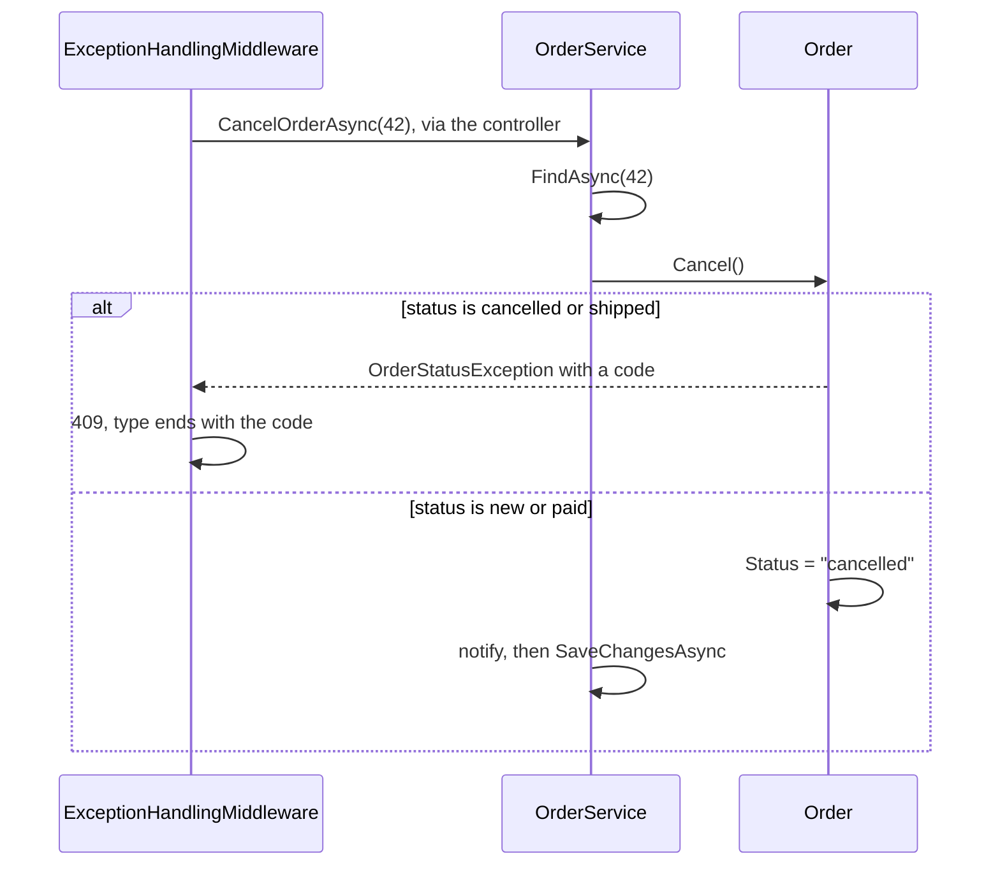

## Bạn cần biết trước

- [[design.l2.anemic-domain-model]] — bạn biết ở stage-1 `Order` giữ dữ liệu mà không giữ quy tắc nào, nên `CancelOrderAsync` hủy được cả đơn `shipped`.
- [[backend.l2.problem-types]] — bạn biết ở stage-2, hủy một đơn đã hủy hoặc đã giao sẽ nhận `409`, với `type` kết thúc bằng `already-cancelled` hoặc `already-shipped`.
- [[design.l2.dependency-rule]] — bạn biết không gì trong `DonHang.Domain` được gọi tên phần code web hay truy cập dữ liệu quanh nó.

## Tình huống

Ở stage-2, một request `PATCH /api/v1/orders/42/cancel` tới cho một đơn đã giao. API trả `409`, với `type` kết thúc bằng `already-shipped`: lỗ hổng của stage-1 đã được bịt. Bạn mở `CancelOrderAsync` trong `OrderService` để xem bước kiểm tra mới thêm. Không có: thân method không có `if` nào về trạng thái và không so sánh gì với `shipped`. Nó tìm đơn, gọi `order.Cancel()`, thông báo rồi lưu. Vậy giờ lời từ chối đến từ đâu, và vì sao quy tắc được đặt ở đó thay vì trong script?

## Khái niệm cốt lõi

- **domain model** (Cách thiết kế đặt mỗi quy tắc nghiệp vụ thành method của chính class chứa dữ liệu mà quy tắc nói tới) — cách thiết kế đặt mỗi quy tắc nghiệp vụ, dưới dạng method, vào class chứa dữ liệu mà quy tắc nói tới, để các method đó trở thành cách để đổi dữ liệu ấy.
- `Order.Cancel()` — method quyết định đơn này có được hủy không, và chỉ đổi `Status` của nó khi được phép.
- `OrderStatusException` — exception mà `Order` ném khi một lần đổi trạng thái không được phép; nó mang một mã gọi tên trường hợp và không mang HTTP status nào.

## Cơ chế hoạt động



Trong tình huống trên, `Order` đã trở thành một domain model. Quy tắc "đơn đã hủy hoặc đã giao thì không hủy được" nói về chính trạng thái của đơn, nên giờ nó nằm trong `Order`, dưới dạng `Cancel()`. `Cancel()` ném `OrderStatusException` khi trạng thái là `cancelled` hoặc `shipped`, còn không thì đặt `Status` thành `cancelled`.

`OrderService` không biến mất. `CancelOrderAsync` vẫn chạy use case: tìm đơn (hoặc ném `KeyNotFoundException`, như trước), gọi `order.Cancel()`, gửi thông báo, rồi lưu. Service quyết định các bước và làm việc với repository và notifier, tức object nó dùng để gửi thông báo, còn `Order` quyết định điều gì được phép. Nếu `Cancel()` ném exception, method dừng trước khi thông báo hay lưu, nên không có gì về lần hủy bị từ chối được ghi lại.

Lời từ chối vẫn phải tới client dưới dạng HTTP. `OrderStatusException` nằm trong `DonHang.Domain` và không gọi tên HTTP status nào: nó mang order id và một mã như `already-shipped`. `ExceptionHandlingMiddleware`, trong `DonHang.Api`, bắt nó và ghi ra `409` với `type` tạo từ mã đó, mỗi trường hợp một `type`. Vậy `DonHang.Domain` nói quy tắc nào bị vi phạm, phía web nói cách trả lời, và dependency rule vẫn được giữ.

Chuyển quy tắc vào `Order` có lợi khi nhiều use case cùng đổi một dữ liệu: code nào hủy đơn cũng gọi `Cancel()` và có ngay bước kiểm tra mà không phải chép lại, và bên gọi nào, không chỉ middleware, cũng bắt được `OrderStatusException` và đọc mã của nó. Với dữ liệu mà quy tắc duy nhất là một bước kiểm tra đơn giản trên giá trị đầu vào, như `Product` ở stage-2 với giá phải lớn hơn không (API từ chối request có giá bằng không hoặc nhỏ hơn, và database không nhận dòng như vậy), method trên class chỉ để gán giá trị, nên nó giữ nguyên các property đơn giản.

## Trong hệ thống Đơn Hàng

Quy tắc, nằm trong `Order`:

```csharp file=DonHang.Domain/Entities.cs tag=stage-2 lines=82-88
    // lesson: design.l2.domain-model
    public void Cancel()
    {
        if (Status == "cancelled") throw new OrderStatusException(Id, "already-cancelled", $"order {Id} is already cancelled");
        if (Status == "shipped") throw new OrderStatusException(Id, "already-shipped", $"order {Id} has already shipped");
        Status = "cancelled";
    }
```

Hai bước kiểm tra, rồi mới đổi. Mỗi lời từ chối gọi tên trường hợp bằng một mã, còn message dành cho người đọc log. Không có gì ở đây biết tới request, status code hay database: `Cancel()` đổi object trong bộ nhớ và chỉ vậy.

Use case, nằm trong `OrderService`:

```csharp file=DonHang.Domain/OrderService.cs tag=stage-2 lines=36-49
    // lesson: design.l2.domain-model
    // Find, let the order decide, notify, save. An order that is already
    // cancelled or shipped makes order.Cancel() throw OrderStatusException.
    // The notification is saved with the order, by the same SaveChangesAsync.
    public async Task<Order> CancelOrderAsync(int orderId)
    {
        var order = await repository.FindAsync(orderId)
            ?? throw new KeyNotFoundException($"order {orderId} not found");

        order.Cancel();
        notifier.Send(order, "order cancelled");
        await repository.SaveChangesAsync();
        return order;
    }
```

Hãy so với stage-1. `order.Status = "cancelled"` đã thành `order.Cancel()`, và method không còn bước kiểm tra trạng thái nào của riêng nó. Thứ tự các bước cuối cũng đổi: ở stage-1 method lưu trước rồi mới gửi, còn giờ `notifier.Send` đứng trước lần lưu. Ở stage-2 `Send` chỉ thêm một job email vào cùng `DonHangDbContext`, tức unit of work của request, nên job nằm chờ trong bộ nhớ tới khi một lần `SaveChangesAsync` ghi nó cùng với đơn. Comment phía trên method cũng nói đúng như vậy.

## Người mới hay nghĩ rằng…

- **"Trong domain model, service biến mất, vì mọi logic chuyển vào entity."** → Thực ra chỉ các quy tắc về dữ liệu của chính đơn chuyển vào `Order`. Tải, thông báo và lưu vẫn cần repository và notifier, những thứ `Order` không có. Bạn sẽ nhận ra khi thấy `CancelOrderAsync` vẫn còn ở stage-2, với bốn bước và một lời gọi `Cancel()`.
- **"`Order` nên ném một exception mang sẵn status `409`, vì dù sao API cũng trả `409`."** → Thực ra status code là quyết định của phía web, còn `DonHang.Domain` chỉ nên nói quy tắc nào bị vi phạm. Với một mã như `already-shipped`, `ExceptionHandlingMiddleware` chọn cả status lẫn `type`. Bạn sẽ thấy khác biệt khi `Cancel()` chạy trong unit test, nơi status code chẳng có nghĩa gì mà mã vẫn gọi đúng tên trường hợp.
- **"Domain model nghĩa là mỗi entity tự lưu mình xuống database."** → Thực ra `Order` chỉ đổi chính nó trong bộ nhớ. Việc lưu vẫn là `IOrderRepository.SaveChangesAsync`, do `OrderService` gọi. Bạn sẽ nhận ra khi đọc `Cancel()`: nó đổi `Status` và không gọi gì để ghi xuống đâu cả.

## Thử ngay (3 phút)

Trong thư mục gốc của repo ví dụ, đã checkout ở `stage-2`:

1. Chạy `git grep -n "throw new OrderStatusException" -- "DonHang.*/*.cs"` để tìm mọi dòng từ chối một lần đổi trạng thái.
2. Chạy `git grep -n "OrderStatusException" -- "DonHang.Api/*.cs"` để tìm nơi phía web xử lý lời từ chối đó.

Kết quả mong đợi: lệnh đầu in ra bảy dòng, tất cả trong `DonHang.Domain/Entities.cs`, bên trong `MarkPaid()`, `Cancel()` và `Ship()`: chỉ `Order` từ chối. Lệnh thứ hai in hai dòng: một comment trong `OrdersController.cs` và `catch (OrderStatusException ex)` trong `ExceptionHandlingMiddleware.cs`, nơi duy nhất biến lời từ chối thành `409`.

## Liên hệ

- [[design.l2.anemic-domain-model]] — vấn đề mà bài này chữa: `Order` ở stage-1 không có chỗ cho quy tắc hủy đơn, giờ `Cancel()` chính là chỗ đó.
- [[backend.l2.problem-types]] — đầu kia của cùng một lời từ chối: các mã ném ra ở đây trở thành những giá trị `type` mà bài đó dạy client so sánh.
- [[design.l2.dependency-rule]] — lý do exception không gọi tên HTTP status nào: `DonHang.Domain` không bao giờ gọi tên phần code web quanh nó.
- [[design.l2.status-changes-through-methods]] — bước tiếp theo: đóng cửa để không code nào ngoài `Order` gán thẳng được `Status`.
- [[design.l3.aggregates-and-invariants]] — một bài sau mang cùng ý tưởng này tới các quy tắc trải trên nhiều class liên quan.

## Tóm tắt 5 dòng

1. Domain model đặt mỗi quy tắc nghiệp vụ vào class chứa dữ liệu mà quy tắc nói tới, nên method của class là cách để đổi dữ liệu đó.
2. Ở stage-2 `Order.Cancel()` ném `OrderStatusException` với đơn `cancelled` hoặc `shipped`, còn không thì đặt `Status` thành `cancelled`.
3. `CancelOrderAsync` tìm đơn, gọi `Cancel()`, thông báo rồi lưu: service chạy use case, `Order` quyết định điều gì được phép.
4. `OrderStatusException` mang một mã và không mang HTTP status. `ExceptionHandlingMiddleware` biến nó thành `409`, mỗi trường hợp một `type`.
5. Quy tắc nằm trong class có lợi khi nhiều use case cùng đổi một dữ liệu. Dữ liệu chỉ có một bước kiểm tra đầu vào đơn giản thì giữ property đơn giản.
