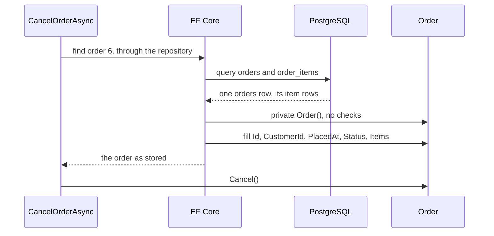

## Before you start

- [[design.l2.valid-from-construction]] — you know `Order`'s public constructor refuses an empty item list and sets `Status` to `new`, and code outside `Order` can call only that constructor.
- [[backend.l1.efcore-relationships-and-keys]] — you know `Items` is a navigation property, tied to the `order_items` rows through `HasMany(o => o.Items)` and the `order_id` column.

## The situation

Customer 3 cancels order 6 with `PATCH /api/v1/orders/6/cancel`. `CancelOrderAsync` loads the order through the repository, calls `order.Cancel()` and saves, and the answer shows the status `cancelled`. Now read `Order` at stage-2: `Status` has a private setter, so only `Order` may assign it. The public constructor takes the items as a list, refuses an empty one, and sets `Status` to `new` itself. Yet the loaded order held the status stored in its `orders` row before `Cancel()` changed it. How does EF Core build that object and fill `Status` from the row, and does it run the constructor's checks on the way?

## Core concepts

- a private setter — `{ get; private set; }`: any code can read the property, only code inside the class can assign it; EF Core, below, is the exception.
- loading an order — EF Core turning one `orders` row, and the `order_items` rows asked for with it, into an `Order` object with its properties filled.
- the constructor for EF Core — the private `Order()` with no parameters, which EF Core uses to create an order it is about to fill from a row.
- a check for created orders — a test that guards the moment code makes a new order, not the moment a stored row is read back.

## How it works



In the situation above, `CancelOrderAsync` asks the repository for order 6. The repository hands the request to EF Core, which queries the PostgreSQL database behind Đơn Hàng and reads back one `orders` row with its item rows. It then needs an `Order` object to put those values in.

It cannot use the public constructor. That constructor takes `items` as a parameter, and EF Core cannot pass a navigation such as `Items` to a constructor. This is a fixed rule of EF Core, not something to work around: it passes only mapped column values to a constructor, never navigations. So at stage-2 `Order` also has a private constructor with no parameters, written for EF Core alone. EF Core is the exception to what private means: as the ORM, it is built to reach the private constructors and setters of the classes it maps, which your other classes cannot. So no other code creates an order through `Order()`.

After creating the object, EF Core fills each mapped property with the value from the row, `Status` included. The private setter closes `Status` to every class except `Order` itself, but not to EF Core. `DonHangDbContext` maps `Status` to the `status` column with the same line as at stage-1, and EF Core reads that column on load and writes it on save: when `Cancel()` changes `Status`, `SaveChangesAsync` writes `cancelled` to the row.

The private constructor has no checks, so loading an order runs none of the public constructor's checks. That is the intent: those checks guard orders the code creates, while a row already in the table, perhaps written by SQL outside the application, is read as it is. A stored order with no item rows loads with an empty `Items` instead of throwing.

## In the Đơn Hàng system

The two constructors, inside `Order`:

```csharp file=DonHang.Domain/Entities.cs tag=stage-2 lines=51-70
    // lesson: design.l2.ef-core-and-private-setters
    // For EF Core only. It cannot pass the Items navigation to the public
    // constructor, so it creates the object with this one and then sets each
    // mapped property from the row it loaded — the checks below do not run.
    private Order()
    {
        Status = "";
    }

    // lesson: design.l2.valid-from-construction
    public Order(int customerId, List<OrderItem> items, DateTimeOffset placedAt)
    {
        if (items.Count == 0) throw new ArgumentException("an order needs at least one item");
        if (items.Any(item => item.Quantity < 1)) throw new ArgumentException("every item needs a quantity of at least 1");

        CustomerId = customerId;
        Items = items;
        PlacedAt = placedAt;
        Status = "new";
    }
```

The private constructor gives `Status` a placeholder, `""`, whose value never matters: the value from the row replaces it before any of your code sees the order. The public one checks first and assigns after. The comment above `Order()` says what this lesson says: the checks below do not run when EF Core loads an order.

`Id` is different: it keeps a public setter. EF Core does not need that setter; it would fill `Id` behind a private setter just as it fills `Status`. The code that needs it is `FakeOrderRepository`:

```csharp file=DonHang.Tests/FakeOrderRepository.cs tag=stage-2 lines=33-38
    public Task AddAsync(Order order)
    {
        order.Id = nextId++;
        orders[order.Id] = order;
        return Task.CompletedTask;
    }
```

The `orders.id` column is filled by the database on insert, and EF Core copies the new number back into `order.Id` when `SaveChangesAsync` inserts the order. `FakeOrderRepository` plays the database in `OrderServiceTests`, so its `AddAsync` hands out the id itself, from a running number. An id says which order this is, not what the order may do, so a public setter on it opens no business rule to other code.

## Beginners often think…

- **"A class mapped by EF Core must keep public setters, or EF Core cannot fill it."** → Actually EF Core maps a property with a private setter and fills it on load like any other, because the setter's access limits other classes, not the ORM. You notice this at stage-2: `Status` turned private, its mapping line in `DonHangDbContext` stayed as it was, and cancelling an order still saves `cancelled`.
- **"When EF Core loads an order it calls the public constructor, so a stored order with no items would throw."** → Actually EF Core cannot pass `Items` to a constructor, so it uses the private `Order()`, which checks nothing. You notice this when an order row with no item rows, written by SQL, still loads, with an empty `Items`.

## Try it (3 minutes)

In the root folder of the example repository, in Git Bash:

1. Run `git grep -n "e.Property(o => o\." stage-1 stage-2 -- DonHang.Infrastructure/DonHangDbContext.cs` to list how `Order`'s properties are mapped at both stages; `stage-1` and `stage-2` are names the example repository gives to two of its commits.
2. Run `git grep -n "private set\|Order()" stage-2 -- DonHang.Domain/Entities.cs` to list what turned private at stage-2.

Expected result: the first command prints four lines for `stage-1` and six for `stage-2`. After the line number, the code for `Id`, `CustomerId`, `PlacedAt` and `Status` reads the same at both stages, with each line number one higher at `stage-2` (41 becomes 42). `stage-2` only adds `IdempotencyKey` and `Version`. The second command prints six lines: `CustomerId`, `PlacedAt`, `Status`, `Items` and `Version` with `private set`, and the private constructor on line 55. Closing the setters needed no change to the mapping.

## Connections

- [[design.l2.valid-from-construction]] — the step before: the public constructor guards orders the code creates; this lesson shows why loading one skips it.
- [[backend.l1.efcore-mapping]] — the mapping this lesson relies on: the same `HasColumnName` lines now fill properties that other classes cannot set.
- [[backend.l1.efcore-relationships-and-keys]] — the navigation `Items` from that lesson is the reason EF Core needs its own constructor.
- [[design.l2.testing-the-entity]] — the next lesson: testing `Order`'s rules with the public constructor and no database.

## Five-line summary

1. EF Core fills a property whose setter is private, so `Status` is closed to other code and still read from and saved to `orders`.
2. EF Core cannot pass a navigation such as `Items` to a constructor, so it cannot use `Order`'s public constructor.
3. At stage-2 `Order` has a private constructor with no parameters for EF Core, and it checks nothing.
4. Loading an order runs none of the public constructor's checks: they guard orders the code creates, not rows already stored.
5. `Id` keeps a public setter because `FakeOrderRepository` assigns it in tests, as the database does on insert; EF Core alone would not need it.
