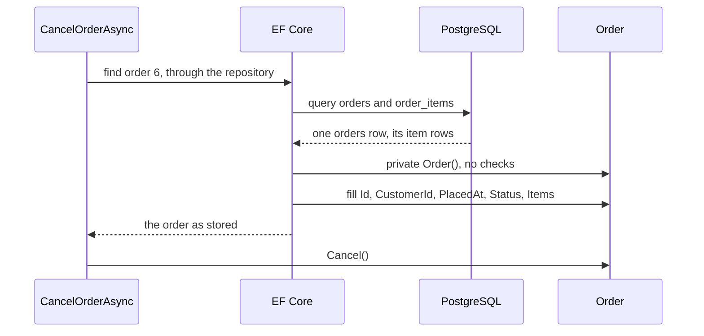

## Bạn cần biết trước

- [[design.l2.valid-from-construction]] — bạn biết constructor public của `Order` từ chối danh sách hàng rỗng và tự đặt `Status` thành `new`, và code bên ngoài `Order` chỉ gọi được constructor đó.
- [[backend.l1.efcore-relationships-and-keys]] — bạn biết `Items` là một navigation property, nối với các dòng `order_items` qua `HasMany(o => o.Items)` và cột `order_id`.

## Tình huống

Khách hàng 3 hủy đơn 6 bằng `PATCH /api/v1/orders/6/cancel`. `CancelOrderAsync` tải đơn qua repository, gọi `order.Cancel()` rồi lưu, và response cho thấy trạng thái `cancelled`. Giờ hãy đọc `Order` ở stage-2: `Status` có setter private, nên chỉ `Order` được gán nó. Constructor public nhận danh sách hàng, từ chối danh sách rỗng, và tự đặt `Status` thành `new`. Vậy mà đơn vừa tải lên vẫn mang đúng trạng thái đã lưu trong dòng `orders` của nó, trước khi `Cancel()` đổi đi. EF Core dựng object đó thế nào, điền `Status` từ dòng dữ liệu ra sao, và trên đường đi nó có chạy các bước kiểm tra của constructor không?

## Khái niệm cốt lõi

- setter private — `{ get; private set; }`: code nào cũng đọc được property, nhưng chỉ code bên trong class mới gán được nó. EF Core, như bạn sẽ thấy bên dưới, là ngoại lệ.
- tải một đơn — EF Core biến một dòng `orders`, cùng các dòng `order_items` được yêu cầu kèm theo, thành một object `Order` đã điền sẵn các property.
- constructor dành cho EF Core — `Order()` private, không tham số, mà EF Core dùng để tạo một đơn trước khi điền nó từ dòng dữ liệu.
- bước kiểm tra cho đơn được tạo — phép thử canh khoảnh khắc code tạo ra một đơn mới, không phải khoảnh khắc một dòng đã lưu được đọc lại.

## Cơ chế hoạt động



Trong tình huống trên, `CancelOrderAsync` hỏi repository lấy đơn 6. Repository chuyển yêu cầu cho EF Core, và EF Core truy vấn database PostgreSQL phía sau Đơn Hàng, đọc về một dòng `orders` cùng các dòng item của nó. Lúc này EF Core cần một object `Order` để đặt các giá trị ấy vào.

EF Core không dùng được constructor public. Constructor đó nhận `items` làm tham số, mà EF Core không truyền được một navigation như `Items` vào constructor. Đây là quy tắc cố định của EF Core, không phải thứ để lách: nó chỉ truyền giá trị của các cột đã map vào constructor, không bao giờ truyền navigation. Vì thế ở stage-2 `Order` có thêm một constructor private không tham số, viết riêng cho EF Core. EF Core là ngoại lệ của chữ private: là ORM, nó được làm ra để chạm tới constructor và setter private của các class nó map, điều các class khác của bạn không làm được. Nên không code nào khác tạo đơn qua `Order()`.

Tạo xong object, EF Core điền từng property đã map bằng giá trị trong dòng dữ liệu, kể cả `Status`. Setter private đóng `Status` với mọi class trừ chính `Order`, nhưng không đóng với EF Core. `DonHangDbContext` map `Status` sang cột `status` bằng đúng dòng code như ở stage-1, và EF Core đọc cột đó khi tải, ghi nó khi lưu: khi `Cancel()` đổi `Status`, `SaveChangesAsync` ghi `cancelled` vào dòng dữ liệu.

Constructor private không kiểm tra gì, nên tải một đơn không chạy bước kiểm tra nào của constructor public. Đó là chủ ý: các bước kiểm tra ấy canh những đơn do code tạo, còn một dòng đã nằm trong bảng, có thể do SQL chạy ngoài ứng dụng ghi vào, được đọc đúng như nó đang có. Một đơn đã lưu mà không có dòng item nào sẽ được tải lên với `Items` rỗng, không ném exception.

## Trong hệ thống Đơn Hàng

Hai constructor, bên trong `Order`:

```csharp file=DonHang.Domain/Entities.cs tag=stage-2 lines=51-70
    // lesson: design.l2.ef-core-and-private-setters
    // For EF Core only. It cannot pass the Items navigation to the public
    // constructor, so it creates the object with this one and then sets each
    // mapped property from the row it loaded — the checks below do not run.
    private Order()
    {
        Status = "";
    }

    // lesson: design.l2.valid-from-construction
    public Order(int customerId, List<OrderItem> items, DateTimeOffset placedAt)
    {
        if (items.Count == 0) throw new ArgumentException("an order needs at least one item");
        if (items.Any(item => item.Quantity < 1)) throw new ArgumentException("every item needs a quantity of at least 1");

        CustomerId = customerId;
        Items = items;
        PlacedAt = placedAt;
        Status = "new";
    }
```

Constructor private cho `Status` một giá trị giữ chỗ, `""`, và giá trị này không quan trọng: giá trị từ dòng dữ liệu thay nó trước khi code nào của bạn thấy đơn. Constructor public kiểm tra trước, gán sau. Comment phía trên `Order()` nói đúng điều bài này nói: các bước kiểm tra bên dưới không chạy khi EF Core tải một đơn.

`Id` thì khác: nó giữ setter public. EF Core không cần setter đó, vì nó vẫn điền được `Id` sau một setter private, y như cách nó điền `Status`. Code cần setter public là `FakeOrderRepository`:

```csharp file=DonHang.Tests/FakeOrderRepository.cs tag=stage-2 lines=33-38
    public Task AddAsync(Order order)
    {
        order.Id = nextId++;
        orders[order.Id] = order;
        return Task.CompletedTask;
    }
```

Cột `orders.id` được database điền khi insert, và EF Core chép số mới đó ngược vào `order.Id` khi `SaveChangesAsync` insert đơn. `FakeOrderRepository` đóng vai database trong `OrderServiceTests`, nên `AddAsync` của nó tự cấp id, từ một số chạy tăng dần. Id cho biết đây là đơn nào, không nói đơn được làm gì, nên để setter của nó public không mở quy tắc nghiệp vụ nào cho code khác.

## Người mới hay nghĩ rằng…

- **"Class được EF Core map phải giữ setter public, không thì EF Core không điền được."** → Thực ra EF Core map một property có setter private và điền nó khi tải như mọi property khác, vì quyền truy cập của setter giới hạn các class khác chứ không giới hạn ORM. Bạn sẽ nhận ra ở stage-2: `Status` đã thành private, dòng map của nó trong `DonHangDbContext` vẫn giữ nguyên, và hủy đơn vẫn lưu `cancelled`.
- **"Khi EF Core tải một đơn, nó gọi constructor public, nên một đơn đã lưu mà không có hàng sẽ ném exception."** → Thực ra EF Core không truyền được `Items` vào constructor, nên nó dùng `Order()` private, thứ không kiểm tra gì. Bạn sẽ nhận ra khi một dòng đơn không có dòng item nào, do SQL ghi vào, vẫn tải lên được, với `Items` rỗng.

## Thử ngay (3 phút)

Trong thư mục gốc của repo ví dụ, dùng Git Bash:

1. Chạy `git grep -n "e.Property(o => o\." stage-1 stage-2 -- DonHang.Infrastructure/DonHangDbContext.cs` để liệt kê cách các property của `Order` được map ở cả hai stage. `stage-1` và `stage-2` là tên mà repo ví dụ đặt cho hai commit của nó.
2. Chạy `git grep -n "private set\|Order()" stage-2 -- DonHang.Domain/Entities.cs` để liệt kê những gì đã thành private ở stage-2.

Kết quả mong đợi: lệnh đầu in bốn dòng cho `stage-1` và sáu dòng cho `stage-2`. Bỏ qua số dòng, code của `Id`, `CustomerId`, `PlacedAt` và `Status` giống nhau ở cả hai stage, chỉ có số dòng ở `stage-2` lớn hơn một (41 thành 42). `stage-2` chỉ thêm `IdempotencyKey` và `Version`. Lệnh thứ hai in sáu dòng: `CustomerId`, `PlacedAt`, `Status`, `Items` và `Version` với `private set`, cùng constructor private ở dòng 55. Đóng các setter không cần sửa gì ở phần map.

## Liên hệ

- [[design.l2.valid-from-construction]] — bước trước đó: constructor public canh những đơn do code tạo, còn bài này cho thấy vì sao lúc tải đơn lại bỏ qua nó.
- [[backend.l1.efcore-mapping]] — phần map mà bài này dựa vào: chính các dòng `HasColumnName` ấy giờ điền những property mà class khác không gán được.
- [[backend.l1.efcore-relationships-and-keys]] — navigation `Items` của bài đó là lý do EF Core cần constructor riêng.
- [[design.l2.testing-the-entity]] — bài tiếp theo: test các quy tắc của `Order` bằng constructor public, không cần database.

## Tóm tắt 5 dòng

1. EF Core điền được property có setter private, nên `Status` đóng với code khác mà vẫn được đọc từ và lưu vào `orders`.
2. EF Core không truyền được một navigation như `Items` vào constructor, nên không dùng được constructor public của `Order`.
3. Ở stage-2, `Order` có một constructor private không tham số dành cho EF Core, và nó không kiểm tra gì.
4. Tải một đơn không chạy bước kiểm tra nào của constructor public: chúng canh đơn do code tạo, không canh dòng đã lưu.
5. `Id` giữ setter public vì `FakeOrderRepository` gán nó trong test, như database làm khi insert, còn riêng EF Core thì không cần.
