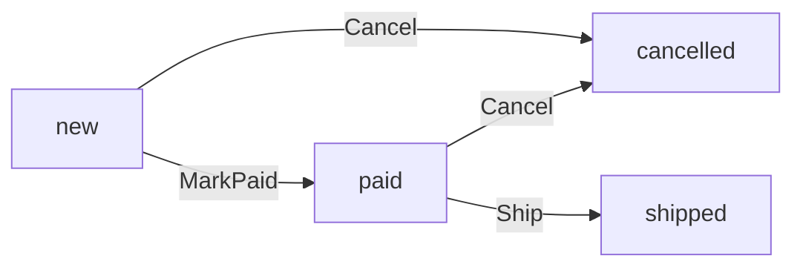

## Before you start

- [[design.l2.domain-model]] — you know `Order.Cancel()` decides whether an order may be cancelled, and `OrderService` runs the steps around it.
- [[backend.l2.role-based-access]] — you know the `StaffOnly` policy lets only a token with the `staff` role reach `PATCH /api/v1/orders/{id}/ship`.

## The situation

At stage-2 you are chasing a bug in `ShipOrderAsync` and want to skip a step while testing. You replace `order.Ship()` with `order.Status = "shipped";`, the kind of line `CancelOrderAsync` had at stage-1, and build the solution. The build fails: `error CS0272: The property or indexer 'Order.Status' cannot be used in this context because the set accessor is inaccessible`. At stage-1 a line like that compiled in any class that held an `Order`, and nothing in the class stood in the way. What changed in `Order`, and why is refusing the assignment not the whole protection?

## Core concepts

- private setter — a `set` accessor marked `private`, so only code inside the class can assign the property, while any code can still read it.
- a status-change method — a method of `Order`, such as `Ship()`, that checks the status the order starts from and only then assigns the new one.
- the ship endpoint's policy — `[Authorize(Policy = "StaffOnly")]`, which decides who may call `PATCH /api/v1/orders/{id}/ship`, before any order is loaded.

## How it works



In the situation above, the build failed because at stage-2 `Status` is declared `public string Status { get; private set; }`. Code outside `Order` can read the status but cannot assign it, so `order.Status = "shipped"` written in `OrderService` does not compile. `CustomerId`, `PlacedAt` and `Items` have private setters too.

A private setter alone only moves every assignment inside `Order`. What makes the assignments safe is that each allowed change is its own method, and each one first checks the status it starts from. The diagram is the whole list: `MarkPaid()` moves an order from `new` to `paid`, and `Ship()` moves it from `paid` to `shipped`. `Cancel()` moves it from `new` or `paid` to `cancelled`. Any other starting status makes the method throw `OrderStatusException` with a code, and the status stays as it was.

Now follow a ship request. `PATCH /api/v1/orders/{id}/ship` carries the `StaffOnly` policy, so a caller without the `staff` role never reaches the method. A staff request then calls `OrderService.ShipOrderAsync`, which loads the order and calls `order.Ship()`. The two checks answer different questions: the policy decides who may ship, and `Order` decides whether this order can be shipped. A staff member shipping a cancelled order passes the first check and fails the second, and gets `409`.

Reading `Order` alone now tells you every status change the application's code can make, named in business words: mark paid, ship, cancel. At stage-1 the assignments sat as plain lines inside `OrderService`'s methods, with no check of the status they started from.

## In the Đơn Hàng system

The three status changes, inside `Order`:

```csharp file=DonHang.Domain/Entities.cs tag=stage-2 lines=72-96
    // lesson: design.l2.status-changes-through-methods
    // One method per allowed change, each checking the status it starts from.
    // No endpoint takes payments at stage-2; OrderTests uses this to get a paid order.
    public void MarkPaid()
    {
        if (Status == "cancelled") throw new OrderStatusException(Id, "already-cancelled", $"order {Id} is cancelled");
        if (Status != "new") throw new OrderStatusException(Id, "already-paid", $"order {Id} is already paid");
        Status = "paid";
    }

    // lesson: design.l2.domain-model
    public void Cancel()
    {
        if (Status == "cancelled") throw new OrderStatusException(Id, "already-cancelled", $"order {Id} is already cancelled");
        if (Status == "shipped") throw new OrderStatusException(Id, "already-shipped", $"order {Id} has already shipped");
        Status = "cancelled";
    }

    public void Ship()
    {
        if (Status == "cancelled") throw new OrderStatusException(Id, "already-cancelled", $"order {Id} is cancelled");
        if (Status == "shipped") throw new OrderStatusException(Id, "already-shipped", $"order {Id} has already shipped");
        if (Status != "paid") throw new OrderStatusException(Id, "not-paid", $"order {Id} is not paid yet");
        Status = "shipped";
    }
```

Each method has the same shape: checks on the current status, then one assignment. Read the conditions against the diagram. `Ship()` names two cases with their own codes and turns anything else that is not `paid` into `not-paid`. As the comment says, no endpoint calls `MarkPaid()` at stage-2; the tests use it to get a paid order.

The use case that ships an order:

```csharp file=DonHang.Domain/OrderService.cs tag=stage-2 lines=51-61
    // lesson: design.l2.status-changes-through-methods
    public async Task<Order> ShipOrderAsync(int orderId)
    {
        var order = await repository.FindAsync(orderId)
            ?? throw new KeyNotFoundException($"order {orderId} not found");

        order.Ship();
        notifier.Send(order, "order shipped");
        await repository.SaveChangesAsync();
        return order;
    }
```

`ShipOrderAsync` has no role check and no status check. The role was checked by the endpoint's policy before this method ran, and the status is checked by `order.Ship()`.

## Beginners often think…

- **"Turning `Status` into an enum would already stop an order going from `cancelled` to `shipped`."** → Actually an enum limits which values exist, not which value may follow which, because any code that can assign the property can assign any member. You notice this when a line that sets the enum's shipped value compiles for an order whose status is cancelled.
- **"The ship endpoint requires the `staff` role, so a cancelled order cannot be shipped."** → Actually the policy only checks who is calling; it never looks at the order. You notice this when a staff token sent to the ship endpoint for a cancelled order passes the policy and gets `409` with a `type` ending in `already-cancelled`, not `403`.
- **"A private setter alone protects the status; `Order` does not also need methods that check anything."** → Actually a private setter only limits where the assignment is written, because code inside `Order` can still assign any status. You notice this when a new method in `Order` sets `Status = "shipped"` with no check: it compiles, and nothing refuses it.

## Try it (3 minutes)

In the root folder of the example repository, checked out at `stage-2`:

1. In Git Bash, run `git grep -n "Status = \"" -- "DonHang.Domain/*.cs"` to list every line in `DonHang.Domain` that assigns an order status.
2. For each line, note which member of `Order` it sits in.

Expected result: five lines, all in `Entities.cs`. Line 79 (`"paid"`) is in `MarkPaid()`, line 87 (`"cancelled"`) in `Cancel()` and line 95 (`"shipped"`) in `Ship()`: the three changes in the diagram. Line 69 is in the public constructor, which gives every new order the status `new`; line 57 is in a private constructor kept for EF Core. Both are the topic of later lessons. `OrderService.cs` has no line at all.

## Connections

- [[design.l2.domain-model]] — the step before: `Cancel()` became the place for one rule; this lesson closes the setter so every change goes through such a method.
- [[backend.l2.role-based-access]] — the other half of the ship request: that lesson decides who may ship, this one decides whether the order can be shipped.
- [[backend.l2.optimistic-concurrency]] — what these methods cannot see: two requests changing the same order at once, which the `Version` token catches at save time.
- [[design.l2.valid-from-construction]] — the next lesson: the public constructor that gives every new order the status `new`.
- [[design.l2.anemic-domain-model]] — the contrast: at stage-1 `Status` had a public setter and any class could assign it.

## Five-line summary

1. At stage-2 `Status` has a private setter, so `order.Status = "shipped"` outside `Order` fails to compile with `CS0272`.
2. Each allowed change is a method that checks its starting status: `MarkPaid()` from `new`, `Ship()` from `paid`, `Cancel()` from `new` or `paid`.
3. The ship endpoint's `StaffOnly` policy decides who may ship; `order.Ship()` decides whether this order can be shipped.
4. A private setter without those checks only moves the assignments into `Order`; the checks are what refuse a wrong change.
5. Reading `Order` alone lists every status change the application's code can make, named in business words.
