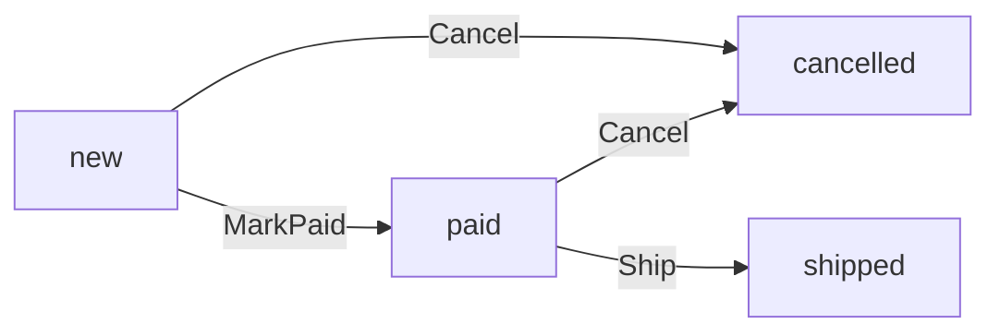

## Bạn cần biết trước

- [[design.l2.domain-model]] — bạn biết `Order.Cancel()` quyết định một đơn có được hủy không, còn `OrderService` chạy các bước quanh nó.
- [[backend.l2.role-based-access]] — bạn biết policy `StaffOnly` chỉ cho token có role `staff` tới được `PATCH /api/v1/orders/{id}/ship`.

## Tình huống

Ở stage-2, bạn đang lần theo một bug trong `ShipOrderAsync` và muốn bỏ qua một bước khi thử. Bạn thay `order.Ship()` bằng `order.Status = "shipped";`, đúng kiểu dòng mà `CancelOrderAsync` từng có ở stage-1, rồi build solution. Build lỗi: `error CS0272: The property or indexer 'Order.Status' cannot be used in this context because the set accessor is inaccessible`. Ở stage-1, một dòng như vậy biên dịch được trong bất kỳ class nào giữ một `Order`, và không gì trong class cản lại. `Order` đã đổi điều gì, và vì sao chặn được phép gán vẫn chưa phải là toàn bộ sự bảo vệ?

## Khái niệm cốt lõi

- setter private — accessor `set` được đánh dấu `private`, nên chỉ code bên trong class gán được property, còn code nào cũng vẫn đọc được.
- method đổi trạng thái — một method của `Order`, như `Ship()`, kiểm tra trạng thái xuất phát của đơn rồi mới gán trạng thái mới.
- policy của endpoint giao hàng — `[Authorize(Policy = "StaffOnly")]`, quyết định ai được gọi `PATCH /api/v1/orders/{id}/ship`, trước khi đơn nào được tải.

## Cơ chế hoạt động



Trong tình huống trên, build lỗi vì ở stage-2 `Status` được khai báo `public string Status { get; private set; }`. Code bên ngoài `Order` đọc được trạng thái nhưng không gán được, nên `order.Status = "shipped"` viết trong `OrderService` không biên dịch. `CustomerId`, `PlacedAt` và `Items` cũng có setter private.

Chỉ riêng setter private thì chỉ dời mọi phép gán vào trong `Order`. Điều làm các phép gán an toàn là mỗi lần đổi được phép là một method riêng, và method nào cũng kiểm tra trạng thái xuất phát trước. Sơ đồ là toàn bộ danh sách: `MarkPaid()` đưa đơn từ `new` sang `paid`, còn `Ship()` đưa từ `paid` sang `shipped`. `Cancel()` đưa đơn từ `new` hoặc `paid` sang `cancelled`. Mọi trạng thái xuất phát khác đều khiến method ném `OrderStatusException` kèm một mã, và trạng thái giữ nguyên.

Giờ hãy đi theo một request giao hàng. `PATCH /api/v1/orders/{id}/ship` mang policy `StaffOnly`, nên bên gọi không có role `staff` không bao giờ tới được method. Một request của nhân viên sau đó gọi `OrderService.ShipOrderAsync`, method này tải đơn rồi gọi `order.Ship()`. Hai bước kiểm tra trả lời hai câu hỏi khác nhau: policy quyết định ai được giao hàng, còn `Order` quyết định đơn này có giao được không. Một nhân viên giao một đơn đã hủy sẽ qua bước đầu, trượt bước sau, và nhận `409`.

Giờ chỉ cần đọc `Order` là biết mọi lần đổi trạng thái mà code của ứng dụng làm được, gọi bằng tên nghiệp vụ: đánh dấu đã thanh toán, giao hàng, hủy. Ở stage-1 các phép gán chỉ là những dòng trơn trong các method của `OrderService`, không kiểm tra trạng thái xuất phát.

## Trong hệ thống Đơn Hàng

Ba lần đổi trạng thái, nằm trong `Order`:

```csharp file=DonHang.Domain/Entities.cs tag=stage-2 lines=72-96
    // lesson: design.l2.status-changes-through-methods
    // One method per allowed change, each checking the status it starts from.
    // No endpoint takes payments at stage-2; OrderTests uses this to get a paid order.
    public void MarkPaid()
    {
        if (Status == "cancelled") throw new OrderStatusException(Id, "already-cancelled", $"order {Id} is cancelled");
        if (Status != "new") throw new OrderStatusException(Id, "already-paid", $"order {Id} is already paid");
        Status = "paid";
    }

    // lesson: design.l2.domain-model
    public void Cancel()
    {
        if (Status == "cancelled") throw new OrderStatusException(Id, "already-cancelled", $"order {Id} is already cancelled");
        if (Status == "shipped") throw new OrderStatusException(Id, "already-shipped", $"order {Id} has already shipped");
        Status = "cancelled";
    }

    public void Ship()
    {
        if (Status == "cancelled") throw new OrderStatusException(Id, "already-cancelled", $"order {Id} is cancelled");
        if (Status == "shipped") throw new OrderStatusException(Id, "already-shipped", $"order {Id} has already shipped");
        if (Status != "paid") throw new OrderStatusException(Id, "not-paid", $"order {Id} is not paid yet");
        Status = "shipped";
    }
```

Method nào cũng cùng một dáng: kiểm tra trạng thái hiện tại, rồi một phép gán. Hãy đọc các điều kiện đối chiếu với sơ đồ. `Ship()` gọi tên hai trường hợp bằng mã riêng, còn mọi trạng thái khác không phải `paid` thì thành `not-paid`. Như comment nói, ở stage-2 không endpoint nào gọi `MarkPaid()`; test dùng nó để có một đơn đã thanh toán.

Use case giao một đơn:

```csharp file=DonHang.Domain/OrderService.cs tag=stage-2 lines=51-61
    // lesson: design.l2.status-changes-through-methods
    public async Task<Order> ShipOrderAsync(int orderId)
    {
        var order = await repository.FindAsync(orderId)
            ?? throw new KeyNotFoundException($"order {orderId} not found");

        order.Ship();
        notifier.Send(order, "order shipped");
        await repository.SaveChangesAsync();
        return order;
    }
```

`ShipOrderAsync` không kiểm tra role, cũng không kiểm tra trạng thái. Role đã được policy của endpoint kiểm tra trước khi method này chạy, còn trạng thái do `order.Ship()` kiểm tra.

## Người mới hay nghĩ rằng…

- **"Đổi `Status` thành enum là đủ để chặn đơn đi từ `cancelled` sang `shipped`."** → Thực ra enum giới hạn những giá trị nào tồn tại, không giới hạn giá trị nào được đi sau giá trị nào, vì code nào gán được property thì gán được mọi giá trị của enum. Bạn sẽ nhận ra khi một dòng đặt giá trị shipped của enum vẫn biên dịch được cho một đơn đang ở trạng thái đã hủy.
- **"Endpoint giao hàng đòi role `staff`, nên đơn đã hủy không thể bị giao."** → Thực ra policy chỉ kiểm tra ai đang gọi, nó không hề nhìn vào đơn. Bạn sẽ nhận ra khi token nhân viên gửi tới endpoint giao hàng cho một đơn đã hủy vẫn qua policy và nhận `409` với `type` kết thúc bằng `already-cancelled`, chứ không phải `403`.
- **"Chỉ setter private là đủ bảo vệ trạng thái, `Order` không cần thêm method nào kiểm tra gì."** → Thực ra setter private chỉ giới hạn chỗ viết phép gán, vì code bên trong `Order` vẫn gán được bất kỳ trạng thái nào. Bạn sẽ nhận ra khi một method mới trong `Order` đặt `Status = "shipped"` mà không kiểm tra gì: nó vẫn biên dịch, và không gì từ chối.

## Thử ngay (3 phút)

Trong thư mục gốc của repo ví dụ, đã checkout ở `stage-2`:

1. Trong Git Bash, chạy `git grep -n "Status = \"" -- "DonHang.Domain/*.cs"` để liệt kê mọi dòng trong `DonHang.Domain` gán trạng thái đơn.
2. Với mỗi dòng, ghi lại nó nằm trong thành phần nào của `Order`.

Kết quả mong đợi: năm dòng, tất cả trong `Entities.cs`. Dòng 79 (`"paid"`) nằm trong `MarkPaid()`, dòng 87 (`"cancelled"`) trong `Cancel()` và dòng 95 (`"shipped"`) trong `Ship()`: ba lần đổi trong sơ đồ. Dòng 69 nằm trong constructor public, nơi cho mọi đơn mới trạng thái `new`; dòng 57 nằm trong một constructor private giữ lại cho EF Core. Cả hai là chủ đề của các bài sau. `OrderService.cs` không có dòng nào.

## Liên hệ

- [[design.l2.domain-model]] — bước trước đó: `Cancel()` trở thành chỗ đặt một quy tắc; bài này đóng setter lại để mọi lần đổi đều đi qua một method như thế.
- [[backend.l2.role-based-access]] — nửa kia của request giao hàng: bài đó quyết định ai được giao, bài này quyết định đơn có giao được không.
- [[backend.l2.optimistic-concurrency]] — điều các method này không thấy được: hai request cùng đổi một đơn một lúc, thứ mà token `Version` bắt được lúc lưu.
- [[design.l2.valid-from-construction]] — bài tiếp theo: constructor public cho mọi đơn mới trạng thái `new`.
- [[design.l2.anemic-domain-model]] — phép so sánh: ở stage-1 `Status` có setter public và class nào cũng gán được.

## Tóm tắt 5 dòng

1. Ở stage-2 `Status` có setter private, nên `order.Status = "shipped"` bên ngoài `Order` không biên dịch được, báo lỗi `CS0272`.
2. Mỗi lần đổi được phép là một method kiểm tra trạng thái xuất phát: `MarkPaid()` từ `new`, `Ship()` từ `paid`, `Cancel()` từ `new` hoặc `paid`.
3. Policy `StaffOnly` của endpoint giao hàng quyết định ai được giao; `order.Ship()` quyết định đơn này có giao được không.
4. Setter private mà thiếu các bước kiểm tra đó chỉ dời phép gán vào trong `Order`. Chính các bước kiểm tra mới từ chối được một lần đổi sai.
5. Chỉ cần đọc `Order` là thấy mọi lần đổi trạng thái mà code của ứng dụng làm được, gọi bằng tên nghiệp vụ.
