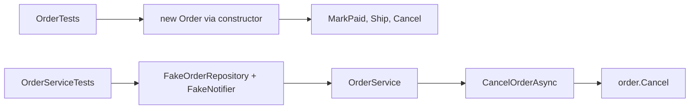

## Before you start

- [[design.l2.valid-from-construction]] — you know `Order`'s public constructor refuses an empty item list and gives every new order the status `new`, and that after that only `MarkPaid()` (from `new`), `Ship()` (from `paid`) and `Cancel()` (from `new` or `paid`) change the status.
- [[design.l1.testing-with-a-fake-repository]] — you know `OrderServiceTests` builds `OrderService` with a `FakeOrderRepository` and a `FakeNotifier`, so its tests need no database.

## The situation

At stage-1, a review of `OrderServiceTests` found that no test cancels a `shipped` order. Writing one then meant a `FakeOrderRepository`, an order seeded with `Status = "shipped"`, a `FakeNotifier`, an `OrderService` built from both, and an `await` on `CancelOrderAsync`. Four pieces of setup and an `await`, to ask one question about one order. At stage-2 the rule "a shipped order cannot be cancelled" lives in `Order.Cancel()`, and the test suite has a new class, `OrderTests`, next to `OrderServiceTests`. What does a test of that rule need now, and what is left for `OrderServiceTests` to check?

## Core concepts

- object under test — the one object whose behaviour a test checks; in `OrderTests` it is an `Order`, in `OrderServiceTests` it is an `OrderService`.
- setup of a test — the lines that run before the call being checked: creating the object under test and everything it needs to work.
- testing a rule where it lives — calling the method that holds the rule directly, instead of reaching it through a class that calls that method.

## How it works



Both paths reach `Order.Cancel()`. The top path calls it directly; the bottom path goes through `OrderService`, which needs two fakes before it can run.

In the situation above, the object under test for the status rule is the `Order` itself, an entity: a class that stands for one business thing. `OrderTests` creates it with the public constructor, through a helper `NewOrder()` that passes one item. Creating the order is one line, and nothing else has to be built: no repository, no notifier, no fake, and no `await`, because `Order`'s methods are ordinary synchronous methods.

To reach `shipped`, the test calls `MarkPaid()` and then `Ship()`, since `Status` has a private setter and `Ship()` accepts only a paid order. No endpoint takes payments at stage-2; `OrderTests` calls `MarkPaid()` only to get a paid order. The test then checks that `Cancel()` throws `OrderStatusException`, the exception `Order` throws when a change is not allowed, with the `Code` `already-shipped` naming the case, and that the status is still `shipped`.

`OrderServiceTests` keeps only what needs the fakes: the three `PlaceOrderAsync` tests, that `CancelOrderAsync` leaves the order `cancelled` in the fake repository and sends one notification, that an unknown id throws `KeyNotFoundException`, and that a refused `Ship()` notifies nobody. Checking every status rule there again would repeat `OrderTests` with more setup.

That is why a rule inside the entity is cheaper to test: the test creates only the object under test, instead of wiring the dependencies of the class that calls it.

## In the Đơn Hàng system

The test for the case the stage-1 suite never had:

```csharp file=DonHang.Tests/Domain/OrderTests.cs tag=stage-2 lines=38-51
    // lesson: design.l2.testing-the-entity
    // The case the stage-1 suite never had: paid, then shipped, then cancelled.
    [Fact]
    public void Cancel_ShippedOrder_Throws()
    {
        var order = NewOrder();
        order.MarkPaid();
        order.Ship();

        var ex = Assert.Throws<OrderStatusException>(order.Cancel);

        Assert.Equal("already-shipped", ex.Code);
        Assert.Equal("shipped", order.Status);
    }
```

The method returns `void`, not `Task`, and no line creates a fake. `Assert.Throws` takes `order.Cancel` without calling it and runs it itself, so the throw happens inside the check. The last line matters too: a refused `Cancel()` must leave the status as it was.

A test that still needs the fakes:

```csharp file=DonHang.Tests/Services/OrderServiceTests.cs tag=stage-2 lines=52-64
    [Fact]
    public async Task CancelOrderAsync_NewOrder_SavesAndNotifies()
    {
        var repository = new FakeOrderRepository();
        repository.Seed(new Order(customerId: 1, OneItem(), DateTimeOffset.UtcNow) { Id = 1 });
        var notifier = new FakeNotifier();
        var service = new OrderService(repository, notifier);

        var order = await service.CancelOrderAsync(1);

        Assert.Equal("cancelled", (await repository.FindAsync(1))!.Status);
        Assert.Equal((order.Id, "order cancelled"), Assert.Single(notifier.Sent));
    }
```

Four lines of setup before the call; `OneItem()` is a helper returning a list with one item. `Assert.Single` checks that `Sent` holds exactly one entry and returns it. That cost is worth paying here, because the question is about the use case: does `CancelOrderAsync` find the order, and does it send the notification? Only `OrderService` does those steps, so only a test of `OrderService` can answer. Whether a `shipped` order may be cancelled is not asked here; `OrderTests` answers it.

## Beginners often think…

- **"Every unit test needs a fake for something."** → Actually a fake stands in for a dependency, and `Order` has none: it holds its own data and calls no repository or notifier. You notice this when you read `OrderTests`: no fake class and no `await` appear anywhere in the file, and all its tests pass.
- **"Rules must be tested through `OrderService`, because that is what the controller calls."** → Actually the rule runs in `Order.Cancel()` whoever calls it, so a test that calls `Cancel()` directly checks the same code with less setup. You notice this when you break the rule in `Order` and the failing test is in `OrderTests`, while `OrderServiceTests` stays green.

## Try it (3 minutes)

In the root folder of the example repository, checked out at `stage-2`:

1. Run `dotnet test DonHang.Tests --filter "FullyQualifiedName~DonHang.Tests.Domain"`. The `~` means "contains": only tests whose full name contains `DonHang.Tests.Domain` run.
2. In `DonHang.Domain/Entities.cs`, inside `Cancel()`, delete the line that throws when `Status == "shipped"`. Run the command from step 1 again.
3. Run `dotnet test DonHang.Tests --filter "FullyQualifiedName~OrderServiceTests"`, then undo the change.

Expected result: step 1 — ten tests pass. Step 2 — one test fails, `Cancel_ShippedOrder_Throws`, expecting an `OrderStatusException` that was never thrown; the other nine pass. Step 3 — all six tests in `OrderServiceTests` pass: none of them asks whether a `shipped` order may be cancelled, so the broken rule is caught only where it lives.

## Connections

- [[design.l2.valid-from-construction]] — the prerequisite that makes creating the order one line: the public constructor is how `OrderTests` gets a valid order.
- [[design.l1.testing-with-a-fake-repository]] — the contrast: the fakes are still right for `OrderService`, now only for the steps that reach outside the order.
- [[management.l1.reviewing-for-tests]] — the fix for the gap that review found: the missing `shipped` case is now a test.
- [[design.l2.where-a-rule-belongs]] — the next lesson: deciding which class each rule goes into, which also decides where it is tested.
- [[design.l2.integration-test-first-look]] — what neither test class checks: whether an order is really stored in PostgreSQL.

## Five-line summary

1. A rule inside `Order` is tested by creating an `Order` and calling its methods, because the rule needs no other object.
2. `OrderTests` uses the public constructor, then methods only: no repository, no notifier, no fake and no `await`.
3. `Cancel_ShippedOrder_Throws` covers the case the stage-1 suite never had: paid, shipped, then `Cancel()` throws `OrderStatusException`.
4. `OrderServiceTests` keeps what needs the fakes, such as saving and notifying; repeating the status rules there would duplicate `OrderTests`.
5. The test of a rule in the entity creates only the object under test, instead of wiring the dependencies of a service.
