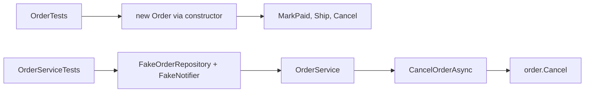

## Bạn cần biết trước

- [[design.l2.valid-from-construction]] — bạn biết constructor public của `Order` từ chối danh sách hàng rỗng và cho mọi đơn mới trạng thái `new`, và sau đó chỉ `MarkPaid()` (từ `new`), `Ship()` (từ `paid`) và `Cancel()` (từ `new` hoặc `paid`) được đổi trạng thái.
- [[design.l1.testing-with-a-fake-repository]] — bạn biết `OrderServiceTests` dựng `OrderService` với một `FakeOrderRepository` và một `FakeNotifier`, nên các test của nó không cần database.

## Tình huống

Ở stage-1, một lần review `OrderServiceTests` phát hiện không có test nào hủy một đơn `shipped`. Muốn viết test đó khi ấy, bạn cần một `FakeOrderRepository`, một đơn tạo sẵn với `Status = "shipped"`, một `FakeNotifier`, một `OrderService` dựng từ hai thứ kia, và một `await` trên `CancelOrderAsync`. Bốn thứ phải chuẩn bị cộng một `await`, chỉ để hỏi một câu về một đơn. Ở stage-2, quy tắc "đơn đã giao thì không hủy được" nằm trong `Order.Cancel()`, và bộ test có thêm class `OrderTests` đặt cạnh `OrderServiceTests`. Giờ test quy tắc đó cần những gì, và `OrderServiceTests` còn lại việc gì để kiểm tra?

## Khái niệm cốt lõi

- object được test — object duy nhất mà test kiểm tra hành vi. Trong `OrderTests` đó là một `Order`, trong `OrderServiceTests` đó là một `OrderService`.
- phần chuẩn bị của test — các dòng chạy trước lời gọi đang được kiểm tra: tạo object được test và mọi thứ nó cần để chạy.
- test quy tắc ngay nơi nó nằm — gọi thẳng method chứa quy tắc, thay vì đi vòng qua một class có gọi method đó.

## Cơ chế hoạt động



Cả hai đường đều tới `Order.Cancel()`. Đường trên gọi thẳng nó, còn đường dưới đi qua `OrderService`, thứ cần hai fake mới chạy được.

Trong tình huống trên, object được test cho quy tắc trạng thái chính là `Order`, một entity: class đại diện cho một thứ trong nghiệp vụ. `OrderTests` tạo nó bằng constructor public, thông qua helper `NewOrder()` truyền vào một món hàng. Tạo đơn chỉ mất một dòng, và không phải dựng thêm gì: không repository, không notifier, không fake, không `await`, vì các method của `Order` là method đồng bộ bình thường.

Để tới `shipped`, test gọi `MarkPaid()` rồi `Ship()`, vì `Status` có setter private và `Ship()` chỉ nhận đơn đã thanh toán. Ở stage-2 chưa endpoint nào nhận thanh toán, `OrderTests` gọi `MarkPaid()` chỉ để có một đơn đã thanh toán. Sau đó test kiểm tra `Cancel()` ném `OrderStatusException`, exception mà `Order` ném khi một lần đổi không được phép, với `Code` là `already-shipped` để gọi tên trường hợp, và trạng thái vẫn là `shipped`.

`OrderServiceTests` chỉ giữ những gì cần fake: ba test của `PlaceOrderAsync`, test cho thấy `CancelOrderAsync` để đơn ở trạng thái `cancelled` trong fake repository và gửi đúng một thông báo, test cho thấy id không tồn tại thì ném `KeyNotFoundException`, và test cho thấy `Ship()` bị từ chối thì không ai được thông báo. Kiểm tra lại từng quy tắc trạng thái ở đó chỉ lặp lại `OrderTests` với nhiều phần chuẩn bị hơn.

Đó là lý do quy tắc nằm trong entity thì test rẻ hơn: test chỉ tạo object được test, thay vì phải nối dây mọi phụ thuộc của class gọi tới nó.

## Trong hệ thống Đơn Hàng

Test cho trường hợp mà bộ test stage-1 chưa từng có:

```csharp file=DonHang.Tests/Domain/OrderTests.cs tag=stage-2 lines=38-51
    // lesson: design.l2.testing-the-entity
    // The case the stage-1 suite never had: paid, then shipped, then cancelled.
    [Fact]
    public void Cancel_ShippedOrder_Throws()
    {
        var order = NewOrder();
        order.MarkPaid();
        order.Ship();

        var ex = Assert.Throws<OrderStatusException>(order.Cancel);

        Assert.Equal("already-shipped", ex.Code);
        Assert.Equal("shipped", order.Status);
    }
```

Method trả về `void`, không phải `Task`, và không dòng nào tạo fake. `Assert.Throws` nhận `order.Cancel` mà không gọi nó, rồi tự chạy nó, nên exception được ném ngay bên trong phép kiểm tra. Dòng cuối cũng quan trọng: một lần `Cancel()` bị từ chối phải để nguyên trạng thái như cũ.

Một test vẫn cần fake:

```csharp file=DonHang.Tests/Services/OrderServiceTests.cs tag=stage-2 lines=52-64
    [Fact]
    public async Task CancelOrderAsync_NewOrder_SavesAndNotifies()
    {
        var repository = new FakeOrderRepository();
        repository.Seed(new Order(customerId: 1, OneItem(), DateTimeOffset.UtcNow) { Id = 1 });
        var notifier = new FakeNotifier();
        var service = new OrderService(repository, notifier);

        var order = await service.CancelOrderAsync(1);

        Assert.Equal("cancelled", (await repository.FindAsync(1))!.Status);
        Assert.Equal((order.Id, "order cancelled"), Assert.Single(notifier.Sent));
    }
```

Bốn dòng chuẩn bị trước lời gọi, trong đó `OneItem()` là helper trả về một danh sách có một món hàng. `Assert.Single` kiểm tra `Sent` có đúng một phần tử và trả phần tử đó về. Ở đây cái giá ấy đáng bỏ ra, vì câu hỏi là về use case: `CancelOrderAsync` có tìm thấy đơn không, và có gửi thông báo không? Chỉ `OrderService` làm các bước đó, nên chỉ test của `OrderService` trả lời được. Test này không hỏi đơn `shipped` có được hủy không, câu đó `OrderTests` trả lời.

## Người mới hay nghĩ rằng…

- **"Unit test nào cũng cần fake cho một thứ gì đó."** → Thực ra fake đứng thay một phụ thuộc, còn `Order` không có phụ thuộc nào: nó giữ dữ liệu của chính nó và không gọi repository hay notifier nào. Bạn sẽ nhận ra khi đọc `OrderTests`: cả file không có class fake nào, không có `await` nào, và mọi test đều pass.
- **"Quy tắc phải được test qua `OrderService`, vì controller gọi `OrderService`."** → Thực ra quy tắc chạy trong `Order.Cancel()` bất kể ai gọi, nên test gọi thẳng `Cancel()` kiểm tra đúng code đó với ít phần chuẩn bị hơn. Bạn sẽ nhận ra khi làm hỏng quy tắc trong `Order`: test fail nằm trong `OrderTests`, còn `OrderServiceTests` vẫn xanh.

## Thử ngay (3 phút)

Trong thư mục gốc của repo ví dụ, checkout ở `stage-2`:

1. Chạy `dotnet test DonHang.Tests --filter "FullyQualifiedName~DonHang.Tests.Domain"`. Dấu `~` nghĩa là "chứa": chỉ những test có tên đầy đủ chứa `DonHang.Tests.Domain` mới chạy.
2. Trong `DonHang.Domain/Entities.cs`, bên trong `Cancel()`, xóa dòng ném exception khi `Status == "shipped"`. Chạy lại lệnh ở bước 1.
3. Chạy `dotnet test DonHang.Tests --filter "FullyQualifiedName~OrderServiceTests"`, rồi hoàn tác thay đổi.

Kết quả mong đợi: bước 1 — mười test pass. Bước 2 — một test fail, `Cancel_ShippedOrder_Throws`, vì nó chờ một `OrderStatusException` không hề được ném, chín test còn lại pass. Bước 3 — cả sáu test trong `OrderServiceTests` đều pass: không test nào hỏi đơn `shipped` có được hủy không, nên quy tắc bị hỏng chỉ bị bắt đúng nơi nó nằm.

## Liên hệ

- [[design.l2.valid-from-construction]] — điều kiện tiên quyết giúp tạo đơn chỉ mất một dòng: constructor public là cách `OrderTests` có được một đơn hợp lệ.
- [[design.l1.testing-with-a-fake-repository]] — phép đối chiếu: fake vẫn đúng chỗ với `OrderService`, giờ chỉ cho những bước với ra ngoài đơn hàng.
- [[management.l1.reviewing-for-tests]] — lời giải cho lỗ hổng mà lần review đó tìm ra: trường hợp `shipped` còn thiếu giờ đã thành một test.
- [[design.l2.where-a-rule-belongs]] — bài tiếp theo: quyết định mỗi quy tắc nằm ở class nào, và cũng là quyết định nó được test ở đâu.
- [[design.l2.integration-test-first-look]] — điều cả hai class test đều không kiểm tra: đơn có thật sự được lưu vào PostgreSQL hay không.

## Tóm tắt 5 dòng

1. Quy tắc nằm trong `Order` được test bằng cách tạo một `Order` rồi gọi các method của nó, vì quy tắc không cần object nào khác.
2. `OrderTests` dùng constructor public, rồi chỉ gọi method: không repository, không notifier, không fake, không `await`.
3. `Cancel_ShippedOrder_Throws` phủ trường hợp bộ test stage-1 chưa từng có: đã thanh toán, đã giao, rồi `Cancel()` ném `OrderStatusException`.
4. `OrderServiceTests` giữ những gì cần fake, như lưu và gửi thông báo, lặp lại các quy tắc trạng thái ở đó chỉ trùng với `OrderTests`.
5. Test một quy tắc trong entity chỉ tạo object được test, thay vì phải nối dây các phụ thuộc của một service.
