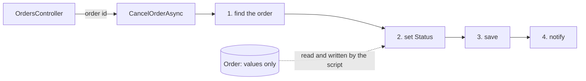

## Before you start

- [[design.l1.the-service-layer]] — you know `OrderService` holds the steps of placing and cancelling an order and knows nothing about HTTP.
- [[design.l2.clean-architecture]] — you know a use case is one thing the application does for its user, and that `PlaceOrderAsync` and `CancelOrderAsync` are Đơn Hàng's.

## The situation

Your team lead asks you to add shipping to Đơn Hàng at stage-1: staff will mark an order as shipped, and you open `OrderService` to copy its style. `PlaceOrderAsync` checks the items, builds an `Order`, saves it and sends a notification, all in one method. `CancelOrderAsync` finds the order, sets its `Status`, saves and notifies, while `Order` itself has only properties. So you plan `ShipOrderAsync` the same way, top to bottom. Then you notice that `CancelOrderAsync` never looks at the status the order is in. Does this way of writing each operation have a name, and what does it cost once several methods change the same order?

## Core concepts

- **transaction script** — one method that runs a whole business operation step by step, over data that holds no rules of its own.
- the steps of a script — typically check the input, load or build the data, change it, save it, report it, one after another inside the one method; a script may skip a step it does not need.
- the word "transaction" in the name — it means one business operation, such as "cancel an order", not a database transaction.

## How it works



In the situation above, `CancelOrderAsync` is a transaction script. The controller hands it an order id, and from there the method does everything the operation needs, in the order the diagram shows: find the order, set its `Status`, have it saved, send the notification. `PlaceOrderAsync` has the same shape: check the items, build the `Order`, add and save it, notify. Each method holds one whole use case.

`Order` sits outside that flow. The script loads it in step 1 and writes its `Status` in step 2, but `Order` itself has no method that takes part: no step asks the order anything. Every decision about the operation, including any rule about which status may change to which, has no place in `Order`, so in this design it is written in the script.

The name comes from the book Patterns of Enterprise Application Architecture, and "transaction" there means a business operation. The method does not wrap its steps in a database transaction. At stage-1 nothing in `OrderService` opens one: the query in `FindAsync` and the final save each go to the database on their own, so no single transaction covers the whole method.

A transaction script is easy to follow while an operation has few rules. You read one method from top to bottom and see every step, with nothing hidden in another class.

The cost appears when several scripts change the same data. A rule about an order's status, such as "a shipped order cannot be cancelled", has to be written inside every script that changes the status. Each script needs its own copy of the check, and nothing in the code makes a new script add it. That is the gap you noticed: `CancelOrderAsync` never checks, and `ShipOrderAsync` would need its own check too.

## In the Đơn Hàng system

The script that places an order, in `DonHang.Domain`:

```csharp file=DonHang.Domain/OrderService.cs tag=stage-1 lines=8-23
    public async Task<Order> PlaceOrderAsync(int customerId, List<OrderItem> items)
    {
        if (items.Count == 0) throw new ArgumentException("an order needs at least one item");

        var order = new Order
        {
            CustomerId = customerId,
            PlacedAt = DateTimeOffset.UtcNow,
            Status = "new",
            Items = items,
        };
        await repository.AddAsync(order);
        await repository.SaveChangesAsync();
        notifier.Send(order.Id, "order placed");
        return order;
    }
```

Read it as a list of steps: check the input, build the data, save it, report it. The rule "an order needs at least one item" is the first line of the script. The `Order` is built by setting its properties from outside, including `Status = "new"`: the script decides the starting status, not the order.

The script that cancels one:

```csharp file=DonHang.Domain/OrderService.cs tag=stage-1 lines=25-38
    // lesson: management.l1.reviewing-for-tests
    // Deliberately missing a check: an order already `shipped` still gets
    // cancelled here. `DonHang.Tests` covers `new` but not `shipped` —
    // the gap a reviewer is meant to catch, not a crash to catch by running it.
    public async Task<Order> CancelOrderAsync(int orderId)
    {
        var order = await repository.FindAsync(orderId)
            ?? throw new KeyNotFoundException($"order {orderId} not found");

        order.Status = "cancelled";
        await repository.SaveChangesAsync();
        notifier.Send(order.Id, "order cancelled");
        return order;
    }
```

The first comment line only marks which lesson uses this gap. The rest of the comment admits the missing check. Adding it here would fix cancelling, but the check would live in `CancelOrderAsync` only. A `ShipOrderAsync` written next to it would start with no check at all, and only the author's memory would add one. In `Entities.cs`, `Order` has a public getter and setter for each property and no method, so it has nowhere to keep the rule for both scripts.

## Beginners often think…

- **"A transaction script is a method that wraps its work in a database transaction."** → Actually "transaction" names the business operation the method runs, because the pattern is about organising logic, not about the database. You notice this when you look in `OrderService` for a `BeginTransaction` call, the call that opens a database transaction in code, and find none, yet the methods are still transaction scripts.
- **"Putting all the logic in service methods is simply bad design, whatever the application does."** → Actually it is a simple design that works well while operations share few rules, because every step is visible in one method. When data has no rules, a script is often clearer than spreading a few lines across classes. You notice the limit when the same check has to be copied into a second and a third script, and one copy is missing.

## Try it (3 minutes)

In the root folder of the example repository, checked out at `stage-1`:

1. Run `git grep -n "Status" -- "DonHang.Domain/*.cs"` to list every line in `DonHang.Domain` that mentions an order's status.
2. For each line, note whether it declares the status or assigns it, and which method it sits in.

Expected result: three lines. `Entities.cs` line 30 declares `Status` with a public setter. `OrderService.cs` line 16 sets `Status = "new"` inside `PlaceOrderAsync`, and line 34 sets `order.Status = "cancelled"` inside `CancelOrderAsync`. Every status change is written inside a script; no line reads the current status before changing it.

## Connections

- [[design.l1.the-service-layer]] — the layer these scripts live in: that lesson put the steps in `OrderService`; this one names the style of those methods.
- [[design.l2.clean-architecture]] — the same unit seen from another angle: each use case there is one transaction script here.
- [[foundation.l1.transaction-intro]] — the other meaning of the word: that lesson's database transaction is not what "transaction" means in this pattern's name.
- [[design.l2.anemic-domain-model]] — the next lesson, about the other side of this design: an `Order` that holds values and none of the rules.

## Five-line summary

1. A transaction script runs one whole business operation in one method, step by step, while the data it changes holds no rules.
2. `PlaceOrderAsync` and `CancelOrderAsync` are transaction scripts; `Order` only carries the values they read and write.
3. "Transaction" in the name means a business operation, not a database transaction around the method.
4. A script is easy to follow while an operation has few rules: every step sits in one method, read top to bottom.
5. When several scripts change the same data, each needs its own copy of every check, and nothing makes a new script add it.
