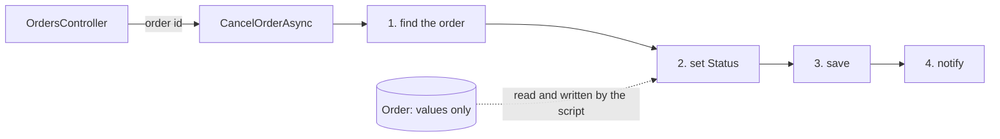

## Bạn cần biết trước

- [[design.l1.the-service-layer]] — bạn biết `OrderService` giữ các bước đặt đơn và hủy đơn, và không biết gì về HTTP.
- [[design.l2.clean-architecture]] — bạn biết use case là một việc ứng dụng làm cho người dùng của nó, và `PlaceOrderAsync`, `CancelOrderAsync` là use case của Đơn Hàng.

## Tình huống

Trưởng nhóm giao bạn thêm tính năng giao hàng cho Đơn Hàng ở stage-1: nhân viên sẽ đánh dấu một đơn là đã giao, và bạn mở `OrderService` để làm theo cách viết sẵn có. `PlaceOrderAsync` kiểm tra danh sách hàng, tạo một `Order`, lưu rồi gửi thông báo, tất cả trong một method. `CancelOrderAsync` tìm đơn, gán `Status`, lưu rồi thông báo, còn bản thân `Order` chỉ có property. Vậy bạn định viết `ShipOrderAsync` cũng như thế, chạy từ trên xuống dưới. Rồi bạn để ý `CancelOrderAsync` không hề nhìn xem đơn đang ở trạng thái nào. Cách viết mỗi thao tác như vậy có tên gọi không, và nó tốn kém gì khi nhiều method cùng đổi một đơn?

## Khái niệm cốt lõi

- **transaction script** (Một thủ tục chạy trọn một thao tác nghiệp vụ từng bước, trên dữ liệu không mang quy tắc nào) — một method chạy trọn một thao tác nghiệp vụ theo từng bước, trên dữ liệu không tự mang quy tắc nào.
- các bước của một script — thường là kiểm tra đầu vào, tải hoặc tạo dữ liệu, thay đổi nó, lưu, rồi báo lại, lần lượt trong cùng một method. Script có thể bỏ bước nào nó không cần.
- chữ "transaction" trong tên — nghĩa là một thao tác nghiệp vụ, như "hủy một đơn", không phải giao dịch database.

## Cơ chế hoạt động



Trong tình huống trên, `CancelOrderAsync` là một transaction script. Controller đưa cho nó một order id, và từ đó method làm mọi việc thao tác cần, theo đúng thứ tự trong sơ đồ: tìm đơn, gán `Status`, cho lưu, gửi thông báo. `PlaceOrderAsync` cũng cùng dáng đó: kiểm tra danh sách hàng, tạo `Order`, thêm và lưu, thông báo. Mỗi method chứa trọn một use case.

`Order` đứng ngoài luồng đó. Script tải nó ở bước 1 và ghi `Status` của nó ở bước 2, nhưng bản thân `Order` không có method nào tham gia: không bước nào hỏi đơn điều gì. Mọi quyết định của thao tác, kể cả quy tắc trạng thái nào được đổi sang trạng thái nào, không có chỗ trong `Order`, nên ở thiết kế này nó được viết trong script.

Cái tên đến từ cuốn sách Patterns of Enterprise Application Architecture, và "transaction" ở đó nghĩa là một thao tác nghiệp vụ. Method không bọc các bước của nó trong một giao dịch database. Ở stage-1 không chỗ nào trong `OrderService` mở giao dịch: truy vấn trong `FindAsync` và lần lưu cuối mỗi cái tự đi tới database, nên không có giao dịch nào bao trọn cả method.

Transaction script dễ theo dõi khi một thao tác có ít quy tắc. Bạn đọc một method từ trên xuống dưới và thấy mọi bước, không có gì giấu trong class khác.

Cái giá lộ ra khi nhiều script cùng đổi một dữ liệu. Một quy tắc về trạng thái đơn, như "đơn đã giao thì không hủy được", phải được viết trong mọi script có đổi trạng thái. Mỗi script cần bản sao riêng của bước kiểm tra, và không có gì trong code buộc một script mới phải thêm nó. Đó chính là lỗ hổng bạn vừa thấy: `CancelOrderAsync` không kiểm tra, và `ShipOrderAsync` cũng sẽ cần bước kiểm tra của riêng nó.

## Trong hệ thống Đơn Hàng

Script đặt đơn, trong `DonHang.Domain`:

```csharp file=DonHang.Domain/OrderService.cs tag=stage-1 lines=8-23
    public async Task<Order> PlaceOrderAsync(int customerId, List<OrderItem> items)
    {
        if (items.Count == 0) throw new ArgumentException("an order needs at least one item");

        var order = new Order
        {
            CustomerId = customerId,
            PlacedAt = DateTimeOffset.UtcNow,
            Status = "new",
            Items = items,
        };
        await repository.AddAsync(order);
        await repository.SaveChangesAsync();
        notifier.Send(order.Id, "order placed");
        return order;
    }
```

Hãy đọc nó như một danh sách bước: kiểm tra đầu vào, tạo dữ liệu, lưu, báo lại. Quy tắc "đơn cần ít nhất một món hàng" là dòng đầu tiên của script. `Order` được tạo bằng cách gán từng property từ bên ngoài, kể cả `Status = "new"`: script quyết định trạng thái ban đầu, không phải đơn.

Script hủy đơn:

```csharp file=DonHang.Domain/OrderService.cs tag=stage-1 lines=25-38
    // lesson: management.l1.reviewing-for-tests
    // Deliberately missing a check: an order already `shipped` still gets
    // cancelled here. `DonHang.Tests` covers `new` but not `shipped` —
    // the gap a reviewer is meant to catch, not a crash to catch by running it.
    public async Task<Order> CancelOrderAsync(int orderId)
    {
        var order = await repository.FindAsync(orderId)
            ?? throw new KeyNotFoundException($"order {orderId} not found");

        order.Status = "cancelled";
        await repository.SaveChangesAsync();
        notifier.Send(order.Id, "order cancelled");
        return order;
    }
```

Dòng comment đầu chỉ đánh dấu bài học nào dùng lỗ hổng này. Phần còn lại của comment thừa nhận thiếu bước kiểm tra. Thêm bước đó vào đây sẽ sửa được chuyện hủy đơn, nhưng nó chỉ nằm trong `CancelOrderAsync`. Một `ShipOrderAsync` viết cạnh đó sẽ bắt đầu mà không có bước kiểm tra nào, và chỉ trí nhớ của người viết mới thêm vào. Trong `Entities.cs`, `Order` có getter và setter public cho mỗi property và không có method nào, nên nó không có chỗ giữ quy tắc chung cho cả hai script.

## Người mới hay nghĩ rằng…

- **"Transaction script là method bọc công việc của nó trong một giao dịch database."** → Thực ra "transaction" gọi tên thao tác nghiệp vụ mà method chạy, vì mẫu này nói về cách tổ chức logic, không nói về database. Bạn sẽ nhận ra khi tìm trong `OrderService` một lời gọi `BeginTransaction`, lời gọi mở giao dịch database từ code, mà không thấy, trong khi các method vẫn là transaction script.
- **"Dồn hết logic vào method của service đơn giản là thiết kế tồi, bất kể ứng dụng làm gì."** → Thực ra đây là một thiết kế đơn giản, dùng tốt khi các thao tác ít quy tắc chung, vì mọi bước hiện ra trong một method. Khi dữ liệu không có quy tắc, một script thường rõ hơn việc rải vài dòng ra nhiều class. Bạn sẽ thấy giới hạn của nó khi cùng một bước kiểm tra phải chép sang script thứ hai, thứ ba, và một bản bị sót.

## Thử ngay (3 phút)

Trong thư mục gốc của repo ví dụ, đã checkout ở `stage-1`:

1. Chạy `git grep -n "Status" -- "DonHang.Domain/*.cs"` để liệt kê mọi dòng trong `DonHang.Domain` có nhắc tới trạng thái đơn.
2. Với mỗi dòng, ghi lại nó khai báo hay gán trạng thái, và nằm trong method nào.

Kết quả mong đợi: ba dòng. `Entities.cs` dòng 30 khai báo `Status` với setter public. `OrderService.cs` dòng 16 gán `Status = "new"` trong `PlaceOrderAsync`, và dòng 34 gán `order.Status = "cancelled"` trong `CancelOrderAsync`. Mọi lần đổi trạng thái đều nằm trong một script, và không dòng nào đọc trạng thái hiện tại trước khi đổi.

## Liên hệ

- [[design.l1.the-service-layer]] — tầng mà các script này nằm trong: bài đó đặt các bước vào `OrderService`, bài này gọi tên kiểu viết của các method ấy.
- [[design.l2.clean-architecture]] — cùng một đơn vị nhìn từ góc khác: mỗi use case ở bài đó là một transaction script ở bài này.
- [[foundation.l1.transaction-intro]] — nghĩa còn lại của chữ này: giao dịch database ở bài đó không phải là nghĩa của "transaction" trong tên mẫu này.
- [[design.l2.anemic-domain-model]] — bài tiếp theo, về mặt kia của thiết kế này: một `Order` giữ giá trị mà không giữ quy tắc nào.

## Tóm tắt 5 dòng

1. Transaction script chạy trọn một thao tác nghiệp vụ trong một method, từng bước, còn dữ liệu nó thay đổi không mang quy tắc nào.
2. `PlaceOrderAsync` và `CancelOrderAsync` là transaction script. `Order` chỉ mang các giá trị mà chúng đọc và ghi.
3. "Transaction" trong tên nghĩa là một thao tác nghiệp vụ, không phải giao dịch database bọc quanh method.
4. Script dễ theo dõi khi thao tác có ít quy tắc: mọi bước nằm trong một method, đọc từ trên xuống dưới.
5. Khi nhiều script cùng đổi một dữ liệu, mỗi script cần bản sao riêng của mọi bước kiểm tra, và không gì buộc script mới phải thêm vào.
