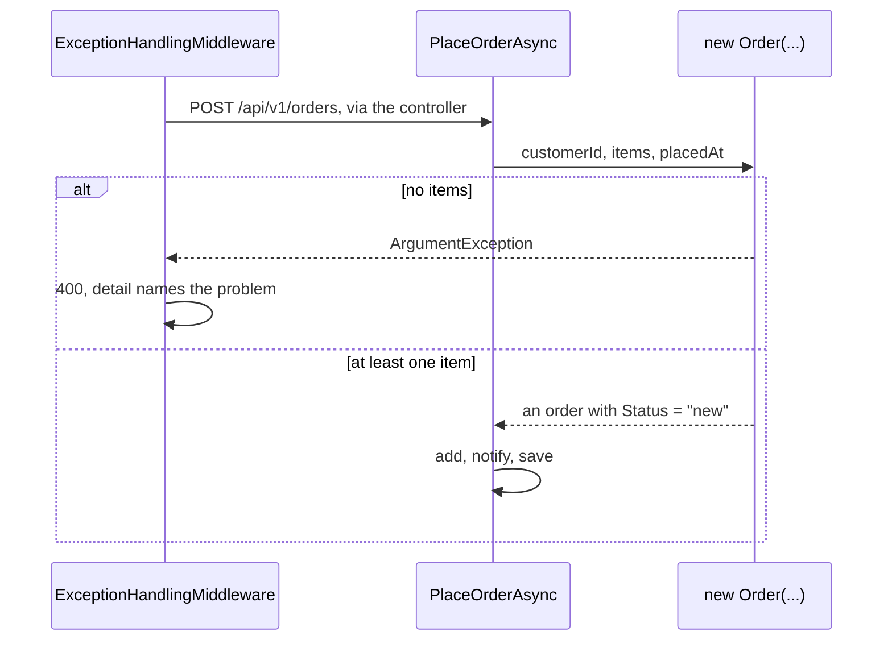

## Before you start

- [[design.l2.status-changes-through-methods]] — you know `Status` has a private setter at stage-2, and every change after creation goes through a method of `Order`.
- [[backend.l1.validating-input]] — you know `POST /api/v1/orders` with an empty item list answers `400`, with a `detail` naming the problem.

## The situation

At stage-1, a test in `OrderServiceTests` seeded its data with `new Order { Id = 1, CustomerId = 1, PlacedAt = DateTimeOffset.UtcNow, Status = "new" }`. That order has no items, which the business forbids, and it compiled without complaint: the empty-items check lived in `PlaceOrderAsync`, and the test never went through it. At stage-2 the same line no longer compiles. The test now writes `new Order(customerId: 1, OneItem(), DateTimeOffset.UtcNow) { Id = 1 }`, where `OneItem()` is a test helper returning one item and `Id` still has a public setter. What does that constructor guarantee, and does the API still answer the same when a client sends an empty order?

## Core concepts

- public constructor of `Order` — `Order(int customerId, List<OrderItem> items, DateTimeOffset placedAt)`, the one way code outside `Order` can create a new order at stage-2.
- a check in a constructor — a test of the inputs that runs before `new` hands the object to the caller, so a failing input means the caller never gets an order.
- an allowed starting state — the state every new order must begin in: at least one item, and the status `new`.

## How it works



In the situation above, the stage-1 line fails because `CustomerId`, `PlacedAt` and `Status` have private setters, and `Order`'s other constructor is private, so outside code can call only the public one. It throws `ArgumentException` when there are no items, and it sets `Status` to `new` itself. It also refuses an item whose quantity is below 1, so quantity 0, which answered `500` at stage-1, now takes the same path to `400`.

`PlaceOrderAsync` now calls that constructor instead of setting every property in an object initializer. It still uses an initializer for one property, `IdempotencyKey`, which has an `init` accessor and no rule about it. The empty-items check therefore moved from `OrderService` into `Order`, and no code outside `Order` can create an order that starts without items: the check is not a step a caller may skip, it is the only way in. A caller needs no copy of the check; a copy is one more place to keep in step with `Order`.

A request passes through `ExceptionHandlingMiddleware`, then the controller, before it reaches `PlaceOrderAsync`. On the diagram's first branch, the constructor throws before `PlaceOrderAsync` has an order to add, so nothing is added or saved. The exception travels up to `ExceptionHandlingMiddleware`, which already catches `ArgumentException` and answers `400` with the message as `detail`. Moving the check did not change the contract: a client placing a new order with no items sees the same `400` as before.

The second branch is the payoff: `PlaceOrderAsync` adds the order, queues the notification and saves, as before, and every new order the code places starts with items and the status `new`. `Cancel()`, `Ship()` and `MarkPaid()` therefore check the status alone, never whether the order was built correctly.

## In the Đơn Hàng system

The constructor, inside `Order`:

```csharp file=DonHang.Domain/Entities.cs tag=stage-2 lines=60-70
    // lesson: design.l2.valid-from-construction
    public Order(int customerId, List<OrderItem> items, DateTimeOffset placedAt)
    {
        if (items.Count == 0) throw new ArgumentException("an order needs at least one item");
        if (items.Any(item => item.Quantity < 1)) throw new ArgumentException("every item needs a quantity of at least 1");

        CustomerId = customerId;
        Items = items;
        PlacedAt = placedAt;
        Status = "new";
    }
```

The checks come first, the assignments after. The message of the first check is word for word the one `PlaceOrderAsync` threw at stage-1, so the `detail` a client reads did not change either. `Status = "new"` is no longer something a caller has to remember: the constructor decides it.

The use case that calls it:

```csharp file=DonHang.Domain/OrderService.cs tag=stage-2 lines=15-34
    public async Task<(Order Order, bool Created)> PlaceOrderAsync(int customerId, List<OrderItem> items, string? idempotencyKey = null)
    {
        if (idempotencyKey is not null)
        {
            var earlier = await repository.FindByIdempotencyKeyAsync(idempotencyKey);
            if (earlier is not null && earlier.CustomerId != customerId)
                throw new ArgumentException("this Idempotency-Key was already used by another customer");
            if (earlier is not null) return (earlier, Created: false);
        }

        var order = new Order(customerId, items, DateTimeOffset.UtcNow) { IdempotencyKey = idempotencyKey };
        await repository.AddAsync(order);

        // lesson: backend.l2.database-job-queue
        // The notifier only adds a pending email job next to the order; this one
        // SaveChangesAsync then writes both in one transaction, or neither.
        notifier.Send(order, "order placed");
        await repository.SaveChangesAsync();
        return (order, Created: true);
    }
```

The method has no `items.Count == 0` line any more. The idempotency-key block at the top is another lesson's topic; what matters here is the `new Order(...)` line, where the constructor does the checking and the initializer sets only `IdempotencyKey`.

## Beginners often think…

- **"A constructor should only copy its parameters into properties; checks belong in methods."** → Actually a check in a method runs only when someone calls that method, so an order without items would exist, and could be saved, until then. A check in the constructor runs before `new` hands the object to anyone. You notice the difference at stage-1, where a test seeded an order with no items and nothing complained.
- **"Moving the empty-items check into `Order` makes the API answer `500` for an empty order."** → Actually the middleware matches the exception's type, not the class that threw it, and the constructor throws the same `ArgumentException` that `PlaceOrderAsync` threw before. You notice this when an empty order still gets `400` with `detail` "an order needs at least one item".

## Try it (3 minutes)

In the root folder of the example repository, in Git Bash:

1. Run `git grep -n "an order needs at least one item" stage-1 stage-2 -- "DonHang.*/*.cs"` to find the empty-items check at both tags.
2. Run `git grep -n "new Order(" stage-2 -- "DonHang.Domain/*.cs" "DonHang.Api/*.cs"` to find where the application code creates an order at stage-2.

Expected result: the first command prints two lines. At `stage-1` the check is in `OrderService.cs`, line 10; at `stage-2` it is in `Entities.cs`, line 63, inside the constructor. The second command prints one line, `OrderService.cs` line 25: `PlaceOrderAsync` is the one place the application creates an order, and it goes through the constructor.

## Connections

- [[design.l2.status-changes-through-methods]] — the step before: methods guard every change after creation; this lesson guards the moment of creation.
- [[backend.l1.validating-input]] — the check this lesson moves: same message, same `400`, now inside `Order`.
- [[design.l2.builder-pattern]] — a contrast: that lesson found an object initializer enough for `Order`; at stage-2 a constructor with checks replaces most of it.
- [[design.l2.ef-core-and-private-setters]] — the next lesson: how the ORM creates an `Order` when it loads a row.
- [[design.l2.domain-model]] — the same idea applied to creation: the rule about an order's items lives in `Order`.

## Five-line summary

1. At stage-2 `Order`'s public constructor takes customer id, items and time placed, refuses an empty list with `ArgumentException`, and sets `Status` to `new`.
2. `PlaceOrderAsync` calls it instead of setting every property in an initializer, so the empty-items check moved from `OrderService` into `Order`.
3. No code outside `Order` can create an order that starts without items; the check is the only way in, not a step to remember.
4. The API still answers `400` for an empty order, because `ExceptionHandlingMiddleware` already maps `ArgumentException` to `400`.
5. Every new order starts in an allowed state, so later methods need not ask whether it was built correctly.
