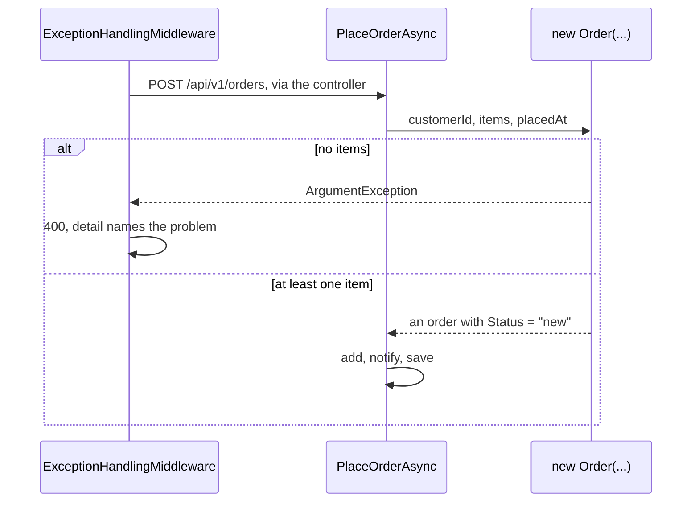

## Bạn cần biết trước

- [[design.l2.status-changes-through-methods]] — bạn biết ở stage-2 `Status` có setter private, và mọi lần đổi sau khi tạo đều đi qua một method của `Order`.
- [[backend.l1.validating-input]] — bạn biết `POST /api/v1/orders` với danh sách hàng rỗng trả `400`, kèm `detail` nói rõ vấn đề.

## Tình huống

Ở stage-1, một test trong `OrderServiceTests` tạo dữ liệu sẵn bằng `new Order { Id = 1, CustomerId = 1, PlacedAt = DateTimeOffset.UtcNow, Status = "new" }`. Đơn đó không có món hàng nào, điều nghiệp vụ cấm, vậy mà vẫn biên dịch êm: bước kiểm tra danh sách rỗng nằm trong `PlaceOrderAsync`, và test không hề đi qua nó. Ở stage-2, chính dòng đó không biên dịch được nữa. Test giờ viết `new Order(customerId: 1, OneItem(), DateTimeOffset.UtcNow) { Id = 1 }`, trong đó `OneItem()` là helper của test trả về một món hàng, còn `Id` vẫn có setter public. Constructor đó bảo đảm điều gì, và API có còn trả lời như cũ khi client gửi một đơn rỗng không?

## Khái niệm cốt lõi

- constructor public của `Order` — `Order(int customerId, List<OrderItem> items, DateTimeOffset placedAt)`, cách duy nhất để code bên ngoài `Order` tạo một đơn mới ở stage-2.
- bước kiểm tra trong constructor — phép thử đầu vào chạy trước khi `new` trao object cho bên gọi, nên đầu vào sai nghĩa là bên gọi không bao giờ nhận được đơn nào.
- trạng thái ban đầu hợp lệ — trạng thái mà mọi đơn mới phải có lúc bắt đầu: ít nhất một món hàng, và trạng thái `new`.

## Cơ chế hoạt động



Trong tình huống trên, dòng của stage-1 lỗi vì `CustomerId`, `PlacedAt` và `Status` có setter private, và constructor còn lại của `Order` là private, nên code bên ngoài chỉ gọi được constructor public. Nó ném `ArgumentException` khi không có món hàng nào, và tự đặt `Status` thành `new`. Nó cũng từ chối món hàng có số lượng dưới 1, nên số lượng 0, thứ từng trả `500` ở stage-1, giờ đi cùng đường tới `400`.

Giờ `PlaceOrderAsync` gọi constructor đó thay vì gán mọi property trong một object initializer. Nó vẫn dùng initializer cho đúng một property, `IdempotencyKey`, property có accessor `init` và không có quy tắc nào. Vì vậy bước kiểm tra danh sách rỗng đã chuyển từ `OrderService` vào `Order`, và không code nào bên ngoài `Order` tạo được một đơn bắt đầu mà không có hàng: bước kiểm tra không phải một bước bên gọi có thể bỏ qua, nó là lối vào duy nhất. Bên gọi không cần bản sao của bước kiểm tra; mỗi bản sao là thêm một chỗ phải giữ đồng bộ với `Order`.

Một request đi qua `ExceptionHandlingMiddleware`, rồi tới controller, trước khi tới `PlaceOrderAsync`. Ở nhánh thứ nhất của sơ đồ, constructor ném exception trước khi `PlaceOrderAsync` có đơn nào để thêm, nên không có gì được thêm hay lưu. Exception đi ngược lên `ExceptionHandlingMiddleware`, nơi vốn đã bắt `ArgumentException` và trả `400` với message làm `detail`. Chuyển bước kiểm tra không làm đổi hợp đồng: client đặt một đơn mới không có hàng vẫn nhận đúng `400` như trước.

Nhánh thứ hai là phần được lợi: `PlaceOrderAsync` thêm đơn, xếp thông báo vào hàng chờ rồi lưu, như trước, và mọi đơn mới mà code đặt đều bắt đầu với hàng và trạng thái `new`. Vì vậy `Cancel()`, `Ship()` và `MarkPaid()` chỉ kiểm tra trạng thái, không bao giờ phải hỏi đơn có được tạo đúng hay không.

## Trong hệ thống Đơn Hàng

Constructor, nằm trong `Order`:

```csharp file=DonHang.Domain/Entities.cs tag=stage-2 lines=60-70
    // lesson: design.l2.valid-from-construction
    public Order(int customerId, List<OrderItem> items, DateTimeOffset placedAt)
    {
        if (items.Count == 0) throw new ArgumentException("an order needs at least one item");
        if (items.Any(item => item.Quantity < 1)) throw new ArgumentException("every item needs a quantity of at least 1");

        CustomerId = customerId;
        Items = items;
        PlacedAt = placedAt;
        Status = "new";
    }
```

Kiểm tra trước, gán sau. Message của bước kiểm tra đầu tiên giống từng chữ với message `PlaceOrderAsync` từng ném ở stage-1, nên `detail` mà client đọc cũng không đổi. `Status = "new"` không còn là thứ bên gọi phải nhớ: constructor tự quyết.

Use case gọi nó:

```csharp file=DonHang.Domain/OrderService.cs tag=stage-2 lines=15-34
    public async Task<(Order Order, bool Created)> PlaceOrderAsync(int customerId, List<OrderItem> items, string? idempotencyKey = null)
    {
        if (idempotencyKey is not null)
        {
            var earlier = await repository.FindByIdempotencyKeyAsync(idempotencyKey);
            if (earlier is not null && earlier.CustomerId != customerId)
                throw new ArgumentException("this Idempotency-Key was already used by another customer");
            if (earlier is not null) return (earlier, Created: false);
        }

        var order = new Order(customerId, items, DateTimeOffset.UtcNow) { IdempotencyKey = idempotencyKey };
        await repository.AddAsync(order);

        // lesson: backend.l2.database-job-queue
        // The notifier only adds a pending email job next to the order; this one
        // SaveChangesAsync then writes both in one transaction, or neither.
        notifier.Send(order, "order placed");
        await repository.SaveChangesAsync();
        return (order, Created: true);
    }
```

Method không còn dòng `items.Count == 0` nào. Khối idempotency key ở đầu là chủ đề của bài khác; điều cần nhìn ở đây là dòng `new Order(...)`, nơi constructor lo việc kiểm tra còn initializer chỉ gán `IdempotencyKey`.

## Người mới hay nghĩ rằng…

- **"Constructor chỉ nên chép tham số vào property; kiểm tra là việc của method."** → Thực ra bước kiểm tra trong method chỉ chạy khi có người gọi method đó, nên một đơn không có hàng sẽ tồn tại, và có thể bị lưu, cho tới lúc ấy. Bước kiểm tra trong constructor chạy trước khi `new` trao object cho bất kỳ ai. Bạn sẽ thấy khác biệt ở stage-1, khi một test tạo sẵn một đơn không có hàng mà không gì phàn nàn.
- **"Chuyển bước kiểm tra danh sách rỗng vào `Order` khiến API trả `500` cho đơn rỗng."** → Thực ra middleware so kiểu của exception, không so class đã ném nó, và constructor ném đúng `ArgumentException` mà `PlaceOrderAsync` từng ném. Bạn sẽ nhận ra khi một đơn rỗng vẫn nhận `400` với `detail` "an order needs at least one item".

## Thử ngay (3 phút)

Trong thư mục gốc của repo ví dụ, dùng Git Bash:

1. Chạy `git grep -n "an order needs at least one item" stage-1 stage-2 -- "DonHang.*/*.cs"` để tìm bước kiểm tra danh sách rỗng ở cả hai tag.
2. Chạy `git grep -n "new Order(" stage-2 -- "DonHang.Domain/*.cs" "DonHang.Api/*.cs"` để tìm nơi code của ứng dụng tạo đơn ở stage-2.

Kết quả mong đợi: lệnh đầu in hai dòng. Ở `stage-1` bước kiểm tra nằm trong `OrderService.cs`, dòng 10; ở `stage-2` nó nằm trong `Entities.cs`, dòng 63, bên trong constructor. Lệnh thứ hai in một dòng, `OrderService.cs` dòng 25: `PlaceOrderAsync` là nơi duy nhất ứng dụng tạo đơn, và nó đi qua constructor.

## Liên hệ

- [[design.l2.status-changes-through-methods]] — bước trước đó: các method canh mọi lần đổi sau khi tạo; bài này canh chính khoảnh khắc tạo ra đơn.
- [[backend.l1.validating-input]] — bước kiểm tra mà bài này chuyển chỗ: cùng message, cùng `400`, giờ nằm trong `Order`.
- [[design.l2.builder-pattern]] — một phép so sánh: bài đó thấy object initializer là đủ cho `Order`; ở stage-2 một constructor có kiểm tra thay phần lớn initializer ấy.
- [[design.l2.ef-core-and-private-setters]] — bài tiếp theo: ORM tạo một `Order` thế nào khi tải một dòng lên.
- [[design.l2.domain-model]] — cùng ý tưởng áp dụng cho lúc tạo: quy tắc về hàng của một đơn nằm trong `Order`.

## Tóm tắt 5 dòng

1. Ở stage-2, constructor public của `Order` nhận customer id, danh sách hàng và thời điểm đặt, từ chối danh sách rỗng bằng `ArgumentException`, và đặt `Status` thành `new`.
2. `PlaceOrderAsync` gọi nó thay vì gán mọi property trong initializer, nên bước kiểm tra danh sách rỗng đã chuyển từ `OrderService` vào `Order`.
3. Không code nào bên ngoài `Order` tạo được một đơn bắt đầu mà không có hàng; bước kiểm tra là lối vào duy nhất, không phải một bước phải nhớ.
4. API vẫn trả `400` cho đơn rỗng, vì `ExceptionHandlingMiddleware` vốn đã map `ArgumentException` sang `400`.
5. Mọi đơn mới đều bắt đầu ở trạng thái hợp lệ, nên các method sau không cần hỏi đơn có được tạo đúng hay không.
