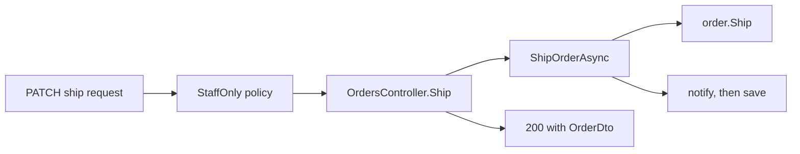

## Before you start

- [[design.l2.testing-the-entity]] — you know a rule inside `Order` is tested by creating an `Order` and calling its methods, with no fake.
- [[backend.l2.resource-based-authorization]] — you know `OrderOwnerHandler` lets in staff or the customer whose id matches the order's `CustomerId`, and the endpoint must load the order before it can ask.
- [[design.l2.composition-root]] — you know `ProductsController.List` reads `DonHangDbContext` directly, and that this shortcut suits an endpoint that only reads rows.

## The situation

A teammate reviews the ship feature at stage-2 and counts what one `PATCH /api/v1/orders/{id}/ship` request must get past. The caller needs the `staff` role, the order must exist and be `paid`, a notification must be queued and the change saved, and the client must get `200` with the order, or `409` when shipping is refused. Those checks and steps are spread over `OrdersController`, `OrderService` and `Order`. The teammate asks: "Why not put all of it in `Order.Ship()`, so every rule is in one place?" Where does each of these belong, and how do you decide for the next rule someone adds?

## Core concepts

- rule about one order's own data — a rule that can be decided from the fields of a single `Order` and nothing else, such as which status may follow which.
- step of the use case — work that reaches outside the order, such as loading it, saving it or sending a notification.
- access check — a decision about who may act, made from the caller's token and sometimes from the order being asked about.
- translation to and from HTTP — turning a request into a method call, and a result or exception back into a response.

## How it works



Follow the ship request in the diagram, left to right, and ask of each check what it needs to know.

"The caller needs the `staff` role" is an access check, decided in `DonHang.Api`. `StaffOnly` is a policy: a named access rule, registered in `Program.cs`, that ASP.NET Core checks before `OrdersController.Ship` is even called. A customer is refused before `OrderService` changes anything.

`OrdersController.Ship` then translates: the route becomes a call to `ShipOrderAsync`, and later the result becomes `200` through `Ok(ToDto(order))`.

`ShipOrderAsync` finds the order, then notifies and saves. These reach outside the order, so they are steps of the use case and stay in `OrderService`. Between finding and notifying, it asks `order.Ship()` for the decision instead of making it.

"The order must be `paid`" needs only the order's own `Status`, so it is a rule about one order's own data and belongs in `Order`. `Ship()` refuses anything else by throwing `OrderStatusException`, which `ExceptionHandlingMiddleware`, not the controller, turns into `409`. The empty-items check in the constructor, which `PlaceOrderAsync` calls, is the same kind of rule.

Cancelling uses a different access check, `OrderOwnerHandler`. The controller loads a read-only copy of the order only so `OrderOwnerHandler` can see it, then calls `CancelOrderAsync`, where `Order.Cancel()` still decides. The handler reads `CustomerId`, but also needs the caller's token and a repository lookup of the caller, and `Order` has neither.

A controller that writes `if (order.Status == "shipped")` has taken a rule out of `Order`. And where no rule exists, extra methods buy nothing: listing products stays a direct query in `ProductsController.List`.

## In the Đơn Hàng system

The ship endpoint, in `OrdersController`:

```csharp file=DonHang.Api/Controllers/OrdersController.cs tag=stage-2 lines=86-97
    // lesson: design.l2.status-changes-through-methods
    // lesson: backend.l2.role-based-access
    // The endpoint decides who may ship: the StaffOnly policy lets in only a
    // token whose roles include "staff" (403 for a customer, 401 with no
    // token). Order.Ship() decides whether this order can be shipped.
    [Authorize(Policy = "StaffOnly")]
    [HttpPatch("{id:int}/ship")]
    public async Task<ActionResult<OrderDto>> Ship(int id)
    {
        var order = await orderService.ShipOrderAsync(id);
        return Ok(ToDto(order));
    }
```

The method body is two lines: one call, one response. The attribute answers "who", `Order.Ship()` answers "whether", and the comment says so in words. Nothing in the controller checks `Status`: it only copies it into the `OrderDto`.

The owner check, in `DonHang.Api`:

```csharp file=DonHang.Api/Authorization/OrderOwnerHandler.cs tag=stage-2 lines=13-35
// lesson: backend.l2.resource-based-authorization
// Every customer has the same role, so a role cannot say whose order this is.
// The rule needs the order itself: its owner, or anyone with the staff role.
public sealed class OrderOwnerHandler(ICustomerRepository customers)
    : AuthorizationHandler<OrderOwnerRequirement, Order>
{
    protected override async Task HandleRequirementAsync(
        AuthorizationHandlerContext context, OrderOwnerRequirement requirement, Order order)
    {
        if (context.User.IsInRole("staff"))
        {
            context.Succeed(requirement);
            return;
        }

        var subject = context.User.FindFirstValue("sub");
        var caller = subject is null ? null : await customers.FindByIdentitySubjectAsync(subject);
        if (caller is not null && caller.Id == order.CustomerId)
        {
            context.Succeed(requirement);
        }
    }
}
```

This rule does look at an `Order`, yet it lives in `DonHang.Api`. Its inputs are `context.User`, the caller from the token, and `customers`, a repository. `Order` has neither, so the rule is about the caller and the order together, not about the order alone.

## Beginners often think…

- **"Checking whether the caller is staff is a business rule, so it belongs in `Order`."** → Actually `Order` never sees the request: `Ship()` takes no parameters, and the role arrives in the caller's token, which `DonHang.Api` reads. Moving the check in would mean passing the caller into `Order`. You notice this when a test of a status rule in `OrderTests` would suddenly need a made-up user with a role.
- **"Once there is a domain model, every class in `DonHang.Domain`, including `Product` and `Payment`, must get methods too."** → Actually methods pay off when a class has rules about its data that several use cases must respect. At stage-2 no endpoint writes a `Payment`, and listing products applies no rule, so neither gives a method anything to decide. You notice this when the method you are about to add has no `if` in it.

## Try it (3 minutes)

In the root folder of the example repository, in Git Bash:

1. Run `git grep -n "Status ==\|Status !=" stage-2 -- "DonHang.*/*.cs"` to find every line that checks an order's status.
2. Run `git grep -n -e IsInRole -e RequireRole -e "Policy = \"StaffOnly\"" stage-2 -- "DonHang.*/*.cs"` to find every line that checks the `staff` role.

Expected result: the first command prints seven lines, all in `DonHang.Domain/Entities.cs`, inside `MarkPaid()`, `Cancel()` and `Ship()`. The second prints four lines, all in `DonHang.Api`: `OrderOwnerHandler.cs`, the two `[Authorize(Policy = "StaffOnly")]` lines in `OrdersController.cs` (shipping) and `ProductsController.cs` (changing a product's price), and the policy itself in `Program.cs`. Status rules sit only in `Order`; access checks sit only in `DonHang.Api`.

## Connections

- [[design.l2.testing-the-entity]] — the payoff of this placement: a rule in `Order` is tested with no fake, and an access check is tested elsewhere.
- [[backend.l2.resource-based-authorization]] — the access check this lesson keeps in `DonHang.Api`, even though it reads an order.
- [[design.l2.composition-root]] — the other end of the scale: an endpoint with no rule may skip the core entirely.
- [[design.l2.domain-model]] — the first rule this module moved into `Order`; this lesson is the rule for moving the next one.
- [[design.l3.aggregates-and-invariants]] — a later lesson that asks the same question for rules spanning several related classes.

## Five-line summary

1. Each rule goes where the data it needs lives: one order's own data in `Order`, anything wider outside it.
2. `OrderService` loads, notifies and saves, and asks `Order` for each decision instead of making it.
3. Who may act is decided in `DonHang.Api`, by the `StaffOnly` policy and `OrderOwnerHandler`, before `OrderService` changes anything.
4. `OrdersController` translates between HTTP and calls and asks for access checks, but decides no status change; a status check there misplaces a rule.
5. A domain model is worth its methods where rules exist; an operation with no rule, like listing products, stays a direct query.
