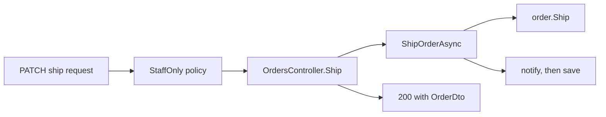

## Bạn cần biết trước

- [[design.l2.testing-the-entity]] — bạn biết quy tắc nằm trong `Order` được test bằng cách tạo một `Order` rồi gọi các method của nó, không cần fake.
- [[backend.l2.resource-based-authorization]] — bạn biết `OrderOwnerHandler` cho qua nhân viên hoặc khách có id khớp với `CustomerId` của đơn, và endpoint phải tải đơn lên trước thì mới hỏi được.
- [[design.l2.composition-root]] — bạn biết `ProductsController.List` đọc thẳng `DonHangDbContext`, và lối tắt này hợp với endpoint chỉ đọc dữ liệu.

## Tình huống

Một đồng đội review tính năng giao hàng ở stage-2 và đếm xem một request `PATCH /api/v1/orders/{id}/ship` phải vượt qua những gì. Người gọi cần role `staff`, đơn phải tồn tại và đang `paid`, một thông báo phải được xếp hàng chờ và thay đổi phải được lưu, còn client phải nhận `200` kèm đơn, hoặc `409` khi việc giao bị từ chối. Các kiểm tra và bước đó nằm rải ở `OrdersController`, `OrderService` và `Order`. Đồng đội hỏi: "Sao không dồn hết vào `Order.Ship()` cho mọi quy tắc nằm một chỗ?" Mỗi thứ trên nên nằm ở đâu, và bạn quyết định thế nào cho quy tắc tiếp theo có người thêm vào?

## Khái niệm cốt lõi

- quy tắc về dữ liệu của chính một đơn — quy tắc quyết định được chỉ từ các field của một `Order` duy nhất, ví dụ trạng thái nào được theo sau trạng thái nào.
- bước của use case — việc với ra ngoài đơn hàng, như tải đơn, lưu đơn hay gửi thông báo.
- kiểm tra quyền truy cập — quyết định ai được làm gì, dựa trên token của người gọi và đôi khi dựa trên chính đơn đang được hỏi tới.
- chuyển đổi qua lại với HTTP — biến một request thành một lời gọi method, và biến kết quả hay exception ngược lại thành response.

## Cơ chế hoạt động



Hãy đi theo request giao hàng trong sơ đồ, từ trái sang phải, và với mỗi kiểm tra, hỏi xem nó cần biết những gì.

"Người gọi cần role `staff`" là một kiểm tra quyền truy cập, được quyết định trong `DonHang.Api`. `StaffOnly` là một policy: một quy tắc truy cập có tên, đăng ký trong `Program.cs`, được ASP.NET Core kiểm tra trước cả khi `OrdersController.Ship` được gọi. Một khách hàng bị từ chối trước khi `OrderService` kịp đổi bất cứ thứ gì.

Tiếp đó `OrdersController.Ship` làm việc chuyển đổi: route trở thành một lời gọi `ShipOrderAsync`, và sau đó kết quả trở thành `200` qua `Ok(ToDto(order))`.

`ShipOrderAsync` tìm đơn, rồi gửi thông báo và lưu. Những việc này với ra ngoài đơn hàng, nên chúng là bước của use case và nằm lại trong `OrderService`. Giữa lúc tìm đơn và lúc gửi thông báo, nó hỏi `order.Ship()` để lấy quyết định chứ không tự quyết.

"Đơn phải đang `paid`" chỉ cần `Status` của chính đơn, nên đây là quy tắc về dữ liệu của một đơn và thuộc về `Order`. `Ship()` từ chối mọi trạng thái khác bằng cách ném `OrderStatusException`, và chính `ExceptionHandlingMiddleware`, không phải controller, biến nó thành `409`. Bước kiểm tra danh sách rỗng trong constructor, thứ mà `PlaceOrderAsync` gọi, cũng là loại quy tắc như vậy.

Hủy đơn dùng một kiểm tra quyền truy cập khác, `OrderOwnerHandler`. Controller tải một bản chỉ-đọc của đơn chỉ để `OrderOwnerHandler` nhìn thấy nó, rồi gọi `CancelOrderAsync`, nơi `Order.Cancel()` vẫn là bên quyết định. Handler có đọc `CustomerId`, nhưng còn cần token của người gọi và một lần tra repository để tìm người gọi, mà `Order` thì không có thứ nào trong hai thứ đó.

Controller nào viết `if (order.Status == "shipped")` là đã kéo một quy tắc ra khỏi `Order`. Còn ở chỗ không có quy tắc nào, thêm method chẳng được gì: danh sách sản phẩm vẫn là một truy vấn thẳng trong `ProductsController.List`.

## Trong hệ thống Đơn Hàng

Endpoint giao hàng, trong `OrdersController`:

```csharp file=DonHang.Api/Controllers/OrdersController.cs tag=stage-2 lines=86-97
    // lesson: design.l2.status-changes-through-methods
    // lesson: backend.l2.role-based-access
    // The endpoint decides who may ship: the StaffOnly policy lets in only a
    // token whose roles include "staff" (403 for a customer, 401 with no
    // token). Order.Ship() decides whether this order can be shipped.
    [Authorize(Policy = "StaffOnly")]
    [HttpPatch("{id:int}/ship")]
    public async Task<ActionResult<OrderDto>> Ship(int id)
    {
        var order = await orderService.ShipOrderAsync(id);
        return Ok(ToDto(order));
    }
```

Thân method có hai dòng: một lời gọi, một response. Attribute trả lời câu "ai", `Order.Ship()` trả lời câu "có được không", và comment nói đúng điều đó bằng lời. Không chỗ nào trong controller kiểm tra `Status`: nó chỉ chép giá trị đó vào `OrderDto`.

Kiểm tra chủ đơn, trong `DonHang.Api`:

```csharp file=DonHang.Api/Authorization/OrderOwnerHandler.cs tag=stage-2 lines=13-35
// lesson: backend.l2.resource-based-authorization
// Every customer has the same role, so a role cannot say whose order this is.
// The rule needs the order itself: its owner, or anyone with the staff role.
public sealed class OrderOwnerHandler(ICustomerRepository customers)
    : AuthorizationHandler<OrderOwnerRequirement, Order>
{
    protected override async Task HandleRequirementAsync(
        AuthorizationHandlerContext context, OrderOwnerRequirement requirement, Order order)
    {
        if (context.User.IsInRole("staff"))
        {
            context.Succeed(requirement);
            return;
        }

        var subject = context.User.FindFirstValue("sub");
        var caller = subject is null ? null : await customers.FindByIdentitySubjectAsync(subject);
        if (caller is not null && caller.Id == order.CustomerId)
        {
            context.Succeed(requirement);
        }
    }
}
```

Quy tắc này có nhìn vào một `Order`, vậy mà lại nằm trong `DonHang.Api`. Đầu vào của nó là `context.User`, tức người gọi lấy từ token, và `customers`, một repository. `Order` không có thứ nào trong hai thứ đó, nên đây là quy tắc về người gọi và đơn cùng lúc, không phải về riêng đơn.

## Người mới hay nghĩ rằng…

- **"Kiểm tra người gọi có phải nhân viên không là quy tắc nghiệp vụ, nên nó thuộc về `Order`."** → Thực ra `Order` không bao giờ thấy request: `Ship()` không nhận tham số nào, còn role đi theo token của người gọi, thứ mà `DonHang.Api` đọc. Chuyển bước kiểm tra vào trong nghĩa là phải truyền người gọi vào `Order`. Bạn sẽ nhận ra khi một test quy tắc trạng thái trong `OrderTests` bỗng cần một user bịa ra kèm role.
- **"Đã có domain model thì mọi class trong `DonHang.Domain`, kể cả `Product` và `Payment`, đều phải có method."** → Thực ra method chỉ đáng giá khi class có quy tắc về dữ liệu của nó mà nhiều use case phải tuân theo. Ở stage-2 không endpoint nào ghi `Payment`, và việc liệt kê sản phẩm không áp quy tắc nào, nên cả hai đều không cho method nào điều gì để quyết định. Bạn sẽ nhận ra khi method bạn sắp thêm không có câu `if` nào.

## Thử ngay (3 phút)

Trong thư mục gốc của repo ví dụ, dùng Git Bash:

1. Chạy `git grep -n "Status ==\|Status !=" stage-2 -- "DonHang.*/*.cs"` để tìm mọi dòng kiểm tra trạng thái của đơn.
2. Chạy `git grep -n -e IsInRole -e RequireRole -e "Policy = \"StaffOnly\"" stage-2 -- "DonHang.*/*.cs"` để tìm mọi dòng kiểm tra role `staff`.

Kết quả mong đợi: lệnh đầu in bảy dòng, tất cả trong `DonHang.Domain/Entities.cs`, bên trong `MarkPaid()`, `Cancel()` và `Ship()`. Lệnh thứ hai in bốn dòng, tất cả trong `DonHang.Api`: `OrderOwnerHandler.cs`, hai dòng `[Authorize(Policy = "StaffOnly")]` trong `OrdersController.cs` (giao hàng) và `ProductsController.cs` (đổi giá sản phẩm), cùng chính policy đó trong `Program.cs`. Quy tắc trạng thái chỉ nằm trong `Order`, còn kiểm tra quyền truy cập chỉ nằm trong `DonHang.Api`.

## Liên hệ

- [[design.l2.testing-the-entity]] — cái lợi của cách đặt này: quy tắc trong `Order` được test không cần fake, còn kiểm tra quyền truy cập được test ở chỗ khác.
- [[backend.l2.resource-based-authorization]] — kiểm tra quyền truy cập mà bài này giữ trong `DonHang.Api`, dù nó có đọc một đơn.
- [[design.l2.composition-root]] — đầu kia của thang đo: endpoint không có quy tắc nào có thể bỏ qua phần lõi hoàn toàn.
- [[design.l2.domain-model]] — quy tắc đầu tiên mà module này chuyển vào `Order`, còn bài này là cách chọn chỗ cho quy tắc tiếp theo.
- [[design.l3.aggregates-and-invariants]] — một bài sau đặt lại cùng câu hỏi cho những quy tắc trải qua nhiều class liên quan với nhau.

## Tóm tắt 5 dòng

1. Mỗi quy tắc nằm ở nơi có dữ liệu nó cần: dữ liệu của chính một đơn thì ở `Order`, rộng hơn thế thì ở bên ngoài.
2. `OrderService` tải, gửi thông báo và lưu, và hỏi `Order` cho từng quyết định thay vì tự quyết.
3. Ai được làm gì do `DonHang.Api` quyết định, qua policy `StaffOnly` và `OrderOwnerHandler`, trước khi `OrderService` đổi bất cứ thứ gì.
4. `OrdersController` chuyển đổi giữa HTTP và lời gọi, có nhờ kiểm tra quyền truy cập, nhưng không quyết định đổi trạng thái nào, kiểm tra trạng thái đặt ở đó là đặt sai chỗ.
5. Domain model đáng thêm method ở nơi có quy tắc, còn thao tác không có quy tắc nào, như liệt kê sản phẩm, vẫn là một truy vấn thẳng.
