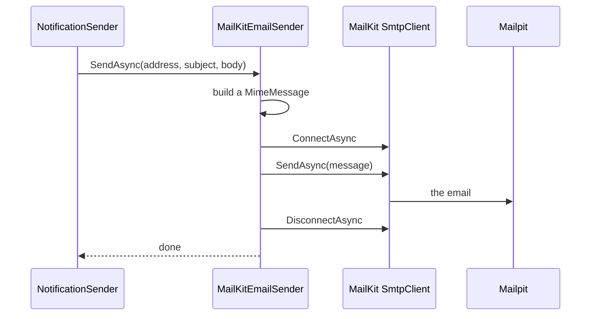

## Before you start

- [[design.l2.decorator-pattern]] — you know a class can wrap another object behind the same interface and add one job around each call.
- [[backend.l2.retry-with-backoff]] — you know `NotificationSender` retries a failed email later, waiting longer after each failure.

## The situation

Every order email leaves Đơn Hàng from `NotificationSender`, the background job that claims pending rows and retries failures. The sending itself is done by MailKit, a library with its own vocabulary: an `SmtpClient` that you connect, send through and disconnect, and a `MimeMessage` for it to send, with sender, recipient and body parts, a type from MimeKit, the library MailKit is built on. If the job built those objects itself, MailKit details would sit right beside the retry logic, and another mail library would mean rewriting the job. Yet all the job wants to say is "send this text to this address". How can the job speak in its own words while MailKit still does the sending?

## Core concepts

- **Adapter pattern** — a class placed between your code and a library whose interface does not match what your code wants; it implements your interface and translates each call into the library's calls.
- target interface — the interface written in your code's own words, which the adapter implements; in the situation above, `IEmailSender`.
- adapter — the class that does the translating; here, `MailKitEmailSender`.

## How it works



`NotificationSender` holds an `IEmailSender` and makes one call: `SendAsync` with an address, a subject and a body. In the situation above, that interface is the target interface, and the object behind it is the adapter, `MailKitEmailSender`. The adapter turns the three strings into what MailKit expects: a `MimeMessage` with a sender, a recipient, a subject and a plain-text body. Then it connects MailKit's `SmtpClient` to the mail server, which is Mailpit, the fake mail server that the example system runs in Docker, sends the message, disconnects and returns to the job. The job sees one call; MailKit sees its own sequence of calls.

Compare this with the decorator from the previous lesson. `ProductCache` is an `IProductRepository` wrapped around another `IProductRepository`: the interface stays the same, and the decorator adds a job, a copy in Redis. `MailKitEmailSender` is an `IEmailSender` in front of an `SmtpClient`, which has quite different methods. The adapter changes the interface and adds no business rule of its own: it decides nothing about which email goes out, when, or how often to retry. Those decisions stay in `NotificationSender`. The adapter only fills in details MailKit needs to do what it is told, such as a sender address and how to connect.

That split is what makes the library replaceable. To move to another mail library, you write another class that implements `IEmailSender` with that library, and register it instead of `MailKitEmailSender`. `NotificationSender`, with its retry and exponential backoff, stays exactly as it is, because it never knew which library was behind the interface.

## In the Đơn Hàng system

The target interface, in `DonHang.Domain`:

```csharp file=DonHang.Domain/IEmailSender.cs tag=stage-2 lines=3-9
// lesson: design.l2.adapter-pattern
// Sending an email in Đơn Hàng's own words: one address, a subject, a body.
// No mail library's types appear here; MailKitEmailSender translates.
public interface IEmailSender
{
    Task SendAsync(string toAddress, string subject, string body, CancellationToken cancellationToken);
}
```

One method, and its parameters are plain strings plus a `CancellationToken`, which lets the caller cancel the send, for example when the app shuts down. In `NotificationSender.cs`, the method `SendOneAsync` takes an `IEmailSender email` and calls `email.SendAsync(customer.Email, ...)`; that file has no `using` for MailKit and names none of its types. `ServiceCollectionExtensions` registers `new MailKitEmailSender(smtp)` as the `IEmailSender`.

The adapter:

```csharp file=DonHang.Infrastructure/MailKitEmailSender.cs tag=stage-2 lines=15-34
// lesson: design.l2.adapter-pattern
// Implements Đơn Hàng's IEmailSender with MailKit: builds a MimeMessage and
// hands it to MailKit's SmtpClient. Only this class knows MailKit exists.
public sealed class MailKitEmailSender(SmtpSettings smtp) : IEmailSender
{
    public async Task SendAsync(string toAddress, string subject, string body, CancellationToken cancellationToken)
    {
        var message = new MimeMessage();
        message.From.Add(new MailboxAddress("Đơn Hàng", "orders@donhang.local"));
        message.To.Add(MailboxAddress.Parse(toAddress));
        message.Subject = subject;
        message.Body = new TextPart("plain") { Text = body };

        using var client = new SmtpClient { Timeout = 10_000 };
        // Mailpit in the lab speaks plain SMTP, without TLS.
        await client.ConnectAsync(smtp.Host, smtp.Port, SecureSocketOptions.None, cancellationToken);
        await client.SendAsync(message, cancellationToken);
        await client.DisconnectAsync(quit: true, cancellationToken);
    }
}
```

`smtp` is an `SmtpSettings`, the mail server's host and port. Read the method as a translation table. `toAddress` becomes a recipient in `message.To`, `subject` becomes `message.Subject`, and `body` becomes a plain-text part. The last three lines are MailKit's own way of sending: connect, send, disconnect, over SMTP, the protocol mail servers use to accept email. Nothing in this method decides whether an email should go out; it only says, in MailKit's terms, what `NotificationSender` already decided.

## Beginners often think…

- **"An adapter and a decorator are the same thing, since both wrap another object."** → Actually a decorator keeps the interface of what it wraps and adds a job, while an adapter offers a different interface from what it wraps and only translates. `ProductCache` could wrap another `ProductCache`, since both are `IProductRepository`; nothing that expects an `SmtpClient` can be handed a `MailKitEmailSender`. You notice the mix-up when one wrapper class both renames a library's methods and adds a rule of its own, and nobody can say which of the two jobs it has.
- **"Wrapping a library in your own interface only pays off if you already plan to switch libraries."** → Actually it pays off at stage-2 with MailKit still in place. The test setup in `DonHang.Tests` replaces the adapter with `FakeEmailSender`, which only records each email, so `NotificationSender` runs in tests without Mailpit. You notice the cost of not wrapping when a test of the job needs a running mail server, or a library update breaks a call inside the job itself.

## Try it (3 minutes)

In the root folder of the example repository, checked out at `stage-2`:

1. Run `git grep -n -e "using MailKit" -e "using MimeKit" -- "*.cs"` to find every C# file that imports MailKit or MimeKit.
2. Run `git grep -n ": IEmailSender" -- "*.cs"` to find every class that implements the target interface.

Expected result: the first command prints three lines, lines 2 to 4 of `DonHang.Infrastructure/MailKitEmailSender.cs`, and nothing else: no other file, `NotificationSender.cs` included, imports MailKit or MimeKit. The second prints two lines: `MailKitEmailSender` in `DonHang.Infrastructure/MailKitEmailSender.cs` and `FakeEmailSender` in `DonHang.Tests/Integration/FakeEmailSender.cs`. Two implementations of one interface, and the job works with either.

## Connections

- [[design.l2.decorator-pattern]] — the look-alike: also a class in front of another object, but it keeps the interface and adds a job.
- [[backend.l2.retry-with-backoff]] — the retry logic that stays untouched when the mail library behind `IEmailSender` changes.
- [[design.l1.solid-isp]] — `IEmailSender` is a small interface shaped by what its one client needs, the kind of interface ISP asks for.
- [[design.l2.ports-and-adapters]] — a later lesson builds a whole architecture on this idea: the business code reaches databases, mail servers and other outside systems only through interfaces of its own.

## Five-line summary

1. An adapter implements the interface your code wants and translates each call into the calls of a library that does not fit it.
2. `NotificationSender` depends on `IEmailSender`, declared in Đơn Hàng's own words: send one email to an address, with a subject and a body.
3. `MailKitEmailSender` builds a `MimeMessage` and sends it through MailKit's `SmtpClient`, so no MailKit type appears in `NotificationSender`.
4. A decorator keeps the interface of what it wraps and adds work; an adapter offers a different interface and decides nothing about what to send.
5. Another mail library means another `IEmailSender` adapter, while `NotificationSender` and its retry with backoff stay unchanged.
