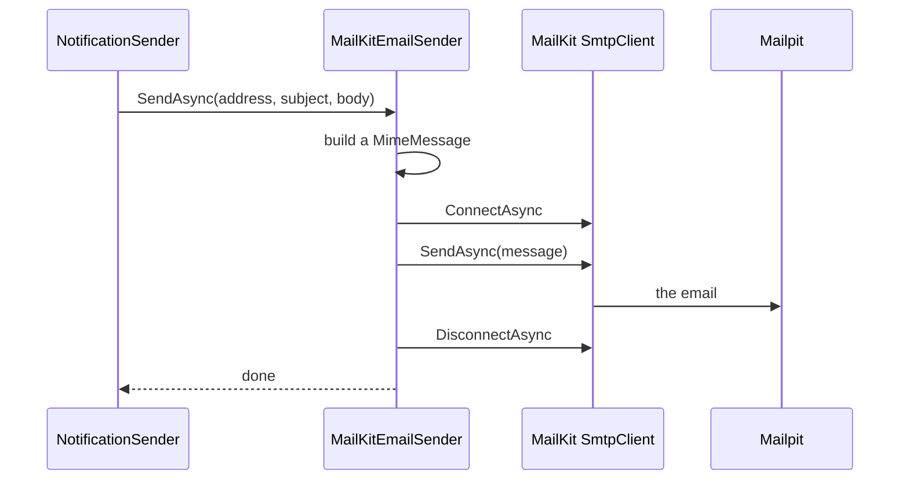

## Bạn cần biết trước

- [[design.l2.decorator-pattern]] — bạn biết một class có thể bọc một đối tượng khác sau cùng một interface và thêm một việc quanh mỗi lời gọi.
- [[backend.l2.retry-with-backoff]] — bạn biết `NotificationSender` gửi lại email thất bại vào lúc sau, và chờ lâu hơn sau mỗi lần thất bại.

## Tình huống

Mọi email về đơn hàng đều rời Đơn Hàng từ `NotificationSender`, background job nhận các dòng đang chờ và thử lại khi gửi lỗi. Phần gửi thật sự do MailKit đảm nhận, một thư viện có từ vựng riêng: một `SmtpClient` mà bạn phải kết nối, gửi qua rồi ngắt kết nối, và một `MimeMessage` để nó gửi, gồm các phần người gửi, người nhận và nội dung. `MimeMessage` là kiểu của MimeKit, thư viện mà MailKit dựa trên. Nếu job tự dựng các đối tượng đó, chi tiết của MailKit sẽ nằm ngay cạnh logic thử lại, và đổi sang thư viện mail khác nghĩa là viết lại job. Trong khi tất cả những gì job muốn nói chỉ là "gửi đoạn chữ này tới địa chỉ này". Làm sao để job nói bằng từ ngữ của chính nó mà MailKit vẫn lo phần gửi?

## Khái niệm cốt lõi

- **Adapter pattern** (class cài đặt interface mà code của bạn cần bằng cách dịch mỗi lời gọi sang interface của thứ khác) — một class đặt giữa code của bạn và một thư viện có interface không khớp với thứ code cần. Nó cài đặt interface của bạn và dịch mỗi lời gọi thành các lời gọi của thư viện.
- target interface — interface viết bằng từ ngữ của chính code bạn, được adapter cài đặt. Trong tình huống trên, đó là `IEmailSender`.
- adapter — class làm việc dịch. Ở đây là `MailKitEmailSender`.

## Cơ chế hoạt động



`NotificationSender` giữ một `IEmailSender` và gọi đúng một lần: `SendAsync` với một địa chỉ, một tiêu đề và một nội dung. Trong tình huống trên, interface đó là target interface, và đối tượng đứng sau nó là adapter, tức `MailKitEmailSender`. Adapter biến ba chuỗi đó thành thứ MailKit cần: một `MimeMessage` có người gửi, người nhận, tiêu đề và phần nội dung dạng chữ thường. Sau đó nó kết nối `SmtpClient` của MailKit tới mail server, ở đây là Mailpit, mail server giả mà hệ thống ví dụ chạy trong Docker, gửi message, ngắt kết nối rồi trả về cho job. Job chỉ thấy một lời gọi, còn MailKit thấy trình tự lời gọi riêng của nó.

So sánh với decorator ở bài trước. `ProductCache` là một `IProductRepository` bọc quanh một `IProductRepository` khác: interface giữ nguyên, và decorator thêm một việc là bản sao trong Redis. `MailKitEmailSender` là một `IEmailSender` đứng trước một `SmtpClient`, thứ có các phương thức khác hẳn. Adapter đổi interface và không thêm quy tắc nghiệp vụ nào của riêng nó: nó không quyết định email nào được gửi, lúc nào, hay thử lại bao nhiêu lần. Những quyết định đó nằm lại trong `NotificationSender`. Adapter chỉ điền các chi tiết MailKit cần để làm đúng việc được giao, như địa chỉ người gửi và cách kết nối.

Chính sự tách bạch đó giúp thay được thư viện. Muốn chuyển sang thư viện mail khác, bạn viết một class khác cài đặt `IEmailSender` bằng thư viện đó, rồi đăng ký nó thay cho `MailKitEmailSender`. `NotificationSender`, cùng phần thử lại và exponential backoff, giữ nguyên hoàn toàn, vì nó chưa bao giờ biết thư viện nào đứng sau interface.

## Trong hệ thống Đơn Hàng

Target interface, nằm trong `DonHang.Domain`:

```csharp file=DonHang.Domain/IEmailSender.cs tag=stage-2 lines=3-9
// lesson: design.l2.adapter-pattern
// Sending an email in Đơn Hàng's own words: one address, a subject, a body.
// No mail library's types appear here; MailKitEmailSender translates.
public interface IEmailSender
{
    Task SendAsync(string toAddress, string subject, string body, CancellationToken cancellationToken);
}
```

Chỉ một phương thức, và các tham số là chuỗi bình thường cộng thêm một `CancellationToken`, thứ cho phép bên gọi hủy lần gửi, chẳng hạn khi app tắt. Trong `NotificationSender.cs`, phương thức `SendOneAsync` nhận một `IEmailSender email` và gọi `email.SendAsync(customer.Email, ...)`. File đó không có `using` nào cho MailKit và không gọi tên kiểu nào của nó. `ServiceCollectionExtensions` đăng ký `new MailKitEmailSender(smtp)` làm `IEmailSender`.

Adapter:

```csharp file=DonHang.Infrastructure/MailKitEmailSender.cs tag=stage-2 lines=15-34
// lesson: design.l2.adapter-pattern
// Implements Đơn Hàng's IEmailSender with MailKit: builds a MimeMessage and
// hands it to MailKit's SmtpClient. Only this class knows MailKit exists.
public sealed class MailKitEmailSender(SmtpSettings smtp) : IEmailSender
{
    public async Task SendAsync(string toAddress, string subject, string body, CancellationToken cancellationToken)
    {
        var message = new MimeMessage();
        message.From.Add(new MailboxAddress("Đơn Hàng", "orders@donhang.local"));
        message.To.Add(MailboxAddress.Parse(toAddress));
        message.Subject = subject;
        message.Body = new TextPart("plain") { Text = body };

        using var client = new SmtpClient { Timeout = 10_000 };
        // Mailpit in the lab speaks plain SMTP, without TLS.
        await client.ConnectAsync(smtp.Host, smtp.Port, SecureSocketOptions.None, cancellationToken);
        await client.SendAsync(message, cancellationToken);
        await client.DisconnectAsync(quit: true, cancellationToken);
    }
}
```

`smtp` là một `SmtpSettings`, gồm host và port của mail server. Hãy đọc phương thức này như một bảng dịch. `toAddress` thành người nhận trong `message.To`, `subject` thành `message.Subject`, còn `body` thành một phần nội dung dạng chữ thường. Ba dòng cuối là cách gửi riêng của MailKit: kết nối, gửi, ngắt kết nối, qua SMTP, giao thức mà mail server dùng để nhận email. Không có gì trong phương thức này quyết định email có nên được gửi hay không. Nó chỉ nói lại, bằng ngôn ngữ của MailKit, điều `NotificationSender` đã quyết định.

## Người mới hay nghĩ rằng…

- **"Adapter và decorator là một, vì cả hai đều bọc một đối tượng khác."** → Thực ra decorator giữ nguyên interface của thứ nó bọc và thêm một việc, còn adapter đưa ra một interface khác với thứ nó bọc và chỉ làm việc dịch. `ProductCache` có thể bọc một `ProductCache` khác, vì cả hai đều là `IProductRepository`. Còn không chỗ nào cần một `SmtpClient` lại nhận được một `MailKitEmailSender`. Bạn sẽ nhận ra sự nhầm lẫn này khi một class bọc vừa đổi tên các phương thức của thư viện vừa thêm quy tắc riêng, và không ai nói được nó đang làm việc nào trong hai việc đó.
- **"Bọc một thư viện trong interface của riêng mình chỉ đáng khi đã định đổi thư viện."** → Thực ra nó đã có ích ở stage-2, khi MailKit vẫn đang được dùng. Phần chuẩn bị test trong `DonHang.Tests` thay adapter bằng `FakeEmailSender`, class chỉ ghi lại từng email, nên `NotificationSender` chạy được trong test mà không cần Mailpit. Bạn sẽ thấy cái giá của việc không bọc khi một test của job cần mail server đang chạy, hoặc khi một bản cập nhật thư viện làm hỏng một lời gọi nằm ngay trong job.

## Thử ngay (3 phút)

Trong thư mục gốc của repo ví dụ, đã checkout ở `stage-2`:

1. Chạy `git grep -n -e "using MailKit" -e "using MimeKit" -- "*.cs"` để tìm mọi file C# có import MailKit hoặc MimeKit.
2. Chạy `git grep -n ": IEmailSender" -- "*.cs"` để tìm mọi class cài đặt target interface.

Kết quả mong đợi: lệnh đầu in ra ba dòng, là dòng 2 tới 4 của `DonHang.Infrastructure/MailKitEmailSender.cs`, và không gì khác: không file nào khác, kể cả `NotificationSender.cs`, import MailKit hay MimeKit. Lệnh thứ hai in ra hai dòng: `MailKitEmailSender` trong `DonHang.Infrastructure/MailKitEmailSender.cs` và `FakeEmailSender` trong `DonHang.Tests/Integration/FakeEmailSender.cs`. Hai cài đặt của cùng một interface, và job chạy được với cả hai.

## Liên hệ

- [[design.l2.decorator-pattern]] — pattern trông giống: cũng là một class đứng trước một đối tượng khác, nhưng giữ nguyên interface và thêm một việc.
- [[backend.l2.retry-with-backoff]] — logic thử lại vẫn giữ nguyên khi thư viện mail đứng sau `IEmailSender` thay đổi.
- [[design.l1.solid-isp]] — `IEmailSender` là một interface nhỏ, được định hình theo đúng thứ client duy nhất của nó cần, đúng kiểu interface mà ISP đòi hỏi.
- [[design.l2.ports-and-adapters]] — một bài sau dựng cả một kiến trúc trên ý tưởng này: code nghiệp vụ chỉ chạm tới database, mail server và các hệ thống bên ngoài khác qua những interface của chính nó.

## Tóm tắt 5 dòng

1. Adapter cài đặt interface mà code của bạn cần và dịch mỗi lời gọi thành lời gọi của một thư viện không khớp với interface đó.
2. `NotificationSender` phụ thuộc vào `IEmailSender`, được khai báo bằng từ ngữ của Đơn Hàng: gửi một email tới một địa chỉ, kèm tiêu đề và nội dung.
3. `MailKitEmailSender` dựng một `MimeMessage` và gửi nó qua `SmtpClient` của MailKit, nên không kiểu nào của MailKit xuất hiện trong `NotificationSender`.
4. Decorator giữ interface của thứ nó bọc và thêm việc, còn adapter đưa ra một interface khác và không quyết định gửi gì.
5. Thư viện mail khác nghĩa là một adapter `IEmailSender` khác, còn `NotificationSender` và phần thử lại với backoff giữ nguyên.
