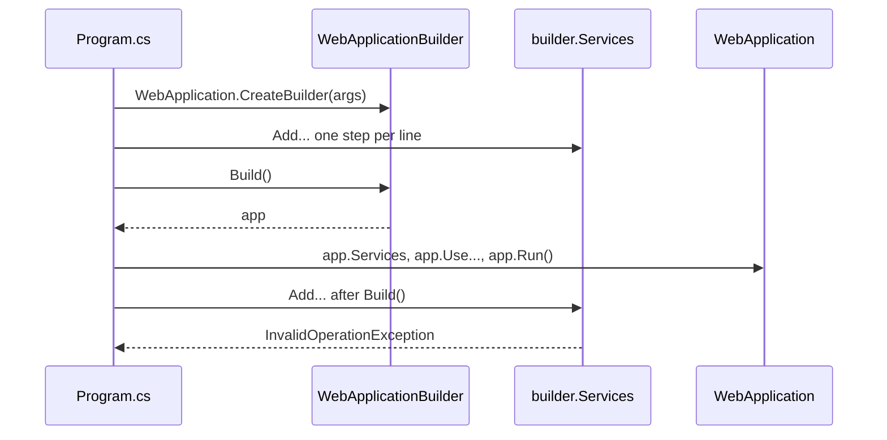

## Before you start

- [[design.l2.strategy-pattern]] — you know what a design pattern is: a named, reusable shape of solution to a design problem that keeps coming back.
- [[design.l1.wiring-the-container]] — you know that `Program.cs` registers services on `builder.Services`, and that a missing registration makes the container throw.
- [[backend.l1.migrations]] — you know that `DesignTimeDbContextFactory` exists so the `dotnet ef` tools can create a `DonHangDbContext` without starting the API.

## The situation

You need one more class registered in Đơn Hàng, so the container can hand it out. In `Program.cs`, the block that applies migrations sits right after `var app = builder.Build();`, and it already runs at startup, so you add your `builder.Services.Add...` line there. The project compiles. Then the API stops at startup with an exception, before any request arrives. Meanwhile `DesignTimeDbContextFactory` also has a variable named `builder`: the code gives it a setting first and reads a result from it last. Why do both files keep a separate object for collecting settings, and what changes once that object has produced its result?

## Core concepts

- **Builder pattern** — a builder object collects an object's settings over several steps, then one final call creates the finished object; collecting and creating are kept apart.
- builder — the object that collects the settings; here, the `WebApplicationBuilder` in `Program.cs` and the `DbContextOptionsBuilder` in `DesignTimeDbContextFactory`.
- final call — the one call that turns the collected settings into the finished object: `Build()` in `Program.cs`, the `Options` property in the factory.
- object initializer — the C# syntax `new Order { CustomerId = ..., Status = ... }`, which creates an object and sets the listed properties in one expression.

## How it works



Read the diagram from the top. `WebApplication.CreateBuilder(args)` returns a `WebApplicationBuilder`, the builder. It does not start anything yet; it is a place to collect settings. Each `builder.Services.Add...` line is one step that adds registrations to the list on `builder.Services`; some lines, such as `AddControllers`, add many at once. The steps can come from many places, such as `AddDonHangInfrastructure` in another project, and none of them needs to know about the others.

Then comes the final call. `builder.Build()` takes everything collected so far and creates the `WebApplication`, the object `Program.cs` calls `app`. From here on, `Program.cs` works with `app`: `app.Services` hands out the registered services, the `app.Use...` lines set up the pipeline, and `app.Run()` starts the server.

The bottom two arrows are the situation. After `Build()`, the registration list on `builder.Services` is read-only: the app was created from the list as it was at that moment, so a registration added later could never reach it. Instead of ignoring the new line silently, the call throws an `InvalidOperationException` at startup. The compiler cannot see this, because `builder` is still an ordinary variable in scope after `Build()`; only running the code shows it.

So the pattern gives you two phases with a clear line between them: while collecting, settings can be added by any code that has the builder; after the final call, you have one finished object and the settings are fixed.

## In the Đơn Hàng system

The line between the two phases in `Program.cs`:

```csharp file=DonHang.Api/Program.cs tag=stage-1 lines=49-62
builder.Services.AddCors(options =>
    options.AddDefaultPolicy(policy => policy.AllowAnyOrigin().AllowAnyHeader().AllowAnyMethod()));

var app = builder.Build();

// lesson: backend.l1.migrations
// Applies pending migrations on start, so a fresh `db` container ends up on
// the same schema a developer gets from `dotnet ef database update`.
using (var scope = app.Services.CreateScope())
{
    var context = scope.ServiceProvider.GetRequiredService<DonHangDbContext>();
    MigrationBaseline.ApplyIfNeeded(context);
    context.Database.Migrate();
}
```

`AddCors` is the last registration; every `builder.Services` line above it in the file, starting at line 13 (not shown here), adds registrations to the list. `var app = builder.Build();` is the final call. The migration block only asks `app.Services` for a `DonHangDbContext`; it registers nothing. That is why a new `builder.Services.Add...` line belongs above `Build()`, never below it.

A smaller builder, in the factory that `dotnet ef` uses:

```csharp file=DonHang.Infrastructure/DesignTimeDbContextFactory.cs tag=stage-1 lines=11-16
    public DonHangDbContext CreateDbContext(string[] args)
    {
        var builder = new DbContextOptionsBuilder<DonHangDbContext>();
        builder.UseNpgsql("Host=localhost;Database=donhang;Username=donhang;Password=design-time-only");
        return new DonHangDbContext(builder.Options);
    }
```

Here the builder is a `DbContextOptionsBuilder<DonHangDbContext>`. There is only one step: `UseNpgsql(...)` tells it to use PostgreSQL, with a connection string meant only for the `dotnet ef` tools, not for the running API. The final call is reading `builder.Options`, which returns the finished options object, and that object is what the `DonHangDbContext` constructor receives. The context never sees the builder itself.

Now compare `OrderService.PlaceOrderAsync`. It creates the order with an object initializer, `new Order { ... }`, setting `CustomerId`, `PlacedAt`, `Status` and `Items` in one expression. Every value is already known on that line, and no step has to finish before another can start, so there is nothing to collect first. A builder would add a type and a final call without solving any problem there.

## Beginners often think…

- **"A builder is just a constructor with many parameters, split across several lines."** → Actually a constructor gets all its values in one call, while a builder receives them in separate steps, possibly from different code, and creates the object only when asked. `AddDonHangInfrastructure` adds its registrations from `DonHang.Infrastructure`, and `Program.cs` adds more afterwards; no single call ever holds them all. You notice this when you try to picture `WebApplication`'s constructor taking every registration of `Program.cs` as one argument list.
- **"`builder.Services` can still take new registrations after `Build()`, as long as `app.Run()` has not been called yet."** → Actually `Build()` is the line, not `Run()`: after it, the registration list is read-only and adding to it throws an `InvalidOperationException`. The app was already created from the list as it stood. You notice this when a registration placed next to the migration block stops the API at startup with that exception.
- **"Every class with many properties deserves its own builder."** → Actually a builder pays off when settings arrive in steps, possibly from different code, before the object can be created. `Order` has several properties, yet `OrderService` knows them all on one line and an object initializer is enough. You notice an unneeded builder when every use of it sets all the values in one place, right before the final call, with nothing added from other code.

## Try it (3 minutes)

In the example repository at stage-1:

1. In `DonHang.Api/Program.cs`, add the line `builder.Services.AddScoped<OrderService>();` directly below `var app = builder.Build();`. `OrderService` is already registered above; the duplicate is not what fails, the position after `Build()` is.
2. From the repository root, run `ConnectionStrings__Default=Host=localhost Jwt__SigningKey=try-it dotnet run --project DonHang.Api`. The two variables only get the API past its checks for missing config; nothing connects to a database before the error.
3. Undo your change.

Expected result: the build succeeds, then the API stops with `Unhandled exception. System.InvalidOperationException: The service collection cannot be modified because it is read-only.`, and the stack trace points at `Program.cs` line 53, the line you added.

## Connections

- [[backend.l1.hosting-and-program-cs]] — introduced `CreateBuilder`, `Build()` and `Run()`; this lesson names the pattern behind that shape.
- [[design.l1.wiring-the-container]] — the registrations the builder collects; this lesson adds that they must all come before `Build()`.
- [[backend.l1.migrations]] — where `DesignTimeDbContextFactory` comes from; its `DbContextOptionsBuilder` is the same pattern at a smaller size.
- [[design.l2.factory]] — the neighbouring creation pattern: a factory decides which object to create, a builder collects how to set one up.
- [[design.l2.strategy-pattern]] — the first pattern of this module; Strategy is about passing a rule in, Builder about creating an object in steps.

## Five-line summary

1. The Builder pattern separates collecting an object's settings, over several steps, from creating it with one final call.
2. `WebApplication.CreateBuilder(args)` returns a `WebApplicationBuilder`; registrations go on `builder.Services`, and `builder.Build()` creates the `WebApplication`.
3. After `Build()`, `builder.Services` is read-only: adding a registration throws an `InvalidOperationException` at startup, not at compile time.
4. `DesignTimeDbContextFactory` gives a `DbContextOptionsBuilder` `UseNpgsql(...)`, then passes its `Options` to `DonHangDbContext`.
5. When every value is known at once, as for `Order` in `OrderService`, an object initializer is enough and no builder is needed.
