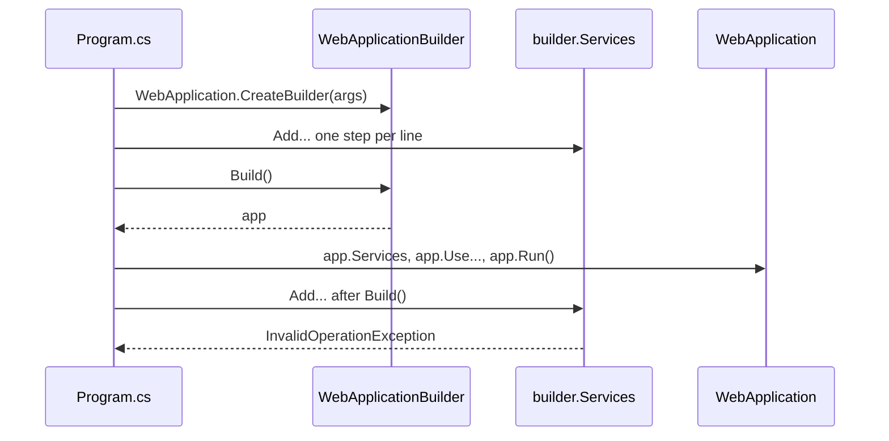

## Bạn cần biết trước

- [[design.l2.strategy-pattern]] — bạn biết design pattern là gì: một dạng lời giải có tên, dùng lại được, cho một vấn đề thiết kế cứ quay lại mãi.
- [[design.l1.wiring-the-container]] — bạn biết `Program.cs` đăng ký các service lên `builder.Services`, và thiếu một đăng ký thì container sẽ ném exception.
- [[backend.l1.migrations]] — bạn biết `DesignTimeDbContextFactory` có mặt để công cụ `dotnet ef` tạo được một `DonHangDbContext` mà không cần khởi động API.

## Tình huống

Bạn cần đăng ký thêm một class trong Đơn Hàng để container có thể đưa nó ra khi cần. Trong `Program.cs`, khối áp dụng migration nằm ngay sau `var app = builder.Build();` và vốn đã chạy lúc khởi động, nên bạn thêm dòng `builder.Services.Add...` của mình vào đó. Project build được. Rồi API dừng ngay lúc khởi động với một exception, trước khi có request nào tới. Trong khi đó `DesignTimeDbContextFactory` cũng có một biến tên `builder`: code đưa cho nó một thiết lập trước, rồi đọc kết quả từ nó sau cùng. Vì sao cả hai file đều giữ một đối tượng riêng để gom cấu hình, và điều gì thay đổi khi đối tượng đó đã cho ra kết quả?

## Khái niệm cốt lõi

- **Builder pattern** (một builder gom cấu hình qua nhiều bước, rồi một lời gọi cuối tạo ra đối tượng hoàn chỉnh) — một đối tượng builder gom cấu hình của một đối tượng qua nhiều bước, rồi một lời gọi cuối tạo ra đối tượng hoàn chỉnh. Gom và tạo được tách rời nhau.
- builder — đối tượng gom cấu hình. Ở đây là `WebApplicationBuilder` trong `Program.cs` và `DbContextOptionsBuilder` trong `DesignTimeDbContextFactory`.
- lời gọi cuối — lời gọi duy nhất biến cấu hình đã gom thành đối tượng hoàn chỉnh: `Build()` trong `Program.cs`, thuộc tính `Options` trong factory.
- object initializer — cú pháp C# `new Order { CustomerId = ..., Status = ... }`, tạo một đối tượng và gán các thuộc tính được liệt kê trong cùng một biểu thức.

## Cơ chế hoạt động



Đọc sơ đồ từ trên xuống. `WebApplication.CreateBuilder(args)` trả về một `WebApplicationBuilder`, tức builder. Nó chưa khởi động gì cả, chỉ là chỗ để gom cấu hình. Mỗi dòng `builder.Services.Add...` là một bước thêm đăng ký vào danh sách trên `builder.Services`. Có dòng thêm nhiều đăng ký cùng lúc, như `AddControllers`. Các bước có thể đến từ nhiều nơi, như `AddDonHangInfrastructure` ở một project khác, và không bước nào cần biết tới các bước còn lại.

Sau đó là lời gọi cuối. `builder.Build()` lấy mọi thứ đã gom tới lúc đó và tạo ra `WebApplication`, đối tượng mà `Program.cs` đặt tên là `app`. Từ đây `Program.cs` làm việc với `app`: `app.Services` đưa ra các service đã đăng ký, các dòng `app.Use...` dựng pipeline, còn `app.Run()` khởi động server.

Hai mũi tên dưới cùng chính là tình huống. Sau `Build()`, danh sách đăng ký trên `builder.Services` chỉ còn đọc được: app đã được tạo từ danh sách đúng như lúc đó, nên một đăng ký thêm sau sẽ không bao giờ tới được app. Thay vì lặng lẽ bỏ qua dòng mới, lời gọi đó ném `InvalidOperationException` ngay lúc khởi động. Trình biên dịch không thấy được lỗi này, vì sau `Build()` thì `builder` vẫn là một biến bình thường còn trong phạm vi. Chỉ khi chạy code bạn mới thấy.

Vậy pattern này cho bạn hai giai đoạn với ranh giới rõ ràng. Trong lúc gom, bất kỳ code nào có builder đều thêm được cấu hình. Sau lời gọi cuối, bạn có một đối tượng hoàn chỉnh và cấu hình đã cố định.

## Trong hệ thống Đơn Hàng

Ranh giới giữa hai giai đoạn trong `Program.cs`:

```csharp file=DonHang.Api/Program.cs tag=stage-1 lines=49-62
builder.Services.AddCors(options =>
    options.AddDefaultPolicy(policy => policy.AllowAnyOrigin().AllowAnyHeader().AllowAnyMethod()));

var app = builder.Build();

// lesson: backend.l1.migrations
// Applies pending migrations on start, so a fresh `db` container ends up on
// the same schema a developer gets from `dotnet ef database update`.
using (var scope = app.Services.CreateScope())
{
    var context = scope.ServiceProvider.GetRequiredService<DonHangDbContext>();
    MigrationBaseline.ApplyIfNeeded(context);
    context.Database.Migrate();
}
```

`AddCors` là đăng ký cuối cùng. Mọi dòng `builder.Services` phía trên nó trong file, bắt đầu từ dòng 13 (không hiện ở đây), đều thêm đăng ký vào danh sách. `var app = builder.Build();` là lời gọi cuối. Khối migration chỉ xin `app.Services` một `DonHangDbContext`, nó không đăng ký gì. Vì thế một dòng `builder.Services.Add...` mới phải nằm trên `Build()`, không bao giờ nằm dưới.

Một builder nhỏ hơn, trong factory mà `dotnet ef` dùng:

```csharp file=DonHang.Infrastructure/DesignTimeDbContextFactory.cs tag=stage-1 lines=11-16
    public DonHangDbContext CreateDbContext(string[] args)
    {
        var builder = new DbContextOptionsBuilder<DonHangDbContext>();
        builder.UseNpgsql("Host=localhost;Database=donhang;Username=donhang;Password=design-time-only");
        return new DonHangDbContext(builder.Options);
    }
```

Ở đây builder là một `DbContextOptionsBuilder<DonHangDbContext>`. Chỉ có một bước: `UseNpgsql(...)` bảo nó dùng PostgreSQL, với một connection string chỉ dành cho công cụ `dotnet ef`, không phải cho API đang chạy. Lời gọi cuối là đọc `builder.Options`, trả về đối tượng options hoàn chỉnh, và constructor của `DonHangDbContext` nhận chính đối tượng đó. Context không bao giờ thấy bản thân builder.

Giờ so với `OrderService.PlaceOrderAsync`. Phương thức này tạo đơn hàng bằng object initializer, `new Order { ... }`, gán `CustomerId`, `PlacedAt`, `Status` và `Items` trong một biểu thức. Mọi giá trị đều đã biết ngay trên dòng đó, và không bước nào phải xong trước thì bước khác mới bắt đầu được, nên chẳng có gì cần gom trước. Một builder ở đây chỉ thêm một kiểu và một lời gọi cuối mà không giải quyết vấn đề nào.

## Người mới hay nghĩ rằng…

- **"Builder chỉ là một constructor nhiều tham số, được tách ra nhiều dòng."** → Thực ra constructor nhận mọi giá trị trong một lời gọi, còn builder nhận chúng theo từng bước riêng, có thể từ những đoạn code khác nhau, và chỉ tạo đối tượng khi được yêu cầu. `AddDonHangInfrastructure` thêm đăng ký của nó từ `DonHang.Infrastructure`, rồi `Program.cs` thêm tiếp. Không lời gọi nào chứa hết chúng. Bạn sẽ nhận ra khi thử hình dung constructor của `WebApplication` nhận mọi đăng ký của `Program.cs` trong một danh sách tham số.
- **"`builder.Services` vẫn nhận đăng ký mới sau `Build()`, miễn là chưa gọi `app.Run()`."** → Thực ra ranh giới là `Build()`, không phải `Run()`: sau đó danh sách đăng ký chỉ còn đọc được, và thêm vào sẽ ném `InvalidOperationException`. App đã được tạo từ danh sách như lúc ấy. Bạn sẽ nhận ra khi một đăng ký đặt cạnh khối migration làm API dừng ngay lúc khởi động với đúng exception đó.
- **"Class nào nhiều thuộc tính cũng đáng có một builder riêng."** → Thực ra builder đáng dùng khi cấu hình đến theo từng bước, có thể từ những đoạn code khác nhau, trước khi đối tượng được tạo. `Order` có nhiều thuộc tính, nhưng `OrderService` biết hết chúng trên một dòng và object initializer là đủ. Bạn sẽ nhận ra một builder thừa khi mọi chỗ dùng nó đều gán hết giá trị ở một chỗ, ngay trước lời gọi cuối, không có gì được thêm từ code khác.

## Thử ngay (3 phút)

Trong repo ví dụ ở stage-1:

1. Trong `DonHang.Api/Program.cs`, thêm dòng `builder.Services.AddScoped<OrderService>();` ngay dưới `var app = builder.Build();`. `OrderService` đã được đăng ký ở phía trên. Thứ gây lỗi không phải bản đăng ký trùng mà là vị trí sau `Build()`.
2. Từ thư mục gốc của repo, chạy `ConnectionStrings__Default=Host=localhost Jwt__SigningKey=try-it dotnet run --project DonHang.Api`. Hai biến này chỉ giúp API qua được các bước kiểm tra thiếu config. Không có gì kết nối tới database trước khi lỗi xảy ra.
3. Hoàn tác thay đổi.

Kết quả mong đợi: build thành công, rồi API dừng với `Unhandled exception. System.InvalidOperationException: The service collection cannot be modified because it is read-only.`, và stack trace chỉ tới `Program.cs` dòng 53, chính dòng bạn vừa thêm.

## Liên hệ

- [[backend.l1.hosting-and-program-cs]] — đã giới thiệu `CreateBuilder`, `Build()` và `Run()`. Bài này đặt tên cho pattern đứng sau hình dạng đó.
- [[design.l1.wiring-the-container]] — các đăng ký mà builder gom lại. Bài này nói thêm rằng tất cả phải đứng trước `Build()`.
- [[backend.l1.migrations]] — nơi `DesignTimeDbContextFactory` xuất hiện. `DbContextOptionsBuilder` của nó là cùng pattern ở cỡ nhỏ hơn.
- [[design.l2.factory]] — pattern tạo đối tượng đứng cạnh: factory quyết định tạo đối tượng nào, còn builder gom cách thiết lập một đối tượng.
- [[design.l2.strategy-pattern]] — pattern đầu tiên của module. Strategy là truyền một quy tắc vào, còn Builder là tạo một đối tượng theo từng bước.

## Tóm tắt 5 dòng

1. Builder pattern tách phần gom cấu hình của một đối tượng qua nhiều bước ra khỏi lúc tạo nó bằng một lời gọi cuối.
2. `WebApplication.CreateBuilder(args)` trả về một `WebApplicationBuilder`. Đăng ký được đặt lên `builder.Services`, và `builder.Build()` tạo ra `WebApplication`.
3. Sau `Build()`, `builder.Services` chỉ còn đọc được: thêm một đăng ký sẽ ném `InvalidOperationException` lúc khởi động, không phải lúc biên dịch.
4. `DesignTimeDbContextFactory` gọi `UseNpgsql(...)` trên một `DbContextOptionsBuilder`, rồi truyền `Options` của nó cho `DonHangDbContext`.
5. Khi mọi giá trị đã biết cùng lúc, như `Order` trong `OrderService`, object initializer là đủ và không cần builder.
