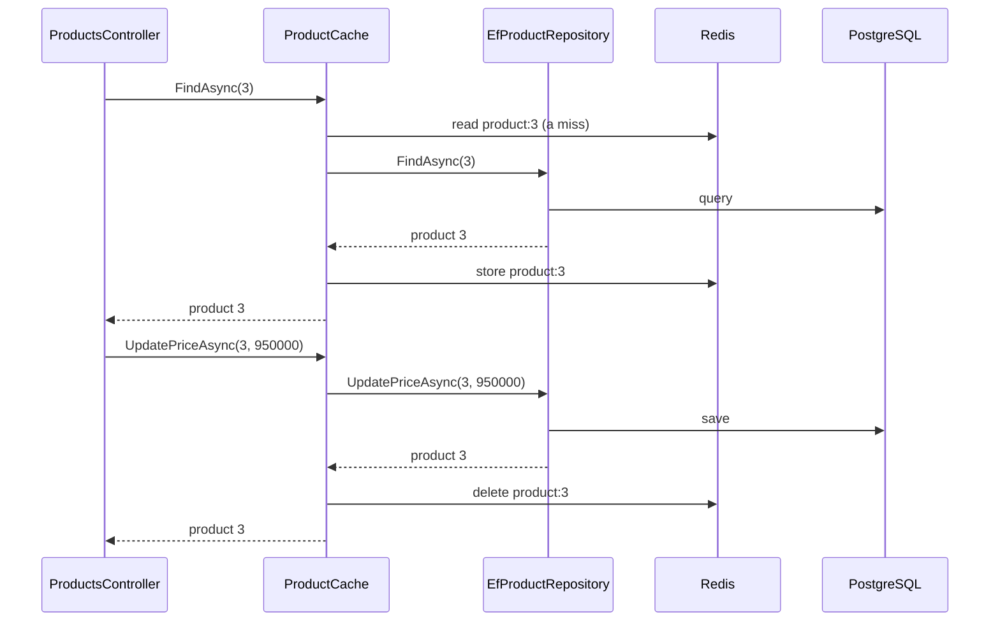

## Before you start

- [[design.l2.strategy-pattern]] — you know a class can be handed an object through its constructor and use it without knowing its concrete class.
- [[backend.l2.cache-invalidation]] — you know what `ProductCache` does when staff change a price: save first, then delete `product:{id}`.
- [[design.l1.the-repository-layer]] — you know a repository hides its queries behind an interface that the code above it depends on.

## The situation

Products are read far more often than they change, so stage-2 keeps a copy of each one in Redis. Imagine adding that yourself. Your first idea is to open `EfProductRepository` and put a Redis lookup in front of the query in `FindAsync`, and a Redis delete after the save in `UpdatePriceAsync`. Now one class talks to both PostgreSQL and Redis, and every change to the caching rules is an edit to the class that holds the queries. `ProductsController` already works as it is, and you would rather not touch it either. How can caching be added around product reads and price changes without editing the query code or the code that calls it?

## Core concepts

- **Decorator pattern** — a class that implements the same interface as another object, holds that object, and adds its own work before or after passing each call on to it.
- decorator — the wrapping class; in the situation above, `ProductCache`.
- wrapped object — the object the decorator holds and passes calls to; here, an `EfProductRepository`.

## How it works



The controller holds an `IProductRepository` and calls `FindAsync(3)`. In the situation above, the object behind that interface is the decorator, `ProductCache`. It does its own work first: it looks for `product:3` in Redis. On a hit it returns that copy and never calls the wrapped object. On a miss it passes the same call, with the same argument, to the wrapped object, the `EfProductRepository`, which queries PostgreSQL as before. When a product comes back, `ProductCache` stores a copy and returns it unchanged; when no product has that id, it stores nothing.

The price change runs the other way round. `ProductCache` passes `UpdatePriceAsync` on first and lets the wrapped repository save. Only after that call returns a product does it delete `product:3`. So cache invalidation is work added after the call, not lines inside the query code: `EfProductRepository` does not mention Redis anywhere.

Two things make this possible. First, `ProductCache` implements `IProductRepository`, so any code that accepts the interface accepts the decorator. Second, it receives the object it wraps through its constructor, typed as that same interface. Its code never uses the type `EfProductRepository`, which only a comment mentions; the registration decides what goes inside.

That second point is why decorators can be stacked. The wrapped object only has to be an `IProductRepository`, and a decorator is one. A class that measured how long each call takes could wrap `ProductCache`, and the controller would still see a single `IProductRepository`. Each wrapper adds one job; the class at the centre stays as it is.

## In the Đơn Hàng system

The decorator's first lines:

```csharp file=DonHang.Infrastructure/ProductCache.cs tag=stage-2 lines=9-14
// lesson: design.l2.decorator-pattern
// An IProductRepository that holds another IProductRepository (at stage-2,
// EfProductRepository) and adds one job around its calls: a copy of each
// product in Redis. Callers cannot tell it apart from the repository inside.
public sealed class ProductCache(IProductRepository inner, IConnectionMultiplexer redis, ILogger<ProductCache> logger)
    : IProductRepository
```

Look at the two places `IProductRepository` appears. After the colon, it is the interface `ProductCache` implements, so `ProductCache` must have `FindAsync` and `UpdatePriceAsync`. In the parameter list, it is the type of `inner`, the wrapped object. The other two parameters are only what the extra job needs: a Redis connection and a logger. Further down in the file, not shown above, `UpdatePriceAsync` calls `inner.UpdatePriceAsync(id, priceVnd)` first and calls `RemoveAsync($"product:{id}")` only when the result is not `null`.

Where the wrapping happens:

```csharp file=DonHang.Infrastructure/ServiceCollectionExtensions.cs tag=stage-2 lines=40-47
        // lesson: design.l2.decorator-pattern
        // Whoever asks for an IProductRepository gets a ProductCache with an
        // EfProductRepository inside it. Nothing else knows about the wrapping.
        services.AddScoped<EfProductRepository>();
        services.AddScoped<IProductRepository>(provider => new ProductCache(
            provider.GetRequiredService<EfProductRepository>(),
            provider.GetRequiredService<IConnectionMultiplexer>(),
            provider.GetRequiredService<ILogger<ProductCache>>()));
```

`AddScoped<EfProductRepository>()` registers the class under its own name, not under the interface, so nobody asking for `IProductRepository` gets it bare. The second registration tells the DI container how to build an `IProductRepository`: create a `ProductCache` and pass the `EfProductRepository` in as `inner`. Here `provider` is the container, and `GetRequiredService<T>()` asks it for a `T`. `ProductsController` asks for `IProductRepository products` in its constructor and uses it for `GET` of one product and for the staff `PATCH` of a price. It cannot tell which object it got. Its paged list of products does not use the repository; it reads `DonHangDbContext` directly and is not cached.

## Beginners often think…

- **"To cache product reads, you have to edit the repository method that runs the query."** → Actually the cache can live in its own class that implements the same interface and calls the query code. At stage-2, `EfProductRepository.FindAsync` is one line that asks EF Core for the product, with no Redis in it. You notice the edited version when a repository's constructor asks for both a `DbContext` and a Redis connection, and a change to how long copies live means editing the class that holds the queries.
- **"A decorator is a subclass of the class it adds behaviour to."** → Actually `ProductCache` declares no base class: it implements `IProductRepository` and holds another one. `EfProductRepository` is even `sealed`, so C# would not allow a subclass of it. Holding the object through the interface is what lets a decorator wrap any implementation, including another decorator. You notice the subclass version when caching is needed for a second implementation of the interface and the only way is to write a second subclass.

## Try it (3 minutes)

In the root folder of the example repository, checked out at `stage-2`:

1. Run `git grep -n "IProductRepository" -- DonHang.Api` to see every line under `DonHang.Api` that names the interface.
2. Run `git grep -n "new ProductCache" -- "*.cs"` to find where the decorator is created.

Expected result: the first command prints two lines, both in `DonHang.Api/Controllers/ProductsController.cs`: line 12, a comment, and line 15, the constructor that asks for `IProductRepository products`. The second prints one line, starting `DonHang.Infrastructure/ServiceCollectionExtensions.cs:44:` and followed by the `AddScoped<IProductRepository>` call. The controller's code uses only the interface; one registration decides the wrapping.

## Connections

- [[backend.l2.cache-invalidation]] — the caching rules `ProductCache` follows are taught there; this lesson names the shape of the class that holds them.
- [[backend.l1.middleware-pipeline]] — the same idea one level up: each middleware adds one job around the next step of a request.
- [[design.l1.the-repository-layer]] — the interface a decorator needs; without `IProductRepository`, there would be nothing to wrap.
- [[design.l2.strategy-pattern]] — both receive an object through the constructor; a strategy supplies a rule, a decorator adds work around another object's calls.
- [[design.l2.adapter-pattern]] — the next lesson: another class that wraps an object.

## Five-line summary

1. A decorator implements the same interface as the object it wraps, holds it, and adds work before or after passing each call on.
2. `ProductCache` implements `IProductRepository` and receives the wrapped `IProductRepository`, at stage-2 an `EfProductRepository`, through its constructor.
3. On a miss it passes `FindAsync` on and stores the result; on a price change it lets the save finish, then deletes `product:{id}`.
4. `ProductsController` sees only `IProductRepository`; the registration in `ServiceCollectionExtensions` alone puts `ProductCache` around `EfProductRepository`.
5. Because the interface stays the same, decorators can be stacked, each adding one job, while the class at the centre stays unchanged.
