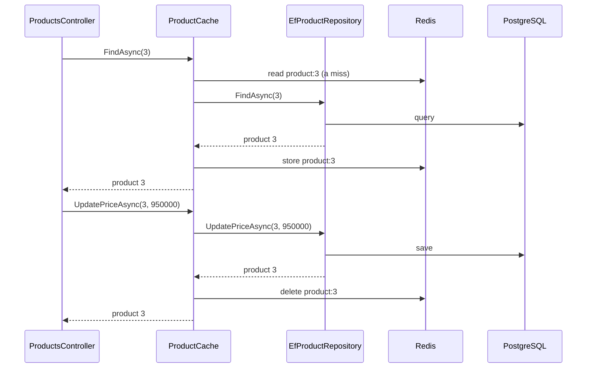

## Bạn cần biết trước

- [[design.l2.strategy-pattern]] — bạn biết một class có thể nhận một đối tượng qua constructor và dùng nó mà không cần biết class cụ thể của nó.
- [[backend.l2.cache-invalidation]] — bạn biết `ProductCache` làm gì khi nhân viên đổi giá: lưu trước, rồi mới xóa `product:{id}`.
- [[design.l1.the-repository-layer]] — bạn biết repository giấu các câu truy vấn sau một interface mà code phía trên phụ thuộc vào.

## Tình huống

Sản phẩm được đọc nhiều hơn hẳn số lần bị sửa, nên ở stage-2 mỗi sản phẩm có một bản sao trong Redis. Thử hình dung bạn tự thêm phần đó. Ý đầu tiên là mở `EfProductRepository`, đặt một lần tìm trong Redis trước câu truy vấn trong `FindAsync`, và một lần xóa trong Redis sau khi lưu trong `UpdatePriceAsync`. Giờ một class nói chuyện với cả PostgreSQL lẫn Redis, và mỗi lần đổi quy tắc cache là một lần sửa class đang chứa các câu truy vấn. `ProductsController` cũng đang chạy ổn, và bạn cũng chẳng muốn đụng vào nó. Làm sao thêm cache quanh việc đọc sản phẩm và đổi giá mà không sửa code truy vấn, cũng không sửa code gọi nó?

## Khái niệm cốt lõi

- **Decorator pattern** (lớp bọc có cùng interface với đối tượng được bọc, làm thêm việc trước hoặc sau mỗi lời gọi) — một class cài đặt cùng interface với một đối tượng khác, giữ đối tượng đó, và làm thêm việc của mình trước hoặc sau khi chuyển từng lời gọi sang cho nó.
- decorator — class bọc bên ngoài. Trong tình huống trên, đó là `ProductCache`.
- đối tượng được bọc — đối tượng mà decorator giữ và chuyển lời gọi sang. Ở đây là một `EfProductRepository`.

## Cơ chế hoạt động



Controller giữ một `IProductRepository` và gọi `FindAsync(3)`. Trong tình huống trên, đối tượng đứng sau interface đó là decorator, tức `ProductCache`. Nó làm việc của mình trước: tìm `product:3` trong Redis. Nếu cache hit, nó trả bản sao đó về và không hề gọi đối tượng được bọc. Nếu cache miss, nó chuyển đúng lời gọi đó, cùng tham số, sang đối tượng được bọc là `EfProductRepository`, và class này truy vấn PostgreSQL như trước giờ. Khi có sản phẩm trả về, `ProductCache` lưu một bản sao rồi trả sản phẩm về nguyên vẹn. Khi không có sản phẩm nào mang id đó, nó không lưu gì.

Đổi giá thì chạy theo chiều ngược lại. `ProductCache` chuyển `UpdatePriceAsync` đi trước và để repository được bọc lưu. Chỉ sau khi lời gọi đó trả về một sản phẩm, nó mới xóa `product:3`. Như vậy cache invalidation là việc làm thêm sau lời gọi, không phải mấy dòng nằm trong code truy vấn: `EfProductRepository` không nhắc tới Redis ở chỗ nào cả.

Có hai điều làm được chuyện này. Thứ nhất, `ProductCache` cài đặt `IProductRepository`, nên code nào nhận interface đó cũng nhận được decorator. Thứ hai, nó nhận đối tượng cần bọc qua constructor, với kiểu cũng chính là interface đó. Code của nó không hề dùng kiểu `EfProductRepository`, cái tên này chỉ có trong một comment. Phần đăng ký mới quyết định thứ gì nằm bên trong.

Điều thứ hai chính là lý do các decorator có thể xếp chồng lên nhau. Đối tượng được bọc chỉ cần là một `IProductRepository`, và decorator cũng là một `IProductRepository`. Một class đo thời gian của từng lời gọi có thể bọc `ProductCache`, và controller vẫn chỉ thấy một `IProductRepository`. Mỗi lớp bọc thêm một việc, còn class ở trung tâm vẫn giữ nguyên.

## Trong hệ thống Đơn Hàng

Mấy dòng đầu của decorator:

```csharp file=DonHang.Infrastructure/ProductCache.cs tag=stage-2 lines=9-14
// lesson: design.l2.decorator-pattern
// An IProductRepository that holds another IProductRepository (at stage-2,
// EfProductRepository) and adds one job around its calls: a copy of each
// product in Redis. Callers cannot tell it apart from the repository inside.
public sealed class ProductCache(IProductRepository inner, IConnectionMultiplexer redis, ILogger<ProductCache> logger)
    : IProductRepository
```

Hãy nhìn hai chỗ `IProductRepository` xuất hiện. Sau dấu hai chấm, đó là interface mà `ProductCache` cài đặt, nên `ProductCache` phải có `FindAsync` và `UpdatePriceAsync`. Trong danh sách tham số, đó là kiểu của `inner`, tức đối tượng được bọc. Hai tham số còn lại chỉ là thứ mà việc làm thêm cần tới: một kết nối Redis và một logger. Ở phía dưới trong file, không có trong đoạn trên, `UpdatePriceAsync` gọi `inner.UpdatePriceAsync(id, priceVnd)` trước, rồi chỉ gọi `RemoveAsync($"product:{id}")` khi kết quả khác `null`.

Chỗ việc bọc diễn ra:

```csharp file=DonHang.Infrastructure/ServiceCollectionExtensions.cs tag=stage-2 lines=40-47
        // lesson: design.l2.decorator-pattern
        // Whoever asks for an IProductRepository gets a ProductCache with an
        // EfProductRepository inside it. Nothing else knows about the wrapping.
        services.AddScoped<EfProductRepository>();
        services.AddScoped<IProductRepository>(provider => new ProductCache(
            provider.GetRequiredService<EfProductRepository>(),
            provider.GetRequiredService<IConnectionMultiplexer>(),
            provider.GetRequiredService<ILogger<ProductCache>>()));
```

`AddScoped<EfProductRepository>()` đăng ký class theo đúng tên của nó, không theo interface, nên ai xin `IProductRepository` cũng không nhận được một `EfProductRepository` trần. Dòng đăng ký thứ hai chỉ cho DI container cách dựng một `IProductRepository`: tạo một `ProductCache` và truyền `EfProductRepository` vào làm `inner`. Ở đây `provider` là container, còn `GetRequiredService<T>()` xin nó một `T`. `ProductsController` xin `IProductRepository products` trong constructor và dùng nó cho `GET` một sản phẩm và cho `PATCH` đổi giá của nhân viên. Nó không phân biệt được mình đã nhận đối tượng nào. Danh sách sản phẩm có phân trang thì không dùng repository: nó đọc thẳng `DonHangDbContext` và không được cache.

## Người mới hay nghĩ rằng…

- **"Muốn cache việc đọc sản phẩm thì phải sửa phương thức repository đang chạy câu truy vấn."** → Thực ra cache có thể nằm trong một class riêng, cài đặt cùng interface và gọi sang code truy vấn. Ở stage-2, `EfProductRepository.FindAsync` chỉ là một dòng hỏi EF Core lấy sản phẩm, không có chút Redis nào. Bạn sẽ nhận ra kiểu sửa thẳng vào repository khi constructor của một repository đòi cả một `DbContext` lẫn một kết nối Redis, và muốn đổi thời gian sống của bản sao thì phải sửa class đang chứa các câu truy vấn.
- **"Decorator là class con của class mà nó thêm hành vi."** → Thực ra `ProductCache` không khai báo class cha nào: nó cài đặt `IProductRepository` và giữ một `IProductRepository` khác. `EfProductRepository` còn là `sealed`, nên C# không cho phép tạo class con của nó. Giữ đối tượng qua interface mới là thứ cho phép một decorator bọc bất kỳ cài đặt nào, kể cả một decorator khác. Bạn sẽ nhận ra kiểu class con khi một cài đặt thứ hai của interface cũng cần cache và cách duy nhất là viết thêm một class con thứ hai.

## Thử ngay (3 phút)

Trong thư mục gốc của repo ví dụ, đã checkout ở `stage-2`:

1. Chạy `git grep -n "IProductRepository" -- DonHang.Api` để xem mọi dòng trong `DonHang.Api` có nhắc tới interface này.
2. Chạy `git grep -n "new ProductCache" -- "*.cs"` để tìm chỗ decorator được tạo ra.

Kết quả mong đợi: lệnh đầu in ra hai dòng, đều trong `DonHang.Api/Controllers/ProductsController.cs`: dòng 12 là một comment, dòng 15 là constructor xin `IProductRepository products`. Lệnh thứ hai in ra một dòng, bắt đầu bằng `DonHang.Infrastructure/ServiceCollectionExtensions.cs:44:` rồi tới lời gọi `AddScoped<IProductRepository>`. Code của controller chỉ dùng interface, và một dòng đăng ký duy nhất quyết định việc bọc.

## Liên hệ

- [[backend.l2.cache-invalidation]] — các quy tắc cache mà `ProductCache` tuân theo được dạy ở đó. Bài này gọi tên hình dạng của class chứa các quy tắc ấy.
- [[backend.l1.middleware-pipeline]] — cùng một ý ở tầng cao hơn: mỗi middleware thêm một việc quanh bước tiếp theo của một request.
- [[design.l1.the-repository-layer]] — interface mà decorator cần. Không có `IProductRepository` thì chẳng có gì để bọc.
- [[design.l2.strategy-pattern]] — cả hai đều nhận một đối tượng qua constructor. Strategy cung cấp một quy tắc, còn decorator làm thêm việc quanh lời gọi tới một đối tượng khác.
- [[design.l2.adapter-pattern]] — bài tiếp theo: một class khác cũng bọc một đối tượng.

## Tóm tắt 5 dòng

1. Decorator cài đặt cùng interface với đối tượng nó bọc, giữ đối tượng đó, và làm thêm việc trước hoặc sau khi chuyển từng lời gọi đi.
2. `ProductCache` cài đặt `IProductRepository` và nhận `IProductRepository` được bọc, ở stage-2 là một `EfProductRepository`, qua constructor.
3. Khi cache miss, nó chuyển `FindAsync` đi và lưu kết quả. Khi đổi giá, nó để việc lưu xong trước, rồi mới xóa `product:{id}`.
4. `ProductsController` chỉ thấy `IProductRepository`. Riêng phần đăng ký trong `ServiceCollectionExtensions` đặt `ProductCache` bọc quanh `EfProductRepository`.
5. Vì interface giữ nguyên, các decorator có thể xếp chồng, mỗi cái thêm một việc, còn class ở trung tâm không phải đổi.
