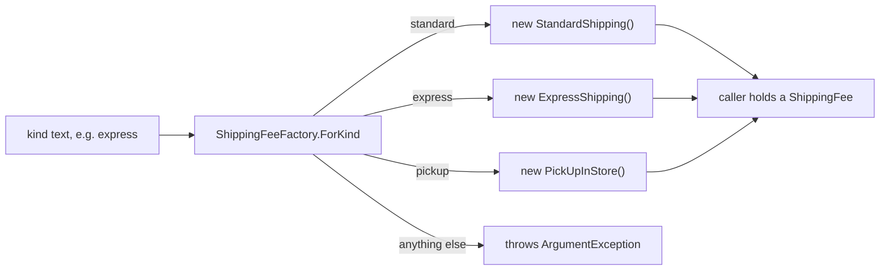

## Before you start

- [[design.l2.strategy-pattern]] — you know `CheckoutTotal` is handed a `ShippingFee` object and never asks which kind of shipping it is.
- [[backend.l2.hosted-services]] — you know `NotificationSender` runs for the app's whole life and gets a fresh `DonHangDbContext` for each round through `IServiceScopeFactory`.

## The situation

`CheckoutTotal` is ready: hand it a `ShippingFee` and it adds the right fee. But a customer does not choose an object. The choice reaches your code as text, such as `"express"`. Someone has to turn that text into `new ExpressShipping()`. If every place that needs a fee writes its own `if`/`else if` on the text, the chain you removed from `CheckoutTotal` comes back in several places, and same-day shipping means finding and editing all of them. Where should the decision "which class for this text" live, so that the code using the fee never names a class?

## Core concepts

- **factory** — a method or object whose job is to create objects, so the code that uses those objects never names the concrete class.
- `ShippingFeeFactory.ForKind` — the factory method in the samples: it takes a kind string and returns a `ShippingFee`.
- `IServiceScopeFactory` — a factory object the framework provides: each call to its `CreateScope` returns a new `IServiceScope`.

## How it works



Read the diagram from the left. The caller has only the text the customer chose. It passes that text to `ShippingFeeFactory.ForKind` and gets back a `ShippingFee`. Inside, the factory compares the text with the three kinds it knows and creates the matching class. A kind it does not know, such as `"same_day"` today, is refused with an `ArgumentException` instead of silently getting some fee.

Look at what the caller holds afterwards: a value of type `ShippingFee`. It can pass that value to `CheckoutTotal` exactly as the tests in the previous lesson did, and neither the caller nor `CheckoutTotal` ever writes `new ExpressShipping()`. Code that gets its fee from the factory never names the three classes; the factory names them once, for everyone.

The branch on the text has not disappeared; it has moved. It now lives in one method, and that method does one thing: pick a class. It does not know that standard shipping is free from 2,000,000 VND. That rule stays in `StandardShipping`, where the OCP lesson put it. `ShippingFeeIfElseChain` mixed both jobs in one chain: each branch both recognised a kind and computed its fee.

So a new kind of shipping costs two small edits: one new subclass of `ShippingFee` holding the fee rule, and one new line in the factory mapping the text to it. `CheckoutTotal`, the existing fee classes and every caller that already gets its fee from `ForKind` stay as they are.

## In the Đơn Hàng system

The factory method:

```csharp file=samples/DonHang.Samples/Samples/Design/ShippingFeeFactory.cs tag=stage-2 lines=6-19
// Turns the kind string that arrives from outside into a ShippingFee object.
// The branch on the string is still here, but only to pick a class: the fee
// rules stay in the subclasses (compare ShippingFeeIfElseChain). A new kind is
// one new subclass plus one new line below.
public static class ShippingFeeFactory
{
    public static ShippingFee ForKind(string kind) => kind switch
    {
        "standard" => new StandardShipping(),
        "express" => new ExpressShipping(),
        "pickup" => new PickUpInStore(),
        _ => throw new ArgumentException($"unknown shipping kind: {kind}"),
    };
}
```

`kind switch { ... }` is a C# switch expression: it checks the lines from top to bottom and returns the value after `=>` on the first line that matches. `_` matches anything, so it catches every kind not listed above it. The return type is `ShippingFee`, not any of the three classes, which is why a caller never learns which class it got. `ForKind` is `static`, so you call it on the class name without creating a `ShippingFeeFactory` first. In the samples, only the tests in `ShippingFeeFactoryTests` call it.

A factory the framework gives you:

```csharp file=DonHang.Api/Jobs/NotificationSender.cs tag=stage-2 lines=47-59
    private async Task SendDueAsync(CancellationToken stoppingToken)
    {
        using var scope = scopeFactory.CreateScope();
        var queue = scope.ServiceProvider.GetRequiredService<NotificationQueue>();
        var email = scope.ServiceProvider.GetRequiredService<IEmailSender>();

        var due = await queue.ClaimDueAsync(BatchSize, stoppingToken);
        foreach (var notification in due)
        {
            await SendOneAsync(email, notification, stoppingToken);
        }
        await queue.CompleteAsync(stoppingToken);
    }
```

`scopeFactory` is a constructor parameter of type `IServiceScopeFactory`. `NotificationSender` never builds a scope itself and never names the class behind `IServiceScope`; each round it asks the factory with `CreateScope()`. The next two lines ask that new scope for a `NotificationQueue` and an `IEmailSender`; the `NotificationQueue` it returns holds this round's fresh `DonHangDbContext`. Nobody in Đơn Hàng registers `IServiceScopeFactory`: the framework registers it itself, and the DI container hands it in like any other constructor parameter. This is the same idea as `ForKind`, but as an object rather than a static method.

## Beginners often think…

- **"A factory removes every `if` or `switch` on the kind from the program."** → Actually the `switch` is still there, inside `ForKind`. What changes is where it lives and what it does: one place, only choosing a class. You notice this when you add a `SameDayShipping` class, forget the factory line, and `ForKind("same_day")` still throws `ArgumentException` with `unknown shipping kind: same_day`.
- **"Once there is a DI container, an application never needs a factory of its own."** → Actually the container's registrations in Đơn Hàng are all made once, at startup; none of them reads the text a customer chose for one order. Turning `"express"` into an object is still your code's job, and a factory is where it goes. The framework itself relies on factories too: `NotificationSender` receives `IServiceScopeFactory` from the container. You notice this when you look for a registration that could turn `"express"` into `ExpressShipping` and find none.

## Try it (3 minutes)

In the example repository at stage-2:

1. At the end of `samples/DonHang.Samples/Samples/Design/ShippingFeeFactory.cs`, add a public sealed class `SameDayShipping` that derives from `ShippingFee` and overrides `ForOrder` (it takes the items total as an `int` and returns an `int`) to return `80_000`.
2. In the same file, add the line `"same_day" => new SameDayShipping(),` just above the `_ =>` line.
3. Run `dotnet test samples/DonHang.Samples.Tests --filter ShippingFeeFactoryTests`, then undo your changes.

Expected result: the summary line starts with `Failed!` and shows 1 failed and 1 passed. The failing test is `AnUnknownKindIsRefused`, which expects `"same_day"` to be refused; now the factory knows it. You added a kind with one class and one line, and `CheckoutTotal.cs` and the other fee classes still compiled unchanged.

## Connections

- [[design.l2.strategy-pattern]] — the pattern this lesson feeds: Strategy needs a `ShippingFee` handed in, and the factory is where that object is made.
- [[design.l1.solid-ocp]] — `ShippingFeeIfElseChain` is the chain the factory splits into two jobs, choosing a class and computing a fee.
- [[backend.l2.hosted-services]] — where `NotificationSender` and its `IServiceScopeFactory` were introduced; here you see the same code as a factory.
- [[design.l1.the-di-container]] — the container resolves types from registrations made at startup; a factory decides from a value that arrives later.

## Five-line summary

1. A factory is a method or object whose job is to create objects, so the code that uses them never names the concrete class.
2. `ShippingFeeFactory.ForKind` turns a kind string into a `ShippingFee` subclass and throws `ArgumentException` for a kind it does not know.
3. The branch on the kind still exists, but only in the factory and only to pick a class; fee rules stay in the subclasses.
4. A new kind is one new subclass plus one new factory line; `CheckoutTotal` and the existing fee classes do not change.
5. `NotificationSender` asks the framework's `IServiceScopeFactory` for a fresh scope each round instead of building one itself.
