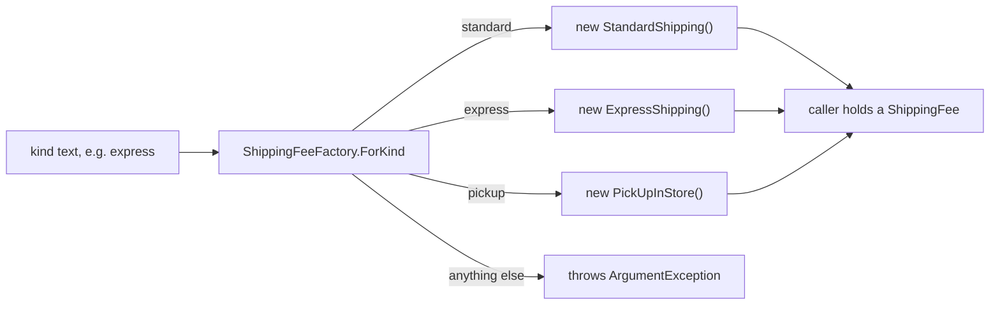

## Bạn cần biết trước

- [[design.l2.strategy-pattern]] — bạn biết `CheckoutTotal` được truyền vào một đối tượng `ShippingFee` và không bao giờ hỏi đó là kiểu giao hàng nào.
- [[backend.l2.hosted-services]] — bạn biết `NotificationSender` chạy suốt vòng đời của app và mỗi vòng lấy một `DonHangDbContext` mới qua `IServiceScopeFactory`.

## Tình huống

`CheckoutTotal` đã sẵn sàng: đưa cho nó một `ShippingFee` là nó cộng đúng phí. Nhưng khách hàng đâu có chọn một đối tượng. Lựa chọn của khách tới code dưới dạng chữ, như `"express"`. Phải có ai đó biến chữ ấy thành `new ExpressShipping()`. Nếu chỗ nào cần phí cũng tự viết một chuỗi `if`/`else if` theo chữ đó, thì chuỗi rẽ nhánh bạn vừa gỡ khỏi `CheckoutTotal` lại mọc ra ở nhiều nơi, và thêm giao trong ngày nghĩa là phải đi tìm và sửa hết từng chỗ. Vậy quyết định "chữ này ứng với class nào" nên nằm ở đâu, để code dùng phí không bao giờ phải gọi tên một class?

## Khái niệm cốt lõi

- **factory** (phương thức hoặc đối tượng chuyên tạo đối tượng, để nơi dùng không phải gọi tên class cụ thể) — một phương thức hoặc đối tượng có nhiệm vụ tạo đối tượng, nhờ vậy code dùng các đối tượng đó không bao giờ gọi tên class cụ thể.
- `ShippingFeeFactory.ForKind` — phương thức factory trong samples: nhận một string chỉ kiểu giao hàng và trả về một `ShippingFee`.
- `IServiceScopeFactory` — một đối tượng factory do framework cung cấp: mỗi lần gọi `CreateScope` của nó là nhận về một `IServiceScope` mới.

## Cơ chế hoạt động



Đọc sơ đồ từ trái sang. Bên gọi chỉ có chữ mà khách đã chọn. Nó đưa chữ đó cho `ShippingFeeFactory.ForKind` và nhận lại một `ShippingFee`. Bên trong, factory so chữ với ba kiểu nó biết rồi tạo class tương ứng. Kiểu nào nó không biết, như `"same_day"` ở thời điểm này, sẽ bị từ chối bằng một `ArgumentException`, chứ không lặng lẽ nhận về một mức phí bất kỳ.

Giờ nhìn thứ bên gọi đang cầm: một giá trị kiểu `ShippingFee`. Nó có thể truyền giá trị đó cho `CheckoutTotal` y như các test ở bài trước, và cả bên gọi lẫn `CheckoutTotal` đều không bao giờ viết `new ExpressShipping()`. Code lấy phí từ factory không gọi tên ba class kia. Factory gọi tên chúng một lần, thay cho tất cả.

Nhánh rẽ theo chữ không biến mất, nó chỉ dời chỗ. Giờ nó nằm trong một phương thức, và phương thức ấy chỉ làm một việc: chọn class. Nó không biết giao tiêu chuẩn được miễn phí từ 2.000.000 VND. Quy tắc đó vẫn ở trong `StandardShipping`, nơi bài OCP đã đặt nó. `ShippingFeeIfElseChain` thì trộn cả hai việc vào một chuỗi: nhánh nào cũng vừa nhận ra kiểu, vừa tính phí của kiểu đó.

Vì thế thêm một kiểu giao hàng chỉ tốn hai chỗ sửa nhỏ: một class con mới của `ShippingFee` chứa quy tắc tính phí, và một dòng mới trong factory ánh xạ chữ sang class đó. `CheckoutTotal`, các class phí có sẵn và mọi bên gọi đã lấy phí từ `ForKind` đều giữ nguyên.

## Trong hệ thống Đơn Hàng

Phương thức factory:

```csharp file=samples/DonHang.Samples/Samples/Design/ShippingFeeFactory.cs tag=stage-2 lines=6-19
// Turns the kind string that arrives from outside into a ShippingFee object.
// The branch on the string is still here, but only to pick a class: the fee
// rules stay in the subclasses (compare ShippingFeeIfElseChain). A new kind is
// one new subclass plus one new line below.
public static class ShippingFeeFactory
{
    public static ShippingFee ForKind(string kind) => kind switch
    {
        "standard" => new StandardShipping(),
        "express" => new ExpressShipping(),
        "pickup" => new PickUpInStore(),
        _ => throw new ArgumentException($"unknown shipping kind: {kind}"),
    };
}
```

`kind switch { ... }` là một switch expression của C#: nó xét các dòng từ trên xuống và trả về giá trị sau `=>` ở dòng đầu tiên khớp. `_` khớp với mọi thứ, nên nó hứng mọi kiểu không có trong các dòng phía trên. Kiểu trả về là `ShippingFee` chứ không phải class nào trong ba class kia, vì vậy bên gọi không bao giờ biết mình nhận được class nào. `ForKind` là `static`, nên bạn gọi nó qua tên class mà không cần tạo `ShippingFeeFactory` trước. Trong samples, chỉ các test trong `ShippingFeeFactoryTests` gọi nó.

Một factory framework đưa sẵn cho bạn:

```csharp file=DonHang.Api/Jobs/NotificationSender.cs tag=stage-2 lines=47-59
    private async Task SendDueAsync(CancellationToken stoppingToken)
    {
        using var scope = scopeFactory.CreateScope();
        var queue = scope.ServiceProvider.GetRequiredService<NotificationQueue>();
        var email = scope.ServiceProvider.GetRequiredService<IEmailSender>();

        var due = await queue.ClaimDueAsync(BatchSize, stoppingToken);
        foreach (var notification in due)
        {
            await SendOneAsync(email, notification, stoppingToken);
        }
        await queue.CompleteAsync(stoppingToken);
    }
```

`scopeFactory` là một tham số constructor kiểu `IServiceScopeFactory`. `NotificationSender` không bao giờ tự dựng scope và không bao giờ gọi tên class đứng sau `IServiceScope`. Mỗi vòng, nó xin factory bằng `CreateScope()`. Hai dòng kế tiếp xin scope mới đó một `NotificationQueue` và một `IEmailSender`, và `NotificationQueue` nhận được giữ `DonHangDbContext` mới của vòng này. Không chỗ nào trong Đơn Hàng đăng ký `IServiceScopeFactory`: framework tự đăng ký nó, và DI container truyền nó vào như mọi tham số constructor khác. Đây cùng một ý với `ForKind`, chỉ khác là ở dạng đối tượng thay vì phương thức static.

## Người mới hay nghĩ rằng…

- **"Factory bỏ được mọi `if` hay `switch` theo kiểu ra khỏi chương trình."** → Thực ra `switch` vẫn còn đó, bên trong `ForKind`. Thứ thay đổi là nó nằm ở đâu và làm gì: một chỗ duy nhất, chỉ để chọn class. Bạn sẽ nhận ra khi thêm class `SameDayShipping` nhưng quên dòng trong factory, và `ForKind("same_day")` vẫn ném `ArgumentException` với thông báo `unknown shipping kind: same_day`.
- **"Đã có DI container thì ứng dụng không bao giờ cần factory của riêng mình."** → Thực ra các đăng ký của container trong Đơn Hàng đều được làm một lần, lúc khởi động, và không đăng ký nào đọc chữ mà khách chọn cho một đơn cụ thể. Biến `"express"` thành một đối tượng vẫn là việc của code bạn viết, và chỗ cho nó là một factory. Chính framework cũng dựa vào factory: `NotificationSender` nhận `IServiceScopeFactory` từ container. Bạn sẽ nhận ra khi đi tìm một đăng ký có thể biến `"express"` thành `ExpressShipping` và không thấy cái nào.

## Thử ngay (3 phút)

Trong repo ví dụ ở stage-2:

1. Ở cuối `samples/DonHang.Samples/Samples/Design/ShippingFeeFactory.cs`, thêm một public sealed class `SameDayShipping` kế thừa `ShippingFee` và override `ForOrder` (nhận tổng tiền hàng kiểu `int`, trả về `int`) để trả về `80_000`.
2. Cũng trong file đó, thêm dòng `"same_day" => new SameDayShipping(),` ngay trên dòng `_ =>`.
3. Chạy `dotnet test samples/DonHang.Samples.Tests --filter ShippingFeeFactoryTests`, rồi hoàn tác các thay đổi.

Kết quả mong đợi: dòng tổng kết bắt đầu bằng `Failed!` và cho thấy 1 failed, 1 passed. Test fail là `AnUnknownKindIsRefused`, test này chờ `"same_day"` bị từ chối, còn giờ factory đã biết kiểu đó. Bạn vừa thêm một kiểu bằng một class và một dòng, còn `CheckoutTotal.cs` và các class phí khác vẫn biên dịch được mà không sửa gì.

## Liên hệ

- [[design.l2.strategy-pattern]] — pattern mà bài này cung cấp đầu vào: Strategy cần được truyền vào một `ShippingFee`, và factory là nơi tạo ra đối tượng đó.
- [[design.l1.solid-ocp]] — `ShippingFeeIfElseChain` là chuỗi rẽ nhánh mà factory tách thành hai việc: chọn class và tính phí.
- [[backend.l2.hosted-services]] — nơi `NotificationSender` và `IServiceScopeFactory` của nó được giới thiệu. Ở bài này bạn nhìn cùng đoạn code đó như một factory.
- [[design.l1.the-di-container]] — container resolve các kiểu theo đăng ký làm lúc khởi động, còn factory quyết định theo một giá trị tới sau.

## Tóm tắt 5 dòng

1. Factory là phương thức hoặc đối tượng có nhiệm vụ tạo đối tượng, để code dùng chúng không bao giờ gọi tên class cụ thể.
2. `ShippingFeeFactory.ForKind` biến một string chỉ kiểu giao hàng thành một class con của `ShippingFee`, và ném `ArgumentException` với kiểu nó không biết.
3. Nhánh rẽ theo kiểu vẫn còn, nhưng chỉ nằm trong factory và chỉ để chọn class, còn quy tắc tính phí ở lại trong các class con.
4. Một kiểu mới là một class con mới cộng một dòng factory mới, còn `CheckoutTotal` và các class phí có sẵn không đổi.
5. Mỗi vòng, `NotificationSender` xin `IServiceScopeFactory` của framework một scope mới thay vì tự dựng.
