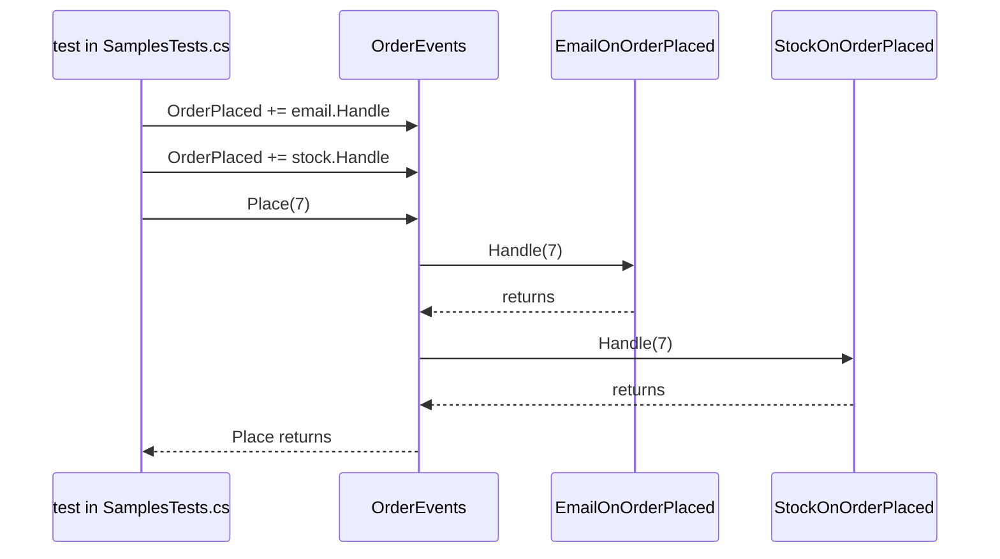

## Before you start

- [[design.l2.strategy-pattern]] — you know a class can be handed an object from outside and use it without knowing its concrete class.
- [[backend.l2.database-job-queue]] — you know Đơn Hàng saves each order email as a `pending` row in `notifications`, and `NotificationSender` sends it later.

## The situation

When an order is placed, other parts of the shop want to react: one sends the customer an email, another reduces the stock. Next month someone will want loyalty points too. If the method that places the order calls each of them by name, it must know every one of them, and each new reaction means editing it again. In the samples at stage-2, `OrderEvents.Place` has exactly this job, yet it names no email class and no stock class; the real API sends order emails another way, for reasons you meet at the end. How can the code that places an order let others react without knowing who they are or what they do?

## Core concepts

- **Observer pattern** — objects subscribe to something that happens in another object; that object keeps the list of subscribers and calls each one when it happens, without knowing what they do.
- event — in C#, a class member declared with the `event` keyword that holds that list; here `OrderPlaced` in `OrderEvents`.
- handler — a method added to an event with `+=`, called when the event is raised; here each subscriber's `Handle`.
- raise — to call every handler of an event; `Place` raises `OrderPlaced` with `OrderPlaced?.Invoke(orderId)`.

## How it works



Read the diagram from the top. In the samples, the caller is again a test. It creates `OrderEvents` and two subscribers, then adds each subscriber's `Handle` to `OrderPlaced` with `+=`. The event now holds two handlers, in the order they were added. `OrderEvents` never sees the classes `EmailOnOrderPlaced` or `StockOnOrderPlaced`; it only holds methods that take an order id.

Then the test calls `Place(7)`. `Place` raises the event, and C# calls the handlers one after another, in the order they subscribed, on the same thread. The email handler runs and returns, then the stock handler runs and returns. Only after the last handler returns does `Invoke` return, and only then does `Place` continue. Nothing runs in the background, and the caller of `Place` waits for every handler.

Now suppose the first handler throws an exception. C# stops calling the list: the handlers after it are not called. The exception leaves `Invoke`, then `Place`, and reaches whoever called `Place`, exactly as if `Place` had thrown it itself.

The `?.` before `Invoke` covers one more case. While nobody has subscribed, the event holds no handlers and `OrderPlaced` is `null`; `?.` then skips the call instead of throwing.

So adding a reaction means writing a new subscriber and one more `+=` where the objects are wired together. `OrderEvents` stays as it is, the same gain Strategy gave `CheckoutTotal`, but here any number of objects are called, not just one.

## In the Đơn Hàng system

The object raising the event and its two subscribers:

```csharp file=samples/DonHang.Samples/Samples/Design/OrderEvents.cs tag=stage-2 lines=7-27
public sealed class OrderEvents
{
    public event Action<int>? OrderPlaced;

    public void Place(int orderId)
    {
        // ... the order would be saved here ...
        OrderPlaced?.Invoke(orderId);
    }
}

// Two subscribers that know nothing about each other.
public sealed class EmailOnOrderPlaced(List<string> log)
{
    public void Handle(int orderId) => log.Add($"email for order {orderId}");
}

public sealed class StockOnOrderPlaced(List<string> log)
{
    public void Handle(int orderId) => log.Add($"stock for order {orderId}");
}
```

`Action<int>` is the .NET type for a method that takes one `int` and returns nothing, so any such method can subscribe. The subscribers only add a line to a shared `log` list, which lets a test see who ran and in which order. Neither subscriber mentions the other, and `OrderEvents` mentions neither.

The two tests that pin down the behaviour:

```csharp file=samples/DonHang.Samples.Tests/SamplesTests.cs tag=stage-2 lines=124-147
    [Fact]
    public void HandlersRunInTheOrderTheySubscribed()
    {
        var log = new List<string>();
        var events = new OrderEvents();
        events.OrderPlaced += new EmailOnOrderPlaced(log).Handle;
        events.OrderPlaced += new StockOnOrderPlaced(log).Handle;

        events.Place(7);

        Assert.Equal(["email for order 7", "stock for order 7"], log);
    }

    [Fact]
    public void AThrowingHandlerStopsTheRestAndReachesPlace()
    {
        var log = new List<string>();
        var events = new OrderEvents();
        events.OrderPlaced += _ => throw new InvalidOperationException("mail server down");
        events.OrderPlaced += new StockOnOrderPlaced(log).Handle;

        Assert.Throws<InvalidOperationException>(() => events.Place(7));
        Assert.Empty(log);
    }
```

The first test expects the email line before the stock line, because that is the order of the `+=` lines. In the second, the first handler is a lambda standing in for an email that fails. `Assert.Throws` shows the exception reaches the call to `Place`, and `Assert.Empty(log)` shows the stock handler never ran.

This is why an observer is not a background job. It runs inside the call that raised the event, and nothing retries it after a failure. If order emails were a handler of such an event, the order request would wait for the mail server, and one failed send would be lost and would stop the handlers after it. Đơn Hàng therefore keeps order emails in the `notifications` job queue, where `NotificationSender` sends them later and retries failures. `OrderEvents` lives only in the samples; the API does not use it.

## Beginners often think…

- **"Raising an event runs the subscribers in the background, so the raiser does not wait for them."** → Actually `Invoke` calls each handler on the same thread and returns only after the last one returns, so `Place` waits for all of them. You notice this when a slow handler makes every call to the raising method slower by the time that handler takes.
- **"If one subscriber throws, the others still run, because subscribers do not know about each other."** → Actually the subscribers not knowing each other says nothing about how they are called. The event calls them in a row, and an exception ends the row, as `AThrowingHandlerStopsTheRestAndReachesPlace` shows. You notice this when a failure in one handler also makes a later handler's work silently go missing, and the exception surfaces in the method that raised the event.

## Try it (3 minutes)

In `samples/DonHang.Samples.Tests/SamplesTests.cs` at stage-2:

1. In `AThrowingHandlerStopsTheRestAndReachesPlace`, swap the two `events.OrderPlaced += ...` lines, so the stock handler subscribes first.
2. Run `dotnet test samples/DonHang.Samples.Tests --filter OrderEventsTests`, where `OrderEventsTests` is the class holding the two tests shown above. Read the result, then undo your change.

Expected result: the summary line starts with `Failed!` and shows 1 failed and 1 passed. The failing test reports `Assert.Empty() Failure: Collection was not empty` with `Collection: ["stock for order 7"]`. The stock handler now ran before the throwing one, and `Assert.Throws` still passed: the exception reached `Place` either way.

## Connections

- [[design.l2.strategy-pattern]] — the neighbouring behavioural pattern: Strategy hands a class one object to call, Observer lets any number of objects subscribe and all are called.
- [[backend.l2.database-job-queue]] — where Đơn Hàng puts order emails instead of in a handler: a row saved with the order and sent later.
- [[backend.l2.work-outside-the-request]] — the problem an observer does not solve: work called inside the request still makes the response wait.
- [[backend.l2.retry-with-backoff]] — what an event handler lacks: a failed job is tried again later, a failed handler is not.

## Five-line summary

1. With the Observer pattern, an object keeps a list of subscribers and calls each one when something happens, without knowing what they do.
2. In C#, the `OrderPlaced` event holds that list; each subscriber adds its handler with `+=`, and `Place` raises it with `?.Invoke`.
3. Handlers run one after another in subscription order, on the same thread, and `Place` continues only after the last one returns.
4. If a handler throws, later handlers are not called and the exception reaches the caller of `Place`.
5. A handler is not a background job, so Đơn Hàng keeps order emails in the `notifications` job queue, which retries them.
