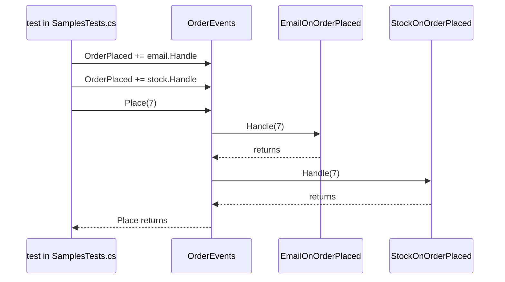

## Bạn cần biết trước

- [[design.l2.strategy-pattern]] — bạn biết một class có thể được truyền vào một đối tượng từ bên ngoài và dùng nó mà không cần biết class cụ thể của nó.
- [[backend.l2.database-job-queue]] — bạn biết Đơn Hàng lưu mỗi email đơn hàng thành một dòng `pending` trong `notifications`, và `NotificationSender` gửi nó sau.

## Tình huống

Khi một đơn hàng được đặt, nhiều phần khác của cửa hàng muốn phản ứng: một phần gửi email cho khách, một phần trừ tồn kho. Tháng sau sẽ có người muốn cộng điểm thành viên nữa. Nếu method đặt hàng gọi từng phần theo tên, nó phải biết hết chúng, và mỗi phản ứng mới lại nghĩa là sửa nó thêm lần nữa. Trong samples ở stage-2, `OrderEvents.Place` làm đúng việc này, vậy mà không nhắc tên class email hay class kho nào. Còn API thật thì gửi email đơn hàng theo cách khác, lý do nằm ở cuối bài. Làm sao để code đặt hàng cho các phần khác phản ứng mà không cần biết chúng là ai hay làm gì?

## Khái niệm cốt lõi

- **Observer pattern** (các bên đăng ký với một đối tượng; khi có chuyện xảy ra, đối tượng gọi từng bên mà không biết chúng làm gì) — các đối tượng đăng ký theo dõi một chuyện xảy ra trong một đối tượng khác. Đối tượng đó giữ danh sách các bên đăng ký và gọi từng bên khi chuyện xảy ra, mà không biết chúng làm gì.
- event — trong C#, một thành viên của class khai báo bằng từ khóa `event`, giữ danh sách đó. Ở đây là `OrderPlaced` trong `OrderEvents`.
- handler — một method được thêm vào event bằng `+=`, và được gọi khi event được raise. Ở đây là `Handle` của từng subscriber.
- raise — gọi mọi handler của một event. `Place` raise `OrderPlaced` bằng `OrderPlaced?.Invoke(orderId)`.

## Cơ chế hoạt động



Đọc sơ đồ từ trên xuống. Trong samples, bên gọi lại là một test. Nó tạo `OrderEvents` và hai subscriber, rồi thêm `Handle` của từng subscriber vào `OrderPlaced` bằng `+=`. Lúc này event giữ hai handler, theo đúng thứ tự được thêm vào. `OrderEvents` không hề thấy class `EmailOnOrderPlaced` hay `StockOnOrderPlaced`. Nó chỉ giữ các method nhận vào một mã đơn.

Sau đó test gọi `Place(7)`. `Place` raise event, và C# gọi các handler lần lượt từng cái, theo thứ tự đăng ký, trên cùng một thread. Handler email chạy xong và trả về, rồi tới handler kho chạy xong và trả về. Chỉ khi handler cuối cùng trả về thì `Invoke` mới trả về, và chỉ lúc đó `Place` mới chạy tiếp. Không có gì chạy ngầm cả, và bên gọi `Place` phải chờ mọi handler.

Giờ giả sử handler đầu tiên ném exception. C# dừng gọi danh sách: các handler phía sau không được gọi. Exception đi ra khỏi `Invoke`, rồi khỏi `Place`, và tới chỗ đã gọi `Place`, y như thể chính `Place` ném nó.

Dấu `?.` trước `Invoke` lo thêm một trường hợp. Khi chưa ai đăng ký, event không giữ handler nào và `OrderPlaced` là `null`. Khi đó `?.` bỏ qua lời gọi thay vì ném lỗi.

Vậy thêm một phản ứng nghĩa là viết một subscriber mới và thêm một dòng `+=` ở nơi các đối tượng được nối với nhau. `OrderEvents` giữ nguyên, cùng cái lợi mà Strategy mang lại cho `CheckoutTotal`, nhưng ở đây số đối tượng được gọi là bao nhiêu cũng được, không chỉ một.

## Trong hệ thống Đơn Hàng

Đối tượng raise event và hai subscriber của nó:

```csharp file=samples/DonHang.Samples/Samples/Design/OrderEvents.cs tag=stage-2 lines=7-27
public sealed class OrderEvents
{
    public event Action<int>? OrderPlaced;

    public void Place(int orderId)
    {
        // ... the order would be saved here ...
        OrderPlaced?.Invoke(orderId);
    }
}

// Two subscribers that know nothing about each other.
public sealed class EmailOnOrderPlaced(List<string> log)
{
    public void Handle(int orderId) => log.Add($"email for order {orderId}");
}

public sealed class StockOnOrderPlaced(List<string> log)
{
    public void Handle(int orderId) => log.Add($"stock for order {orderId}");
}
```

`Action<int>` là kiểu .NET cho một method nhận một `int` và không trả về gì, nên method nào có dạng đó cũng đăng ký được. Hai subscriber chỉ thêm một dòng vào danh sách `log` dùng chung, nhờ vậy test thấy được ai đã chạy và chạy theo thứ tự nào. Không subscriber nào nhắc tới subscriber kia, và `OrderEvents` không nhắc tới cái nào.

Hai test chốt lại hành vi này:

```csharp file=samples/DonHang.Samples.Tests/SamplesTests.cs tag=stage-2 lines=124-147
    [Fact]
    public void HandlersRunInTheOrderTheySubscribed()
    {
        var log = new List<string>();
        var events = new OrderEvents();
        events.OrderPlaced += new EmailOnOrderPlaced(log).Handle;
        events.OrderPlaced += new StockOnOrderPlaced(log).Handle;

        events.Place(7);

        Assert.Equal(["email for order 7", "stock for order 7"], log);
    }

    [Fact]
    public void AThrowingHandlerStopsTheRestAndReachesPlace()
    {
        var log = new List<string>();
        var events = new OrderEvents();
        events.OrderPlaced += _ => throw new InvalidOperationException("mail server down");
        events.OrderPlaced += new StockOnOrderPlaced(log).Handle;

        Assert.Throws<InvalidOperationException>(() => events.Place(7));
        Assert.Empty(log);
    }
```

Test đầu kỳ vọng dòng email đứng trước dòng kho, vì đó là thứ tự của các dòng `+=`. Ở test thứ hai, handler đầu là một lambda đóng vai một lần gửi email bị lỗi. `Assert.Throws` cho thấy exception tới được lời gọi `Place`, còn `Assert.Empty(log)` cho thấy handler kho chưa hề chạy.

Đây là lý do một observer không phải background job. Nó chạy bên trong lời gọi đã raise event, và không gì thử lại nó sau khi lỗi. Nếu email đơn hàng là một handler của event như vậy, request đặt hàng sẽ phải chờ mail server, còn một lần gửi lỗi sẽ mất hẳn và chặn luôn các handler sau nó. Vì thế Đơn Hàng giữ email đơn hàng trong hàng đợi job `notifications`, nơi `NotificationSender` gửi chúng sau và thử lại những lần gửi lỗi. `OrderEvents` chỉ nằm trong samples, API không dùng nó.

## Người mới hay nghĩ rằng…

- **"Raise một event là các subscriber chạy ngầm, nên bên raise không phải chờ chúng."** → Thực ra `Invoke` gọi từng handler trên cùng thread và chỉ trả về sau khi handler cuối cùng trả về, nên `Place` chờ tất cả. Bạn sẽ nhận ra khi một handler chậm làm mọi lời gọi tới method raise event chậm thêm đúng bằng thời gian handler đó chạy.
- **"Nếu một subscriber ném exception thì các subscriber khác vẫn chạy, vì chúng không biết nhau."** → Thực ra việc các subscriber không biết nhau chẳng nói gì về cách chúng được gọi. Event gọi chúng nối tiếp nhau, và một exception chấm dứt chuỗi đó, như `AThrowingHandlerStopsTheRestAndReachesPlace` cho thấy. Bạn sẽ nhận ra khi lỗi ở một handler làm phần việc của một handler phía sau lặng lẽ biến mất, còn exception lại hiện ra ở method đã raise event.

## Thử ngay (3 phút)

Trong `samples/DonHang.Samples.Tests/SamplesTests.cs` ở stage-2:

1. Trong `AThrowingHandlerStopsTheRestAndReachesPlace`, đổi chỗ hai dòng `events.OrderPlaced += ...`, để handler kho đăng ký trước.
2. Chạy `dotnet test samples/DonHang.Samples.Tests --filter OrderEventsTests`, trong đó `OrderEventsTests` là class chứa hai test ở trên. Đọc kết quả, rồi hoàn tác thay đổi.

Kết quả mong đợi: dòng tổng kết bắt đầu bằng `Failed!` và cho thấy 1 test lỗi, 1 test qua. Test lỗi báo `Assert.Empty() Failure: Collection was not empty` kèm `Collection: ["stock for order 7"]`. Handler kho giờ đã chạy trước handler ném lỗi, còn `Assert.Throws` vẫn qua: dù thứ tự nào, exception vẫn tới `Place`.

## Liên hệ

- [[design.l2.strategy-pattern]] — pattern hành vi ngay bên cạnh: Strategy đưa cho một class một đối tượng để gọi, còn Observer cho bao nhiêu đối tượng đăng ký cũng được và gọi tất cả.
- [[backend.l2.database-job-queue]] — nơi Đơn Hàng đặt email đơn hàng thay vì trong một handler: một dòng được lưu cùng đơn hàng và gửi sau.
- [[backend.l2.work-outside-the-request]] — vấn đề mà observer không giải được: việc được gọi bên trong request vẫn bắt response phải chờ.
- [[backend.l2.retry-with-backoff]] — thứ mà handler của event không có: job lỗi được thử lại sau, còn handler lỗi thì không.

## Tóm tắt 5 dòng

1. Với Observer pattern, một đối tượng giữ danh sách subscriber và gọi từng bên khi có chuyện xảy ra, mà không biết chúng làm gì.
2. Trong C#, event `OrderPlaced` giữ danh sách đó. Mỗi subscriber thêm handler của mình bằng `+=`, và `Place` raise nó bằng `?.Invoke`.
3. Các handler chạy lần lượt theo thứ tự đăng ký, trên cùng thread, và `Place` chỉ chạy tiếp sau khi handler cuối cùng trả về.
4. Nếu một handler ném exception, các handler sau không được gọi và exception tới chỗ đã gọi `Place`.
5. Handler không phải background job, nên Đơn Hàng giữ email đơn hàng trong hàng đợi job `notifications`, nơi chúng được thử lại.
