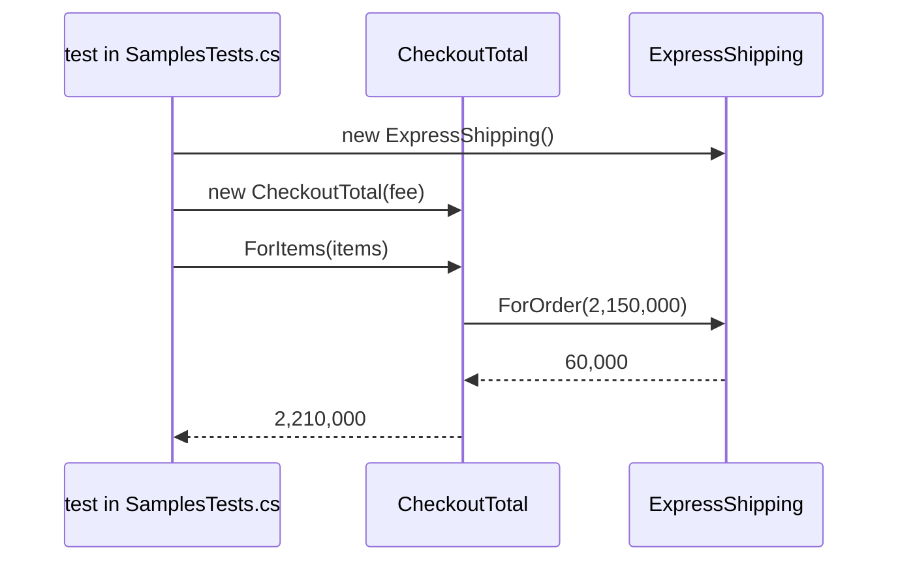

## Before you start

- [[design.l1.solid-ocp]] — you know that adding a new kind of shipping should mean adding a class, not editing code that already works.
- [[design.l1.dependency-injection-intro]] — you know a class can receive the objects it depends on through its constructor instead of creating them with `new`.

## The situation

A checkout needs one number: what the customer pays, which is the items plus shipping. The shop ships three ways, and a fourth, same-day, is already being discussed. Your first idea is to give the checkout code the kind of shipping as a string and pick the fee with an `if`/`else if` chain, like `ShippingFeeIfElseChain`. Then the checkout code must know every kind, and same-day means editing it again. Yet the fee rules already live in `StandardShipping`, `ExpressShipping` and `PickUpInStore`. How can the code that adds up an order use the right fee without ever asking which kind of shipping it is?

## Core concepts

- **design pattern** — a named, reusable shape of solution to a design problem that keeps coming back; the book Design Patterns, known as the GoF ("Gang of Four") book, catalogues many of them for object-oriented code.
- **Strategy pattern** — each variant of one rule sits in its own class behind a shared type, and the code that needs the rule is handed one of those objects instead of choosing a branch itself.
- strategy — one of those objects; in the situation above, a `ShippingFee` such as `ExpressShipping`.
- context — the class that is handed a strategy and uses it; here, `CheckoutTotal`.

## How it works



Read the diagram from the top. In the samples, the caller is a test in `SamplesTests.cs`. It creates the strategy first, an `ExpressShipping`, and passes it to the constructor of `CheckoutTotal` (the `fee` in the diagram). The kind is chosen there, outside `CheckoutTotal`, while the program runs: the same `CheckoutTotal` code uses the standard rule in one test and the express rule in the next, depending only on the object it received. Nothing inside `CheckoutTotal` fixes the kind when its code is written.

Next the caller asks for the total by calling `ForItems`. `CheckoutTotal` multiplies quantity by unit price for each item, adds them up, then calls `ForOrder` on the object it was given, passing it that items total. Its constructor parameter has the type `ShippingFee`, so which override runs depends on the object passed in, exactly as in polymorphism. `CheckoutTotal` adds the fee to the items total and returns it; the numbers in the diagram come from the test items shown in the next section.

Notice what `CheckoutTotal` does not contain: no string naming a kind, no `if`, no `switch`, no `new` for any fee class. So a new kind needs no edit to it: you write a new class that derives from `ShippingFee`, and the code that creates `CheckoutTotal` passes that one in. This is OCP applied to the code that uses the rule: the checkout stays closed for modification while the fee rules stay open for extension.

In the samples, only the tests create a `CheckoutTotal`. Turning a customer's choice, such as the text `"express"`, into the right object is the subject of the next lesson.

## In the Đơn Hàng system

The context:

```csharp file=samples/DonHang.Samples/Samples/Design/CheckoutTotal.cs tag=stage-2 lines=6-16
// The shipping rule is handed in from outside, through the constructor.
// CheckoutTotal adds whatever fee it is given and never asks which kind of
// shipping that was — a new ShippingFee subclass needs no change here.
public sealed class CheckoutTotal(ShippingFee shippingFee)
{
    public int ForItems(IEnumerable<(int Quantity, int UnitPriceVnd)> items)
    {
        var itemsTotalVnd = items.Sum(item => item.Quantity * item.UnitPriceVnd);
        return itemsTotalVnd + shippingFee.ForOrder(itemsTotalVnd);
    }
}
```

The parameter list after the class name makes `shippingFee` a constructor parameter, so every `new CheckoutTotal(...)` has to pass a `ShippingFee`. `ForItems` passes the items total to `ForOrder`, which is how the standard kind can make shipping free from 2,000,000 VND. The fee rules are the same three `ShippingFee` classes you saw in the OCP lesson, unchanged at stage-2.

Two callers, two strategies:

```csharp file=samples/DonHang.Samples.Tests/SamplesTests.cs tag=stage-2 lines=83-102
public class CheckoutTotalTests
{
    private static readonly (int Quantity, int UnitPriceVnd)[] Items = [(1, 1_250_000), (2, 450_000)];

    [Fact]
    public void AddsTheStandardFee()
    {
        var checkout = new CheckoutTotal(new StandardShipping());

        Assert.Equal(2_150_000, checkout.ForItems(Items));
    }

    [Fact]
    public void AddsTheExpressFee()
    {
        var checkout = new CheckoutTotal(new ExpressShipping());

        Assert.Equal(2_210_000, checkout.ForItems(Items));
    }
}
```

Both tests use the same items: one at 1,250,000 VND and two at 450,000 VND, 2,150,000 VND in all. With `StandardShipping` the total stays 2,150,000, because the order reaches the free-shipping threshold; with `ExpressShipping` it becomes 2,210,000. Only the object passed to the constructor differs; `checkout.ForItems(Items)` is the same line in both.

`ShippingFee` and its overrides existed before `CheckoutTotal` did; that part is polymorphism, a feature of C#. Strategy is the design decision built on it: `CheckoutTotal` does not pick a fee, it takes one from outside through its constructor, using dependency injection so that one rule can be replaced. The pattern earns its place here because shipping really varies: three kinds today, a fourth under discussion.

## Beginners often think…

- **"Every abstract class with a few subclasses is already the Strategy pattern."** → Actually subclasses give you polymorphism; Strategy also needs a class that uses the rule and is handed the object from outside. `ShippingFee` and its three classes have been in the samples since stage-0, but `CheckoutTotal`, the class that receives one, arrives only at stage-2. You notice this when you look for the code that is handed the object and find only code that creates a specific kind with `new` right before calling it.
- **"Using more design patterns always makes code better, even for a rule that never changes."** → Actually every pattern adds types, and a reader has to jump to another file to see the rule. If the shop had one way to ship and no plan for more, one method returning the fee would be easier to follow. You notice this when a base class like `ShippingFee` has had exactly one subclass for its whole life, and every change edits both the base class and that subclass.
- **"Strategy only moves the `if/else` to another file, so nothing is really gained."** → Actually the branching is gone from the code that uses the rule: `ForItems` never compares kinds, and each class returns its own fee. One choice remains, which object to create, and it is made once where the object is built, not in every method that needs the fee. You notice the gain when a new kind arrives and `CheckoutTotal` and its tests stay exactly as they were.

## Try it (3 minutes)

In `samples/DonHang.Samples.Tests/SamplesTests.cs` at stage-2:

1. Below `CheckoutTotalTests`, add a public sealed class `SameDayShipping` that derives from `ShippingFee` and overrides `ForOrder` (it takes the items total as an `int` and returns an `int`) to return `80_000`.
2. Inside `CheckoutTotalTests`, add a `[Fact]` method `AddsTheSameDayFee`: a copy of `AddsTheExpressFee` that passes `new SameDayShipping()` and expects `2_230_000`.
3. Run `dotnet test samples/DonHang.Samples.Tests --filter CheckoutTotalTests`, then undo your changes.

Expected result: the summary line starts with `Passed!` and shows 0 failed and 3 passed. You added a fourth kind of shipping without opening `CheckoutTotal.cs`.

## Connections

- [[foundation.l1.oop-polymorphism]] — the language feature this pattern is built on; `ShippingFee` and its three overrides were introduced there.
- [[design.l1.solid-ocp]] — Strategy is one way to get the extension OCP asks for while the code that uses the rule stays closed.
- [[design.l1.dependency-injection-intro]] — the mechanic Strategy relies on: the rule arrives through the constructor.
- [[design.l2.factory]] — the next lesson: turning the customer's choice of shipping into the right `ShippingFee` object.
- [[design.l2.template-method-pattern]] — a later pattern in this module that looks similar; the difference is covered there.

## Five-line summary

1. The Strategy pattern hands the code that needs a rule one object holding a variant of it, instead of letting that code branch on variants.
2. A design pattern is a named, reusable shape of solution to a recurring design problem; the GoF book catalogues many.
3. `CheckoutTotal` receives a `ShippingFee` in its constructor and adds `ForOrder`'s result to the items total without asking which kind it has.
4. The code that creates `CheckoutTotal` picks the `ShippingFee` while the program runs, so a new shipping kind is a new class and `CheckoutTotal` stays unchanged.
5. Polymorphism is the language feature; Strategy is the decision to pass the rule in, worth it only when the rule really varies.
