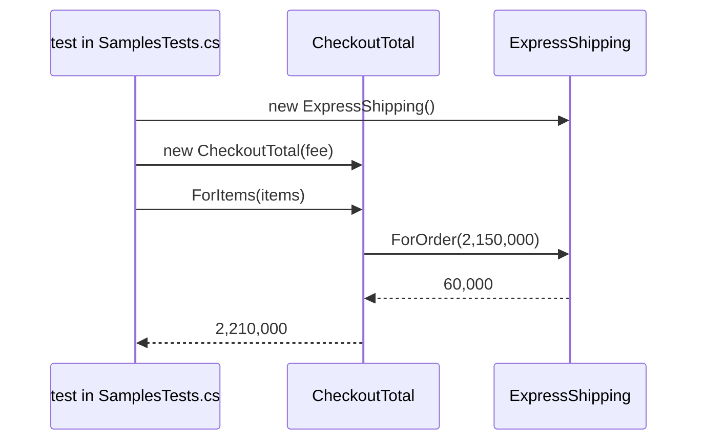

## Bạn cần biết trước

- [[design.l1.solid-ocp]] — bạn biết rằng thêm một kiểu giao hàng mới nên là thêm một class, chứ không phải sửa code đang chạy tốt.
- [[design.l1.dependency-injection-intro]] — bạn biết một class có thể nhận các đối tượng nó phụ thuộc qua constructor, thay vì tự tạo chúng bằng `new`.

## Tình huống

Trang thanh toán cần đúng một con số: khách phải trả bao nhiêu, tức tiền hàng cộng phí giao hàng. Cửa hàng có ba kiểu giao hàng, và kiểu thứ tư, giao trong ngày, đang được bàn tới. Ý đầu tiên của bạn là đưa cho code thanh toán kiểu giao hàng dưới dạng string rồi chọn phí bằng một chuỗi `if`/`else if`, giống `ShippingFeeIfElseChain`. Khi đó code thanh toán phải biết mọi kiểu, và giao trong ngày lại nghĩa là sửa nó thêm lần nữa. Trong khi các quy tắc tính phí đã nằm sẵn trong `StandardShipping`, `ExpressShipping` và `PickUpInStore`. Làm sao để code cộng tiền một đơn dùng đúng mức phí mà không bao giờ phải hỏi đó là kiểu giao hàng nào?

## Khái niệm cốt lõi

- **design pattern** (một dạng lời giải có tên, dùng lại được, cho một vấn đề thiết kế hay lặp lại) — một dạng lời giải có tên, dùng lại được, cho một vấn đề thiết kế cứ quay lại mãi. Cuốn sách Design Patterns, hay được gọi là sách GoF ("Gang of Four"), liệt kê nhiều pattern như vậy cho code hướng đối tượng.
- **Strategy pattern** (mỗi biến thể của một quy tắc nằm trong class riêng, code cần quy tắc được truyền vào một đối tượng trong số đó) — mỗi biến thể của một quy tắc nằm trong class riêng, đứng sau một kiểu chung, và code cần quy tắc được đưa cho một trong các đối tượng đó thay vì tự chọn nhánh.
- strategy — một trong các đối tượng đó. Trong tình huống trên, đó là một `ShippingFee` như `ExpressShipping`.
- context — class được truyền vào một strategy và dùng nó. Ở đây là `CheckoutTotal`.

## Cơ chế hoạt động



Đọc sơ đồ từ trên xuống. Trong samples, bên gọi là một test trong `SamplesTests.cs`. Nó tạo strategy trước, một `ExpressShipping`, rồi truyền vào constructor của `CheckoutTotal` (chính là `fee` trong sơ đồ). Kiểu giao hàng được chọn ở đó, bên ngoài `CheckoutTotal`, lúc chương trình đang chạy: cùng một đoạn code `CheckoutTotal` dùng quy tắc giao tiêu chuẩn ở test này và quy tắc giao nhanh ở test kế tiếp, chỉ tùy vào đối tượng nó nhận được. Không có gì bên trong `CheckoutTotal` cố định kiểu giao hàng ngay từ lúc viết code.

Tiếp theo, bên gọi hỏi tổng tiền bằng cách gọi `ForItems`. `CheckoutTotal` nhân số lượng với đơn giá của từng món, cộng lại, rồi gọi `ForOrder` trên đối tượng nó được truyền vào, kèm theo tổng tiền hàng đó. Tham số constructor của nó có kiểu `ShippingFee`, nên override nào chạy là tùy đối tượng được truyền vào, đúng như đa hình. `CheckoutTotal` cộng phí vào tổng tiền hàng rồi trả kết quả về. Các con số trong sơ đồ lấy từ các món hàng của test, xem ở mục sau.

Hãy để ý những gì `CheckoutTotal` không có: không string nào gọi tên một kiểu, không `if`, không `switch`, không `new` cho class phí nào. Vì vậy một kiểu mới không cần sửa gì ở nó: bạn viết một class mới kế thừa `ShippingFee`, và code tạo ra `CheckoutTotal` truyền class đó vào. Đây là OCP áp vào code dùng quy tắc: phần thanh toán vẫn đóng với sửa đổi, còn các quy tắc tính phí vẫn mở để mở rộng.

Trong samples, chỉ có các test tạo ra `CheckoutTotal`. Biến lựa chọn của khách, như chữ `"express"`, thành đúng đối tượng là chủ đề của bài tiếp theo.

## Trong hệ thống Đơn Hàng

Context:

```csharp file=samples/DonHang.Samples/Samples/Design/CheckoutTotal.cs tag=stage-2 lines=6-16
// The shipping rule is handed in from outside, through the constructor.
// CheckoutTotal adds whatever fee it is given and never asks which kind of
// shipping that was — a new ShippingFee subclass needs no change here.
public sealed class CheckoutTotal(ShippingFee shippingFee)
{
    public int ForItems(IEnumerable<(int Quantity, int UnitPriceVnd)> items)
    {
        var itemsTotalVnd = items.Sum(item => item.Quantity * item.UnitPriceVnd);
        return itemsTotalVnd + shippingFee.ForOrder(itemsTotalVnd);
    }
}
```

Danh sách tham số ngay sau tên class biến `shippingFee` thành tham số constructor, nên mọi lời gọi `new CheckoutTotal(...)` đều phải truyền một `ShippingFee`. `ForItems` đưa tổng tiền hàng cho `ForOrder`, nhờ vậy kiểu giao tiêu chuẩn mới miễn phí giao hàng được từ 2.000.000 VND. Các quy tắc tính phí vẫn là ba class `ShippingFee` bạn đã gặp ở bài OCP, không đổi ở stage-2.

Hai bên gọi, hai strategy:

```csharp file=samples/DonHang.Samples.Tests/SamplesTests.cs tag=stage-2 lines=83-102
public class CheckoutTotalTests
{
    private static readonly (int Quantity, int UnitPriceVnd)[] Items = [(1, 1_250_000), (2, 450_000)];

    [Fact]
    public void AddsTheStandardFee()
    {
        var checkout = new CheckoutTotal(new StandardShipping());

        Assert.Equal(2_150_000, checkout.ForItems(Items));
    }

    [Fact]
    public void AddsTheExpressFee()
    {
        var checkout = new CheckoutTotal(new ExpressShipping());

        Assert.Equal(2_210_000, checkout.ForItems(Items));
    }
}
```

Cả hai test dùng cùng các món hàng: một món giá 1.250.000 VND và hai món giá 450.000 VND, tổng cộng 2.150.000 VND. Với `StandardShipping`, tổng vẫn là 2.150.000 vì đơn đã chạm ngưỡng miễn phí giao hàng. Với `ExpressShipping`, tổng thành 2.210.000. Chỉ đối tượng truyền vào constructor là khác nhau, còn `checkout.ForItems(Items)` là cùng một dòng ở cả hai test.

`ShippingFee` và các override của nó có trước `CheckoutTotal`. Phần đó là đa hình, một tính năng của C#. Strategy là quyết định thiết kế dựng trên nó: `CheckoutTotal` không tự chọn phí mà nhận phí từ bên ngoài qua constructor, dùng dependency injection để một quy tắc có thể được thay bằng quy tắc khác. Pattern này đáng dùng ở đây vì phí giao hàng thật sự thay đổi: hôm nay có ba kiểu, kiểu thứ tư đang được bàn.

## Người mới hay nghĩ rằng…

- **"Abstract class nào có vài class con cũng đã là Strategy pattern rồi."** → Thực ra các class con cho bạn đa hình, còn Strategy cần thêm một class dùng quy tắc và được truyền đối tượng từ bên ngoài. `ShippingFee` và ba class con đã có trong samples từ stage-0, nhưng `CheckoutTotal`, class nhận một đối tượng trong số đó, tới stage-2 mới xuất hiện. Bạn sẽ nhận ra khi đi tìm code được truyền đối tượng vào và chỉ thấy code tự tạo một kiểu cụ thể bằng `new` ngay trước khi gọi nó.
- **"Dùng càng nhiều design pattern thì code càng tốt, kể cả cho một quy tắc không bao giờ đổi."** → Thực ra pattern nào cũng thêm kiểu mới, và người đọc phải nhảy sang file khác mới thấy quy tắc. Nếu cửa hàng chỉ có một kiểu giao hàng và không định thêm, một method trả về mức phí sẽ dễ theo dõi hơn. Bạn sẽ nhận ra khi một base class như `ShippingFee` suốt đời chỉ có đúng một class con, và lần thay đổi nào cũng phải sửa cả base class lẫn class con đó.
- **"Strategy chỉ dời `if/else` sang file khác, nên chẳng được gì."** → Thực ra việc rẽ nhánh đã biến mất khỏi code dùng quy tắc: `ForItems` không bao giờ so sánh các kiểu, và mỗi class tự trả về mức phí của mình. Chỉ còn một lựa chọn là tạo đối tượng nào, và nó được làm một lần ở nơi tạo đối tượng, chứ không lặp lại ở mọi method cần đến phí. Bạn sẽ thấy cái lợi khi có kiểu mới mà `CheckoutTotal` cùng các test của nó vẫn y nguyên.

## Thử ngay (3 phút)

Trong `samples/DonHang.Samples.Tests/SamplesTests.cs` ở stage-2:

1. Bên dưới `CheckoutTotalTests`, thêm một public sealed class `SameDayShipping` kế thừa `ShippingFee` và override `ForOrder` (nhận tổng tiền hàng kiểu `int`, trả về `int`) để trả về `80_000`.
2. Bên trong `CheckoutTotalTests`, thêm một method `[Fact]` tên `AddsTheSameDayFee`: chép từ `AddsTheExpressFee`, nhưng truyền `new SameDayShipping()` và kỳ vọng `2_230_000`.
3. Chạy `dotnet test samples/DonHang.Samples.Tests --filter CheckoutTotalTests`, rồi hoàn tác các thay đổi.

Kết quả mong đợi: dòng tổng kết bắt đầu bằng `Passed!` và cho thấy 0 test lỗi, 3 test qua. Bạn đã thêm kiểu giao hàng thứ tư mà không mở `CheckoutTotal.cs`.

## Liên hệ

- [[foundation.l1.oop-polymorphism]] — tính năng ngôn ngữ mà pattern này dựng lên trên. `ShippingFee` và ba override của nó được giới thiệu ở đó.
- [[design.l1.solid-ocp]] — Strategy là một trong những cách đạt được sự mở rộng mà OCP đòi hỏi, trong khi code dùng quy tắc vẫn đóng.
- [[design.l1.dependency-injection-intro]] — cơ chế mà Strategy dựa vào: quy tắc đi vào qua constructor.
- [[design.l2.factory]] — bài tiếp theo: biến lựa chọn kiểu giao hàng của khách thành đúng đối tượng `ShippingFee`.
- [[design.l2.template-method-pattern]] — một pattern sau trong module này trông khá giống. Điểm khác nhau được nói ở bài đó.

## Tóm tắt 5 dòng

1. Strategy pattern đưa cho code cần một quy tắc một đối tượng mang một biến thể của quy tắc đó, thay vì để code ấy rẽ nhánh theo biến thể.
2. Design pattern là một dạng lời giải có tên, dùng lại được, cho một vấn đề thiết kế hay lặp lại. Sách GoF liệt kê nhiều pattern như vậy.
3. `CheckoutTotal` nhận một `ShippingFee` qua constructor và cộng kết quả của `ForOrder` vào tổng tiền hàng mà không hỏi đó là kiểu nào.
4. Code tạo ra `CheckoutTotal` chọn `ShippingFee` lúc chương trình chạy, nên kiểu giao hàng mới là một class mới và `CheckoutTotal` giữ nguyên.
5. Đa hình là tính năng ngôn ngữ. Strategy là quyết định truyền quy tắc vào, chỉ đáng dùng khi quy tắc thật sự thay đổi.
