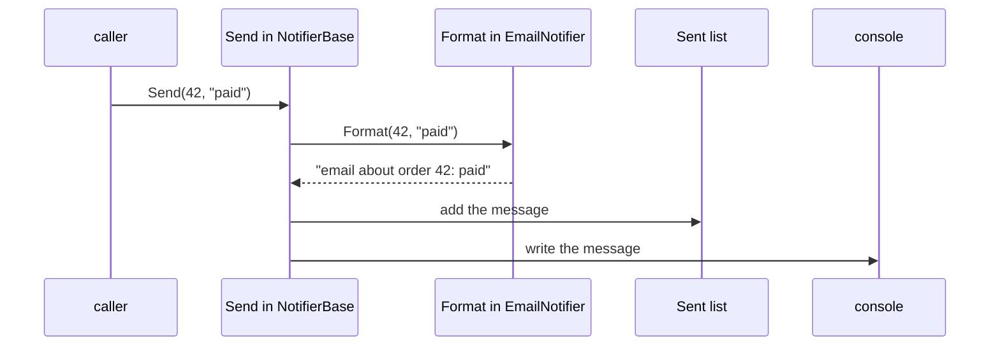

## Before you start

- [[design.l2.strategy-pattern]] — you saw one rule handed to `CheckoutTotal` as an object; this lesson varies a step a different way and compares the two.
- [[foundation.l1.oop-interface-vs-abstract]] — you met `NotifierBase`, the abstract class that keeps the sent list and the steps of `Send` and leaves `Format` to its subclasses.

## The situation

The team wants a third notifier in the samples, one that sends push messages, the short alerts an app shows on a phone. Every notifier must do the same things in the same order: build the message text, record it in `Sent` so a test can read it, then write it out. Only the wording differs between email, SMS and push. If each class wrote its own `Send`, the push version could forget to record the message, and a test that checks `Sent` would find an empty list. How do you let each notifier write its own wording while the other steps stay in one place that no notifier can override?

## Core concepts

- **Template Method pattern** — a base-class method fixes the order of the steps and leaves one or more of those steps abstract, for subclasses to fill in.
- template method — the base-class method that holds the fixed order; in the situation above, `NotifierBase.Send`.
- step to fill in — an abstract method the template method calls at a fixed point; here `Format`, which `EmailNotifier` and `SmsNotifier` override.

## How it works



Read the diagram from the top. The caller holds an `EmailNotifier` and calls `Send`. `EmailNotifier` has no `Send` of its own, so the code that runs is the one written in `NotifierBase`. That method is the template method: it does three things, always in this order.

First it calls `Format`. This is the one place where the subclass speaks: `Format` is abstract in `NotifierBase`, so the override in `EmailNotifier` answers, exactly as polymorphism works for `ShippingFee`. Then `Send` adds the returned text to the private list behind `Sent`, and finally writes it to the console. Those two steps belong to the base class; a subclass never sees the list field, because it is private.

The subclass cannot override this order. In C#, a subclass can override only a method the base class marks as open to it, as `abstract` does for `Format`; `Send` carries no such mark, so only `Format` is open. A push notifier therefore writes one method, its wording, and gets recording and printing in the right order. For a notifier that only writes `Format`, forgetting to record the message is no longer possible.

Compare this with Strategy. `CheckoutTotal` was handed a `ShippingFee` object through its constructor, and the code that created it chose which one while the program ran. Here the varying step comes through inheritance: which `Format` runs is fixed when you write `class EmailNotifier : NotifierBase`. To change the wording of a notifier, you pick a different subclass; the notifier cannot swap its `Format` for another one later.

## In the Đơn Hàng system

The template method and the step it leaves open:

```csharp file=samples/DonHang.Samples/Samples/Oop/NotifierBase.cs tag=stage-1 lines=4-19
// A skeleton: shared state and shared steps, with one step left to fill in.
public abstract class NotifierBase : INotifier
{
    private readonly List<string> sent = new();

    public IReadOnlyList<string> Sent => sent;

    public void Send(int orderId, string subject)
    {
        var message = Format(orderId, subject);
        sent.Add(message);
        Console.WriteLine(message);
    }

    protected abstract string Format(int orderId, string subject);
}
```

Look at the three lines inside `Send`: they are the whole algorithm, and they live in one place. `Format` is `protected`, so outside code cannot call it directly; only `Send` and subclasses can. `Send` itself is the method `INotifier` asks for, so a caller that only knows `INotifier` still gets the fixed order.

The subclasses fill in one step each:

```csharp file=samples/DonHang.Samples/Samples/Oop/NotifierBase.cs tag=stage-1 lines=21-31
public sealed class EmailNotifier : NotifierBase
{
    protected override string Format(int orderId, string subject) =>
        $"email about order {orderId}: {subject}";
}

public sealed class SmsNotifier : NotifierBase
{
    protected override string Format(int orderId, string subject) =>
        $"sms about order {orderId}: {subject}";
}
```

Each subclass contains no list, no `Add`, no console call. Because `Format` is abstract, the compiler refuses a non-abstract subclass that leaves it out, so every notifier has to supply its wording.

Now suppose a second step also varied: where the message goes, the console for some notifiers and a file for others. A C# class can derive from only one base class, so each combination of wording and destination would need its own subclass: email to console, email to file, SMS to console, SMS to file. Every new wording or destination multiplies the count: a third wording adds two more classes.

With Strategy, `NotifierBase` could instead receive one object for the wording and another for the destination, and any pair would work without a new class. Template Method fits when one step varies and the order around it must never change; when steps vary independently, handing in objects scales better.

## Beginners often think…

- **"Any abstract class is the Template Method pattern, as long as it has an abstract method."** → Actually the pattern needs a finished method in the base class that calls the abstract step at a fixed point in a fixed sequence. `ShippingFee` is abstract with an abstract `ForOrder`, but no base-class method calls `ForOrder` around other steps; each subclass supplies the whole answer. You notice this when you look for the base-class method that holds the order of steps and find none.
- **"Template Method and Strategy are the same idea, one written with an abstract class and the other with an interface."** → Actually they differ in how the varying part arrives, not in the keyword. With Template Method the subclass supplies it, fixed when the class is written; with Strategy an object is handed in and can be chosen while the program runs. `ShippingFee` is an abstract class, yet `CheckoutTotal` uses it as a strategy. You notice the difference when you want to change one behaviour of an object you already created: with a strategy you pass another object, with a template method you need another subclass.

## Try it (3 minutes)

In `samples/DonHang.Samples.Tests/SamplesTests.cs` at stage-1, which already has `using DonHang.Samples.Oop;`:

1. At the end of the file, add a public sealed class `PushNotifier` that derives from `NotifierBase` and overrides `Format` (a `protected` method taking an `int` order id and a `string` subject, returning a `string`) to return `$"push about order {orderId}: {subject}"`.
2. Add a public class `PushNotifierTests` with a `[Fact]` method that creates a `PushNotifier`, calls `Send(42, "paid")`, and asserts `Assert.Equal("push about order 42: paid", Assert.Single(notifier.Sent))`.
3. Run `dotnet test samples/DonHang.Samples.Tests --filter PushNotifierTests`.
4. Add `public override void Send(int orderId, string subject) { }` to `PushNotifier`, run the same command again, then remove everything you added in steps 1, 2 and 4.

Expected result: step 3 prints a line starting with `Passed!` with 1 passed and 0 failed, although `PushNotifier` never touches `Sent`. Step 4 fails to build with error `CS0506` on `PushNotifier.Send`: a subclass cannot override `Send`, so the order stays in the base class.

## Connections

- [[design.l2.strategy-pattern]] — the look-alike: Strategy hands the varying rule in as an object, Template Method lets a subclass fill a step.
- [[foundation.l1.oop-interface-vs-abstract]] — where `NotifierBase` first appeared as a skeleton; this lesson names the shape of its `Send`.
- [[foundation.l1.oop-polymorphism]] — the language feature underneath: the call to `Format` runs the override of the object's own class.
- [[design.l2.builder-pattern]] — the next pattern in this module, about creating an object in steps.

## Five-line summary

1. The Template Method pattern keeps the order of steps in one base-class method and lets subclasses fill in only the steps left abstract.
2. `NotifierBase.Send` always formats, records in `Sent`, then writes to the console; subclasses override only `Format`.
3. A subclass cannot override `Send`, so a new notifier gets recording and printing by writing one method.
4. Template Method varies a step through inheritance, fixed when the subclass is written; Strategy hands in an object chosen while the program runs.
5. With only one base class, independently varying steps would need a subclass per combination; separate strategy objects avoid that.
